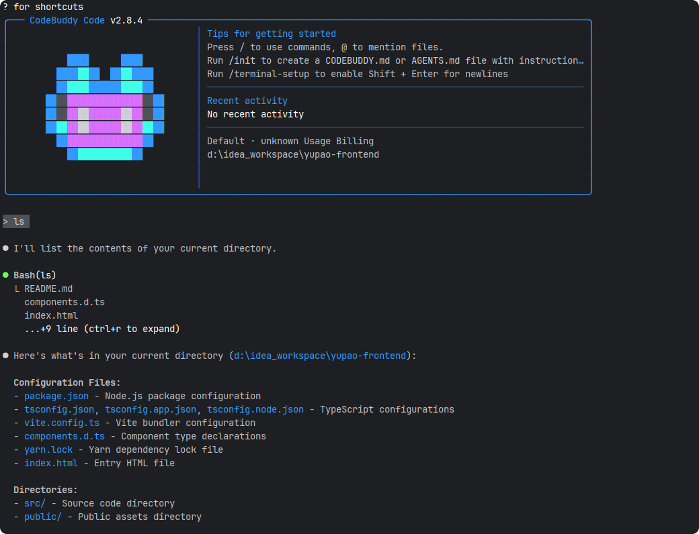

# CodeBuddyCli实战

## 前言

> 先贴一张AI总结的Cli工具大全，仅供参考，本次只尝试CodeBuddyCli
>
> *注意：不知道什么是`cli`是什么的，自行谷歌一下*

| 工具名称                                          | 开发者/公司                          | 类型                  | 核心功能                               | 支持语言 | 是否开源                | 是否需 API Key / 账号                  | 本地运行支持                 | 备注                                                    |
| ------------------------------------------------- | ------------------------------------ | --------------------- | -------------------------------------- | -------- | ----------------------- | -------------------------------------- | ---------------------------- | ------------------------------------------------------- |
| **CodeBuddy CLI**                                 | 社区项目（如 GitHub 上多个同名项目） | CLI 工具              | 代码生成、解释、错误诊断               | 多语言   | ✅（多数为开源）         | 视后端模型而定（如 OpenAI、Ollama）    | ✅（若接本地 LLM）            | 名称较泛，具体功能依赖实现版本                          |
| **Claude (via CLI wrappers)** （如 `claude-cli`） | Anthropic                            | CLI 封装              | 通用对话 + 代码辅助（非专用 IDE 插件） | 多语言   | ✅（社区 CLI 工具开源）  | ✅（需 Anthropic API Key）              | ❌（云端模型）                | 官方无官方 CLI，但社区有封装（如 `aipm`, `claude-cli`） |
| **Aider**                                         | Paul Baumgart                        | CLI 工具              | 直接编辑代码文件、Git 集成、对话式开发 | 多语言   | ✅                       | ✅（支持 OpenAI、Anthropic、Ollama 等） | ✅（通过 Ollama / LM Studio） | 强调“让 AI 修改你的代码”                                |
| **Ollama + Code Llama / DeepSeek-Coder**          | Meta / DeepSeek + Ollama 团队        | CLI 平台 + 模型       | 本地运行代码专用大模型                 | 多语言   | ✅                       | ❌（本地运行无需 API）                  | ✅                            | 可配合 `ollama run codellama` 使用                      |
| **Continue**                                      | Continue.dev                         | IDE 插件 + 实验性 CLI | Copilot 替代，支持自定义模型和上下文   | 多语言   | ✅                       | 视配置而定                             | ✅（支持 Ollama、LM Studio）  | 主要为 VS Code 插件，CLI 功能有限                       |
| **Codeium CLI**                                   | Codeium                              | CLI 辅助工具          | 登录、配置、部分代码补全实验           | 多语言   | ❌（CLI 开源但核心闭源） | ✅（需账号）                            | ❌                            | 主力在 IDE 插件，CLI 功能较弱                           |
| **MagicAI CLI**（如 `magic-coder-cli`）           | MagicHub / Salesforce 等             | CLI 工具              | 基于 MagicCoder 模型的代码生成         | 多语言   | ✅（部分实现）           | ❌（若用本地模型）                      | ✅                            | 基于 StarCoder / MagicCoder 微调模型                    |
| **Phind CLI**（社区封装）                         | Phind                                | CLI 封装              | 类似 Phind 搜索的代码问答              | 多语言   | ✅（非官方 CLI）         | ✅（需 Phind API 或代理）               | ❌                            | 非官方，稳定性有限                                      |

## CodeBuddyCli安装

> 建议安装`nvm`进行`node`版本控制，CodeBuddyCli需要`node20`以上的版本
>
> *注意：不知道什么是`node`和`nvm`是什么的，自行谷歌一下*

CodeBuddyCli官网 https://copilot.tencent.com/docs/cli/installation

- Login with Google / Github(国外用户选这个)
- Login with WeChat（国内用户选这个）
- Login with Enterprise Domain

```cmd
# 执行codebuddy
PS D:\idea_workspace\yupao-frontend> codebuddy
```

