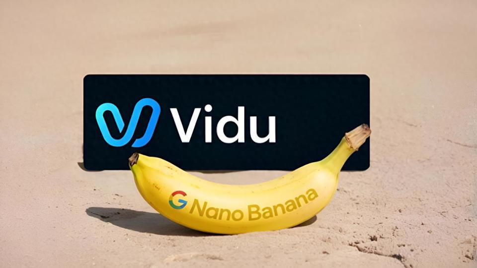
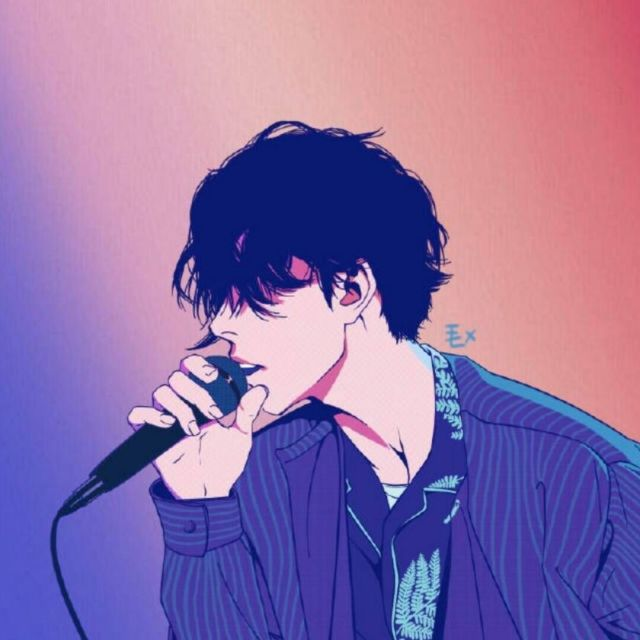
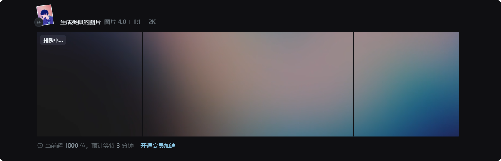
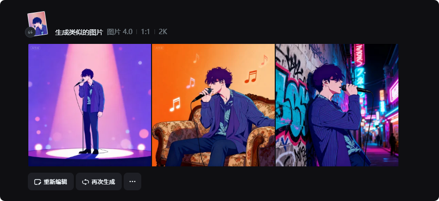

# 国产AI生图逆袭！Vidu Q1正面对决谷歌Nano Banana，Seedream 4.0杀入战场

当谷歌Nano Banana在9月初横空出世，全球AI创作圈为之沸腾。这款被网友戏称为“**PS终结者**”的工具，以惊人的角色一致性和多图融合能力，让复杂修图从数小时缩短至30秒内完成。但谁也没想到，不到10天时间，中国团队就交出了两份重磅答卷。

9月9日，生数科技正式推出 **Vidu Q1参考生图功能**，以**7张参考图输入**打破国内生成上限，在一致性、还原度等关键指标上全面超越Flux.1 Kontext，**正面对标Nano Banana**。同一天，字节跳动Seed团队宣布推出豆包图像创作模型**Seedream 4.0**，支持多模态生图，最高可生成**4K分辨率**商用级图像。

AI生图领域首次出现具备差异化竞争力、甚至局部实现超越的中国创业公司。

| **评测维度**   | **Vidu Q1（生数科技）**          | **Nano Banana（谷歌）**       | **Seedream 4.0（字节跳动）**              |      |      |
| -------------- | -------------------------------- | ----------------------------- | ----------------------------------------- | ---- | ---- |
| **网址**       | https://www.vidu.cn/             | https://nano-banana.org       | https://jimeng.jianying.com/ai-tool/home/ |      |      |
| **发布时间**   | 2025年9月9日                     | 2025年9月初                   | 2025年9月9日                              |      |      |
| **参考图支持** | **单次7张**（实际无上限）        | 最多9张                       | 多图融合（数量未明确）                    |      |      |
| **核心突破**   | 多人多场景高一致性、超高还原度   | 角色一致性（面部特征保留99%） | 多模态交互、4K分辨率                      |      |      |
| **分辨率支持** | 1080P                            | 较低（需第三方工具增强）      | **4K**                                    |      |      |
| **特色功能**   | 万物合成/替换/变换、局部超分重建 | 手办生成、cos换装、漫画分镜   | 组图生成、艺术风格迁移、复杂排版          |      |      |
| **语义理解**   | 中文语义理解优化                 | 英文为主                      | 中英文优化                                |      |      |
| **商用能力**   | 生产级应用                       | 企业级协作                    | 商用级图像输出                            |      |      |
| **生成成本**   | 约0.3元/秒                       | 约0.07美元/张                 | **目前免费**                              |      |      |

## 实际测试

我也来用自己的头像来蹭蹭热度，看看这三家生成类似图片的效果如何？

### Vidu Q1：中国团队的硬核逆袭

作为生数科技推出的首款参考生图产品，Vidu Q1一经发布便展现出**中国团队的硬核技术实力**。

**参考数量碾压行业**
 Vidu Q1支持单次最多​**​7张参考图​**​输入，打破国内天花板。实际测试中，当把多个物体放在一张图中时，其参考的物体数量​**​远不止7张​**​，堪称生图领域的大杀器。

**主体一致性全面超越**
 在多人互动、多场景切换，甚至多次生成下，Vidu Q1能保证人物的面貌、特征高度稳定。多角色混淆、人物走样、服饰或细节丢失等常见问题，在Vidu Q1中几乎不存在。

在与Nano Banana的直接对比中，Vidu Q1展现出惊艳实力：

- 在“人物拿着电饭煲”案例中，Nano Banana出现物体悬空、摆放不合理的问题，而Vidu生成结果自然合理。
- 在彩虹补全测试中，Nano Banana仅生成另外一半彩虹，而Vidu成功补出未出现在图片中的另一半彩虹。

**创意自由度突破天际**
 Vidu Q1支持三大创作模式：

- **万物皆可合成**：让不同人物同框或将商品融入场景
- **万物皆可替**：人物、道具、场景随意替换
- **万物皆可变**：线稿转3D、照片转手办、老照片修复

测试案例中，Vidu Q1成功将雷尼·马格利特的名画《人类之子》中的男人换成黄仁勋，保持背景不变，完美复刻经典艺术画。

> 下图由Vidu Q1生成

### Nano Banana：现象级破圈的“改图真神”

谷歌的Nano Banana（正式名Gemini 2.5 Flash Image）之所以爆火，是**“过硬技术”、“完美策略”和“社交狂欢”三重因素**叠加的经典案例。

**角色一致性封神**
 Nano Banana在保持角色一致性上达到​**​99%的面部特征保留率​**​，在多次编辑、换场景等操作时，核心面容能够保持与原图高度相似。

**创意玩法引爆社交**

- **手办生成**：提示词加一句“生成1/7比例的手办”，即可生成逼真桌面手办
- **cosplay换装**：上传个人照片和角色照片，一键换装、妆容、场景
- **漫画分镜**：一句提示词将单图扩展成漫画9宫格
- **产品上身展示**：支持多产品组合展示，最多支持9张参考图

**两大短板**
 不过Nano Banana也存在明显短板：​**​像素较低​**​，且​**​图片尺寸比较随机​**​，需要借助第三方工具增强。对中文用户而言，其语义理解也以英文为主，存在一定使用门槛。

> 下图由Nano Banana生成

### Seedream 4.0：多模态创作新纪元

字节跳动Seedream 4.0的发布，标志着图像创作**从文生图进入多模态交互的新阶段**。

**四大核心升级**

1. **主体一致性增强**：稳健保持主体特征，避免“失真”与“错位”
2. **多图灵活创作**：支持文本、图像的多维组合输入
3. **超高清输出**：最高支持**4K分辨率**商用级图像
4. **超高速直出**：2K大分辨率图像生成仅需数秒

**多模态创意引擎**
 Seedream 4.0不仅能理解物理规律与时间约束、三维空间等复杂语境，还能在解谜、填字、续写漫画等任务中保持风格一致与细节精致。

> 豆包的Seedream 4.0有点慢，排队中，开了会员之后效果同样非常amazing!

