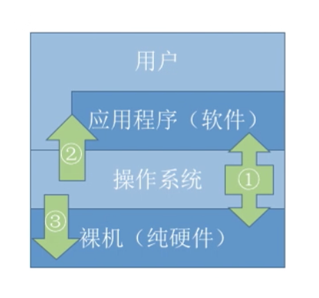

# 操作系统-王道考研

## 操作系统的概念&功能和目标

> 操作系统(Operating System,OS):是指控制和管理整个计算机系统的硬件和软件资源，并合理地组织调度计算机的工作和资源的分配，以提供给用户和其他软件方便的接口和环境，它是计算机系统中最基本的系统软件。
>
> **操作系统提供的功能？**
>
> - 操作系统`作为系统资源的管理者`（这些资源包括软件、硬件、文件等)，需要提供什么功能？
>   - 文件管理/磁盘管理
>   - 内存管理
>   - CPU管理
>   - IO设备管理
> - 操作系统`作为用户与计算机硬件之间的接口`，要为其上层的用户、应用程序提供简单易用的服务，需要实现什么功能？
>   - 命令接口：允许用户`直接使用`
>     - 联机命令接口：用户说一句，系统做一句。举例：ifconfig
>     - 脱机命令接口：用户说一堆，系统做一堆。举例：.bat文件
>   - 程序接口：允许用户通过程序`间接使用`，`由一组系统调用组成`
>   - 图形用户界面GUI
> - 操作系统`作为最接近硬件的层次`，需要在纯硬件的基础上实现什么功能？
>   - 实现对硬件机器的拓展
> - 

## 操作系统的特征

> **操作系统的特征：**
>
> - 并发
> - 共享
>   - 互斥共享方式：一段时间内只允许一个线程访问该资源
>   - 同时共享方式：一段时间允许多个线程“同时”访问该资源
>   - 并发和共享互为存在条件
> - 虚拟
>   - 空分复用技术（如虚拟存储器技术）
>   - 时分复用技术（如虚拟处理器）
> - 异步

## OS的发展和分类

> **OS的发展：**
>
> - 手工操作阶段：人机速度矛盾导致资源利用率极低
> - 批处理阶段
>   - 单道批处理系统（引入脱机输入输出技术）
>   - 多道批处理系统（操作系统开始出现）
>
> OS的分类：
>
> - 分时/非分时操作系统:是否划分时间片
>
> - 实时/非实时操作系统：实时下能处理紧急任务

## OS的运行机制和体系结构

> **两种指令：**
>
> - 特权指令：如内存清零指令
> - 非特权指令：如普通的运算指令
>
> **两种处理器状态：**
>
> - 用户态：只能执行非特权指令
> - 内核态/管态：两种指令都能执行
> - 用程序状态寄存器标识处理器处于什么状态
>
> **两种程序**：
>
> - 内核程序：运行在核心态
> - 非内核程序/用户程序：运行在用户态
>
> ----
>
> 