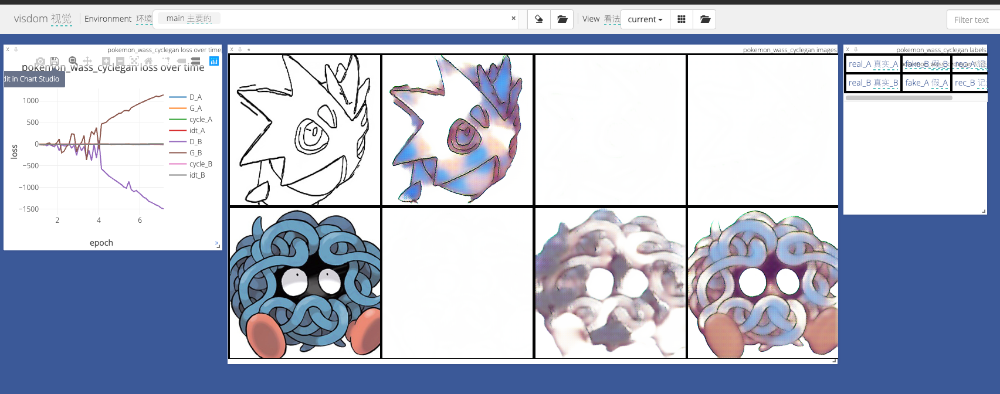

# 硕士服务器操作指南

## jupyter使用注意事项

`jupyter notebook`

[jupyter设置密码](https://www.cnblogs.com/honway/p/9559324.html)

jupyter启动要关闭防火墙，用root用户关闭

jupyter启动前要切换成相应的环境 比如 diffusers

conda config --set ssl_verify False

## conda设置国内镜像源

```text
conda config --add channels http://mirrors.tuna.tsinghua.edu.cn/anaconda/pkgs/free/
conda config --add channels http://mirrors.tuna.tsinghua.edu.cn/anaconda/pkgs/main/
conda config --add channels http://mirrors.tuna.tsinghua.edu.cn/anaconda/cloud/pytorch/
conda config --add channels http://mirrors.tuna.tsinghua.edu.cn/anaconda/cloud/pytorch/linux-64/
conda config --set show_channel_urls yes
```

sudo  vim  /etc/apt/sources.list

## 查看无线网络有哪些 

sudo iw wlo1 scan|grep SSID

## 连接无线网络

wpa_supplicant -B -i wlo1 -c <(wpa_passphrase "WHUT-WLAN" "12061206")

## Wifi密码

WHUT-WLAN 12061206

lab1206 12061206

## 后台运行jupyter visdom

nohup jupyter notebook &

nohup python -m visdom.server &

# 硕士毕业论文资料



## Pix2pix生成器

```
model [Pix2PixModel] was created
---------- Networks initialized -------------
DataParallel(
  (module): UnetGenerator(
    (model): UnetSkipConnectionBlock(
      (model): Sequential(
        (0): Conv2d(3, 64, kernel_size=(4, 4), stride=(2, 2), padding=(1, 1), bias=False)
        (1): UnetSkipConnectionBlock(
          (model): Sequential(
            (0): LeakyReLU(negative_slope=0.2, inplace=True)
            (1): Conv2d(64, 128, kernel_size=(4, 4), stride=(2, 2), padding=(1, 1), bias=False)
            (2): BatchNorm2d(128, eps=1e-05, momentum=0.1, affine=True, track_running_stats=True)
            (3): UnetSkipConnectionBlock(
              (model): Sequential(
                (0): LeakyReLU(negative_slope=0.2, inplace=True)
                (1): Conv2d(128, 256, kernel_size=(4, 4), stride=(2, 2), padding=(1, 1), bias=False)
                (2): BatchNorm2d(256, eps=1e-05, momentum=0.1, affine=True, track_running_stats=True)
                (3): UnetSkipConnectionBlock(
                  (model): Sequential(
                    (0): LeakyReLU(negative_slope=0.2, inplace=True)
                    (1): Conv2d(256, 512, kernel_size=(4, 4), stride=(2, 2), padding=(1, 1), bias=False)
                    (2): BatchNorm2d(512, eps=1e-05, momentum=0.1, affine=True, track_running_stats=True)
                    (3): UnetSkipConnectionBlock(
                      (model): Sequential(
                        (0): LeakyReLU(negative_slope=0.2, inplace=True)
                        (1): Conv2d(512, 512, kernel_size=(4, 4), stride=(2, 2), padding=(1, 1), bias=False)
                        (2): BatchNorm2d(512, eps=1e-05, momentum=0.1, affine=True, track_running_stats=True)
                        (3): UnetSkipConnectionBlock(
                          (model): Sequential(
                            (0): LeakyReLU(negative_slope=0.2, inplace=True)
                            (1): Conv2d(512, 512, kernel_size=(4, 4), stride=(2, 2), padding=(1, 1), bias=False)
                            (2): BatchNorm2d(512, eps=1e-05, momentum=0.1, affine=True, track_running_stats=True)
                            (3): UnetSkipConnectionBlock(
                              (model): Sequential(
                                (0): LeakyReLU(negative_slope=0.2, inplace=True)
                                (1): Conv2d(512, 512, kernel_size=(4, 4), stride=(2, 2), padding=(1, 1), bias=False)
                                (2): BatchNorm2d(512, eps=1e-05, momentum=0.1, affine=True, track_running_stats=True)
                                (3): UnetSkipConnectionBlock(
                                  (model): Sequential(
                                    (0): LeakyReLU(negative_slope=0.2, inplace=True)
                                    (1): Conv2d(512, 512, kernel_size=(4, 4), stride=(2, 2), padding=(1, 1), bias=False)
                                    (2): ReLU(inplace=True)
                                    (3): ConvTranspose2d(512, 512, kernel_size=(4, 4), stride=(2, 2), padding=(1, 1), bias=False)
                                    (4): BatchNorm2d(512, eps=1e-05, momentum=0.1, affine=True, track_running_stats=True)
                                  )
                                )
                                (4): ReLU(inplace=True)
                                (5): ConvTranspose2d(1024, 512, kernel_size=(4, 4), stride=(2, 2), padding=(1, 1), bias=False)
                                (6): BatchNorm2d(512, eps=1e-05, momentum=0.1, affine=True, track_running_stats=True)
                                (7): Dropout(p=0.5, inplace=False)
                              )
                            )
                            (4): ReLU(inplace=True)
                            (5): ConvTranspose2d(1024, 512, kernel_size=(4, 4), stride=(2, 2), padding=(1, 1), bias=False)
                            (6): BatchNorm2d(512, eps=1e-05, momentum=0.1, affine=True, track_running_stats=True)
                            (7): Dropout(p=0.5, inplace=False)
                          )
                        )
                        (4): ReLU(inplace=True)
                        (5): ConvTranspose2d(1024, 512, kernel_size=(4, 4), stride=(2, 2), padding=(1, 1), bias=False)
                        (6): BatchNorm2d(512, eps=1e-05, momentum=0.1, affine=True, track_running_stats=True)
                        (7): Dropout(p=0.5, inplace=False)
                      )
                    )
                    (4): ReLU(inplace=True)
                    (5): ConvTranspose2d(1024, 256, kernel_size=(4, 4), stride=(2, 2), padding=(1, 1), bias=False)
                    (6): BatchNorm2d(256, eps=1e-05, momentum=0.1, affine=True, track_running_stats=True)
                  )
                )
                (4): ReLU(inplace=True)
                (5): ConvTranspose2d(512, 128, kernel_size=(4, 4), stride=(2, 2), padding=(1, 1), bias=False)
                (6): BatchNorm2d(128, eps=1e-05, momentum=0.1, affine=True, track_running_stats=True)
              )
            )
            (4): ReLU(inplace=True)
            (5): ConvTranspose2d(256, 64, kernel_size=(4, 4), stride=(2, 2), padding=(1, 1), bias=False)
            (6): BatchNorm2d(64, eps=1e-05, momentum=0.1, affine=True, track_running_stats=True)
          )
        )
        (2): ReLU(inplace=True)
        (3): ConvTranspose2d(128, 3, kernel_size=(4, 4), stride=(2, 2), padding=(1, 1))
        (4): Tanh()
      )
    )
  )
)
[Network G] Total number of parameters : 54.414 M
DataParallel(
  (module): NLayerDiscriminator(
    (model): Sequential(
      (0): Conv2d(6, 64, kernel_size=(4, 4), stride=(2, 2), padding=(1, 1))
      (1): LeakyReLU(negative_slope=0.2, inplace=True)
      (2): Conv2d(64, 128, kernel_size=(4, 4), stride=(2, 2), padding=(1, 1), bias=False)
      (3): BatchNorm2d(128, eps=1e-05, momentum=0.1, affine=True, track_running_stats=True)
      (4): LeakyReLU(negative_slope=0.2, inplace=True)
      (5): Conv2d(128, 256, kernel_size=(4, 4), stride=(2, 2), padding=(1, 1), bias=False)
      (6): BatchNorm2d(256, eps=1e-05, momentum=0.1, affine=True, track_running_stats=True)
      (7): LeakyReLU(negative_slope=0.2, inplace=True)
      (8): Conv2d(256, 512, kernel_size=(4, 4), stride=(1, 1), padding=(1, 1), bias=False)
      (9): BatchNorm2d(512, eps=1e-05, momentum=0.1, affine=True, track_running_stats=True)
      (10): LeakyReLU(negative_slope=0.2, inplace=True)
      (11): Conv2d(512, 1, kernel_size=(4, 4), stride=(1, 1), padding=(1, 1))
    )
  )
)
```


## Pix2pix-light-improve

```
 (module): UnetGeneratorWithSepConvAndPSACBMA(
    (model): UnetSkipConnectionBlock(
      (attention): PSACBMA(
        (psa): PSALayer(
          (pool): AdaptiveAvgPool2d(output_size=1)
          (conv1): Conv2d(3, 3, kernel_size=(1, 1), stride=(1, 1))
          (conv2): Conv2d(3, 3, kernel_size=(1, 1), stride=(1, 1))
          (sigmoid): Sigmoid()
        )
        (cbam): CBAMAttention(
          (channel_attention): ChannelAttention(
            (avg_pool): AdaptiveAvgPool2d(output_size=1)
            (max_pool): AdaptiveMaxPool2d(output_size=1)
            (fc1): Conv2d(3, 3, kernel_size=(1, 1), stride=(1, 1))
            (relu): ReLU(inplace=True)
            (fc2): Conv2d(3, 3, kernel_size=(1, 1), stride=(1, 1))
            (sigmoid): Sigmoid()
          )
          (spatial_attention): SpatialAttention(
            (conv): Conv2d(2, 1, kernel_size=(7, 7), stride=(1, 1), padding=(3, 3))
            (sigmoid): Sigmoid()
          )
        )
      )
      (model): Sequential(
        (0): SeparableConv2d(
          (depthwise): Conv2d(3, 3, kernel_size=(4, 4), stride=(2, 2), padding=(1, 1), groups=3)
          (pointwise): Conv2d(3, 64, kernel_size=(1, 1), stride=(1, 1))
        )
        (1): UnetSkipConnectionBlock(
          (attention): PSACBMA(
            (psa): PSALayer(
              (pool): AdaptiveAvgPool2d(output_size=1)
              (conv1): Conv2d(64, 8, kernel_size=(1, 1), stride=(1, 1))
              (conv2): Conv2d(8, 64, kernel_size=(1, 1), stride=(1, 1))
              (sigmoid): Sigmoid()
            )
            (cbam): CBAMAttention(
              (channel_attention): ChannelAttention(
                (avg_pool): AdaptiveAvgPool2d(output_size=1)
                (max_pool): AdaptiveMaxPool2d(output_size=1)
                (fc1): Conv2d(64, 4, kernel_size=(1, 1), stride=(1, 1))
                (relu): ReLU(inplace=True)
                (fc2): Conv2d(4, 64, kernel_size=(1, 1), stride=(1, 1))
                (sigmoid): Sigmoid()
              )
              (spatial_attention): SpatialAttention(
                (conv): Conv2d(2, 1, kernel_size=(7, 7), stride=(1, 1), padding=(3, 3))
                (sigmoid): Sigmoid()
              )
            )
          )
          (model): Sequential(
            (0): LeakyReLU(negative_slope=0.2, inplace=True)
            (1): SeparableConv2d(
              (depthwise): Conv2d(64, 64, kernel_size=(4, 4), stride=(2, 2), padding=(1, 1), groups=64)
              (pointwise): Conv2d(64, 128, kernel_size=(1, 1), stride=(1, 1))
            )
            (2): BatchNorm2d(128, eps=1e-05, momentum=0.1, affine=True, track_running_stats=True)
            (3): UnetSkipConnectionBlock(
              (attention): PSACBMA(
                (psa): PSALayer(
                  (pool): AdaptiveAvgPool2d(output_size=1)
                  (conv1): Conv2d(128, 16, kernel_size=(1, 1), stride=(1, 1))
                  (conv2): Conv2d(16, 128, kernel_size=(1, 1), stride=(1, 1))
                  (sigmoid): Sigmoid()
                )
                (cbam): CBAMAttention(
                  (channel_attention): ChannelAttention(
                    (avg_pool): AdaptiveAvgPool2d(output_size=1)
                    (max_pool): AdaptiveMaxPool2d(output_size=1)
                    (fc1): Conv2d(128, 8, kernel_size=(1, 1), stride=(1, 1))
                    (relu): ReLU(inplace=True)
                    (fc2): Conv2d(8, 128, kernel_size=(1, 1), stride=(1, 1))
                    (sigmoid): Sigmoid()
                  )
                  (spatial_attention): SpatialAttention(
                    (conv): Conv2d(2, 1, kernel_size=(7, 7), stride=(1, 1), padding=(3, 3))
                    (sigmoid): Sigmoid()
                  )
                )
              )
              (model): Sequential(
                (0): LeakyReLU(negative_slope=0.2, inplace=True)
                (1): SeparableConv2d(
                  (depthwise): Conv2d(128, 128, kernel_size=(4, 4), stride=(2, 2), padding=(1, 1), groups=128)
                  (pointwise): Conv2d(128, 256, kernel_size=(1, 1), stride=(1, 1))
                )
                (2): BatchNorm2d(256, eps=1e-05, momentum=0.1, affine=True, track_running_stats=True)
                (3): UnetSkipConnectionBlock(
                  (attention): PSACBMA(
                    (psa): PSALayer(
                      (pool): AdaptiveAvgPool2d(output_size=1)
                      (conv1): Conv2d(256, 32, kernel_size=(1, 1), stride=(1, 1))
                      (conv2): Conv2d(32, 256, kernel_size=(1, 1), stride=(1, 1))
                      (sigmoid): Sigmoid()
                    )
                    (cbam): CBAMAttention(
                      (channel_attention): ChannelAttention(
                        (avg_pool): AdaptiveAvgPool2d(output_size=1)
                        (max_pool): AdaptiveMaxPool2d(output_size=1)
                        (fc1): Conv2d(256, 16, kernel_size=(1, 1), stride=(1, 1))
                        (relu): ReLU(inplace=True)
                        (fc2): Conv2d(16, 256, kernel_size=(1, 1), stride=(1, 1))
                        (sigmoid): Sigmoid()
                      )
                      (spatial_attention): SpatialAttention(
                        (conv): Conv2d(2, 1, kernel_size=(7, 7), stride=(1, 1), padding=(3, 3))
                        (sigmoid): Sigmoid()
                      )
                    )
                  )
                  (model): Sequential(
                    (0): LeakyReLU(negative_slope=0.2, inplace=True)
                    (1): SeparableConv2d(
                      (depthwise): Conv2d(256, 256, kernel_size=(4, 4), stride=(2, 2), padding=(1, 1), groups=256)
                      (pointwise): Conv2d(256, 512, kernel_size=(1, 1), stride=(1, 1))
                    )
                    (2): BatchNorm2d(512, eps=1e-05, momentum=0.1, affine=True, track_running_stats=True)
                    (3): UnetSkipConnectionBlock(
                      (attention): PSACBMA(
                        (psa): PSALayer(
                          (pool): AdaptiveAvgPool2d(output_size=1)
                          (conv1): Conv2d(512, 64, kernel_size=(1, 1), stride=(1, 1))
                          (conv2): Conv2d(64, 512, kernel_size=(1, 1), stride=(1, 1))
                          (sigmoid): Sigmoid()
                        )
                        (cbam): CBAMAttention(
                          (channel_attention): ChannelAttention(
                            (avg_pool): AdaptiveAvgPool2d(output_size=1)
                            (max_pool): AdaptiveMaxPool2d(output_size=1)
                            (fc1): Conv2d(512, 32, kernel_size=(1, 1), stride=(1, 1))
                            (relu): ReLU(inplace=True)
                            (fc2): Conv2d(32, 512, kernel_size=(1, 1), stride=(1, 1))
                            (sigmoid): Sigmoid()
                          )
                          (spatial_attention): SpatialAttention(
                            (conv): Conv2d(2, 1, kernel_size=(7, 7), stride=(1, 1), padding=(3, 3))
                            (sigmoid): Sigmoid()
                          )
                        )
                      )
                      (model): Sequential(
                        (0): LeakyReLU(negative_slope=0.2, inplace=True)
                        (1): SeparableConv2d(
                          (depthwise): Conv2d(512, 512, kernel_size=(4, 4), stride=(2, 2), padding=(1, 1), groups=512)
                          (pointwise): Conv2d(512, 512, kernel_size=(1, 1), stride=(1, 1))
                        )
                        (2): BatchNorm2d(512, eps=1e-05, momentum=0.1, affine=True, track_running_stats=True)
                        (3): UnetSkipConnectionBlock(
                          (attention): PSACBMA(
                            (psa): PSALayer(
                              (pool): AdaptiveAvgPool2d(output_size=1)
                              (conv1): Conv2d(512, 64, kernel_size=(1, 1), stride=(1, 1))
                              (conv2): Conv2d(64, 512, kernel_size=(1, 1), stride=(1, 1))
                              (sigmoid): Sigmoid()
                            )
                            (cbam): CBAMAttention(
                              (channel_attention): ChannelAttention(
                                (avg_pool): AdaptiveAvgPool2d(output_size=1)
                                (max_pool): AdaptiveMaxPool2d(output_size=1)
                                (fc1): Conv2d(512, 32, kernel_size=(1, 1), stride=(1, 1))
                                (relu): ReLU(inplace=True)
                                (fc2): Conv2d(32, 512, kernel_size=(1, 1), stride=(1, 1))
                                (sigmoid): Sigmoid()
                              )
                              (spatial_attention): SpatialAttention(
                                (conv): Conv2d(2, 1, kernel_size=(7, 7), stride=(1, 1), padding=(3, 3))
                                (sigmoid): Sigmoid()
                              )
                            )
                          )
                          (model): Sequential(
                            (0): LeakyReLU(negative_slope=0.2, inplace=True)
                            (1): SeparableConv2d(
                              (depthwise): Conv2d(512, 512, kernel_size=(4, 4), stride=(2, 2), padding=(1, 1), groups=512)
                              (pointwise): Conv2d(512, 512, kernel_size=(1, 1), stride=(1, 1))
                            )
                            (2): BatchNorm2d(512, eps=1e-05, momentum=0.1, affine=True, track_running_stats=True)
                            (3): UnetSkipConnectionBlock(
                              (attention): PSACBMA(
                                (psa): PSALayer(
                                  (pool): AdaptiveAvgPool2d(output_size=1)
                                  (conv1): Conv2d(512, 64, kernel_size=(1, 1), stride=(1, 1))
                                  (conv2): Conv2d(64, 512, kernel_size=(1, 1), stride=(1, 1))
                                  (sigmoid): Sigmoid()
                                )
                                (cbam): CBAMAttention(
                                  (channel_attention): ChannelAttention(
                                    (avg_pool): AdaptiveAvgPool2d(output_size=1)
                                    (max_pool): AdaptiveMaxPool2d(output_size=1)
                                    (fc1): Conv2d(512, 32, kernel_size=(1, 1), stride=(1, 1))
                                    (relu): ReLU(inplace=True)
                                    (fc2): Conv2d(32, 512, kernel_size=(1, 1), stride=(1, 1))
                                    (sigmoid): Sigmoid()
                                  )
                                  (spatial_attention): SpatialAttention(
                                    (conv): Conv2d(2, 1, kernel_size=(7, 7), stride=(1, 1), padding=(3, 3))
                                    (sigmoid): Sigmoid()
                                  )
                                )
                              )
                              (model): Sequential(
                                (0): LeakyReLU(negative_slope=0.2, inplace=True)
                                (1): SeparableConv2d(
                                  (depthwise): Conv2d(512, 512, kernel_size=(4, 4), stride=(2, 2), padding=(1, 1), groups=512)
                                  (pointwise): Conv2d(512, 512, kernel_size=(1, 1), stride=(1, 1))
                                )
                                (2): BatchNorm2d(512, eps=1e-05, momentum=0.1, affine=True, track_running_stats=True)
                                (3): UnetSkipConnectionBlock(
                                  (attention): PSACBMA(
                                    (psa): PSALayer(
                                      (pool): AdaptiveAvgPool2d(output_size=1)
                                      (conv1): Conv2d(512, 64, kernel_size=(1, 1), stride=(1, 1))
                                      (conv2): Conv2d(64, 512, kernel_size=(1, 1), stride=(1, 1))
                                      (sigmoid): Sigmoid()
                                    )
                                    (cbam): CBAMAttention(
                                      (channel_attention): ChannelAttention(
                                        (avg_pool): AdaptiveAvgPool2d(output_size=1)
                                        (max_pool): AdaptiveMaxPool2d(output_size=1)
                                        (fc1): Conv2d(512, 32, kernel_size=(1, 1), stride=(1, 1))
                                        (relu): ReLU(inplace=True)
                                        (fc2): Conv2d(32, 512, kernel_size=(1, 1), stride=(1, 1))
                                        (sigmoid): Sigmoid()
                                      )
                                      (spatial_attention): SpatialAttention(
                                        (conv): Conv2d(2, 1, kernel_size=(7, 7), stride=(1, 1), padding=(3, 3))
                                        (sigmoid): Sigmoid()
                                      )
                                    )
                                  )
                                  (model): Sequential(
                                    (0): LeakyReLU(negative_slope=0.2, inplace=True)
                                    (1): SeparableConv2d(
                                      (depthwise): Conv2d(512, 512, kernel_size=(4, 4), stride=(2, 2), padding=(1, 1), groups=512)
                                      (pointwise): Conv2d(512, 512, kernel_size=(1, 1), stride=(1, 1))
                                    )
                                    (2): ReLU(inplace=True)
                                    (3): SeparableConv2d(
                                      (depthwise): Conv2d(512, 512, kernel_size=(1, 1), stride=(1, 1), groups=512)
                                      (pointwise): Conv2d(512, 2048, kernel_size=(1, 1), stride=(1, 1))
                                    )
                                    (4): LeakyReLU(negative_slope=0.2, inplace=True)
                                    (5): PixelShuffle(upscale_factor=2)
                                    (6): SeparableConv2d(
                                      (depthwise): Conv2d(512, 512, kernel_size=(3, 3), stride=(1, 1), padding=(1, 1), groups=512)
                                      (pointwise): Conv2d(512, 512, kernel_size=(1, 1), stride=(1, 1))
                                    )
                                    (7): BatchNorm2d(512, eps=1e-05, momentum=0.1, affine=True, track_running_stats=True)
                                  )
                                )
                                (4): ReLU(inplace=True)
                                (5): SeparableConv2d(
                                  (depthwise): Conv2d(1024, 1024, kernel_size=(1, 1), stride=(1, 1), groups=1024)
                                  (pointwise): Conv2d(1024, 4096, kernel_size=(1, 1), stride=(1, 1))
                                )
                                (6): LeakyReLU(negative_slope=0.2, inplace=True)
                                (7): PixelShuffle(upscale_factor=2)
                                (8): SeparableConv2d(
                                  (depthwise): Conv2d(1024, 1024, kernel_size=(3, 3), stride=(1, 1), padding=(1, 1), groups=1024)
                                  (pointwise): Conv2d(1024, 512, kernel_size=(1, 1), stride=(1, 1))
                                )
                                (9): BatchNorm2d(512, eps=1e-05, momentum=0.1, affine=True, track_running_stats=True)
                                (10): Dropout(p=0.5, inplace=False)
                              )
                            )
                            (4): ReLU(inplace=True)
                            (5): SeparableConv2d(
                              (depthwise): Conv2d(1024, 1024, kernel_size=(1, 1), stride=(1, 1), groups=1024)
                              (pointwise): Conv2d(1024, 4096, kernel_size=(1, 1), stride=(1, 1))
                            )
                            (6): LeakyReLU(negative_slope=0.2, inplace=True)
                            (7): PixelShuffle(upscale_factor=2)
                            (8): SeparableConv2d(
                              (depthwise): Conv2d(1024, 1024, kernel_size=(3, 3), stride=(1, 1), padding=(1, 1), groups=1024)
                              (pointwise): Conv2d(1024, 512, kernel_size=(1, 1), stride=(1, 1))
                            )
                            (9): BatchNorm2d(512, eps=1e-05, momentum=0.1, affine=True, track_running_stats=True)
                            (10): Dropout(p=0.5, inplace=False)
                          )
                        )
                        (4): ReLU(inplace=True)
                        (5): SeparableConv2d(
                          (depthwise): Conv2d(1024, 1024, kernel_size=(1, 1), stride=(1, 1), groups=1024)
                          (pointwise): Conv2d(1024, 4096, kernel_size=(1, 1), stride=(1, 1))
                        )
                        (6): LeakyReLU(negative_slope=0.2, inplace=True)
                        (7): PixelShuffle(upscale_factor=2)
                        (8): SeparableConv2d(
                          (depthwise): Conv2d(1024, 1024, kernel_size=(3, 3), stride=(1, 1), padding=(1, 1), groups=1024)
                          (pointwise): Conv2d(1024, 512, kernel_size=(1, 1), stride=(1, 1))
                        )
                        (9): BatchNorm2d(512, eps=1e-05, momentum=0.1, affine=True, track_running_stats=True)
                        (10): Dropout(p=0.5, inplace=False)
                      )
                    )
                    (4): ReLU(inplace=True)
                    (5): SeparableConv2d(
                      (depthwise): Conv2d(1024, 1024, kernel_size=(1, 1), stride=(1, 1), groups=1024)
                      (pointwise): Conv2d(1024, 4096, kernel_size=(1, 1), stride=(1, 1))
                    )
                    (6): LeakyReLU(negative_slope=0.2, inplace=True)
                    (7): PixelShuffle(upscale_factor=2)
                    (8): SeparableConv2d(
                      (depthwise): Conv2d(1024, 1024, kernel_size=(3, 3), stride=(1, 1), padding=(1, 1), groups=1024)
                      (pointwise): Conv2d(1024, 256, kernel_size=(1, 1), stride=(1, 1))
                    )
                    (9): BatchNorm2d(256, eps=1e-05, momentum=0.1, affine=True, track_running_stats=True)
                  )
                )
                (4): ReLU(inplace=True)
                (5): SeparableConv2d(
                  (depthwise): Conv2d(512, 512, kernel_size=(1, 1), stride=(1, 1), groups=512)
                  (pointwise): Conv2d(512, 2048, kernel_size=(1, 1), stride=(1, 1))
                )
                (6): LeakyReLU(negative_slope=0.2, inplace=True)
                (7): PixelShuffle(upscale_factor=2)
                (8): SeparableConv2d(
                  (depthwise): Conv2d(512, 512, kernel_size=(3, 3), stride=(1, 1), padding=(1, 1), groups=512)
                  (pointwise): Conv2d(512, 128, kernel_size=(1, 1), stride=(1, 1))
                )
                (9): BatchNorm2d(128, eps=1e-05, momentum=0.1, affine=True, track_running_stats=True)
              )
            )
            (4): ReLU(inplace=True)
            (5): SeparableConv2d(
              (depthwise): Conv2d(256, 256, kernel_size=(1, 1), stride=(1, 1), groups=256)
              (pointwise): Conv2d(256, 1024, kernel_size=(1, 1), stride=(1, 1))
            )
            (6): LeakyReLU(negative_slope=0.2, inplace=True)
            (7): PixelShuffle(upscale_factor=2)
            (8): SeparableConv2d(
              (depthwise): Conv2d(256, 256, kernel_size=(3, 3), stride=(1, 1), padding=(1, 1), groups=256)
              (pointwise): Conv2d(256, 64, kernel_size=(1, 1), stride=(1, 1))
            )
            (9): BatchNorm2d(64, eps=1e-05, momentum=0.1, affine=True, track_running_stats=True)
          )
        )
        (2): ReLU(inplace=True)
        (3): SeparableConv2d(
          (depthwise): Conv2d(128, 128, kernel_size=(1, 1), stride=(1, 1), groups=128)
          (pointwise): Conv2d(128, 512, kernel_size=(1, 1), stride=(1, 1))
        )
        (4): LeakyReLU(negative_slope=0.2, inplace=True)
        (5): PixelShuffle(upscale_factor=2)
        (6): SeparableConv2d(
          (depthwise): Conv2d(128, 128, kernel_size=(3, 3), stride=(1, 1), padding=(1, 1), groups=128)
          (pointwise): Conv2d(128, 3, kernel_size=(1, 1), stride=(1, 1))
        )
        (7): Tanh()
      )
    )
  )
)
[Network G] Total number of parameters : 23.180 M
DataParallel(
  (module): NLayerDiscriminator(
    (model): Sequential(
      (0): Conv2d(6, 64, kernel_size=(4, 4), stride=(2, 2), padding=(1, 1))
      (1): LeakyReLU(negative_slope=0.2, inplace=True)
      (2): Conv2d(64, 128, kernel_size=(4, 4), stride=(2, 2), padding=(1, 1), bias=False)
      (3): BatchNorm2d(128, eps=1e-05, momentum=0.1, affine=True, track_running_stats=True)
      (4): LeakyReLU(negative_slope=0.2, inplace=True)
      (5): Conv2d(128, 256, kernel_size=(4, 4), stride=(2, 2), padding=(1, 1), bias=False)
      (6): BatchNorm2d(256, eps=1e-05, momentum=0.1, affine=True, track_running_stats=True)
      (7): LeakyReLU(negative_slope=0.2, inplace=True)
      (8): Conv2d(256, 512, kernel_size=(4, 4), stride=(1, 1), padding=(1, 1), bias=False)
      (9): BatchNorm2d(512, eps=1e-05, momentum=0.1, affine=True, track_running_stats=True)
      (10): LeakyReLU(negative_slope=0.2, inplace=True)
      (11): Conv2d(512, 1, kernel_size=(4, 4), stride=(1, 1), padding=(1, 1))
    )
  )
)

[Network D] Total number of parameters : 2.769 M

---------- Networks initialized -------------
[Network G] Total number of parameters : 23.180 M

[Network D] Total number of parameters : 2.769 M
```


## 实验数据

| 名称                                                         | PSNR                   | SSIM                   | RMSE                  |      |
| ------------------------------------------------------------ | ---------------------- | ---------------------- | --------------------- | ---- |
| pokemon_shuffle_vanilla_pix2pix                              | 14.799001515079391     | 0.7266648452110602     | 80.87863933170526     |      |
| pokemon_sketch_improve_shuffle_pix2pix                       | 17.11532225969383      | 0.8280801068072227     | 75.76262082039669     |      |
| pokemon_shuffle_pix2pix_improve_with_se                      | 15.061375229701442     | 0.720791501109404      | 79.7080851143485      |      |
| pokemon_shuffle_lsgan_pix2pix_with_se                        | 15.360594148005182     | 0.7536646667194176     | 79.90309635307402     |      |
| **pokemon_shuffle_lsgan_pix2pix**                            | **15.504610707369212** | **0.7486559828187681** | **78.88233428806805** |      |
| pokemon_shuffle_cyclegan                                     | 13.922122756905258     | 0.6947314130035258     | 78.12317371562223     |      |
| pokemon_point_shuffle_va_pix2pix_with_senet_attention_basic_resnet_800 | 14.890579086916702     | 0.6719443737879022     | 79.14727927698738     |      |
| pokemon_point_shuffle_va_pix2pix_with_senet_attention_basic_resnet | 14.667573679847902     | 0.6621857381748177     | 80.28858715562288     |      |
| pokemon_point_shuffle_va_pix2pix_with_senet_attention        | 15.365403688715762     | 0.7002132921403228     | 79.45459744551412     |      |
| pokemon_point_shuffle_va_pix2pix_with_merge_attention[这里的merge是什么不记得了] | 15.238269159738628     | 0.6911894893637842     | 81.91376275100534     |      |
| pokemon_point_shuffle_va_pix2pix_with_eca                    | 15.405445466599861     | 0.7011245621079225     | 79.0569303729847      |      |
| pokemon_point_shuffle_va_pix2pix_with_cbam_block             | 15.549585701347883     | 0.6983868214089277     | 78.5295533919229      |      |
| pokemon_point_shuffle_va_pix2pix                             | 15.301405390076638     | 0.698662832581529      | 80.4139626705019      |      |
| pokemon_point_shuffle_pix2pix_improve_with_se_and_basic_resnet | 14.95436740217533      | 0.6583892477746182     | 78.28044585325516     |      |
| pokemon_point_shuffle_pix2pix_improve_with_se                | 15.231485040304554     | 0.6949736078668066     | 79.6600598987224      |      |
| **pokemon_point_shuffle_lsgan_pix2pix_with_senet_attention_back** | 16.2159430745595       | 0.7289926372071364     | 77.46467295453341     |      |
| pokemon_point_shuffle_lsgan_pix2pix_with_merge_attention[这里的merge是什么不记得了] | 16.251074008497177     | 0.730426650553685      | 77.32807809489073     |      |
| **pokemon_point_shuffle_lsgan_pix2pix**                      | **16.208014374820277** | **0.7342366798176988** | **75.91971906326462** |      |
| pokemon_point_sketch_improve_shuffle_pix2pix                 | 16.501106165559655     | 0.7426189059004656     | 77.88495972533333     |      |
| **pokemon_point_sketch_improve_shuffle_lsgan_pix2pix**       | **16.89157133765048**  | **0.7591766337783176** | **76.54309287943086** |      |
| pokemon_point_shuffle_va_pix2pix_with_senet_attention_and_self_attention | 15.414592247332964     | 0.6971841374172594     | 79.53958795431679     |      |
| pokemon_point_shuffle_va_pix2pix_with_senet_attention_and_self_attention_binglian | 15.02597166282427      | 0.6825334177593163     | 79.37109314998986     |      |
| **pokemon_sketch_improve_shuffle_lsgan_pix2pix**             | **17.840842798105854** | **0.8460531328495319** | **75.92092890241597** |      |
| pokemon_point_shuffle_lsgan_pix2pix_with_cbam_block          | 16.193017974184908     | 0.7321140917894813     | 76.73619319642165     |      |
| pokemon_point_sketch_improve_shuffle_lsgan_pix2pix_with_cbam_attention_and_pixel_shuffle | 16.926816970748735     | 0.7647042413021997     | 77.37283730322797     |      |
| pokemon_point_sketch_improve_shuffle_lsgan_pix2pix_with_cbam_attention | 16.973575726418314     | 0.7617217646371554     | 75.63951844883721     |      |
| pokemon_point_sketch_improve_shuffle_lsgan_pix2pix_with_pixel_shuffle | 16.88953181962112      | 0.7560796776938106     | 77.01013827326446     |      |
| pokemon_point_sketch_improve_shuffle_lsgan_pix2pix_with_upsample | 16.88119913371202      | 0.7624254441345777     | 75.97915088847681     |      |
| pokemon_point_shuffle_va_pix2pix_with_PSACBMA[这好像是假的，CBAM写错了写成了senent，但是还是有提升，应该叫PSASE] | 15.513459472032535     | 0.7055368066671032     | 78.20280358486008     |      |
| pokemon_point_shuffle_va_pix2pix_with_PSA                    | 15.352048322778582     | 0.7019022859823397     | 79.18851915096357     |      |
| pokemon_point_shuffle_va_pix2pix_with_PSACBMA_real           | 15.437658624356768     | 0.7053050258624163     | 78.52691752751355     |      |
| pokemon_point_shuffle_va_pix2pix_with_PSACBMA_multiply       | 15.533830540426504     | 0.6964974392482622     | 79.32469004776854     |      |
|                                                              |                        |                        |                       |      |
|                                                              |                        |                        |                       |      |
|                                                              |                        |                        |                       |      |
|                                                              |                        |                        |                       |      |
|                                                              |                        |                        |                       |      |
|                                                              |                        |                        |                       |      |
|                                                              |                        |                        |                       |      |
|                                                              |                        |                        |                       |      |
|                                                              |                        |                        |                       |      |
|                                                              |                        |                        |                       |      |
|                                                              |                        |                        |                       |      |
|                                                              |                        |                        |                       |      |
|                                                              |                        |                        |                       |      |
|                                                              |                        |                        |                       |      |
|                                                              |                        |                        |                       |      |
|                                                              |                        |                        |                       |      |
|                                                              |                        |                        |                       |      |


https://api.bilibili.com/x/v2/dm/wbi/web/seg.so?type=1&oid=210738676&pid=626357031&segment_index=1&pull_mode=1&ps=0&pe=120000&web_location=1315873&w_rid=0aed94e0ae1f101319dadaaa051c6738&wts=1710909334

| 层序号 |      层类型      |   输入大小    |   输出大小    | 卷积核大小 | 步长 | 填充 | 参数数量  |
| :----: | :--------------: | :-----------: | :-----------: | :--------: | :--: | :--: | :-------: |
|   0    |  Conv2d(6, 64)   |  6 x 64 x 64  | 64 x 32 x 32  |    4x4     |  2   |  1   |   6208    |
|   1    |  LeakyReLU(0.2)  | 64 x 32 x 32  | 64 x 32 x 32  |     -      |  -   |  -   |     0     |
|   2    | Conv2d(64, 128)  | 64 x 32 x 32  | 128 x 16 x 16 |    4x4     |  2   |  1   |  131,200  |
|   3    | BatchNorm2d(128) | 128 x 16 x 16 | 128 x 16 x 16 |     -      |  -   |  -   |    256    |
|   4    |  LeakyReLU(0.2)  | 128 x 16 x 16 | 128 x 16 x 16 |     -      |  -   |  -   |     0     |
|   5    | Conv2d(128, 256) | 128 x 16 x 16 |  256 x 8 x 8  |    4x4     |  2   |  1   |  524,544  |
|   6    | BatchNorm2d(256) |  256 x 8 x 8  |  256 x 8 x 8  |     -      |  -   |  -   |    512    |
|   7    |  LeakyReLU(0.2)  |  256 x 8 x 8  |  256 x 8 x 8  |     -      |  -   |  -   |     0     |
|   8    | Conv2d(256, 512) |  256 x 8 x 8  |  512 x 8 x 8  |    4x4     |  1   |  1   | 2,097,664 |
|   9    | BatchNorm2d(512) |  512 x 8 x 8  |  512 x 8 x 8  |     -      |  -   |  -   |   1,024   |
|   10   |  LeakyReLU(0.2)  |  512 x 8 x 8  |  512 x 8 x 8  |     -      |  -   |  -   |     0     |
|   11   |  Conv2d(512, 1)  |  512 x 8 x 8  |   1 x 8 x 8   |    4x4     |  1   |  1   |   8,193   |

1. 输入为6通道的特征图（可能是合并了输入图像和生成图像）。
2. 第一层是一个卷积层，将输入特征图转换为64个特征图，使用4x4的卷积核，步长为2，填充为1。
3. 接着是LeakyReLU激活函数（negative_slope=0.2）。
4. 第二层是一个卷积层，将64个特征图转换为128个特征图，使用4x4的卷积核，步长为2，填充为1，不使用偏置。
5. 然后是Batch Normalization层，用于规范化128个特征图。
6. 再接着是LeakyReLU激活函数。
7. 接下来类似地，依次包含一个卷积层、Batch Normalization层、LeakyReLU激活函数，特征图通道数分别为128、256、512。
8. 最后一层是一个卷积层，将512个特征图转换为单个特征图，使用4x4的卷积核，步长为1，填充为1。

- 
