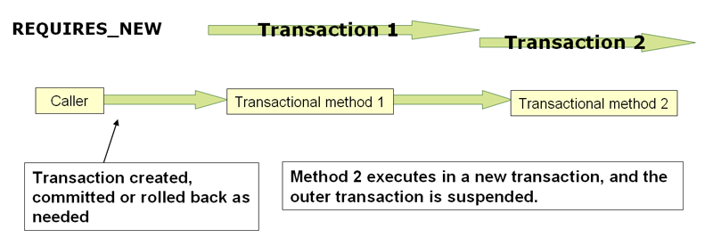
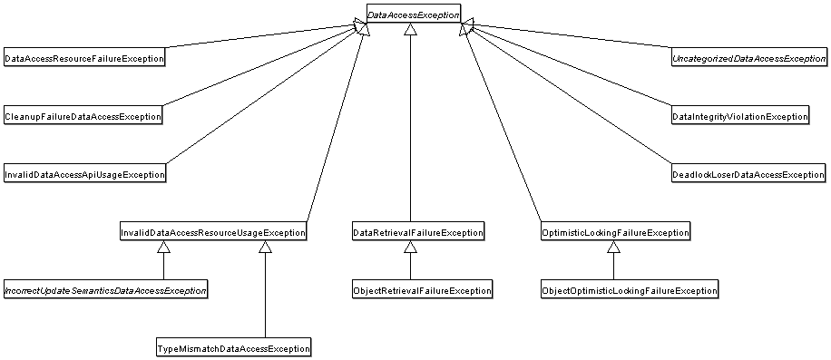

# 数据访问

version 6.0.8-SNAPSHOT

[Back to index](https://springdoc.cn/spring/index.html)

- [1. 事务管理](https://springdoc.cn/spring/data-access.html#transaction)
- [2. DAO 的支持](https://springdoc.cn/spring/data-access.html#dao)
- [3. 使用JDBC进行数据访问](https://springdoc.cn/spring/data-access.html#jdbc)
- [4. 使用R2DBC进行数据访问](https://springdoc.cn/spring/data-access.html#r2dbc)
- [5. 对象关系映射（ORM）数据访问](https://springdoc.cn/spring/data-access.html#orm)
- [6. 通过使用 Object-XML Mapper 对XML进行装载](https://springdoc.cn/spring/data-access.html#oxm)
- [7. 附录](https://springdoc.cn/spring/data-access.html#data.access.appendix)

|      | 本站([springdoc.cn](https://springdoc.cn/))中的内容来源于 [spring.io](https://spring.io/) ，原始版权归属于 [spring.io](https://spring.io/)。由 [springdoc.cn](https://springdoc.cn/) 进行翻译，整理。可供个人学习、研究，未经许可，不得进行任何转载、商用或与之相关的行为。 商标声明：Spring 是 Pivotal Software, Inc. 在美国以及其他国家的商标。 |
| ---- | ------------------------------------------------------------ |
|      |                                                              |

参考文档的这一部分涉及数据访问以及数据访问层和业务或服务层之间的交互。

对Spring全面的事务管理支持进行了一些详细的介绍，随后对Spring框架所集成的各种数据访问框架和技术进行了全面的介绍。

## 1. 事务管理

全面的事务支持是使用Spring框架的最有说服力的理由之一。Spring框架为事务管理提供了一个一致的抽象，提供了以下好处：

- 在不同的事务 API之间有一个一致的编程模型，如Java Transaction API（JTA）、JDBC、Hibernate和Java Persistence API（JPA）。
- 支持 [声明式事务管理](https://springdoc.cn/spring/data-access.html#transaction-declarative)。
- 与复杂的事务API（如JTA）相比，一个更简单的 [编程式](https://springdoc.cn/spring/data-access.html#transaction-programmatic) 事务管理API。
- 与Spring的数据访问抽象的出色集成。

下面的章节描述了Spring框架的事务特性和技术：

- [Spring框架的事务支持模型的优势](https://springdoc.cn/spring/data-access.html#transaction-motivation)描述了为什么你会使用Spring框架的事务抽象，而不是EJB容器管理的事务（CMT）或选择通过专有API（如Hibernate）驱动本地事务。
- [了解Spring框架事务抽象](https://springdoc.cn/spring/data-access.html#transaction-strategies) 概述了核心类，并描述了如何配置和从各种来源获取 `DataSource` 实例。
- [用事务同步资源](https://springdoc.cn/spring/data-access.html#tx-resource-synchronization) 描述了应用程序代码如何确保资源被正确创建、重复使用和清理。
- [声明式事务管理](https://springdoc.cn/spring/data-access.html#transaction-declarative) 描述了对声明式事务管理的支持。
- [程序化事务管理](https://springdoc.cn/spring/data-access.html#transaction-programmatic) 涵盖了对程序化（即明确编码的）事务管理的支持。
- [事务绑定事件](https://springdoc.cn/spring/data-access.html#transaction-event) 描述了你如何在一个事务中使用应用程序事件。

该章还包括对最佳实践、[应用服务器集成](https://springdoc.cn/spring/data-access.html#transaction-application-server-integration) 和 [常见问题解决方案](https://springdoc.cn/spring/data-access.html#transaction-solutions-to-common-problems) 的讨论。

### 1.1. Spring框架的事务支持模型的优势

传统上，EE应用程序开发人员在事务管理方面有两种选择：全局或本地事务，这两种事务都有深刻的局限性。在接下来的两节中，我们将回顾全局和局部事务管理，然后讨论Spring框架的事务管理支持如何解决全局和局部事务模型的限制。

#### 1.1.1. 全局事务

全局事务让你与多个事务性资源一起工作，通常是关系型数据库和消息队列。应用服务器通过JTA管理全局事务，这是一个繁琐的API（部分原因是其异常模型）。此外，JTA的 `UserTransaction` 通常需要从JNDI获取，这意味着你也需要使用JNDI才能使用JTA。全局事务的使用限制了任何潜在的应用程序代码的重用，因为JTA通常只在应用程序服务器环境中可用。

以前，使用全局事务的首选方式是通过EJB CMT（容器管理事务）。CMT是声明式事务管理的一种形式（区别于程序化事务管理）。EJB CMT消除了对事务相关的JNDI查询的需要，尽管EJB的使用本身就需要使用JNDI。它消除了大部分但不是全部编写Java代码来控制事务的需要。重要的缺点是，CMT与JTA和应用服务器环境相联系。而且，只有当人们选择在EJB中实现业务逻辑（或至少在事务性的 EJB facade 后面）时，它才可用。EJB的缺点是如此之多，以至于这不是一个有吸引力的提议，特别是在面对声明式事务管理的引人注目的替代方案时。

#### 1.1.2. 本地事务

本地事务是特定资源的，例如与JDBC连接相关的事务。本地事务可能更容易使用，但有一个明显的缺点： 它们不能跨多个事务资源工作。例如，通过使用JDBC连接管理事务的代码不能在全局JTA事务中运行。因为应用服务器没有参与事务管理，它不能帮助确保跨多个资源的正确性。（值得注意的是，大多数应用程序都使用单一的事务资源）。另一个缺点是，本地事务对编程模型有侵入性。

#### 1.1.3. Spring框架的一致化编程模型

Spring解决了全局和局部事务的弊端。它让应用开发者在任何环境下都能使用一个一致的编程模型。你只需写一次代码，它就可以在不同的环境中受益于不同的事务管理策略。Spring框架同时提供声明式和编程式事务管理。大多数用户更喜欢声明式事务管理，我们在大多数情况下都推荐这样做。

通过编程式事务管理，开发人员使用Spring框架的事务抽象，它可以在任何底层事务基础设施上运行。通过首选的声明式模型，开发人员通常很少或不写与事务管理有关的代码，因此，不依赖于Spring框架的事务API或任何其他事务API。

你需要一个用于事务管理的应用服务器吗？

Spring框架的事务管理支持改变了传统的规则，即企业Java应用何时需要应用服务器。

特别是，你不需要一个纯粹的应用服务器来通过EJB进行声明式事务处理。事实上，即使你的应用服务器有强大的JTA功能，你也可能决定Spring框架的声明式事务比EJB CMT提供更多的功能和更多的编程模型。

通常情况下，只有当你的应用程序需要跨多个资源处理事务时，你才需要应用服务器的JTA能力，这对许多应用程序来说不是一个要求。许多高端应用使用一个单一的、高度可扩展的数据库（如Oracle RAC）来代替。独立的事务管理器（如 [Atomikos Transactions](https://www.atomikos.com/)）是其他选择。当然，你可能需要其他应用服务器的能力，如Java消息服务（JMS）和 Jakarta EE Connector 架构（JCA）。

Spring框架让你可以选择何时将你的应用扩展到一个满载的应用服务器。过去，使用EJB CMT或JTA的唯一选择是编写本地事务的代码（比如JDBC连接上的事务），如果你需要这些代码在全局的、容器管理的事务中运行，就要面临巨大的返工。有了Spring框架，只有你的配置文件中的一些bean定义需要改变（而不是你的代码）。

### 1.2. 了解Spring框架的事务抽象（Transaction Abstraction）

Spring事务抽象的关键是事务策略的概念。事务策略是由 `TransactionManager` 定义的，特别是用于强制事务管理的 `org.springframework.transaction.PlatformTransactionManager` 接口和用于响应式事务管理的 `org.springframework.transaction.ReactiveTransactionManager` 接口。下面的列表显示了 `PlatformTransactionManager` API的定义：

```java
public interface PlatformTransactionManager extends TransactionManager {

    TransactionStatus getTransaction(TransactionDefinition definition) throws TransactionException;

    void commit(TransactionStatus status) throws TransactionException;

    void rollback(TransactionStatus status) throws TransactionException;
}
```

这主要是一个服务提供者接口（SPI），尽管你可以从你的应用代码中以 [编程方式](https://springdoc.cn/spring/data-access.html#transaction-programmatic-ptm) 使用它。因为 `PlatformTransactionManager` 是一个接口，它可以很容易地被 mock 或在必要时被 stub。它不与查找策略相联系，例如 JNDI。`PlatformTransactionManager` 的实现与 Spring Framework IoC容器中的其他对象（或Bean）一样被定义。仅仅是这个好处就使Spring框架的事务成为一个值得一试的抽象，即使是在你使用JTA的时候。你可以比直接使用JTA更容易地测试事务性代码。

同样，为了与Spring的理念保持一致，可以由 `PlatformTransactionManager` 接口的任何方法抛出的 `TransactionException` 是未检查（非运行时）的（也就是说，它继承了 `java.lang.RuntimeException` 类）。事务基础设施的失败几乎无一例外地是致命的。在极少数情况下，应用程序代码实际上可以从事务失败中恢复过来，应用开发者仍然可以选择 catch 和处理 `TransactionException`。突出的一点是，开发者并不被迫这样做。

`getTransaction(..)` 方法返回一个 `TransactionStatus` 对象，这取决于 `TransactionDefinition` 参数。返回的 `TransactionStatus` 可能代表一个新的事务，也可能代表一个现有的事务，如果在当前调用栈中存在一个匹配的事务。后者的含义是，与 Jakarta EE的事务上下文一样，`TransactionStatus` 与执行线程相关。

从Spring Framework 5.2开始，Spring也为利用响应式类型或 Kotlin Coroutines 的响应式应用提供了一个事务管理抽象。下面的列表显示了 `org.springframework.transaction.ReactiveTransactionManager` 所定义的事务策略：

```java
public interface ReactiveTransactionManager extends TransactionManager {

    Mono<ReactiveTransaction> getReactiveTransaction(TransactionDefinition definition) throws TransactionException;

    Mono<Void> commit(ReactiveTransaction status) throws TransactionException;

    Mono<Void> rollback(ReactiveTransaction status) throws TransactionException;
}
```

响应式事务管理器主要是一个服务提供者接口（SPI），尽管你可以从你的应用程序代码中以 [编程方式](https://springdoc.cn/spring/data-access.html#transaction-programmatic-rtm) 使用它。因为 `ReactiveTransactionManager` 是一个接口，它可以根据需要很容易地被 mock 或 stub。

`TransactionDefinition` 接口规定了：

- Propagation: 通常情况下，一个事务范围内的所有代码都在该事务中运行。然而，如果一个事务性方法在一个已经存在的事务上下文中被运行，你可以指定其行为。例如，代码可以继续在现有的事务中运行（常见的情况），或者暂停现有的事务并创建一个新的事务。Spring提供了所有从EJB CMT中熟悉的事务传播选项。要了解Spring中事务传播的语义，请看 [事务传播（Propagation）](https://springdoc.cn/spring/data-access.html#tx-propagation)。
- Isolation: 这个事务与其他事务的隔离级别。例如，这个事务能否看到其他事务的未提交的写操作？
- Timeout: 这个事务会保持多久直到由基础事务基础设施自动超时并回滚。
- Read-only status(只读状态): 当你的代码读取但不修改数据时，你可以使用一个只读事务。只读事务在某些情况下是一种有用的优化，例如当你使用Hibernate时。

这些设置反映了标准的事务性概念。如果有必要，请参考讨论事务隔离级别和其他核心事务概念的资源。理解这些概念对于使用Spring框架或任何事务管理解决方案是至关重要的。

`TransactionStatus` 接口为事务代码提供了一种简单的方法来控制事务执行和查询事务状态。这些概念应该是熟悉的，因为它们是所有事务API所共有的。下面的列表显示了 `TransactionStatus` 接口：

```java
public interface TransactionStatus extends TransactionExecution, SavepointManager, Flushable {

    @Override
    boolean isNewTransaction();

    boolean hasSavepoint();

    @Override
    void setRollbackOnly();

    @Override
    boolean isRollbackOnly();

    void flush();

    @Override
    boolean isCompleted();
}
```

无论你在Spring中选择声明式还是编程式事务管理，定义正确的 `TransactionManager` 实现是绝对必要的。你通常通过依赖注入来定义这个实现。

`TransactionManager` 的实现通常需要对其工作环境的了解： JDBC、JTA、Hibernate，等等。下面的例子显示了你如何定义一个本地的 `PlatformTransactionManager` 实现（在这种情况下，用普通的JDBC。）

你可以通过创建一个与下面类似的 bean 来定义JDBC `DataSource`：

```xml
<bean id="dataSource" class="org.apache.commons.dbcp.BasicDataSource" destroy-method="close">
    <property name="driverClassName" value="${jdbc.driverClassName}" />
    <property name="url" value="${jdbc.url}" />
    <property name="username" value="${jdbc.username}" />
    <property name="password" value="${jdbc.password}" />
</bean>
```

然后，相关的 `PlatformTransactionManager` Bean 定义有一个对 `DataSource` 定义的引用。它应该类似于下面的例子：

```xml
<bean id="txManager" class="org.springframework.jdbc.datasource.DataSourceTransactionManager">
    <property name="dataSource" ref="dataSource"/>
</bean>
```

如果你在Jakarta EE容器中使用JTA，那么你就使用通过JNDI获得的容器 `DataSource`，并结合Spring的 `JtaTransactionManager`。下面的例子显示了JTA和JNDI的查询（lookup）版本是什么样子的：

```xml
<?xml version="1.0" encoding="UTF-8"?>
<beans xmlns="http://www.springframework.org/schema/beans"
    xmlns:xsi="http://www.w3.org/2001/XMLSchema-instance"
    xmlns:jee="http://www.springframework.org/schema/jee"
    xsi:schemaLocation="
        http://www.springframework.org/schema/beans
        https://www.springframework.org/schema/beans/spring-beans.xsd
        http://www.springframework.org/schema/jee
        https://www.springframework.org/schema/jee/spring-jee.xsd">

    <jee:jndi-lookup id="dataSource" jndi-name="jdbc/jpetstore"/>

    <bean id="txManager" class="org.springframework.transaction.jta.JtaTransactionManager" />

    <!-- other <bean/> definitions here -->

</beans>
```

`JtaTransactionManager` 不需要知道数据源（或任何其他特定的资源），因为它使用容器的全局事务管理基础设施。

|      | 前面的 `dataSource` Bean的定义使用了jee命名空间的 `<jndi-lookup/>` 标签。欲了解更多信息，请参见 [JEE Schema](https://springdoc.cn/spring/integration.html#integration.appendix.xsd-schemas-jee)。 |
| ---- | ------------------------------------------------------------ |
|      |                                                              |

|      | 如果你使用JTA，你的事务管理器定义应该看起来是一样的，无论你使用什么数据访问技术，无论是JDBC、Hibernate JPA，还是其他任何支持的技术。这是由于JTA事务是全局事务，它可以征集任何事务性资源。 |
| ---- | ------------------------------------------------------------ |
|      |                                                              |

在所有Spring事务设置中，应用程序代码不需要改变。你可以仅仅通过改变配置来改变事务的管理方式，即使这种改变意味着从本地事务转移到全局事务，或者反之亦然。

#### 1.2.1. Hibernate 事务设置

你也可以轻松地使用Hibernate本地事务，如下面的例子所示。在这种情况下，你需要定义一个Hibernate `LocalSessionFactoryBean`，你的应用代码可以用它来获取Hibernate `Session` 实例。

`DataSource` Bean 的定义与之前显示的本地JDBC例子相似，因此，在下面的例子中没有显示。

|      | 如果 `DataSource`（由任何非JTA事务管理器使用）通过JNDI查找并由Jakarta EE容器管理，它应该是非事务性的，因为Spring框架（而不是Jakarta EE容器）管理着事务。 |
| ---- | ------------------------------------------------------------ |
|      |                                                              |

本例中的 `txManager` Bean 是 `HibernateTransactionManager` 类型的。与 `DataSourceTransactionManager` 需要对 `DataSource` 的引用一样， `HibernateTransactionManager` 需要对 `SessionFactory` 的引用。下面的例子声明了 `sessionFactory` 和 `txManager` bean：

```xml
<bean id="sessionFactory" class="org.springframework.orm.hibernate5.LocalSessionFactoryBean">
    <property name="dataSource" ref="dataSource"/>
    <property name="mappingResources">
        <list>
            <value>org/springframework/samples/petclinic/hibernate/petclinic.hbm.xml</value>
        </list>
    </property>
    <property name="hibernateProperties">
        <value>
            hibernate.dialect=${hibernate.dialect}
        </value>
    </property>
</bean>

<bean id="txManager" class="org.springframework.orm.hibernate5.HibernateTransactionManager">
    <property name="sessionFactory" ref="sessionFactory"/>
</bean>
```

如果你使用Hibernate和Jakarta EE容器管理的JTA事务，你应该使用与前面JDBC的JTA例子中相同的 `JtaTransactionManager`，如下例所示。另外，建议让Hibernate通过它的事务协调器（transaction coordinator），可能还包括它的连接（connection）释放模式配置来了解JTA：

```xml
<bean id="sessionFactory" class="org.springframework.orm.hibernate5.LocalSessionFactoryBean">
    <property name="dataSource" ref="dataSource"/>
    <property name="mappingResources">
        <list>
            <value>org/springframework/samples/petclinic/hibernate/petclinic.hbm.xml</value>
        </list>
    </property>
    <property name="hibernateProperties">
        <value>
            hibernate.dialect=${hibernate.dialect}
            hibernate.transaction.coordinator_class=jta
            hibernate.connection.handling_mode=DELAYED_ACQUISITION_AND_RELEASE_AFTER_STATEMENT
        </value>
    </property>
</bean>

<bean id="txManager" class="org.springframework.transaction.jta.JtaTransactionManager"/>
```

或者，你可以将 `JtaTransactionManager` 传递给你的 `LocalSessionFactoryBean`，以执行相同的默认值：

```xml
<bean id="sessionFactory" class="org.springframework.orm.hibernate5.LocalSessionFactoryBean">
    <property name="dataSource" ref="dataSource"/>
    <property name="mappingResources">
        <list>
            <value>org/springframework/samples/petclinic/hibernate/petclinic.hbm.xml</value>
        </list>
    </property>
    <property name="hibernateProperties">
        <value>
            hibernate.dialect=${hibernate.dialect}
        </value>
    </property>
    <property name="jtaTransactionManager" ref="txManager"/>
</bean>

<bean id="txManager" class="org.springframework.transaction.jta.JtaTransactionManager"/>
```

### 1.3. 用事务同步资源

如何创建不同的事务管理器，以及如何将它们与需要同步到事务的相关资源（例如 `DataSourceTransactionManager` 到JDBC `DataSource`，`HibernateTransactionManager` 到 Hibernate `SessionFactory`，等等）联系起来，现在应该清楚了。本节描述了应用程序代码（直接或间接地通过使用持久化API，如JDBC、Hibernate或JPA）如何确保这些资源被正确地创建、重复使用和清理。本节还讨论了如何通过相关的 `TransactionManager` 触发事务同步（可选）。

#### 1.3.1. 高级同步方式

首选的方法是使用Spring最高级别的基于模板的持久化集成API，或者使用本地ORM API与事务感知（transaction-aware）工厂bean或代理来管理本地资源工厂。这些事务感知解决方案在内部处理资源的创建和重用、清理、资源的可选事务同步，以及异常映射。因此，用户数据访问代码不需要处理这些任务，而是可以纯粹地专注于非模板持久化逻辑。一般来说，你可以使用本地ORM API，或者通过使用 `JdbcTemplate` 为JDBC访问采取模板方法。这些解决方案将在本参考文档的后续章节中详细介绍。

#### 1.3.2. 低级同步方式

诸如 `DataSourceUtils`（用于JDBC）、`EntityManagerFactoryUtils`（用于JPA）、 `SessionFactoryUtils`（用于Hibernate）等类存在于较低层次。当你想让应用程序代码直接处理本地持久化API的资源类型时，你可以使用这些类来确保获得正确的Spring框架管理的实例，事务（可选择）同步，以及在此过程中发生的异常被正确地映射到一致的API。

例如，在JDBC的情况下，你可以使用Spring的 `org.springframework.jdbc.datasource.DataSourceUtils` 类，而不是传统的JDBC方法，即调用 `DataSource` 上的 `getConnection()` 方法，如下所示：

```java
Connection conn = DataSourceUtils.getConnection(dataSource);
```

如果一个现有的事务已经有一个与之同步（链接）的连接，该实例将被返回。否则，该方法的调用会触发一个新的连接的创建，该连接（可选择）与任何现有的事务同步，并可在同一事务中进行后续重用。如前所述，任何 `SQLException` 都被包裹在Spring框架的 `CannotGetJdbcConnectionException` 中，这是Spring框架未检查的 `DataAccessException` 类型的层次结构之一。这种方法为你提供了比从 `SQLException` 中轻易获得的更多信息，并确保了跨数据库甚至不同持久化技术的可移植性。

这种方法在没有Spring事务管理的情况下也可以使用（事务同步是可选的），所以无论你是否使用Spring的事务管理，都可以使用它。

当然，一旦你使用了Spring的JDBC支持、JPA支持或Hibernate支持，一般来说，你最好不要使用 `DataSourceUtils` 或其他辅助类，因为你通过Spring的抽象工作要比直接使用相关的API更快乐。例如，如果你使用Spring `JdbcTemplate` 或 `jdbc.object` 包来简化你对JDBC的使用，正确的连接（connection）检索会在幕后发生，你不需要编写任何特殊的代码。

#### 1.3.3. `TransactionAwareDataSourceProxy`

最底层的是 `TransactionAwareDataSourceProxy` 类。这是一个目标（target） `DataSource` 的代理，它包装了 `DataSource` 以增加对Spring管理的事务的感知。在这方面，它类似于Jakarta EE服务器提供的事务型JNDI `DataSource`。

你几乎不应该需要或想要使用这个类，除非现有的代码必须被调用并传递一个标准的JDBC `DataSource` 接口实现。在这种情况下，这段代码有可能是可用的，但却参与了Spring管理的事务。你可以通过使用前面提到的高级抽象来编写你的新代码。

### 1.4. 声明式事务管理

|      | 大多数Spring框架用户选择声明式事务管理。这个选项对应用程序代码的影响最小，因此与非侵入性的轻量级容器的理想最为一致。 |
| ---- | ------------------------------------------------------------ |
|      |                                                              |

Spring框架的声明式事务管理是通过Spring面向切面编程（AOP）实现的。然而，由于事务方面的代码是随Spring框架的发布而来，并且可以以模板的方式使用，所以一般不需要理解AOP的概念来有效地使用这些代码。

Spring框架的声明式事务管理与EJB CMT类似，你可以指定事务行为（或不指定），直至单个方法级别。如果有必要，你可以在事务上下文中进行 `setRollbackOnly()` 调用。这两种类型的事务管理的区别在于：

- 不像EJB CMT与JTA绑定，Spring框架的声明式事务管理可以在任何环境下工作。通过调整配置文件，它可以与JTA事务或使用JDBC、JPA或Hibernate的本地事务一起工作。
- 你可以将Spring框架的声明式事务管理应用于任何类，而不仅仅是EJB这样的特殊类。
- Spring框架提供了声明式的 [回滚规则](https://springdoc.cn/spring/data-access.html#transaction-declarative-rolling-back)，这是一个没有EJB对应的功能。对回滚规则的编程式和声明式支持都有提供。
- Spring框架允许你通过使用AOP来定制事务行为。例如，你可以在事务回滚的情况下插入自定义行为。你还可以添加任意的advice，以及事务性advice。通过EJB CMT，你不能影响容器的事务管理，除非使用 `setRollbackOnly()`。
- Spring框架不支持跨远程调用的事务上下文的传播，就像高端应用服务器那样。如果你需要这个功能，我们建议你使用EJB。然而，在使用这种功能之前，请仔细考虑，因为，通常情况下，人们不希望事务跨越远程调用。

回滚规则的概念很重要。它们让你指定哪些异常（和 throwable）应该导致自动回滚。你可以在配置中声明性地指定，而不是在Java代码中。因此，尽管你仍然可以在 `TransactionStatus` 对象上调用 `setRollbackOnly()` 来回滚当前事务，但最常见的是你可以指定一个规则，即 `MyApplicationException` 必须总是导致回滚。这个选项的显著优势是，业务对象不依赖于事务基础设施。例如，它们通常不需要导入Spring事务API或其他Spring API。

尽管EJB容器的默认行为会在系统异常（通常是运行时异常）时自动回滚事务，但EJB CMT不会在应用程序异常（即除 `java.rmi.RemoteException` 以外的被检查的异常）时自动回滚事务。虽然Spring声明式事务管理的默认行为遵循了EJB的惯例（只在未检查的异常上自动回滚），但自定义这种行为往往是有用的。

#### 1.4.1. 了解Spring框架的声明式事务实现

仅仅告诉你用 `@Transactional` 注解来注解你的类，将 `@EnableTransactionManagement` 添加到你的配置中，并期望你能理解这一切是如何运作的，这是不够的。为了提供更深入的理解，本节将在事务相关问题的背景下解释Spring框架的声明式事务基础设施的内部运作。

关于Spring框架的声明性事务支持，最重要的概念是这种支持是通过 [AOP代理](https://springdoc.cn/spring/core.html#aop-understanding-aop-proxies) 实现的，而且事务advice是由元数据（目前是基于XML或注解）驱动的。AOP与事务元数据的结合产生了一个AOP代理，它使用 `TransactionInterceptor` 与适当的 `TransactionManager` 实现来驱动围绕方法调用的事务。

|      | Spring AOP在 [AOP部分](https://springdoc.cn/spring/core.html#aop) 有介绍。 |
| ---- | ------------------------------------------------------------ |
|      |                                                              |

Spring Framework的 `TransactionInterceptor` 为命令式和响应式编程模型提供事务管理。拦截器通过检查方法的返回类型来检测所需的事务管理方式。返回响应式类型的方法，如 `Publisher` 或 Kotlin `Flow`（或其子类型），有资格进行响应式事务管理。所有其他的返回类型，包括 `void`，都使用命令式事务管理的代码路径。

事务管理的 “味道” 会影响到需要哪个事务管理器。强制性事务需要 `PlatformTransactionManager`，而响应性事务使用 `ReactiveTransactionManager` 实现。

|      | `@Transactional` 通常与 `PlatformTransactionManager` 管理的线程绑定的事务一起工作，将一个事务暴露给当前执行线程内的所有数据访问操作。注意：这不会传播到方法内新启动的线程。由 `ReactiveTransactionManager` 管理的响应式事务使用 Reactor 上下文而不是 thread-local 属性。因此，所有参与的数据访问操作都需要在同一 reactive pipeline 中的同一 Reactor 上下文中执行。 |
| ---- | ------------------------------------------------------------ |
|      |                                                              |

下图显示了在事务型代理上调用方法的概念性视图：


#### 1.4.2. 声明式事务实现的例子

考虑一下下面的接口及其附带的实现。这个例子使用 `Foo` 和 `Bar` 类作为占位符，这样你就可以专注于事务的使用，而不用关注特定的 domain 模型。就本例而言，`DefaultFooService` 类在每个实现方法的主体中抛出 `UnsupportedOperationException` 实例这一事实是好的。这种行为让你看到事务被创建，然后回滚以响应 `UnsupportedOperationException` 实例。下面的列表显示了 `FooService` 的接口：

Java

```java
package x.y.service;

public interface FooService {

    Foo getFoo(String fooName);

    Foo getFoo(String fooName, String barName);

    void insertFoo(Foo foo);

    void updateFoo(Foo foo);

}
```

Kotlin

```kotlin
package x.y.service

interface FooService {

    fun getFoo(fooName: String): Foo

    fun getFoo(fooName: String, barName: String): Foo

    fun insertFoo(foo: Foo)

    fun updateFoo(foo: Foo)
}
```

下面的例子显示了前述接口的一个实现：

Java

```java
package x.y.service;

public class DefaultFooService implements FooService {

    @Override
    public Foo getFoo(String fooName) {
        // ...
    }

    @Override
    public Foo getFoo(String fooName, String barName) {
        // ...
    }

    @Override
    public void insertFoo(Foo foo) {
        // ...
    }

    @Override
    public void updateFoo(Foo foo) {
        // ...
    }
}
```

Kotlin

```kotlin
package x.y.service

class DefaultFooService : FooService {

    override fun getFoo(fooName: String): Foo {
        // ...
    }

    override fun getFoo(fooName: String, barName: String): Foo {
        // ...
    }

    override fun insertFoo(foo: Foo) {
        // ...
    }

    override fun updateFoo(foo: Foo) {
        // ...
    }
}
```

假设 `FooService` 接口的前两个方法 `getFoo(String)` 和 `getFoo(String, String)` 必须在具有只读语义的事务上下文中运行，其他方法 `insertFoo(Foo)` 和 `updateFoo(Foo)` 必须在具有读写语义的事务下运行。下面几段将详细解释下面的配置：

```xml
<!-- from the file 'context.xml' -->
<?xml version="1.0" encoding="UTF-8"?>
<beans xmlns="http://www.springframework.org/schema/beans"
    xmlns:xsi="http://www.w3.org/2001/XMLSchema-instance"
    xmlns:aop="http://www.springframework.org/schema/aop"
    xmlns:tx="http://www.springframework.org/schema/tx"
    xsi:schemaLocation="
        http://www.springframework.org/schema/beans
        https://www.springframework.org/schema/beans/spring-beans.xsd
        http://www.springframework.org/schema/tx
        https://www.springframework.org/schema/tx/spring-tx.xsd
        http://www.springframework.org/schema/aop
        https://www.springframework.org/schema/aop/spring-aop.xsd">

    <!-- this is the service object that we want to make transactional -->
    <bean id="fooService" class="x.y.service.DefaultFooService"/>

    <!-- the transactional advice (what 'happens'; see the <aop:advisor/> bean below) -->
    <tx:advice id="txAdvice" transaction-manager="txManager">
        <!-- the transactional semantics... -->
        <tx:attributes>
            <!-- all methods starting with 'get' are read-only -->
            <tx:method name="get*" read-only="true"/>
            <!-- other methods use the default transaction settings (see below) -->
            <tx:method name="*"/>
        </tx:attributes>
    </tx:advice>

    <!-- ensure that the above transactional advice runs for any execution
        of an operation defined by the FooService interface -->
    <aop:config>
        <aop:pointcut id="fooServiceOperation" expression="execution(* x.y.service.FooService.*(..))"/>
        <aop:advisor advice-ref="txAdvice" pointcut-ref="fooServiceOperation"/>
    </aop:config>

    <!-- don't forget the DataSource -->
    <bean id="dataSource" class="org.apache.commons.dbcp.BasicDataSource" destroy-method="close">
        <property name="driverClassName" value="oracle.jdbc.driver.OracleDriver"/>
        <property name="url" value="jdbc:oracle:thin:@rj-t42:1521:elvis"/>
        <property name="username" value="scott"/>
        <property name="password" value="tiger"/>
    </bean>

    <!-- similarly, don't forget the TransactionManager -->
    <bean id="txManager" class="org.springframework.jdbc.datasource.DataSourceTransactionManager">
        <property name="dataSource" ref="dataSource"/>
    </bean>

    <!-- other <bean/> definitions here -->

</beans>
```

检查一下前面的配置。它假定你想让一个服务对象（`fooService` Bean）成为事务性的。要应用的事务语义被封装在 `<tx:advice/>` 定义中。`<tx:advice/>` 定义如下："所有以 `get` 开头的方法都要在只读事务的上下文中运行，所有其他方法都要以默认的事务语义运行"。`<tx:advice/>` 标签的 `transaction-manager` 属性被设置为将要驱动事务的 `TransactionManager` Bean的名称（在本例中，是 `txManager` Bean）。

|      | 如果你想接入的 `TransactionManager` 的 bean 名称是 `transactionManager`，你可以在事务 advice（`<tx:advice/>`）中省略 `transaction-manager` 属性。如果你想接入的 `TransactionManager` Bean 有任何其他名字，你必须明确地使用 `transaction-manager` 属性，就像前面的例子一样。 |
| ---- | ------------------------------------------------------------ |
|      |                                                              |

`<aop:config/>` 定义确保由 `txAdvice` Bean 定义的事务性advice在程序中的适当点运行。首先，你定义一个与 `FooService` 接口（`fooServiceOperation`）中定义的任何操作的执行相匹配的 pointcut。然后，你通过使用 advisor 将该 pointcut 与 `txAdvice` 联系起来。结果表明，在执行 `fooServiceOperation` 的时候，由 `txAdvice` 定义的 advice 被运行。

在 `<aop:pointcut/>` 元素中定义的表达式是一个 AspectJ pointcut 表达式。关于Spring中的 pointcut 表达式的更多细节，请参见 [AOP部分](https://springdoc.cn/spring/core.html#aop)。

一个常见的要求是使整个服务层成为事务性的。做到这一点的最好方法是改变 pointcut 表达式以匹配你的服务层中的任何操作。下面的例子展示了如何做到这一点： s

```xml
<aop:config>
    <aop:pointcut id="fooServiceMethods" expression="execution(* x.y.service.*.*(..))"/>
    <aop:advisor advice-ref="txAdvice" pointcut-ref="fooServiceMethods"/>
</aop:config>
```

|      | 在前面的例子中，假设你的所有服务接口都定义在 `x.y.service` 包中。更多细节请参见 [AOP部分](https://springdoc.cn/spring/core.html#aop)。 |
| ---- | ------------------------------------------------------------ |
|      |                                                              |

现在我们已经分析了配置，你可能会问自己，"这些配置到底是做什么的？"

前面显示的配置被用来在从 `fooService` Bean定义中创建的对象周围创建一个事务性代理。该代理被配置为具有事务 advice，因此，当代理上调用适当的方法时，事务被启动、暂停、标记为只读，等等，取决于与该方法相关的事务配置。考虑一下下面的程序，它测试了前面所示的配置：

Java

```java
public final class Boot {

    public static void main(final String[] args) throws Exception {
        ApplicationContext ctx = new ClassPathXmlApplicationContext("context.xml");
        FooService fooService = ctx.getBean(FooService.class);
        fooService.insertFoo(new Foo());
    }
}
```

Kotlin

```kotlin
fun main() {
    val ctx = ClassPathXmlApplicationContext("context.xml")
    val fooService = ctx.getBean<FooService>("fooService")
    fooService.insertFoo(Foo())
}
```

运行前述程序的输出应类似于以下内容（为了清晰起见，`DefaultFooService` 类的 `insertFoo(..)` 方法抛出的 `UnsupportedOperationException` 的 Log4J 输出和 stack trace 已被截断）：

```xml
<!-- the Spring container is starting up... -->
[AspectJInvocationContextExposingAdvisorAutoProxyCreator] - Creating implicit proxy for bean 'fooService' with 0 common interceptors and 1 specific interceptors

<!-- the DefaultFooService is actually proxied -->
[JdkDynamicAopProxy] - Creating JDK dynamic proxy for [x.y.service.DefaultFooService]

<!-- ... the insertFoo(..) method is now being invoked on the proxy -->
[TransactionInterceptor] - Getting transaction for x.y.service.FooService.insertFoo

<!-- the transactional advice kicks in here... -->
[DataSourceTransactionManager] - Creating new transaction with name [x.y.service.FooService.insertFoo]
[DataSourceTransactionManager] - Acquired Connection [org.apache.commons.dbcp.PoolableConnection@a53de4] for JDBC transaction

<!-- the insertFoo(..) method from DefaultFooService throws an exception... -->
[RuleBasedTransactionAttribute] - Applying rules to determine whether transaction should rollback on java.lang.UnsupportedOperationException
[TransactionInterceptor] - Invoking rollback for transaction on x.y.service.FooService.insertFoo due to throwable [java.lang.UnsupportedOperationException]

<!-- and the transaction is rolled back (by default, RuntimeException instances cause rollback) -->
[DataSourceTransactionManager] - Rolling back JDBC transaction on Connection [org.apache.commons.dbcp.PoolableConnection@a53de4]
[DataSourceTransactionManager] - Releasing JDBC Connection after transaction
[DataSourceUtils] - Returning JDBC Connection to DataSource

Exception in thread "main" java.lang.UnsupportedOperationException at x.y.service.DefaultFooService.insertFoo(DefaultFooService.java:14)
<!-- AOP infrastructure stack trace elements removed for clarity -->
at $Proxy0.insertFoo(Unknown Source)
at Boot.main(Boot.java:11)
```

为了使用响应式事务管理，代码必须使用响应式类型。

|      | Spring Framework 使用 `ReactiveAdapterRegistry` 来确定一个方法的返回类型是否是响应式的。 |
| ---- | ------------------------------------------------------------ |
|      |                                                              |

下面的列表显示了之前使用的 `FooService` 的修改版本，但这次代码使用了响应式类型：

Java

```java
package x.y.service;

public interface FooService {

    Flux<Foo> getFoo(String fooName);

    Publisher<Foo> getFoo(String fooName, String barName);

    Mono<Void> insertFoo(Foo foo);

    Mono<Void> updateFoo(Foo foo);

}
```

Kotlin

```kotlin
package x.y.service

interface FooService {

    fun getFoo(fooName: String): Flow<Foo>

    fun getFoo(fooName: String, barName: String): Publisher<Foo>

    fun insertFoo(foo: Foo) : Mono<Void>

    fun updateFoo(foo: Foo) : Mono<Void>
}
```

下面的例子显示了前述接口的一个实现：

Java

```java
package x.y.service;

public class DefaultFooService implements FooService {

    @Override
    public Flux<Foo> getFoo(String fooName) {
        // ...
    }

    @Override
    public Publisher<Foo> getFoo(String fooName, String barName) {
        // ...
    }

    @Override
    public Mono<Void> insertFoo(Foo foo) {
        // ...
    }

    @Override
    public Mono<Void> updateFoo(Foo foo) {
        // ...
    }
}
```

Kotlin

```kotlin
package x.y.service

class DefaultFooService : FooService {

    override fun getFoo(fooName: String): Flow<Foo> {
        // ...
    }

    override fun getFoo(fooName: String, barName: String): Publisher<Foo> {
        // ...
    }

    override fun insertFoo(foo: Foo): Mono<Void> {
        // ...
    }

    override fun updateFoo(foo: Foo): Mono<Void> {
        // ...
    }
}
```

强制性和响应性事务管理在事务边界和事务属性的定义上有相同的语义。强制性和响应性事务的主要区别在于后者的延迟性。`TransactionInterceptor` 用事务操作符装饰返回的反应式类型，以开始和清理事务。因此，调用一个事务性的响应式方法将实际的事务管理推迟到激活响应式类型的处理的订阅类型。

响应式事务管理的另一个切面与数据转义有关，这是编程模型的一个自然结果。

当一个方法成功终止时，强制性事务的方法返回值将从事务性方法中返回，这样部分计算的结果就不会逃脱方法关闭。

响应式事务方法返回一个响应式包装类型，该类型代表一个计算序列以及一个开始和完成计算的承诺（promise）。

一个 `Publisher` 可以在事务进行的过程中发布数据，但不一定能完成。因此，依赖于整个事务成功完成的方法需要在调用代码中确保完成和缓冲结果。

#### 1.4.3. 回滚声明式事务

上一节概述了如何在你的应用程序中以声明的方式为类（通常是服务层类）指定事务性设置的基本内容。这一节描述了如何在 XML 配置中以简单、声明性的方式控制事务的回滚。关于用 `@Transactional` 注解声明性地控制回滚语义的细节，请参见 [`@Transactional` 设置](https://springdoc.cn/spring/data-access.html#transaction-declarative-attransactional-settings)。

向Spring框架的事务基础架构表明事务工作将被回滚的推荐方法是，从当前正在事务上下文中执行的代码中抛出一个异常。Spring框架的事务基础架构代码会在调用堆栈中捕获任何未处理的异常，并决定是否对事务进行回滚标记。

在其默认配置中，Spring框架的事务基础架构代码仅在运行时未检查的异常情况下标记事务进行回滚。也就是说，当抛出的异常是 `RuntimeException` 的一个实例或子类时。（默认情况下，`Error` 实例也会导致回滚）。

从 Spring Framework 5.2 开始，默认配置还提供了对 Vavr 的 `Try` 方法的支持，以在其返回 'Failure' 时触发事务回滚。这允许你使用 Try 来处理函数式错误，并在失败的情况下让事务自动回滚。关于 Vavr 的 Try 的更多信息，请参考 [Vavr官方文档](https://www.vavr.io/vavr-docs/#_try)

下面是一个如何使用 Vavr 的 Try 与事务方法的例子：

Java

```java
@Transactional
public Try<String> myTransactionalMethod() {
    // If myDataAccessOperation throws an exception, it will be caught by the
    // Try instance created with Try.of() and wrapped inside the Failure class
    // which can be checked using the isFailure() method on the Try instance.
    return Try.of(delegate::myDataAccessOperation);
}
```

在默认配置中，从事务性方法抛出的受检查的异常不会导致回滚。你可以通过指定回滚规则，准确地配置哪些 `Exception` 类型将事务标记为回滚，包括受检查的异常。

|      | 回滚规则回滚规则决定当一个给定的异常被抛出时，事务是否应该被回滚，规则是基于异常类型或异常模式的。回滚规则可以通过 `rollback-for` 和 `no-rollback-for` 属性在XML中配置，这允许规则被定义为模式。当使用 [`@Transactional`](https://springdoc.cn/spring/data-access.html#transaction-declarative-attransactional-settings) 时，可以通过 `rollbackFor`/`noRollbackFor` 和 `rollbackForClassName`/`noRollbackForClassName` 属性来配置回滚规则，它们允许分别根据异常类型或模式来定义规则。当一个回滚规则被定义为一个exception类型时，该类型将被用来与抛出的exception及其超类型相匹配，提供了类型安全并避免了使用模式时可能发生的任何意外匹配。例如，`jakarta.servlet.ServletException.class` 的值将只匹配 `jakarta.servlet.ServletException` 类型及其子类的抛出的exception。当用 exception 模式定义回滚规则时，该模式可以是一个全路径的类名或一个异常类型（必须是 `Throwable` 的子类）的全路径的类名的子串，目前没有通配符支持。例如，`"jakarta.servlet.ServletException"` 或 `"ServletException"` 的值将匹配 `jakarta.servlet.ServletException` 及其子类。你必须仔细考虑一个模式的具体程度，以及是否包括包的信息（这不是强制性的）。例如，`"Exception"` 几乎可以匹配任何东西，而且可能会隐藏其他规则。如果 `"Exception"` 是为了给所有被检查的异常定义一条规则，那么 `"java.lang.Exception"` 就是正确的。对于更独特的异常名称，例如 `"BaseBusinessException"`，很可能不需要使用异常模式的全称类名称。此外，基于模式的回滚规则可能会导致对名称相似的异常和嵌套类的非故意匹配。这是因为，如果抛出的异常的名称包含为回滚规则配置的异常模式，那么抛出的异常就被认为是与基于模式的回滚规则相匹配。例如，给定一个配置为匹配 `"com.example.CustomException"` 的规则，该规则将与名为 `com.example.CustomExceptionV2` 的异常（与 `CustomException` 在同一个包中，但有一个额外的后缀）或名为 `com.example.CustomException$AnotherException` 的异常（作为 `CustomException` 的嵌套类声明的异常）匹配。 |
| ---- | ------------------------------------------------------------ |
|      |                                                              |

下面的XML片段演示了如何通过通过 `rollback-for` 属性提供异常模式来配置检查的、特定于应用程序的 `Exception` 类型的回滚：

```xml
<tx:advice id="txAdvice" transaction-manager="txManager">
    <tx:attributes>
        <tx:method name="get*" read-only="true" rollback-for="NoProductInStockException"/>
        <tx:method name="*"/>
    </tx:attributes>
</tx:advice>
```

如果你不希望事务在抛出异常时被回滚，你也可以指定 'no rollback' （不会滚）规则。下面的例子告诉Spring框架的事务基础架构，即使面对未处理的 `InstrumentNotFoundException`，也要提交相关的事务：

```xml
<tx:advice id="txAdvice">
    <tx:attributes>
        <tx:method name="updateStock" no-rollback-for="InstrumentNotFoundException"/>
        <tx:method name="*"/>
    </tx:attributes>
</tx:advice>
```

当Spring框架的事务基础架构捕捉到一个异常并咨询配置的回滚规则以决定是否将事务标记为回滚时，最强的匹配规则获胜。因此，在下面的配置中，除了 `InstrumentNotFoundException` 之外的任何异常都会导致相关事务的回滚：

```xml
<tx:advice id="txAdvice">
    <tx:attributes>
        <tx:method name="*" rollback-for="Throwable" no-rollback-for="InstrumentNotFoundException"/>
    </tx:attributes>
</tx:advice>
```

你也可以用编程方式表示需要回滚。虽然简单，但这一过程是相当具有侵入性的，它将你的代码与Spring框架的事务基础结构紧密地联系在一起。下面的例子展示了如何以编程方式指示所需的回滚：

Java

```java
public void resolvePosition() {
    try {
        // some business logic...
    } catch (NoProductInStockException ex) {
        // trigger rollback programmatically
        TransactionAspectSupport.currentTransactionStatus().setRollbackOnly();
    }
}
```

Kotlin

```kotlin
fun resolvePosition() {
    try {
        // some business logic...
    } catch (ex: NoProductInStockException) {
        // trigger rollback programmatically
        TransactionAspectSupport.currentTransactionStatus().setRollbackOnly();
    }
}
```

如果可能的话，我们强烈建议你使用声明式方法来回滚。如果你绝对需要的话，可以使用编程式回滚，但它的使用与实现一个干净的基于POJO的架构相冲突。

#### 1.4.4. 为不同的ban配置不同的事务性语义

考虑一下这样的情景：你有许多服务层对象，你想对每个对象应用完全不同的事务性配置。你可以通过定义不同的 `<aop:advisor/>` 元素来实现，这些元素具有不同的 `pointcut` 和 `advice-ref` 属性值。

作为比较，首先假设你所有的服务层类都定义在一个根 `x.y.service` 包中。为了使所有作为定义在该包（或子包）中的类的实例且名称以 `Service` 结尾的Bean具有默认的事务性配置，你可以写如下内容：

```xml
<?xml version="1.0" encoding="UTF-8"?>
<beans xmlns="http://www.springframework.org/schema/beans"
    xmlns:xsi="http://www.w3.org/2001/XMLSchema-instance"
    xmlns:aop="http://www.springframework.org/schema/aop"
    xmlns:tx="http://www.springframework.org/schema/tx"
    xsi:schemaLocation="
        http://www.springframework.org/schema/beans
        https://www.springframework.org/schema/beans/spring-beans.xsd
        http://www.springframework.org/schema/tx
        https://www.springframework.org/schema/tx/spring-tx.xsd
        http://www.springframework.org/schema/aop
        https://www.springframework.org/schema/aop/spring-aop.xsd">

    <aop:config>

        <aop:pointcut id="serviceOperation"
                expression="execution(* x.y.service..*Service.*(..))"/>

        <aop:advisor pointcut-ref="serviceOperation" advice-ref="txAdvice"/>

    </aop:config>

    <!-- these two beans will be transactional... -->
    <bean id="fooService" class="x.y.service.DefaultFooService"/>
    <bean id="barService" class="x.y.service.extras.SimpleBarService"/>

    <!-- ... and these two beans won't -->
    <bean id="anotherService" class="org.xyz.SomeService"/> <!-- (not in the right package) -->
    <bean id="barManager" class="x.y.service.SimpleBarManager"/> <!-- (doesn't end in 'Service') -->

    <tx:advice id="txAdvice">
        <tx:attributes>
            <tx:method name="get*" read-only="true"/>
            <tx:method name="*"/>
        </tx:attributes>
    </tx:advice>

    <!-- other transaction infrastructure beans such as a TransactionManager omitted... -->

</beans>
```

下面的例子显示了如何配置两个具有完全不同的事务性设置的不同Bean：

```xml
<?xml version="1.0" encoding="UTF-8"?>
<beans xmlns="http://www.springframework.org/schema/beans"
    xmlns:xsi="http://www.w3.org/2001/XMLSchema-instance"
    xmlns:aop="http://www.springframework.org/schema/aop"
    xmlns:tx="http://www.springframework.org/schema/tx"
    xsi:schemaLocation="
        http://www.springframework.org/schema/beans
        https://www.springframework.org/schema/beans/spring-beans.xsd
        http://www.springframework.org/schema/tx
        https://www.springframework.org/schema/tx/spring-tx.xsd
        http://www.springframework.org/schema/aop
        https://www.springframework.org/schema/aop/spring-aop.xsd">

    <aop:config>

        <aop:pointcut id="defaultServiceOperation"
                expression="execution(* x.y.service.*Service.*(..))"/>

        <aop:pointcut id="noTxServiceOperation"
                expression="execution(* x.y.service.ddl.DefaultDdlManager.*(..))"/>

        <aop:advisor pointcut-ref="defaultServiceOperation" advice-ref="defaultTxAdvice"/>

        <aop:advisor pointcut-ref="noTxServiceOperation" advice-ref="noTxAdvice"/>

    </aop:config>

    <!-- this bean will be transactional (see the 'defaultServiceOperation' pointcut) -->
    <bean id="fooService" class="x.y.service.DefaultFooService"/>

    <!-- this bean will also be transactional, but with totally different transactional settings -->
    <bean id="anotherFooService" class="x.y.service.ddl.DefaultDdlManager"/>

    <tx:advice id="defaultTxAdvice">
        <tx:attributes>
            <tx:method name="get*" read-only="true"/>
            <tx:method name="*"/>
        </tx:attributes>
    </tx:advice>

    <tx:advice id="noTxAdvice">
        <tx:attributes>
            <tx:method name="*" propagation="NEVER"/>
        </tx:attributes>
    </tx:advice>

    <!-- other transaction infrastructure beans such as a TransactionManager omitted... -->

</beans>
```

#### 1.4.5. <tx:advice/> 设置

本节总结了你可以通过使用 `<tx:advice/>` 标签指定的各种事务性设置。默认的 `<tx:advice/>` 设置是：

- [propagation （传播）设置](https://springdoc.cn/spring/data-access.html#tx-propagation) 是 `REQUIRED`。
- isolation （隔离级别）为 `DEFAULT.`
- 该事务是读写的。
- 事务超时默认为底层事务系统的默认超时，如果不支持超时，则为无超时。
- 任何 `RuntimeException` 都会触发回滚，而任何被检查的 `Exception` 都不会。

你可以改变这些默认设置。下表总结了嵌套在 `<tx:advice/>` 和 `<tx:attributes/>` 标签中的 `<tx:method/>` 标签的各种属性：

| 属性              | 必须？ | 默认       | 说明                                                         |
| :---------------- | :----- | :--------- | :----------------------------------------------------------- |
| `name`            | Yes    |            | 事务属性要与之关联的方法名称。通配符（*）可以用来将相同的事务属性设置与许多方法联系起来（例如，`get*`、`handle*`、`on*Event`，等等）。 |
| `propagation`     | No     | `REQUIRED` | 事务传播行为。                                               |
| `isolation`       | No     | `DEFAULT`  | 事务隔离级别。只适用于传播设置为 `REQUIRED` 或 `REQUIRES_NEW`。 |
| `timeout`         | No     | -1         | 事务超时（秒）。只适用于传播 `REQUIRED` 或 `REQUIRES_NEW`。  |
| `read-only`       | No     | false      | 读写事务与只读事务。只适用于 `REQUIRED` 或 `REQUIRES_NEW`。  |
| `rollback-for`    | No     |            | 以逗号分隔的触发回滚的 `Exception` 实例的列表。例如，`com.foo.MyBusinessException,ServletException`。 |
| `no-rollback-for` | No     |            | 以逗号分隔的不触发回滚的 `Exception` 实例列表。例如，`com.foo.MyBusinessException,ServletException`。 |

#### 1.4.6. 使用 `@Transactional`

除了基于XML的事务配置的声明式方法外，你还可以使用基于注解的方法。直接在Java源代码中声明事务语义，使声明更接近于受影响的代码。没有太多的过度耦合的危险，因为无论如何，要以事务方式使用的代码几乎总是以这种方式部署。

|      | 标准的 `jakarta.transaction.Transactional` 注解也被支持，可以替代Spring自己的注解。更多细节请参考JTA文档。 |
| ---- | ------------------------------------------------------------ |
|      |                                                              |

使用 `@Transactional` 注解所带来的易用性最好用一个例子来说明，这将在下面的文字中解释。考虑一下下面的类定义：

Java

```java
// the service class that we want to make transactional
@Transactional
public class DefaultFooService implements FooService {

    @Override
    public Foo getFoo(String fooName) {
        // ...
    }

    @Override
    public Foo getFoo(String fooName, String barName) {
        // ...
    }

    @Override
    public void insertFoo(Foo foo) {
        // ...
    }

    @Override
    public void updateFoo(Foo foo) {
        // ...
    }
}
```

Kotlin

```kotlin
// the service class that we want to make transactional
@Transactional
class DefaultFooService : FooService {

    override fun getFoo(fooName: String): Foo {
        // ...
    }

    override fun getFoo(fooName: String, barName: String): Foo {
        // ...
    }

    override fun insertFoo(foo: Foo) {
        // ...
    }

    override fun updateFoo(foo: Foo) {
        // ...
    }
}
```

如上所述，在类的层面上使用，该注解为声明类（以及它的子类）的所有方法指出了一个默认值。另外，每个方法都可以被单独注解。关于Spring认为哪些方法是事务性的，请参见 [方法的可见性和 @Transactional](https://springdoc.cn/spring/data-access.html#transaction-declarative-annotations-method-visibility)。请注意，类级注解并不适用于类层次结构中的祖先类；在这种情况下，继承的方法需要在本地重新声明，以便参与子类级注解。

当一个POJO类（比如上面的那个）被定义为Spring上下文中的一个Bean时，你可以通过 `@Configuration` 类中的 `@EnableTransactionManagement` 注解来使Bean实例具有事务性。详细内容请参见 [javadoc](https://docs.spring.io/spring-framework/docs/6.0.8-SNAPSHOT/javadoc-api/org/springframework/transaction/annotation/EnableTransactionManagement.html)。

在XML配置中，`<tx:annotation-driven/>` 标签提供了类似的便利：

```xml
<!-- from the file 'context.xml' -->
<?xml version="1.0" encoding="UTF-8"?>
<beans xmlns="http://www.springframework.org/schema/beans"
    xmlns:xsi="http://www.w3.org/2001/XMLSchema-instance"
    xmlns:aop="http://www.springframework.org/schema/aop"
    xmlns:tx="http://www.springframework.org/schema/tx"
    xsi:schemaLocation="
        http://www.springframework.org/schema/beans
        https://www.springframework.org/schema/beans/spring-beans.xsd
        http://www.springframework.org/schema/tx
        https://www.springframework.org/schema/tx/spring-tx.xsd
        http://www.springframework.org/schema/aop
        https://www.springframework.org/schema/aop/spring-aop.xsd">

    <!-- this is the service object that we want to make transactional -->
    <bean id="fooService" class="x.y.service.DefaultFooService"/>

    <!-- enable the configuration of transactional behavior based on annotations -->
    <!-- a TransactionManager is still required -->
    <tx:annotation-driven transaction-manager="txManager"/> 

    <bean id="txManager" class="org.springframework.jdbc.datasource.DataSourceTransactionManager">
        <!-- (this dependency is defined somewhere else) -->
        <property name="dataSource" ref="dataSource"/>
    </bean>

    <!-- other <bean/> definitions here -->

</beans>
```

|      | 使Bean实例具有事务性的一行。 |
| ---- | ---------------------------- |
|      |                              |

|      | 如果你想接入的 `TransactionManager` 的 Bean 名称为 `transactionManager`，你可以在 `<tx:annotation-driven/>` 标签中省略 `transaction-manager` 属性。如果你想依赖注入的 `TransactionManager` Bean 有其他名称，你必须使用 `transaction-manager` 属性，就像前面的例子一样。 |
| ---- | ------------------------------------------------------------ |
|      |                                                              |

响应式事务性方法使用响应式返回类型，与命令式编程安排形成对比，如下表所示：

Java

```java
// the reactive service class that we want to make transactional
@Transactional
public class DefaultFooService implements FooService {

    @Override
    public Publisher<Foo> getFoo(String fooName) {
        // ...
    }

    @Override
    public Mono<Foo> getFoo(String fooName, String barName) {
        // ...
    }

    @Override
    public Mono<Void> insertFoo(Foo foo) {
        // ...
    }

    @Override
    public Mono<Void> updateFoo(Foo foo) {
        // ...
    }
}
```

Kotlin

```kotlin
// the reactive service class that we want to make transactional
@Transactional
class DefaultFooService : FooService {

    override fun getFoo(fooName: String): Flow<Foo> {
        // ...
    }

    override fun getFoo(fooName: String, barName: String): Mono<Foo> {
        // ...
    }

    override fun insertFoo(foo: Foo): Mono<Void> {
        // ...
    }

    override fun updateFoo(foo: Foo): Mono<Void> {
        // ...
    }
}
```

请注意，对于返回的 `Publisher`，在 Reactive Streams 取消信号方面有特殊的考虑。更多细节请参见 "使用 TransactionalOperator" 下的 [取消信号](https://springdoc.cn/spring/data-access.html#tx-prog-operator-cancel) 部分。

|      | 方法的可见性和 @Transactional当你用Spring的标准配置使用事务代理时，你应该只对具有 `public` 可见性的方法应用 `@Transactional` 注解。如果你确实用 `@Transactional` 注解来注解 `protected`、`private` 的或包可见的方法，则不会产生错误，但被注解的方法不会表现出配置的事务性设置。如果你需要注解非 public 的方法，请考虑下一段中关于基于类的代理的提示，或者考虑使用AspectJ编译时或加载时织入（后面描述）。当在 `@Configuration` 类中使用 `@EnableTransactionManagement` 时，通过注册一个自定义的 `transactionAttributeSource` Bean，也可以使基于类的代理的 `protected` 或包可见的方法成为事务性的，就像下面的例子一样。然而，请注意，基于接口的代理中的事务性方法必须始终是 `public` 的，并定义在被代理的接口中。`/** * Register a custom AnnotationTransactionAttributeSource with the * publicMethodsOnly flag set to false to enable support for * protected and package-private @Transactional methods in * class-based proxies. * * @see ProxyTransactionManagementConfiguration#transactionAttributeSource() */ @Bean TransactionAttributeSource transactionAttributeSource() {    return new AnnotationTransactionAttributeSource(false); } `Spring TestContext 框架默认支持非 private 的 `@Transactional` 测试方法。例子见测试章节中的 [事务管理](https://springdoc.cn/spring/testing.html#testcontext-tx)。 |
| ---- | ------------------------------------------------------------ |
|      |                                                              |

你可以将 `@Transactional` 注解应用于接口定义、接口上的方法、类定义或类上的方法。然而，仅仅存在 `@Transactional` 注解并不足以激活事务性行为。`@Transactional` 注解只是元数据，它可以被一些具有 `@Transactional` 意识的运行时基础设施所消费，这些基础设施可以使用元数据来配置具有事务行为的适当的Bean。在前面的例子中，`<tx:annotation-driven/>` 元素开启了事务性行为。

|      | Spring 团队建议你只用 `@Transactional` 注解来注解具体类（以及具体类的方法），而不是注解接口。你当然可以将 `@Transactional` 注解放在接口（或接口方法）上，但这只在你使用基于接口的代理时才会有效果。Java注解不从接口继承的事实意味着，如果你使用基于类的代理（`proxy-target-class="true"`）或基于编织的方面（`mode="aspectj"`），事务设置不会被代理和织入基础设施识别，对象也不会被包裹在一个事务代理中。 |
| ---- | ------------------------------------------------------------ |
|      |                                                              |

|      | 在代理模式下（这是默认的），只有通过代理进入的外部方法调用被拦截。这意味着自我调用（实际上，目标对象内的方法调用目标对象的另一个方法）在运行时不会导致实际的事务，即使被调用的方法被标记为 `@Transactional`。另外，代理必须被完全初始化以提供预期的行为，所以你不应该在初始化代码中依赖这个特性—例如，在 `@PostConstruct` 方法中。 |
| ---- | ------------------------------------------------------------ |
|      |                                                              |

如果你希望 self-invocations 也被事务包裹，请考虑使用AspectJ模式（见下表的 `mode` 属性）。在这种情况下，首先就不存在代理。相反，目标类被织入（也就是说，它的字节码被修改）以支持任何种类的方法上的 `@Transactional` 运行时行为。

| XML 属性              | 注解属性                                                     | 默认                        | 说明                                                         |
| :-------------------- | :----------------------------------------------------------- | :-------------------------- | :----------------------------------------------------------- |
| `transaction-manager` | N/A (见 [`TransactionManagementConfigurer`](https://docs.spring.io/spring-framework/docs/6.0.8-SNAPSHOT/javadoc-api/org/springframework/transaction/annotation/TransactionManagementConfigurer.html) javadoc) | `transactionManager`        | 要使用的事务管理器的名称。只有当事务管理器的名称不是 `transactionManager` 时才需要，如前面的例子。 |
| `mode`                | `mode`                                                       | `proxy`                     | 默认模式（`proxy`）通过使用Spring的AOP框架（遵循代理语义，如前所述，仅适用于通过代理进入的方法调用）来处理要代理的注释豆。另一种模式（`aspectj`）则是用Spring的AspectJ事务方面来织入受影响的类，修改目标类的字节码以适用于任何类型的方法调用。AspectJ织入需要在classpath中加入 `spring-aspects.jar`，并启用加载时织入（或编译时织入）。（参见 [Spring配置](https://springdoc.cn/spring/core.html#aop-aj-ltw-spring)，了解如何设置加载时织构的细节）。 |
| `proxy-target-class`  | `proxyTargetClass`                                           | `false`                     | 仅适用于 `proxy` mode 。控制为带有 `@Transactional` 注解的类创建何种类型的事务代理。如果 `proxy-target-class` 属性被设置为 `true`，就会创建基于类的代理。如果 `proxy-target-class` 是 `false` 的，或者该属性被省略，那么就会创建基于JDK接口的标准代理。（参见 [代理机制](https://springdoc.cn/spring/core.html#aop-proxying) 以详细了解不同的代理类型）。 |
| `order`               | `order`                                                      | `Ordered.LOWEST_PRECEDENCE` | 定义应用于用 `@Transactional` 注解的bean的事务advice的顺序。（关于AOP advice的排序规则的更多信息，请参见 [advice 排序](https://springdoc.cn/spring/core.html#aop-ataspectj-advice-ordering)）。没有指定排序意味着AOP子系统决定advice的顺序。 |

|      | 处理 `@Transactional` 注解的默认 advice 模式是 `proxy`，它只允许通过代理拦截调用。同一类中的本地调用不能通过这种方式被拦截。对于更高级的拦截模式，可以考虑切换到 `aspectj` 模式，并结合编译时或加载时织入。 |
| ---- | ------------------------------------------------------------ |
|      |                                                              |

|      | `proxy-target-class` 属性控制了为带有 `@Transactional` 注解的类创建何种类型的事务代理。如果 `proxy-target-class` 被设置为 `true`，就会创建基于类的代理。如果 `proxy-target-class` 为 `false`，或者省略该属性，则创建基于JDK接口的标准代理。（关于不同代理类型的讨论，请参见 [代理机制](https://springdoc.cn/spring/core.html#aop-proxying)）。 |
| ---- | ------------------------------------------------------------ |
|      |                                                              |

|      | `@EnableTransactionManagement` 和 `<tx:annotation-driven/>` 只在定义它们的同一应用上下文中的bean上寻找 `@Transactional`。这意味着，如果你把注解驱动的配置放在 `DispatcherServlet` 的 `WebApplicationContext` 中，它只在你的控制器而不是服务中检查 `@Transactional` Bean。更多信息请参见 [MVC](https://springdoc.cn/spring/web.html#mvc-servlet)。 |
| ---- | ------------------------------------------------------------ |
|      |                                                              |

在评估一个方法的事务性设置时，最派生的位置优先考虑。在下面的例子中，`DefaultFooService` 类在类的层面上被注解了只读事务的设置，但是同一类中 `updateFoo(Foo)` 方法上的 `@Transactional` 注解优先于类层面上定义的事务设置。

Java

```java
@Transactional(readOnly = true)
public class DefaultFooService implements FooService {

    public Foo getFoo(String fooName) {
        // ...
    }

    // these settings have precedence for this method
    @Transactional(readOnly = false, propagation = Propagation.REQUIRES_NEW)
    public void updateFoo(Foo foo) {
        // ...
    }
}
```

Kotlin

```kotlin
@Transactional(readOnly = true)
class DefaultFooService : FooService {

    override fun getFoo(fooName: String): Foo {
        // ...
    }

    // these settings have precedence for this method
    @Transactional(readOnly = false, propagation = Propagation.REQUIRES_NEW)
    override fun updateFoo(foo: Foo) {
        // ...
    }
}
```

##### `@Transactional` 设置

`@Transactional` 注解是指定接口、类或方法必须具有事务性语义的元数据（例如，"当此方法被调用时，启动一个全新的只读事务，暂停任何现有事务"）。默认的 `@Transactional` 设置如下：

- propagation （传播）设置为 `PROPAGATION_REQUIRED`。
- 隔离级别是 `ISOLATION_DEFAULT`。
- 事务是读写的。
- 事务超时默认为底层事务系统的默认超时，如果不支持超时，则默认为无。
- 任何 `RuntimeException` 或 `Error` 都会触发回滚，而任何被检查的 `Exception` 则不会。

你可以改变这些默认设置。下表总结了 `@Transactional` 注解的各种属性：

| 属性                                                         | 类型                                           | 说明                                                         |
| :----------------------------------------------------------- | :--------------------------------------------- | :----------------------------------------------------------- |
| [value](https://springdoc.cn/spring/data-access.html#tx-multiple-tx-mgrs-with-attransactional) | `String`                                       | 可选的 qualifier，指定要使用的事务管理器。                   |
| `transactionManager`                                         | `String`                                       | `value` 别名。                                               |
| `label`                                                      | `String` 标签数组，用于为事务添加表达式描述。  | 标签可以由事务管理器评估，以便将特定于实现的行为与实际事务联系起来。 |
| [propagation](https://springdoc.cn/spring/data-access.html#tx-propagation) | `enum`: `Propagation`                          | 可选的 propagation （传播）设置。                            |
| `isolation`                                                  | `enum`: `Isolation`                            | 可选的隔离级别。仅适用于 `REQUIRED` 或 `REQUIRES_NEW` 的传播值。 |
| `timeout`                                                    | `int` (以秒为单位的粒度)                       | 可选的事务超时。仅适用于 `REQUIRED` 或 `REQUIRES_NEW` 的传播值。 |
| `timeoutString`                                              | `String` (以秒为单位的粒度)                    | 用于指定以秒为单位的 `timeout`，作为 `String` 值的替代方案，例如，作为占位符。 |
| `readOnly`                                                   | `boolean`                                      | 读写事务与只读事务。只适用于 `REQUIRED` 或 `REQUIRES_NEW` 的值。 |
| `rollbackFor`                                                | `Class` 对象的数组，必须从 `Throwable` 派生。  | 可选的异常类型数组，必须引起回滚。                           |
| `rollbackForClassName`                                       | 异常名称模式（pattern）的数组。                | 可选的异常名称模式（patterns ）数组，必须引起回滚。          |
| `noRollbackFor`                                              | 必须从 `Throwable` 派生的 `Class` 对象的数组。 | 可选的exception类型数组，不能引起回滚。                      |
| `noRollbackForClassName`                                     | 异常名称模式（pattern）的数组。                | 可选的异常名称模式（patterns ）数组，不能引起回滚。          |

|      | 关于回滚规则语义、模式（patterns）和基于pattern 的回滚规则可能的非故意匹配的警告的进一步细节，请参见 [回滚规则](https://springdoc.cn/spring/data-access.html#transaction-declarative-rollback-rules)。 |
| ---- | ------------------------------------------------------------ |
|      |                                                              |

目前，你不能显式地控制事务的名称，这里的 'name' 是指出现在事务监视器（如果适用）（例如，WebLogic的事务监视器）和日志输出中的事务名称。对于声明式事务，事务名总是全限定的类名+ `.` + 事务 advised 类的方法名。例如，如果 `BusinessService` 类的 `handlePayment(..)` 方法启动了一个事务，那么事务的名称将是：`com.example.BusinessService.handlePayment`。

##### 使用 `@Transactional` 的多个事务管理器

大多数Spring应用程序只需要一个事务管理器，但也可能出现在一个应用程序中需要多个独立事务管理器的情况。你可以使用 `@Transactional` 注解的 `value` 或 `transactionManager` 属性来选择性地指定要使用的 `TransactionManager` 的 id。这可以是bean的名字，也可以是事务管理器bean的 qualifier 值。例如，使用 qualifier 符号，你可以在应用程序上下文中把下面的Java代码和下面的事务管理器Bean声明结合起来：

Java

```java
public class TransactionalService {

    @Transactional("order")
    public void setSomething(String name) { ... }

    @Transactional("account")
    public void doSomething() { ... }

    @Transactional("reactive-account")
    public Mono<Void> doSomethingReactive() { ... }
}
```

Kotlin

```kotlin
class TransactionalService {

    @Transactional("order")
    fun setSomething(name: String) {
        // ...
    }

    @Transactional("account")
    fun doSomething() {
        // ...
    }

    @Transactional("reactive-account")
    fun doSomethingReactive(): Mono<Void> {
        // ...
    }
}
```

下面的列表显示了bean的声明：

```xml
<tx:annotation-driven/>

    <bean id="transactionManager1" class="org.springframework.jdbc.datasource.DataSourceTransactionManager">
        ...
        <qualifier value="order"/>
    </bean>

    <bean id="transactionManager2" class="org.springframework.jdbc.datasource.DataSourceTransactionManager">
        ...
        <qualifier value="account"/>
    </bean>

    <bean id="transactionManager3" class="org.springframework.data.r2dbc.connectionfactory.R2dbcTransactionManager">
        ...
        <qualifier value="reactive-account"/>
    </bean>
```

在这种情况下，`TransactionalService` 上的各个方法在不同的事务管理器下运行，由 `order`、`account` 和 `reactive-account` qualifiers 来区分。如果没有找到特别合格的 `TransactionManager` Bean，默认的 `<tx:annotation-driven>` 目标 bean 名称 `transactionManager` 仍然被使用。

##### 自定义“组成”注解

如果你发现你在许多不同的方法上重复使用与 `@Transactional` 相同的属性， [Spring的元注解支持](https://springdoc.cn/spring/core.html#beans-meta-annotations) 让你为你的特定用例定义自定义的组成注解。例如，考虑下面的注解定义：

Java

```java
@Target({ElementType.METHOD, ElementType.TYPE})
@Retention(RetentionPolicy.RUNTIME)
@Transactional(transactionManager = "order", label = "causal-consistency")
public @interface OrderTx {
}

@Target({ElementType.METHOD, ElementType.TYPE})
@Retention(RetentionPolicy.RUNTIME)
@Transactional(transactionManager = "account", label = "retryable")
public @interface AccountTx {
}
```

Kotlin

```kotlin
@Target(AnnotationTarget.FUNCTION, AnnotationTarget.TYPE)
@Retention(AnnotationRetention.RUNTIME)
@Transactional(transactionManager = "order", label = ["causal-consistency"])
annotation class OrderTx

@Target(AnnotationTarget.FUNCTION, AnnotationTarget.TYPE)
@Retention(AnnotationRetention.RUNTIME)
@Transactional(transactionManager = "account", label = ["retryable"])
annotation class AccountTx
```

前面的注解让我们把上一节的例子写成如下：

Java

```java
public class TransactionalService {

    @OrderTx
    public void setSomething(String name) {
        // ...
    }

    @AccountTx
    public void doSomething() {
        // ...
    }
}
```

Kotlin

```kotlin
class TransactionalService {

    @OrderTx
    fun setSomething(name: String) {
        // ...
    }

    @AccountTx
    fun doSomething() {
        // ...
    }
}
```

在前面的例子中，我们使用语法来定义事务管理器 qualifier 和事务标签，但我们也可以包括传播行为、回滚规则、超时和其他功能。

#### 1.4.7. 事务传播（Propagation）

本节介绍了Spring中事务传播的一些语义。请注意，本节并不是对事务传播的正确介绍。相反，它详细介绍了Spring中关于事务传播的一些语义。

在Spring管理的事务中，要注意物理事务和逻辑事务之间的区别，以及传播设置如何适用于这种区别。

##### 理解 `PROPAGATION_REQUIRED`


`PROPAGATION_REQUIRED` 强制执行一个物理事务，如果还没有事务存在，就在当前作用域中执行，或者参与为更大作用域定义的现有 "外部" 事务。在同一线程内的常见调用栈安排中，这是一个很好的缺省（例如，一个委托给几个 repository 方法的服务面，其中所有的底层资源都必须参与服务层事务）。

|      | 默认情况下，参与的事务会加入外层作用域的特性，默默地忽略本地隔离级别、超时值或只读标志（如果有的话）。如果你想在参与具有不同隔离级别的现有事务时拒绝隔离级别声明，可以考虑在你的事务管理器上把 `validateExistingTransactions` 标志切换为 `true`。这种非宽松模式也拒绝只读错配（也就是说，一个内部的读写事务试图参与一个只读的外部范围）。 |
| ---- | ------------------------------------------------------------ |
|      |                                                              |

当传播设置为 `PROPAGATION_REQUIRED` 时，为应用该设置的每个方法创建一个逻辑事务范围。每个这样的逻辑事务作用域都可以单独确定回滚状态，外部事务作用域在逻辑上独立于内部事务作用域。在标准的 `PROPAGATION_REQUIRED` 行为中，所有这些作用域都被映射到同一个物理事务。所以在内部事务作用域中设置的回滚标记确实会影响外部事务实际提交的机会。

然而，在内层事务作用域设置仅回滚标记的情况下，外层事务还没有决定回滚本身，所以回滚（由内层事务作用域默默地触发）是意外的。这时会抛出一个相应的 `UnexpectedRollbackException`。这是预期的行为，这样事务的调用者就不会被误导，以为已经执行了提交，而实际上并没有。因此，如果一个内部事务（外部调用者并不知道）默默地将一个事务标记为只回滚，外部调用者仍然会调用提交。外方调用者需要收到一个 `UnexpectedRollbackException`，以清楚地表明执行的是回滚。

##### 理解 `PROPAGATION_REQUIRES_NEW`



`PROPAGATION_REQUIRES_NEW` 与 `PROPAGATION_REQUIRED` 相反，它总是为每个受影响的事务范围使用一个独立的物理事务，从不参与一个外部范围的现有事务。在这样的安排中，底层资源事务是不同的，因此，可以独立地提交或回滚，外部事务不受内部事务回滚状态的影响，内部事务的锁在其完成后立即释放。这样一个独立的内部事务也可以声明自己的隔离级别、超时和只读设置，并且不继承外部事务的特性。

##### 理解 `PROPAGATION_NESTED`

`PROPAGATION_NESTED` 使用一个具有多个保存点的单一物理事务，它可以回滚到这些保存点。这种部分回滚让内部事务范围触发其范围的回滚，外部事务能够继续物理事务，尽管一些操作已经被回滚。这种设置通常被映射到JDBC保存点（savepoint）上，所以它只适用于JDBC资源事务。参见Spring的 [`DataSourceTransactionManager`](https://docs.spring.io/spring-framework/docs/6.0.8-SNAPSHOT/javadoc-api/org/springframework/jdbc/datasource/DataSourceTransactionManager.html)。

#### 1.4.8. advice 事务操作

假设你想同时运行事务性操作和一些基本的分析 advice。你如何在 `<tx:annotation-driven/>` 的context下实现这一点？

当你调用 `updateFoo(Foo)` 方法时，你希望看到以下动作：

- 配置分析 advice 开始。
- 事务 advice 运行。
- advice 对象上的方法运行。
- 事务提交。
- 分析切面报告了整个事务性方法调用的确切时间。

|      | 本章不涉及解释AOP的任何细节（除了它适用于事务）。关于AOP配置和一般AOP的详细内容，请参见 [AOP](https://springdoc.cn/spring/core.html#aop)。 |
| ---- | ------------------------------------------------------------ |
|      |                                                              |

下面的代码显示了前面讨论的简单分析切面：

Java

```java
package x.y;

public class SimpleProfiler implements Ordered {

    private int order;

    // allows us to control the ordering of advice
    public int getOrder() {
        return this.order;
    }

    public void setOrder(int order) {
        this.order = order;
    }

    // this method is the around advice
    public Object profile(ProceedingJoinPoint call) throws Throwable {
        Object returnValue;
        StopWatch clock = new StopWatch(getClass().getName());
        try {
            clock.start(call.toShortString());
            returnValue = call.proceed();
        } finally {
            clock.stop();
            System.out.println(clock.prettyPrint());
        }
        return returnValue;
    }
}
```

Kotlin

```kotlin
package x.y

class SimpleProfiler : Ordered {

    private var order: Int = 0

    // allows us to control the ordering of advice
    override fun getOrder(): Int {
        return this.order
    }

    fun setOrder(order: Int) {
        this.order = order
    }

    // this method is the around advice
    fun profile(call: ProceedingJoinPoint): Any {
        var returnValue: Any
        val clock = StopWatch(javaClass.name)
        try {
            clock.start(call.toShortString())
            returnValue = call.proceed()
        } finally {
            clock.stop()
            println(clock.prettyPrint())
        }
        return returnValue
    }
}
```

Advice 的排序是通过 `Ordered` 接口控制的。关于 Advice 顺序的全部细节，见 [Advice 顺序](https://springdoc.cn/spring/core.html#aop-ataspectj-advice-ordering)。

下面的配置创建了一个 `fooService` Bean，该bean按照所需的顺序应用了分析和事务性方面的内容：

```xml
<?xml version="1.0" encoding="UTF-8"?>
<beans xmlns="http://www.springframework.org/schema/beans"
    xmlns:xsi="http://www.w3.org/2001/XMLSchema-instance"
    xmlns:aop="http://www.springframework.org/schema/aop"
    xmlns:tx="http://www.springframework.org/schema/tx"
    xsi:schemaLocation="
        http://www.springframework.org/schema/beans
        https://www.springframework.org/schema/beans/spring-beans.xsd
        http://www.springframework.org/schema/tx
        https://www.springframework.org/schema/tx/spring-tx.xsd
        http://www.springframework.org/schema/aop
        https://www.springframework.org/schema/aop/spring-aop.xsd">

    <bean id="fooService" class="x.y.service.DefaultFooService"/>

    <!-- this is the aspect -->
    <bean id="profiler" class="x.y.SimpleProfiler">
        <!-- run before the transactional advice (hence the lower order number) -->
        <property name="order" value="1"/>
    </bean>

    <tx:annotation-driven transaction-manager="txManager" order="200"/>

    <aop:config>
            <!-- this advice runs around the transactional advice -->
            <aop:aspect id="profilingAspect" ref="profiler">
                <aop:pointcut id="serviceMethodWithReturnValue"
                        expression="execution(!void x.y..*Service.*(..))"/>
                <aop:around method="profile" pointcut-ref="serviceMethodWithReturnValue"/>
            </aop:aspect>
    </aop:config>

    <bean id="dataSource" class="org.apache.commons.dbcp.BasicDataSource" destroy-method="close">
        <property name="driverClassName" value="oracle.jdbc.driver.OracleDriver"/>
        <property name="url" value="jdbc:oracle:thin:@rj-t42:1521:elvis"/>
        <property name="username" value="scott"/>
        <property name="password" value="tiger"/>
    </bean>

    <bean id="txManager" class="org.springframework.jdbc.datasource.DataSourceTransactionManager">
        <property name="dataSource" ref="dataSource"/>
    </bean>

</beans>
```

你可以用类似的方式配置任何数量的额外切面。

下面的例子创建了与前两个例子相同的设置，但使用了纯粹的XML声明式方法：

```xml
<?xml version="1.0" encoding="UTF-8"?>
<beans xmlns="http://www.springframework.org/schema/beans"
    xmlns:xsi="http://www.w3.org/2001/XMLSchema-instance"
    xmlns:aop="http://www.springframework.org/schema/aop"
    xmlns:tx="http://www.springframework.org/schema/tx"
    xsi:schemaLocation="
        http://www.springframework.org/schema/beans
        https://www.springframework.org/schema/beans/spring-beans.xsd
        http://www.springframework.org/schema/tx
        https://www.springframework.org/schema/tx/spring-tx.xsd
        http://www.springframework.org/schema/aop
        https://www.springframework.org/schema/aop/spring-aop.xsd">

    <bean id="fooService" class="x.y.service.DefaultFooService"/>

    <!-- the profiling advice -->
    <bean id="profiler" class="x.y.SimpleProfiler">
        <!-- run before the transactional advice (hence the lower order number) -->
        <property name="order" value="1"/>
    </bean>

    <aop:config>
        <aop:pointcut id="entryPointMethod" expression="execution(* x.y..*Service.*(..))"/>
        <!-- runs after the profiling advice (cf. the order attribute) -->

        <aop:advisor advice-ref="txAdvice" pointcut-ref="entryPointMethod" order="2"/>
        <!-- order value is higher than the profiling aspect -->

        <aop:aspect id="profilingAspect" ref="profiler">
            <aop:pointcut id="serviceMethodWithReturnValue"
                    expression="execution(!void x.y..*Service.*(..))"/>
            <aop:around method="profile" pointcut-ref="serviceMethodWithReturnValue"/>
        </aop:aspect>

    </aop:config>

    <tx:advice id="txAdvice" transaction-manager="txManager">
        <tx:attributes>
            <tx:method name="get*" read-only="true"/>
            <tx:method name="*"/>
        </tx:attributes>
    </tx:advice>

    <!-- other <bean/> definitions such as a DataSource and a TransactionManager here -->

</beans>
```

前面配置的结果是一个 `fooService` bean，它按照这个顺序应用了分析和事务性advice。如果你想让分析advice在事务advice之后运行，在事务advice之前运行，你可以交换分析切面Bean的 `order` 属性的值，使其高于事务advice的顺序值。

你可以以类似的方式配置其他切面。

#### 1.4.9. 在 AspectJ 中使用 `@Transactional`

你也可以通过AspectJ方面在Spring容器之外使用Spring框架的 `@Transactional` 支持。要做到这一点，首先用 `@Transactional` 注解来注解你的类（以及可选的类的方法），然后用 `spring-aspects.jar` 文件中定义的 `org.springframework.transaction.aspectj.AnnotationTransactionAspect` 链接（织入）你的应用程序。你还必须用一个事务管理器来配置这个方面。你可以使用Spring框架的IoC容器来处理切面的依赖注入。配置事务管理方面的最简单方法是使用 `<tx:annotation-driven/>` 元素，并将 `mode` 属性指定为 `aspectj`，如使用 [使用 `@Transactional`](https://springdoc.cn/spring/data-access.html#transaction-declarative-annotations) 中所述。因为我们在这里关注的是在Spring容器外运行的应用程序，所以我们将向你展示如何以编程的方式进行配置。

|      | 在继续之前，你可能需要分别阅读使用 [使用 `@Transactional`](https://springdoc.cn/spring/data-access.html#transaction-declarative-annotations) 和 [AOP](https://springdoc.cn/spring/core.html#aop) 。 |
| ---- | ------------------------------------------------------------ |
|      |                                                              |

下面的例子显示了如何创建一个事务管理器并配置 `AnnotationTransactionAspect` 来使用它：

Java

```java
// construct an appropriate transaction manager
DataSourceTransactionManager txManager = new DataSourceTransactionManager(getDataSource());

// configure the AnnotationTransactionAspect to use it; this must be done before executing any transactional methods
AnnotationTransactionAspect.aspectOf().setTransactionManager(txManager);
```

Kotlin

```kotlin
// construct an appropriate transaction manager
val txManager = DataSourceTransactionManager(getDataSource())

// configure the AnnotationTransactionAspect to use it; this must be done before executing any transactional methods
AnnotationTransactionAspect.aspectOf().transactionManager = txManager
```

|      | 当你使用这个切面时，你必须注解实现类（或该类中的方法或两者），而不是该类实现的接口（如果有）。AspectJ遵循Java的规则，即接口上的注解是不继承的。 |
| ---- | ------------------------------------------------------------ |
|      |                                                              |

类上的 `@Transactional` 注解指定了执行该类中任何 public 方法的默认事务语义。

类中的方法上的 `@Transactional` 注解覆盖了类注解给出的默认事务语义（如果存在）。你可以对任何方法进行注解，无论其可见性如何。

要用 `AnnotationTransactionAspect` 织入你的应用程序，你必须用AspectJ构建你的应用程序（见 [AspectJ开发指南](https://www.eclipse.org/aspectj/doc/released/devguide/index.html)）或使用运行时织入。请参阅 [Spring框架中使用 AspectJ 的运行时织入](https://springdoc.cn/spring/core.html#aop-aj-ltw)，了解使用AspectJ的运行时织入的讨论。

### 1.5. 编程式事务管理

Spring框架提供了两种编程式事务管理的手段，通过使用：

- `TransactionTemplate` 或 `TransactionalOperator`.
- 直接实现一个 `TransactionManager`。

Spring团队通常推荐 `TransactionTemplate` 用于强制性流程中的编程式事务管理， `TransactionalOperator` 用于响应式代码。第二种方法类似于使用JTA的 `UserTransaction` API，尽管异常处理没有那么麻烦。

#### 1.5.1. 使用 `TransactionTemplate`

`TransactionTemplate` 采用了与其他Spring template 相同的方法，例如 `JdbcTemplate`。它使用回调方法（将应用程序代码从获取和释放事务资源的模板中解放出来），并导致代码的意图驱动，即你的代码只关注你想做的事情。

|      | 正如下面的示例所示，使用 `TransactionTemplate` 会将你与 Spring 的事务基础设施和API绝对地耦合在一起。是否适合使用编程式事务管理是你需要自己决定的，这取决于你的开发需求。 |
| ---- | ------------------------------------------------------------ |
|      |                                                              |

必须在事务性上下文（transactional context）中运行并明确使用 `TransactionTemplate` 的应用程序代码类似于下一个例子。你，作为一个应用程序的开发者，可以写一个 `TransactionCallback` 的实现（通常表示为一个匿名的内部类），其中包含你需要在事务上下文中运行的代码。然后你可以把你的自定义 `TransactionCallback` 的一个实例传递给 `TransactionTemplate` 上暴露的 `execute(..)` 方法。下面的例子显示了如何做到这一点：

Java

```java
public class SimpleService implements Service {

    // single TransactionTemplate shared amongst all methods in this instance
    private final TransactionTemplate transactionTemplate;

    // use constructor-injection to supply the PlatformTransactionManager
    public SimpleService(PlatformTransactionManager transactionManager) {
        this.transactionTemplate = new TransactionTemplate(transactionManager);
    }

    public Object someServiceMethod() {
        return transactionTemplate.execute(new TransactionCallback() {
            // the code in this method runs in a transactional context
            public Object doInTransaction(TransactionStatus status) {
                updateOperation1();
                return resultOfUpdateOperation2();
            }
        });
    }
}
```

Kotlin

```kotlin
// use constructor-injection to supply the PlatformTransactionManager
class SimpleService(transactionManager: PlatformTransactionManager) : Service {

    // single TransactionTemplate shared amongst all methods in this instance
    private val transactionTemplate = TransactionTemplate(transactionManager)

    fun someServiceMethod() = transactionTemplate.execute<Any?> {
        updateOperation1()
        resultOfUpdateOperation2()
    }
}
```

如果没有返回值，你可以使用方便的 `TransactionCallbackWithoutResult` 类与一个匿名类，如下所示：

Java

```java
transactionTemplate.execute(new TransactionCallbackWithoutResult() {
    protected void doInTransactionWithoutResult(TransactionStatus status) {
        updateOperation1();
        updateOperation2();
    }
});
```

Kotlin

```kotlin
transactionTemplate.execute(object : TransactionCallbackWithoutResult() {
    override fun doInTransactionWithoutResult(status: TransactionStatus) {
        updateOperation1()
        updateOperation2()
    }
})
```

回调中的代码可以通过调用所提供的 `TransactionStatus` 对象的 `setRollbackOnly()` 方法来回滚事务，如下所示：

Java

```java
transactionTemplate.execute(new TransactionCallbackWithoutResult() {

    protected void doInTransactionWithoutResult(TransactionStatus status) {
        try {
            updateOperation1();
            updateOperation2();
        } catch (SomeBusinessException ex) {
            status.setRollbackOnly();
        }
    }
});
```

Kotlin

```kotlin
transactionTemplate.execute(object : TransactionCallbackWithoutResult() {

    override fun doInTransactionWithoutResult(status: TransactionStatus) {
        try {
            updateOperation1()
            updateOperation2()
        } catch (ex: SomeBusinessException) {
            status.setRollbackOnly()
        }
    }
})
```

##### 指定事务设置

你可以通过编程或配置在 `TransactionTemplate` 上指定事务设置（如传播模式、隔离级别、超时等等）。默认情况下，`TransactionTemplate` 实例有 [默认的事务设置](https://springdoc.cn/spring/data-access.html#transaction-declarative-txadvice-settings)。下面的例子显示了对一个特定的 `TransactionTemplate` 的事务性设置的编程式定制：

Java

```java
public class SimpleService implements Service {

    private final TransactionTemplate transactionTemplate;

    public SimpleService(PlatformTransactionManager transactionManager) {
        this.transactionTemplate = new TransactionTemplate(transactionManager);

        // the transaction settings can be set here explicitly if so desired
        this.transactionTemplate.setIsolationLevel(TransactionDefinition.ISOLATION_READ_UNCOMMITTED);
        this.transactionTemplate.setTimeout(30); // 30 seconds
        // and so forth...
    }
}
```

Kotlin

```kotlin
class SimpleService(transactionManager: PlatformTransactionManager) : Service {

    private val transactionTemplate = TransactionTemplate(transactionManager).apply {
        // the transaction settings can be set here explicitly if so desired
        isolationLevel = TransactionDefinition.ISOLATION_READ_UNCOMMITTED
        timeout = 30 // 30 seconds
        // and so forth...
    }
}
```

下面的例子通过使用Spring XML配置，定义了一个带有一些自定义事务设置的 `TransactionTemplate`：

```xml
<bean id="sharedTransactionTemplate"
        class="org.springframework.transaction.support.TransactionTemplate">
    <property name="isolationLevelName" value="ISOLATION_READ_UNCOMMITTED"/>
    <property name="timeout" value="30"/>
</bean>
```

然后，你可以将 `sharedTransactionTemplate` 注入所需的许多服务中。

最后，`TransactionTemplate` 类的实例是线程安全的，因为实例不维护任何对话状态。然而， `TransactionTemplate` 实例确实维护配置状态。因此，虽然许多类可以共享 `TransactionTemplate` 的一个实例，但如果一个类需要使用具有不同设置的 `TransactionTemplate`（例如，不同的隔离级别），你需要创建两个不同的 `TransactionTemplate` 实例。

#### 1.5.2. 使用 `TransactionalOperator`

`TransactionalOperator` 遵循与其他响应式操作符相似的操作设计。它使用回调方法（使应用程序代码不必做模板式的获取和释放事务性资源），导致代码是意图驱动的，即你的代码只关注你想做的事情。

|      | 正如下面的例子所示，使用 `TransactionalOperator` 绝对能让你与Spring的事务基础架构和API结合起来。编程式事务管理是否适合你的开发需求，你必须自己做出决定。 |
| ---- | ------------------------------------------------------------ |
|      |                                                              |

必须在事务性上下文（transactional context）中运行并且明确使用 `TransactionalOperator` 的应用程序代码类似于下一个例子：

Java

```java
public class SimpleService implements Service {

    // single TransactionalOperator shared amongst all methods in this instance
    private final TransactionalOperator transactionalOperator;

    // use constructor-injection to supply the ReactiveTransactionManager
    public SimpleService(ReactiveTransactionManager transactionManager) {
        this.transactionalOperator = TransactionalOperator.create(transactionManager);
    }

    public Mono<Object> someServiceMethod() {

        // the code in this method runs in a transactional context

        Mono<Object> update = updateOperation1();

        return update.then(resultOfUpdateOperation2).as(transactionalOperator::transactional);
    }
}
```

Kotlin

```kotlin
// use constructor-injection to supply the ReactiveTransactionManager
class SimpleService(transactionManager: ReactiveTransactionManager) : Service {

    // single TransactionalOperator shared amongst all methods in this instance
    private val transactionalOperator = TransactionalOperator.create(transactionManager)

    suspend fun someServiceMethod() = transactionalOperator.executeAndAwait<Any?> {
        updateOperation1()
        resultOfUpdateOperation2()
    }
}
```

`TransactionalOperator` 可以以两种方式使用：

- 使用 Project Reactor 类型的操作风格 (`mono.as(transactionalOperator::transactional)`)
- 其他所有情况下的回调风格 (`transactionalOperator.execute(TransactionCallback<T>)`)

回调中的代码可以通过调用所提供的 `ReactiveTransaction` 对象的 `setRollbackOnly()` 方法来回滚事务，如下所示：

Java

```java
transactionalOperator.execute(new TransactionCallback<>() {

    public Mono<Object> doInTransaction(ReactiveTransaction status) {
        return updateOperation1().then(updateOperation2)
                    .doOnError(SomeBusinessException.class, e -> status.setRollbackOnly());
        }
    }
});
```

Kotlin

```kotlin
transactionalOperator.execute(object : TransactionCallback() {

    override fun doInTransactionWithoutResult(status: ReactiveTransaction) {
        updateOperation1().then(updateOperation2)
                    .doOnError(SomeBusinessException.class, e -> status.setRollbackOnly())
    }
})
```

##### 取消信号

在Reactive Streams中，`Subscriber` 可以取消其 `Subscription` 并停止其 `Publisher`。Project Reactor 以及其他库中的操作符，如 `next()`、`take(long)`、`timeout(Duration)` 等，都可以发出取消指令。我们无法知道取消的原因，是由于错误还是仅仅是对进一步消费缺乏兴趣。从5.3版本开始，取消信号会导致回滚。因此，考虑事务 `Publisher` 下游使用的操作符是很重要的。特别是在 `Flux` 或其他多值 `Publisher` 的情况下，必须消耗全部输出，以使事务完成。

##### 指定事务设置

你可以为 `TransactionalOperator` 指定事务设置（如传播模式、隔离级别、超时等等）。默认情况下， `TransactionalOperator` 实例有 [默认的事务设置](https://springdoc.cn/spring/data-access.html#transaction-declarative-txadvice-settings)。下面的例子显示了对特定 `TransactionalOperator` 的事务性设置的定制：

Java

```java
public class SimpleService implements Service {

    private final TransactionalOperator transactionalOperator;

    public SimpleService(ReactiveTransactionManager transactionManager) {
        DefaultTransactionDefinition definition = new DefaultTransactionDefinition();

        // the transaction settings can be set here explicitly if so desired
        definition.setIsolationLevel(TransactionDefinition.ISOLATION_READ_UNCOMMITTED);
        definition.setTimeout(30); // 30 seconds
        // and so forth...

        this.transactionalOperator = TransactionalOperator.create(transactionManager, definition);
    }
}
```

Kotlin

```kotlin
class SimpleService(transactionManager: ReactiveTransactionManager) : Service {

    private val definition = DefaultTransactionDefinition().apply {
        // the transaction settings can be set here explicitly if so desired
        isolationLevel = TransactionDefinition.ISOLATION_READ_UNCOMMITTED
        timeout = 30 // 30 seconds
        // and so forth...
    }
    private val transactionalOperator = TransactionalOperator(transactionManager, definition)
}
```

#### 1.5.3. 使用 `TransactionManager`

下面几节解释了命令式和响应式事务管理器的编程式用法。

##### 使用 `PlatformTransactionManager`

对于强制性事务，你可以直接使用 `org.springframework.transaction.PlatformTransactionManager` 来管理你的事务。要做到这一点，通过一个Bean引用将你使用的 `PlatformTransactionManager` 的实现传递给你的Bean。然后，通过使用 `TransactionDefinition` 和 `TransactionStatus` 对象，你可以启动事务、回滚和提交。下面的例子展示了如何做到这一点：

Java

```java
DefaultTransactionDefinition def = new DefaultTransactionDefinition();
// explicitly setting the transaction name is something that can be done only programmatically
def.setName("SomeTxName");
def.setPropagationBehavior(TransactionDefinition.PROPAGATION_REQUIRED);

TransactionStatus status = txManager.getTransaction(def);
try {
    // put your business logic here
} catch (MyException ex) {
    txManager.rollback(status);
    throw ex;
}
txManager.commit(status);
```

Kotlin

```kotlin
val def = DefaultTransactionDefinition()
// explicitly setting the transaction name is something that can be done only programmatically
def.setName("SomeTxName")
def.propagationBehavior = TransactionDefinition.PROPAGATION_REQUIRED

val status = txManager.getTransaction(def)
try {
    // put your business logic here
} catch (ex: MyException) {
    txManager.rollback(status)
    throw ex
}

txManager.commit(status)
```

##### 使用 `ReactiveTransactionManager`

当使用响应式事务时，你可以直接使用 `org.springframework.transaction.ReactiveTransactionManager` 来管理你的事务。要做到这一点，通过一个Bean引用将你使用的 `ReactiveTransactionManager` 的实现传递给你的Bean。然后，通过使用 `TransactionDefinition` 和 `ReactiveTransaction` 对象，你可以启动事务、回滚和提交。下面的例子展示了如何做到这一点：

Java

```java
DefaultTransactionDefinition def = new DefaultTransactionDefinition();
// explicitly setting the transaction name is something that can be done only programmatically
def.setName("SomeTxName");
def.setPropagationBehavior(TransactionDefinition.PROPAGATION_REQUIRED);

Mono<ReactiveTransaction> reactiveTx = txManager.getReactiveTransaction(def);

reactiveTx.flatMap(status -> {

    Mono<Object> tx = ...; // put your business logic here

    return tx.then(txManager.commit(status))
            .onErrorResume(ex -> txManager.rollback(status).then(Mono.error(ex)));
});
```

Kotlin

```kotlin
val def = DefaultTransactionDefinition()
// explicitly setting the transaction name is something that can be done only programmatically
def.setName("SomeTxName")
def.propagationBehavior = TransactionDefinition.PROPAGATION_REQUIRED

val reactiveTx = txManager.getReactiveTransaction(def)
reactiveTx.flatMap { status ->

    val tx = ... // put your business logic here

    tx.then(txManager.commit(status))
            .onErrorResume { ex -> txManager.rollback(status).then(Mono.error(ex)) }
}
```

### 1.6. 在编程式和声明式事务管理之间做出选择

通常只有当你有少量的事务性操作时，编程式事务管理才是一个好主意。例如，如果你有一个web应用程序，只需要对某些更新操作进行事务，你可能不想通过使用Spring或其他技术来设置事务代理。在这种情况下，使用 `TransactionTemplate` 可能是一个好办法。能够明确地设置事务名称也是只有通过使用事务管理的编程式方法才能做到的。

另一方面，如果你的应用程序有许多事务性操作，声明式事务管理通常是值得的。它将事务管理从业务逻辑中分离出来，并且不难配置。当使用Spring框架，而不是EJB CMT时，声明式事务管理的配置成本会大大降低。

### 1.7. 事务绑定的事件

从Spring 4.2开始，事件的监听器可以被绑定到事务的某个阶段。典型的例子是在事务成功完成时处理该事件。这样做可以让事件在当前事务的结果对监听器来说实际上很重要的时候被更灵活地使用。

你可以通过使用 `@EventListener` 注解来注册一个普通的事件监听器。如果你需要将其绑定到事务上，请使用 `@TransactionalEventListener`。当你这样做的时候，监听器默认被绑定到事务的提交阶段。

下一个例子显示了这个概念。假设一个组件发布了一个创建订单的事件，我们想定义一个监听器，它只在发布该事件的事务成功提交后处理该事件。下面的例子设置了这样一个事件监听器：

Java

```java
@Component
public class MyComponent {

    @TransactionalEventListener
    public void handleOrderCreatedEvent(CreationEvent<Order> creationEvent) {
        // ...
    }
}
```

Kotlin

```kotlin
@Component
class MyComponent {

    @TransactionalEventListener
    fun handleOrderCreatedEvent(creationEvent: CreationEvent<Order>) {
        // ...
    }
}
```

`@TransactionalEventListener` 注解暴露了一个 `phase` 属性，让你自定义监听器应该被绑定的事务的阶段。有效的阶段是 `BEFORE_COMMIT`、`AFTER_COMMIT`（默认）、`AFTER_ROLLBACK`，以及 `AFTER_COMPLETION`，它聚集了事务完成（无论是提交还是回滚）。

如果没有事务在运行，监听器根本就不会被调用，因为我们无法满足所需的语义。然而，你可以通过将注解的 `fallbackExecution` 属性设置为 `true` 来覆盖这一行为。

|      | `@TransactionalEventListener` 只适用于由 `PlatformTransactionManager` 管理的线程绑定的事务。由 `ReactiveTransactionManager` 管理的响应式事务使用 Reactor 上下文而不是线程本地（thread-local）属性，所以从事件监听器的角度来看，没有兼容的活动事务，它可以参与其中。 |
| ---- | ------------------------------------------------------------ |
|      |                                                              |

### 1.8. 特定的应用服务器整合

Spring的事务抽象通常与应用服务器无关。此外，Spring的 `JtaTransactionManager` 类（可以选择执行JNDI lookup JTA `UserTransaction` 和 `TransactionManager` 对象）会自动检测后者对象的位置，这因应用服务器而异。对JTA `TransactionManager` 的访问允许增强事务语义—特别是支持事务暂停。详情见 [`JtaTransactionManager`](https://docs.spring.io/spring-framework/docs/6.0.8-SNAPSHOT/javadoc-api/org/springframework/transaction/jta/JtaTransactionManager.html) javadoc。

Spring的 `JtaTransactionManager` 是在Jakarta EE应用服务器上运行的标准选择，并且已知可以在所有普通服务器上运行。高级功能，如事务暂停，也可以在许多服务器上运行（包括GlassFish、JBoss和Geronimo），无需任何特殊配置。然而，对于完全支持的事务暂停和进一步的高级集成，Spring包含了针对WebLogic Server和WebSphere的特殊适配器。这些适配器将在下面的章节中讨论。

对于标准场景，包括WebLogic Server和WebSphere，考虑使用方便的 `<tx:jta-transaction-manager/>` 配置元素。配置后，该元素会自动检测底层服务器，并选择该平台可用的最佳事务管理器。这意味着你不需要明确地配置特定于服务器的适配器类（如在下面的章节中讨论的）。相反，它们是自动选择的，标准的 `JtaTransactionManager` 是默认的 fallback。

#### 1.8.1. IBM WebSphere

在 WebSphere 6.1.0.9 及以上版本，推荐使用的 Spring JTA 事务管理器是 `WebSphereUowTransactionManager`。这个特殊的适配器使用 IBM 的 `UOWManager` API，它在 WebSphere Application Server 6.1.0.9 及以上版本中可用。通过这个适配器，Spring 驱动的事务暂停（由 `PROPAGATION_REQUIRES_NEW` 发起的暂停和恢复）得到了 IBM 的正式支持。

#### 1.8.2. Oracle WebLogic Server

在WebLogic Server 9.0或以上版本中，你通常会使用 `WebLogicJtaTransactionManager` 而不是现有的 `JtaTransactionManager` 类。这个普通 `JtaTransactionManager` 的特殊WebLogic专用子类在WebLogic管理的事务环境中支持Spring事务定义的全部功能，超出了标准JTA语义。其特点包括事务名称、每个事务的隔离级别以及在所有情况下正确恢复事务。

### 1.9. 常见问题的解决方案

本节介绍了一些常见问题的解决方案。

#### 1.9.1. 为一个特定的 `DataSource` 使用错误的事务管理器

根据你选择的事务技术和要求，使用正确的 `PlatformTransactionManager` 实现。使用得当，Spring框架只是提供了一个直接的、可移植的抽象。如果你使用全局事务，你必须使用 `org.springframework.transaction.jta.JtaTransactionManager` 类（或它的 [特定应用服务器子类](https://springdoc.cn/spring/data-access.html#transaction-application-server-integration)）来进行所有的事务操作。否则，事务基础设施会尝试对容器 `DataSource` 实例等资源执行本地事务。这样的本地事务是没有意义的，一个好的应用服务器会将其视为错误。

### 1.10. 更多资源

关于Spring框架的事务支持的更多信息，请参见：

- [《Spring中的分布式事务，有无XA》](https://www.infoworld.com/article/2077963/distributed-transactions-in-spring—with-and-without-xa.html) 是一个JavaWorld演讲，其中Spring的David Syer指导你学习Spring应用程序中分布式事务的七个模式，其中三个有XA，四个没有。
- [《Java事务设计策略》](https://www.infoq.com/minibooks/JTDS) 是 [InfoQ](https://www.infoq.com/) 提供的一本书，对Java中的事务进行了节奏明快的介绍。它还包括如何配置和使用Spring框架和EJB3的事务的并列例子。

## 2. DAO 的支持

Spring中的数据访问对象（DAO）支持旨在使数据访问技术（如JDBC、Hibernate或JPA）以一致的方式轻松工作。这可以让你在上述持久化技术之间轻松切换，也可以让你在编码时不必担心catch每种技术特有的异常。

### 2.1. 一致的异常层次结构

Spring提供了一个方便的翻译，从特定技术的异常，如 `SQLException` 到它自己的异常类层次结构，其中 `DataAccessException` 是根异常。这些异常包裹着原始的异常，这样就不会有任何风险，你可能会失去任何关于可能出错的信息。

除了JDBC异常外，Spring还可以包装JPA和Hibernate特定的异常，将它们转换为一组集中的运行时异常。这让你只需在适当的层中处理大多数不可恢复的持久性异常，而无需在DAO中使用恼人的模板式 catch 和 throw 代码块以及异常声明（不过你仍然可以在任何需要的地方捕获和处理异常）。如上所述，JDBC 异常（包括数据库特定的方言）也被转换为相同的层次结构，这意味着你可以在一个一致的编程模型中使用 JDBC 进行一些操作。

前面的讨论对Spring支持各种ORM框架的各种模板类都适用。如果你使用基于拦截器的类，应用程序必须关心处理 `HibernateExceptions` 和 `PersistenceExceptions` 本身，最好是分别委托给 `SessionFactoryUtils` 的 `convertHibernateAccessException(..)` 或 `convertJpaAccessException(..)` 方法。这些方法将异常转换为与 `org.springframework.dao` 异常层次结构中的异常兼容的异常。由于 `PersistenceExceptions` 是未经检查的异常，它们也可以被抛出（虽然在异常方面牺牲了通用的DAO抽象性）。

下面的图片显示了Spring提供的异常层次结构。（请注意，图片中详述的类的层次结构只显示了整个 `DataAccessException` 层次结构的一个子集）。



### 2.2. 用于配置DAO或Repository类的注解

保证你的数据访问对象（DAO）或 Repository 提供异常翻译的最好方法是使用 `@Repository` 注解。这个注解还可以让组件扫描支持找到并配置你的DAO和Repository，而不需要为它们提供XML配置条目。下面的例子展示了如何使用 `@Repository` 注解：

Java

```java
@Repository 
public class SomeMovieFinder implements MovieFinder {
    // ...
}
```

|      | `@Repository` 注解。 |
| ---- | -------------------- |
|      |                      |

Kotlin

```kotlin
@Repository 
class SomeMovieFinder : MovieFinder {
    // ...
}
```

|      | `@Repository` 注解。 |
| ---- | -------------------- |
|      |                      |

任何 DAO 或 repository 的实现都需要访问一个持久化资源，这取决于所使用的持久化技术。例如，基于JDBC的 repository 需要访问JDBC `DataSource`，而基于JPA的 repository 需要访问 `EntityManager`。最简单的方法是通过使用 `@Autowired`, `@Inject`, `@Resource` 或 `@PersistenceContext` 注解之一来注入这种资源依赖关系。下面的例子适用于一个JPA repository ：

Java

```java
@Repository
public class JpaMovieFinder implements MovieFinder {

    @PersistenceContext
    private EntityManager entityManager;

    // ...
}
```

Kotlin

```kotlin
@Repository
class JpaMovieFinder : MovieFinder {

    @PersistenceContext
    private lateinit var entityManager: EntityManager

    // ...
}
```

如果你使用经典的 Hibernate API，你可以注入 `SessionFactory`，如下例所示：

Java

```java
@Repository
public class HibernateMovieFinder implements MovieFinder {

    private SessionFactory sessionFactory;

    @Autowired
    public void setSessionFactory(SessionFactory sessionFactory) {
        this.sessionFactory = sessionFactory;
    }

    // ...
}
```

Kotlin

```kotlin
@Repository
class HibernateMovieFinder(private val sessionFactory: SessionFactory) : MovieFinder {
    // ...
}
```

我们在这里展示的最后一个例子是用于典型的JDBC支持。你可以将 `DataSource` 注入到初始化方法或构造函数中，在那里你将通过使用这个 `DataSource` 创建 `JdbcTemplate` 和其他数据访问支持类（如 `SimpleJdbcCall` 和其他）。下面的例子是自动装配一个 `DataSource`：

Java

```java
@Repository
public class JdbcMovieFinder implements MovieFinder {

    private JdbcTemplate jdbcTemplate;

    @Autowired
    public void init(DataSource dataSource) {
        this.jdbcTemplate = new JdbcTemplate(dataSource);
    }

    // ...
}
```

Kotlin

```kotlin
@Repository
class JdbcMovieFinder(dataSource: DataSource) : MovieFinder {

    private val jdbcTemplate = JdbcTemplate(dataSource)

    // ...
}
```

|      | 关于如何配置应用程序上下文以利用这些注解的细节，请参见每种持久化技术的具体说明。 |
| ---- | ------------------------------------------------------------ |
|      |                                                              |

## 3. 使用JDBC进行数据访问

Spring Framework JDBC抽象所提供的价值也许可以通过下表所列的动作顺序得到最好的体现。该表显示了哪些动作是Spring负责的，哪些动作是你的责任。

| 动作                                     | Spring | 你   |
| :--------------------------------------- | :----- | :--- |
| 定义连接参数。                           |        | X    |
| 打开连接。                               | X      |      |
| 指定SQL语句。                            |        | X    |
| 声明参数并提供参数值。                   |        | X    |
| 预编译并执行语句。                       | X      |      |
| 设置循环，对结果进行迭代（如果有的话）。 | X      |      |
| 为每个迭代做工作。                       |        | X    |
| 处理任何异常。                           | X      |      |
| 处理事务。                               | X      |      |
| 关闭连接、语句（statement）和结果集。    | X      |      |

Spring框架负责处理所有低级别的细节，这些细节会使JDBC成为一个繁琐的API。

### 3.1. 为 "JDBC Database Access" 选择一种方法

你可以在几种方法中选择，形成你的JDBC数据库访问的基础。除了 `JdbcTemplate` 的三种风格外，新的 `SimpleJdbcInsert` 和 `SimpleJdbcCall` 方法优化了数据库元数据，而 RDBMS Object 风格采用了与JDO查询设计类似的更面向对象的方法。一旦你开始使用这些方法中的一种，你仍然可以混合和匹配，以包括不同方法中的一个功能。所有的方法都需要一个符合JDBC 2.0的驱动，一些高级的功能需要一个JDBC 3.0的驱动。

- `JdbcTemplate` 是经典和最流行的Spring JDBC方法。这种 "最底层" 方法和其他所有的方法都使用 `JdbcTemplate`。
- `NamedParameterJdbcTemplate` 封装了一个 `JdbcTemplate` 以提供命名的参数，而不是传统的JDBC `?` 占位符。当你为一个SQL语句设置多个参数时，这种方法提供了更好的文档和易用性。
- `SimpleJdbcInsert` 和 `SimpleJdbcCall` 优化数据库元数据以限制必要的配置量。这种方法简化了编码，因此你只需要提供表或过程的名称，并提供与列名匹配的参数映射。这只有在数据库提供足够的元数据时才有效。如果数据库不提供这种元数据，你必须提供明确的参数配置。
- RDBMS Object --包括 `MappingSqlQuery`、`SqlUpdate` 和 `StoredProcedure` --要求你在数据访问层的初始化过程中创建可重用的、线程安全的对象。这种方法是以JDO Query为模型的，其中你定义你的查询字符串，声明参数，并编译查询。一旦你这样做了，`execute(…)`、`update(…)` 和 `findObject(…)` 方法就可以用各种参数值被多次调用。

### 3.2. 包的层次结构

Spring框架的JDBC抽象框架由四个不同的包组成：

- `core`: `org.springframework.jdbc.core` 包包含 `JdbcTemplate` 类和它的各种回调接口，还有各种相关的类。一个名为 `org.springframework.jdbc.core.simple` 的子包包含 `SimpleJdbcInsert` 和 `SimpleJdbcCall` 类。另一个名为 `org.springframework.jdbc.core.namedparam` 的子包包含 `NamedParameterJdbcTemplate` 类和相关支持类。参见[使用JDBC核心类来控制JDBC的基本处理和错误处理](https://springdoc.cn/spring/data-access.html#jdbc-core)，[JDBC批处理操作](https://springdoc.cn/spring/data-access.html#jdbc-advanced-jdbc)，以及 [用 `SimpleJdbc` 类简化JDBC操作](https://springdoc.cn/spring/data-access.html#jdbc-simple-jdbc)。
- `datasource`: `org.springframework.jdbc.datasource` 包包含了一个实用类，用于轻松访问 `DataSource` 和各种简单的 `DataSource` 实现，你可以在Jakarta EE容器之外使用这些实现来测试和运行未经修改的JDBC代码。一个名为 `org.springfamework.jdbc.datasource.embedded` 的子包提供了对使用Java数据库引擎创建嵌入式数据库的支持，例如HSQL、H2和Derby。参见 [控制数据库连接](https://springdoc.cn/spring/data-access.html#jdbc-connections) 和 [嵌入式数据库支持](https://springdoc.cn/spring/data-access.html#jdbc-embedded-database-support)。
- `object`: `org.springframework.jdbc.object` 包包含的类将RDBMS的查询、更新和存储过程表现为线程安全的、可重用的对象。参见 [将JDBC操作建模为Java对象](https://springdoc.cn/spring/data-access.html#jdbc-object)。这种方法是由JDO建模的，尽管由查询返回的对象自然与数据库断开了连接。这种较高层次的JDBC抽象依赖于 `org.springframework.jdbc.core` 包中较低层次的抽象。
- `support`: `org.springframework.jdbc.support` 包提供 `SQLException` 翻译功能和一些实用类。在JDBC处理过程中抛出的异常被翻译成 `org.springframework.dao` 包中定义的异常。这意味着使用Spring JDBC抽象层的代码不需要实现JDBC或RDBMS特定的错误处理。所有被翻译的异常都是未经检查的（RuntimeException 子类），这让你可以选择catch可以恢复的异常，而让其他的异常传播给调用者。参见使用 [使用 `SQLExceptionTranslator`](https://springdoc.cn/spring/data-access.html#jdbc-SQLExceptionTranslator)。

### 3.3. 使用JDBC核心类来控制JDBC的基本处理和错误处理

本节介绍了如何使用JDBC核心类来控制基本的JDBC处理，包括错误处理。它包括以下主题：

- [使用 `JdbcTemplate`](https://springdoc.cn/spring/data-access.html#jdbc-JdbcTemplate)
- [使用 `NamedParameterJdbcTemplate`](https://springdoc.cn/spring/data-access.html#jdbc-NamedParameterJdbcTemplate)
- [使用 `SQLExceptionTranslator`](https://springdoc.cn/spring/data-access.html#jdbc-SQLExceptionTranslator)
- [运行语句（Statements）](https://springdoc.cn/spring/data-access.html#jdbc-statements-executing)
- [运行查询](https://springdoc.cn/spring/data-access.html#jdbc-statements-querying)
- [更新数据库](https://springdoc.cn/spring/data-access.html#jdbc-updates)
- [检索自增key](https://springdoc.cn/spring/data-access.html#jdbc-auto-generated-keys)

#### 3.3.1. 使用 `JdbcTemplate`

`JdbcTemplate` 是JDBC核心包中的中心类。它处理资源的创建和释放，这可以帮助你避免常见的错误，比如忘记关闭连接。它执行核心JDBC工作流程的基本任务（如语句的创建和执行），让应用程序代码提供SQL和提取结果。 `JdbcTemplate` 类：

- 运行SQL查询
- 更新语句和存储过程调用
- 对 `ResultSet` 实例进行迭代并提取返回的参数值。
- Catch JDBC 异常，并将它们翻译成 `org.springframework.dao` 包中定义的通用的、信息量更大的异常层次结构。(见 [一致的异常层次结构](https://springdoc.cn/spring/data-access.html#dao-exceptions)。)

当你为你的代码使用 `JdbcTemplate` 时，你只需要实现回调接口，给它们一个明确定义的契约。给定一个由 `JdbcTemplate` 类提供的 `Connection`， `PreparedStatementCreator` 回调接口创建一个准备好的语句（prepared statement），提供SQL和任何必要的参数。`CallableStatementCreator` 接口也是如此，它创建可调用语句。`RowCallbackHandler` 接口从 `ResultSet` 的每一行提取值。

你可以通过直接实例化 `DataSource` 引用在DAO实现中使用 `JdbcTemplate`，也可以在Spring IoC容器中配置它并将其作为Bean引用给DAO。

|      | `DataSource` 应该总是被配置为Spring IoC容器中的一个Bean。在第一种情况下，Bean被直接给了服务；在第二种情况下，它被给了准备好的 template。 |
| ---- | ------------------------------------------------------------ |
|      |                                                              |

这个类发出的所有SQL都被记录在 `DEBUG` 级别的类别下。对应于 template 实例的全限定类名（通常是 `JdbcTemplate`，但如果你使用一个自定义的 `JdbcTemplate` 类的子类，它可能会有所不同）。

下面的章节提供了一些 `JdbcTemplate` 的使用例子。这些例子并不是 `JdbcTemplate` 所暴露的所有功能的详尽清单。请参阅相关的 [javadoc](https://docs.spring.io/spring-framework/docs/6.0.8-SNAPSHOT/javadoc-api/org/springframework/jdbc/core/JdbcTemplate.html)。

##### 查询 （`SELECT`）

下面的查询得到一个关系中的行数：

Java

```java
int rowCount = this.jdbcTemplate.queryForObject("select count(*) from t_actor", Integer.class);
```

Kotlin

```kotlin
val rowCount = jdbcTemplate.queryForObject<Int>("select count(*) from t_actor")!!
```

下面的查询使用了一个绑定变量：

Java

```java
int countOfActorsNamedJoe = this.jdbcTemplate.queryForObject(
        "select count(*) from t_actor where first_name = ?", Integer.class, "Joe");
```

Kotlin

```kotlin
val countOfActorsNamedJoe = jdbcTemplate.queryForObject<Int>(
        "select count(*) from t_actor where first_name = ?", arrayOf("Joe"))!!
```

下面的查询是在检索一个 `String`：

Java

```java
String lastName = this.jdbcTemplate.queryForObject(
        "select last_name from t_actor where id = ?",
        String.class, 1212L);
```

Kotlin

```kotlin
val lastName = this.jdbcTemplate.queryForObject<String>(
        "select last_name from t_actor where id = ?",
        arrayOf(1212L))!!
```

下面的查询，检索并填充了一个单一的 domain 对象：

Java

```java
Actor actor = jdbcTemplate.queryForObject(
        "select first_name, last_name from t_actor where id = ?",
        (resultSet, rowNum) -> {
            Actor newActor = new Actor();
            newActor.setFirstName(resultSet.getString("first_name"));
            newActor.setLastName(resultSet.getString("last_name"));
            return newActor;
        },
        1212L);
```

Kotlin

```kotlin
val actor = jdbcTemplate.queryForObject(
            "select first_name, last_name from t_actor where id = ?",
            arrayOf(1212L)) { rs, _ ->
        Actor(rs.getString("first_name"), rs.getString("last_name"))
    }
```

下面的查询，检索并填充了一个domain对象的List：

Java

```java
List<Actor> actors = this.jdbcTemplate.query(
        "select first_name, last_name from t_actor",
        (resultSet, rowNum) -> {
            Actor actor = new Actor();
            actor.setFirstName(resultSet.getString("first_name"));
            actor.setLastName(resultSet.getString("last_name"));
            return actor;
        });
```

Kotlin

```kotlin
val actors = jdbcTemplate.query("select first_name, last_name from t_actor") { rs, _ ->
        Actor(rs.getString("first_name"), rs.getString("last_name"))
```

如果最后两个代码片断实际存在于同一个应用程序中，那么去除两个 `RowMapper` lambda 表达式中存在的重复，并将其提取为一个字段，然后可以根据需要由DAO方法引用。例如，将前面的代码片断写成下面的样子可能更好：

Java

```java
private final RowMapper<Actor> actorRowMapper = (resultSet, rowNum) -> {
    Actor actor = new Actor();
    actor.setFirstName(resultSet.getString("first_name"));
    actor.setLastName(resultSet.getString("last_name"));
    return actor;
};

public List<Actor> findAllActors() {
    return this.jdbcTemplate.query("select first_name, last_name from t_actor", actorRowMapper);
}
```

Kotlin

```kotlin
val actorMapper = RowMapper<Actor> { rs: ResultSet, rowNum: Int ->
    Actor(rs.getString("first_name"), rs.getString("last_name"))
}

fun findAllActors(): List<Actor> {
    return jdbcTemplate.query("select first_name, last_name from t_actor", actorMapper)
}
```

##### 用 `JdbcTemplate` 进行更新（`INSERT`、`UPDATE` 和 `DELETE`）

你可以使用 `update(..)` 方法来执行插入、更新和删除操作。参数值通常作为变量参数提供，或者作为一个对象数组提供。

下面的例子插入了一个新条目：

Java

```java
this.jdbcTemplate.update(
        "insert into t_actor (first_name, last_name) values (?, ?)",
        "Leonor", "Watling");
```

Kotlin

```kotlin
jdbcTemplate.update(
        "insert into t_actor (first_name, last_name) values (?, ?)",
        "Leonor", "Watling")
```

下面的例子更新了一个现有条目：

Java

```java
this.jdbcTemplate.update(
        "update t_actor set last_name = ? where id = ?",
        "Banjo", 5276L);
```

Kotlin

```kotlin
jdbcTemplate.update(
        "update t_actor set last_name = ? where id = ?",
        "Banjo", 5276L)
```

下面的例子中，删除了一个条目：

Java

```java
this.jdbcTemplate.update(
        "delete from t_actor where id = ?",
        Long.valueOf(actorId));
```

Kotlin

```kotlin
jdbcTemplate.update("delete from t_actor where id = ?", actorId.toLong())
```

##### 其他 `JdbcTemplate` 操作

你可以使用 `execute(..)` 方法来运行任何任意的SQL。因此，该方法经常被用于DDL语句。它被大量地重载，有一些变体，可以采取回调接口、绑定变量数组等等。下面的例子创建了一个表：

Java

```java
this.jdbcTemplate.execute("create table mytable (id integer, name varchar(100))");
```

Kotlin

```kotlin
jdbcTemplate.execute("create table mytable (id integer, name varchar(100))")
```

下面的例子调用了一个存储过程：

Java

```java
this.jdbcTemplate.update(
        "call SUPPORT.REFRESH_ACTORS_SUMMARY(?)",
        Long.valueOf(unionId));
```

Kotlin

```kotlin
jdbcTemplate.update(
        "call SUPPORT.REFRESH_ACTORS_SUMMARY(?)",
        unionId.toLong())
```

更复杂的存储过程支持将在 [后面](https://springdoc.cn/spring/data-access.html#jdbc-StoredProcedure) 介绍。

##### `JdbcTemplate` 最佳实践

`JdbcTemplate` 类的实例一旦配置好，就是线程安全的。这很重要，因为这意味着你可以配置 `JdbcTemplate` 的一个实例，然后安全地将这个共享引用注入到多个DAO（或 Repository）。`JdbcTemplate` 是有状态的，因为它维护着对 `DataSource` 的引用，但这个状态不是对话式状态。

在使用 `JdbcTemplate` 类（以及相关的 [`NamedParameterJdbcTemplate`](https://springdoc.cn/spring/data-access.html#jdbc-NamedParameterJdbcTemplate) 类）时，一个常见的做法是在Spring配置文件中配置一个 `DataSource`，然后将该共享的 `DataSource` Bean依赖性注入到DAO类中。`JdbcTemplate` 是在 `DataSource` 的setter中创建的。这导致了类似于以下的DAO：

Java

```java
public class JdbcCorporateEventDao implements CorporateEventDao {

    private JdbcTemplate jdbcTemplate;

    public void setDataSource(DataSource dataSource) {
        this.jdbcTemplate = new JdbcTemplate(dataSource);
    }

    // JDBC-backed implementations of the methods on the CorporateEventDao follow...
}
```

Kotlin

```kotlin
class JdbcCorporateEventDao(dataSource: DataSource) : CorporateEventDao {

    private val jdbcTemplate = JdbcTemplate(dataSource)

    // JDBC-backed implementations of the methods on the CorporateEventDao follow...
}
```

下面的例子显示了相应的XML配置：

```xml
<?xml version="1.0" encoding="UTF-8"?>
<beans xmlns="http://www.springframework.org/schema/beans"
    xmlns:xsi="http://www.w3.org/2001/XMLSchema-instance"
    xmlns:context="http://www.springframework.org/schema/context"
    xsi:schemaLocation="
        http://www.springframework.org/schema/beans
        https://www.springframework.org/schema/beans/spring-beans.xsd
        http://www.springframework.org/schema/context
        https://www.springframework.org/schema/context/spring-context.xsd">

    <bean id="corporateEventDao" class="com.example.JdbcCorporateEventDao">
        <property name="dataSource" ref="dataSource"/>
    </bean>

    <bean id="dataSource" class="org.apache.commons.dbcp.BasicDataSource" destroy-method="close">
        <property name="driverClassName" value="${jdbc.driverClassName}"/>
        <property name="url" value="${jdbc.url}"/>
        <property name="username" value="${jdbc.username}"/>
        <property name="password" value="${jdbc.password}"/>
    </bean>

    <context:property-placeholder location="jdbc.properties"/>

</beans>
```

显式配置的另一个选择是使用组件扫描和注解支持依赖注入。在这种情况下，你可以用 `@Repository` 来注解这个类（这使它成为组件扫描的候选者），并用 `@Autowired` 来注解 `DataSource` 的设置方法。下面的例子展示了如何做到这一点：

Java

```java
@Repository 
public class JdbcCorporateEventDao implements CorporateEventDao {

    private JdbcTemplate jdbcTemplate;

    @Autowired 
    public void setDataSource(DataSource dataSource) {
        this.jdbcTemplate = new JdbcTemplate(dataSource); 
    }

    // JDBC-backed implementations of the methods on the CorporateEventDao follow...
}
```

|      | 用 `@Repository` 来注解该类。                      |
| ---- | -------------------------------------------------- |
|      | 用 `@Autowired` 来注解 `DataSource` 的setter方法。 |
|      | 用 `DataSource` 创建一个新的 `JdbcTemplate`。      |

Kotlin

```kotlin
@Repository 
class JdbcCorporateEventDao(dataSource: DataSource) : CorporateEventDao { 

    private val jdbcTemplate = JdbcTemplate(dataSource) 

    // JDBC-backed implementations of the methods on the CorporateEventDao follow...
}
```

|      | 用 `@Repository` 来注解该类。                 |
| ---- | --------------------------------------------- |
|      | 构造函数注入 `DataSource`。                   |
|      | 用 `DataSource` 创建一个新的 `JdbcTemplate`。 |

下面的例子显示了相应的XML配置：

```xml
<?xml version="1.0" encoding="UTF-8"?>
<beans xmlns="http://www.springframework.org/schema/beans"
    xmlns:xsi="http://www.w3.org/2001/XMLSchema-instance"
    xmlns:context="http://www.springframework.org/schema/context"
    xsi:schemaLocation="
        http://www.springframework.org/schema/beans
        https://www.springframework.org/schema/beans/spring-beans.xsd
        http://www.springframework.org/schema/context
        https://www.springframework.org/schema/context/spring-context.xsd">

    <!-- Scans within the base package of the application for @Component classes to configure as beans -->
    <context:component-scan base-package="org.springframework.docs.test" />

    <bean id="dataSource" class="org.apache.commons.dbcp.BasicDataSource" destroy-method="close">
        <property name="driverClassName" value="${jdbc.driverClassName}"/>
        <property name="url" value="${jdbc.url}"/>
        <property name="username" value="${jdbc.username}"/>
        <property name="password" value="${jdbc.password}"/>
    </bean>

    <context:property-placeholder location="jdbc.properties"/>

</beans>
```

如果你使用Spring的 `JdbcDaoSupport` 类，并且你的各种支持JDBC的DAO类都是从该类扩展而来，那么你的子类就会从 `JdbcDaoSupport` 类继承一个 `setDataSource(..)` 方法。你可以选择是否继承自这个类。`JdbcDaoSupport` 类只是作为一种方便提供。

不管你选择使用（或不使用）上述哪种模板初始化方式，每次要运行SQL时，很少有必要创建一个新的 `JdbcTemplate` 类的实例。一旦配置好，`JdbcTemplate` 实例就是线程安全的。如果你的应用程序访问多个数据库，你可能需要多个 `JdbcTemplate` 实例，这就需要多个 `DataSources`，然后需要多个不同配置的 `JdbcTemplate` 实例。

#### 3.3.2. 使用 `NamedParameterJdbcTemplate`

`NamedParameterJdbcTemplate` 类增加了对使用命名参数的JDBC语句编程的支持，而不是只使用传统的占位符（ `'?'`）参数的JDBC语句编程。 `NamedParameterJdbcTemplate` 类包装了一个 `JdbcTemplate`，并委托被包装的 `JdbcTemplate` 完成其大部分工作。本节只描述 `NamedParameterJdbcTemplate` 类中与 `JdbcTemplate` 本身不同的地方—即通过使用命名参数来编程JDBC语句。下面的例子展示了如何使用 `NamedParameterJdbcTemplate`：

Java

```java
// some JDBC-backed DAO class...
private NamedParameterJdbcTemplate namedParameterJdbcTemplate;

public void setDataSource(DataSource dataSource) {
    this.namedParameterJdbcTemplate = new NamedParameterJdbcTemplate(dataSource);
}

public int countOfActorsByFirstName(String firstName) {

    String sql = "select count(*) from T_ACTOR where first_name = :first_name";

    SqlParameterSource namedParameters = new MapSqlParameterSource("first_name", firstName);

    return this.namedParameterJdbcTemplate.queryForObject(sql, namedParameters, Integer.class);
}
```

Kotlin

```kotlin
private val namedParameterJdbcTemplate = NamedParameterJdbcTemplate(dataSource)

fun countOfActorsByFirstName(firstName: String): Int {
    val sql = "select count(*) from T_ACTOR where first_name = :first_name"
    val namedParameters = MapSqlParameterSource("first_name", firstName)
    return namedParameterJdbcTemplate.queryForObject(sql, namedParameters, Int::class.java)!!
}
```

注意在分配给 `sql` 变量的值中使用了命名参数符号，以及插入到 `namedParameters` 变量（`MapSqlParameterSource` 类型）的相应值。

另外，你可以通过使用基于 `Map` 的风格，将命名的参数和它们相应的值传递给 `NamedParameterJdbcTemplate` 实例。`NamedParameterJdbcOperations` 暴露的、由 `NamedParameterJdbcTemplate` 类实现的其余方法遵循类似的模式，这里不做介绍。

下面的例子显示了基于 `Map` 的风格的使用：

Java

```java
// some JDBC-backed DAO class...
private NamedParameterJdbcTemplate namedParameterJdbcTemplate;

public void setDataSource(DataSource dataSource) {
    this.namedParameterJdbcTemplate = new NamedParameterJdbcTemplate(dataSource);
}

public int countOfActorsByFirstName(String firstName) {

    String sql = "select count(*) from T_ACTOR where first_name = :first_name";

    Map<String, String> namedParameters = Collections.singletonMap("first_name", firstName);

    return this.namedParameterJdbcTemplate.queryForObject(sql, namedParameters,  Integer.class);
}
```

Kotlin

```kotlin
// some JDBC-backed DAO class...
private val namedParameterJdbcTemplate = NamedParameterJdbcTemplate(dataSource)

fun countOfActorsByFirstName(firstName: String): Int {
    val sql = "select count(*) from T_ACTOR where first_name = :first_name"
    val namedParameters = mapOf("first_name" to firstName)
    return namedParameterJdbcTemplate.queryForObject(sql, namedParameters, Int::class.java)!!
}
```

与 `NamedParameterJdbcTemplate` 相关的一个很好的特性（存在于同一个Java包中）是 `SqlParameterSource` 接口。你已经在之前的一个代码片段中看到了这个接口的实现示例（`MapSqlParameterSource` 类）。`SqlParameterSource` 是 `NamedParameterJdbcTemplate` 的一个命名参数值的来源。 `MapSqlParameterSource` 类是一个简单的实现，它是围绕 `java.util.Map` 的一个适配器，其中的key是参数名，value是参数值。

另一个 `SqlParameterSource` 的实现是 `BeanPropertySqlParameterSource` 类。这个类包装了一个任意的JavaBean（也就是一个遵守 [JavaBean惯例](https://www.oracle.com/technetwork/java/javase/documentation/spec-136004.html) 的类的实例），并使用被包装的JavaBean的属性作为命名参数值的来源。

下面的例子显示了一个典型的JavaBean：

Java

```java
public class Actor {

    private Long id;
    private String firstName;
    private String lastName;

    public String getFirstName() {
        return this.firstName;
    }

    public String getLastName() {
        return this.lastName;
    }

    public Long getId() {
        return this.id;
    }

    // setters omitted...

}
```

Kotlin

```kotlin
data class Actor(val id: Long, val firstName: String, val lastName: String)
```

下面的例子使用 `NamedParameterJdbcTemplate` 来返回前面例子中所示类的成员数：

Java

```java
// some JDBC-backed DAO class...
private NamedParameterJdbcTemplate namedParameterJdbcTemplate;

public void setDataSource(DataSource dataSource) {
    this.namedParameterJdbcTemplate = new NamedParameterJdbcTemplate(dataSource);
}

public int countOfActors(Actor exampleActor) {

    // notice how the named parameters match the properties of the above 'Actor' class
    String sql = "select count(*) from T_ACTOR where first_name = :firstName and last_name = :lastName";

    SqlParameterSource namedParameters = new BeanPropertySqlParameterSource(exampleActor);

    return this.namedParameterJdbcTemplate.queryForObject(sql, namedParameters, Integer.class);
}
```

Kotlin

```kotlin
// some JDBC-backed DAO class...
private val namedParameterJdbcTemplate = NamedParameterJdbcTemplate(dataSource)

private val namedParameterJdbcTemplate = NamedParameterJdbcTemplate(dataSource)

fun countOfActors(exampleActor: Actor): Int {
    // notice how the named parameters match the properties of the above 'Actor' class
    val sql = "select count(*) from T_ACTOR where first_name = :firstName and last_name = :lastName"
    val namedParameters = BeanPropertySqlParameterSource(exampleActor)
    return namedParameterJdbcTemplate.queryForObject(sql, namedParameters, Int::class.java)!!
}
```

记住，`NamedParameterJdbcTemplate` 类包装了一个经典的 `JdbcTemplate` template。如果你需要访问被包裹的 `JdbcTemplate` 实例来访问只存在于 `JdbcTemplate` 类中的功能，你可以使用 `getJdbcOperations()` 方法来通过 `JdbcOperations` 接口访问被封装的 `JdbcTemplate`。

关于在应用程序中使用 `NamedParameterJdbcTemplate` 类的指南，请参见 [`JdbcTemplate` 最佳实践](https://springdoc.cn/spring/data-access.html#jdbc-JdbcTemplate-idioms) 。

#### 3.3.3. 使用 `SQLExceptionTranslator`

`SQLExceptionTranslator` 是一个由类实现的接口，可以在 `SQLException` 和Spring自己的 `org.springframework.dao.DataAccessException` 之间进行转换，这与数据访问策略无关。实现可以是通用的（例如，使用JDBC的 SQLState code），也可以是专有的（例如，使用Oracle的 error code），以获得更大的精度。

`SQLErrorCodeSQLExceptionTranslator` 是 `SQLExceptionTranslator` 的实现，默认使用。这个实现使用特定的供应商code。它比 `SQLState` 的实现更精确。error code 的翻译是基于一个叫做 `SQLErrorCodes` 的JavaBean类型类中的代码。这个类是由 `SQLErrorCodesFactory` 创建和填充的，（顾名思义）它是一个基于名为 `sql-error-codes.xml` 的配置文件内容来创建 `SQLErrorCodes` 的工厂。这个文件是根据 `DatabaseMetaData` 中的 `DatabaseProductName` 来填充供应商code的。你正在使用的实际数据库的code被使用。

`SQLErrorCodeSQLExceptionTranslator` 按以下顺序应用匹配规则：

1. 任何由子类实现的自定义翻译。通常，提供的具体的 `SQLErrorCodeSQLExceptionTranslator` 被使用，所以这个规则不适用。只有当你实际提供了一个子类的实现时，它才适用。
2. `SQLExceptionTranslator` 接口的任何自定义实现，它作为 `SQLErrorCodes` 类的 `customSqlExceptionTranslator` 属性提供。
3. `CustomSQLErrorCodesTranslation` 类的实例 List（为 `SQLErrorCodes` 类的 `customTranslations` 属性提供）被搜索匹配。
4. Error code 匹配被应用
5. 使用fallback翻译器 `SQLExceptionSubclassTranslator` 是默认的fallback翻译器。如果这个翻译不可用，下一个fallback翻译器是 `SQLStateSQLExceptionTranslator`。

|      | `SQLErrorCodesFactory` 默认用于定义 `Error` code 和自定义异常翻译。它们在classpath的一个名为 `sql-error-codes.xml` 的文件中被查找，并且根据使用中的数据库元数据中的数据库名称找到匹配的 `SQLErrorCodes` 实例。 |
| ---- | ------------------------------------------------------------ |
|      |                                                              |

你可以继承 `SQLErrorCodeSQLExceptionTranslator`，如下例所示：

Java

```java
public class CustomSQLErrorCodesTranslator extends SQLErrorCodeSQLExceptionTranslator {

    protected DataAccessException customTranslate(String task, String sql, SQLException sqlEx) {
        if (sqlEx.getErrorCode() == -12345) {
            return new DeadlockLoserDataAccessException(task, sqlEx);
        }
        return null;
    }
}
```

Kotlin

```kotlin
class CustomSQLErrorCodesTranslator : SQLErrorCodeSQLExceptionTranslator() {

    override fun customTranslate(task: String, sql: String?, sqlEx: SQLException): DataAccessException? {
        if (sqlEx.errorCode == -12345) {
            return DeadlockLoserDataAccessException(task, sqlEx)
        }
        return null
    }
}
```

在前面的例子中，特定的error code（`-12345`）被翻译了，而其他错误则由默认的翻译器实现来翻译。要使用这个自定义翻译器，你必须通过 `setExceptionTranslator` 方法将其传递给 `JdbcTemplate`，而且你必须在所有需要这个翻译器的数据访问处理中使用这个 `JdbcTemplate`。下面的例子展示了如何使用这个自定义翻译器：

Java

```java
private JdbcTemplate jdbcTemplate;

public void setDataSource(DataSource dataSource) {

    // create a JdbcTemplate and set data source
    this.jdbcTemplate = new JdbcTemplate();
    this.jdbcTemplate.setDataSource(dataSource);

    // create a custom translator and set the DataSource for the default translation lookup
    CustomSQLErrorCodesTranslator tr = new CustomSQLErrorCodesTranslator();
    tr.setDataSource(dataSource);
    this.jdbcTemplate.setExceptionTranslator(tr);

}

public void updateShippingCharge(long orderId, long pct) {
    // use the prepared JdbcTemplate for this update
    this.jdbcTemplate.update("update orders" +
        " set shipping_charge = shipping_charge * ? / 100" +
        " where id = ?", pct, orderId);
}
```

Kotlin

```kotlin
// create a JdbcTemplate and set data source
private val jdbcTemplate = JdbcTemplate(dataSource).apply {
    // create a custom translator and set the DataSource for the default translation lookup
    exceptionTranslator = CustomSQLErrorCodesTranslator().apply {
        this.dataSource = dataSource
    }
}

fun updateShippingCharge(orderId: Long, pct: Long) {
    // use the prepared JdbcTemplate for this update
    this.jdbcTemplate!!.update("update orders" +
            " set shipping_charge = shipping_charge * ? / 100" +
            " where id = ?", pct, orderId)
}
```

自定义翻译器被传递给一个数据源，以便在 `sql-error-codes.xml` 中查找错误代码。

#### 3.3.4. 运行语句（Statements）

运行一个SQL语句只需要很少的代码。你需要一个 `DataSource` 和一个 `JdbcTemplate`，包括 `JdbcTemplate` 所提供的便利方法。下面的例子显示了一个最小但功能齐全的创建新表的类需要包括哪些内容：

Java

```java
public class ExecuteAStatement {

    private JdbcTemplate jdbcTemplate;

    public void setDataSource(DataSource dataSource) {
        this.jdbcTemplate = new JdbcTemplate(dataSource);
    }

    public void doExecute() {
        this.jdbcTemplate.execute("create table mytable (id integer, name varchar(100))");
    }
}
```

Kotlin

```kotlin
class ExecuteAStatement(dataSource: DataSource) {

    private val jdbcTemplate = JdbcTemplate(dataSource)

    fun doExecute() {
        jdbcTemplate.execute("create table mytable (id integer, name varchar(100))")
    }
}
```

#### 3.3.5. 运行查询

一些查询方法返回一个单一的值。要从一行中检索一个计数或一个特定的值，请使用 `queryForObject(..)`。后者将返回的JDBC `Type` 转换为作为参数传入的Java类。如果类型转换无效，会抛出一个 `InvalidDataAccessApiUsageException`。下面的例子包含两个查询方法，一个是查询 `int`，另一个是查询 `String`：

Java

```java
public class RunAQuery {

    private JdbcTemplate jdbcTemplate;

    public void setDataSource(DataSource dataSource) {
        this.jdbcTemplate = new JdbcTemplate(dataSource);
    }

    public int getCount() {
        return this.jdbcTemplate.queryForObject("select count(*) from mytable", Integer.class);
    }

    public String getName() {
        return this.jdbcTemplate.queryForObject("select name from mytable", String.class);
    }
}
```

Kotlin

```kotlin
class RunAQuery(dataSource: DataSource) {

    private val jdbcTemplate = JdbcTemplate(dataSource)

    val count: Int
        get() = jdbcTemplate.queryForObject("select count(*) from mytable")!!

    val name: String?
        get() = jdbcTemplate.queryForObject("select name from mytable")
}
```

除了单一结果的查询方法外，还有几个方法返回一个列表，其中有查询返回的每一行的一个条目。最通用的方法是 `queryForList(..)`，它返回一个 `List`，其中每个元素是一个 `Map`，包含每个列的一个条目，使用列名作为key。如果你在前面的例子中添加一个方法来检索所有行的列表，它可能如下：

Java

```java
private JdbcTemplate jdbcTemplate;

public void setDataSource(DataSource dataSource) {
    this.jdbcTemplate = new JdbcTemplate(dataSource);
}

public List<Map<String, Object>> getList() {
    return this.jdbcTemplate.queryForList("select * from mytable");
}
```

Kotlin

```kotlin
private val jdbcTemplate = JdbcTemplate(dataSource)

fun getList(): List<Map<String, Any>> {
    return jdbcTemplate.queryForList("select * from mytable")
}
```

返回的列表将类似于以下内容：

```
[{name=Bob, id=1}, {name=Mary, id=2}]
```

#### 3.3.6. 更新数据库

下面的例子根据主键更新了某一个列：

Java

```java
public class ExecuteAnUpdate {

    private JdbcTemplate jdbcTemplate;

    public void setDataSource(DataSource dataSource) {
        this.jdbcTemplate = new JdbcTemplate(dataSource);
    }

    public void setName(int id, String name) {
        this.jdbcTemplate.update("update mytable set name = ? where id = ?", name, id);
    }
}
```

Kotlin

```kotlin
class ExecuteAnUpdate(dataSource: DataSource) {

    private val jdbcTemplate = JdbcTemplate(dataSource)

    fun setName(id: Int, name: String) {
        jdbcTemplate.update("update mytable set name = ? where id = ?", name, id)
    }
}
```

在前面的例子中，一个SQL语句有行参数的占位符。你可以把参数值作为varargs传入，或者作为对象的数组传入。因此，你应该在基本数据类型包装类中显式地包装基本数据类型，或者你应该使用自动装箱。

#### 3.3.7. 检索自增key

一个 `update()` 方便的方法支持检索由数据库生成的主键。这种支持是JDBC 3.0标准的一部分。详见规范的第13.6章。该方法将一个 `PreparedStatementCreator` 作为其第一个参数，这是指定所需插入语句的方式。另一个参数是一个 `KeyHolder`，它包含从更新中成功返回时生成的key。没有标准的单一方法来创建一个适当的 `PreparedStatement`（这解释了为什么方法签名是这样的）。下面的例子在Oracle上有效，但在其他平台上可能不适用：

Java

```java
final String INSERT_SQL = "insert into my_test (name) values(?)";
final String name = "Rob";

KeyHolder keyHolder = new GeneratedKeyHolder();
jdbcTemplate.update(connection -> {
    PreparedStatement ps = connection.prepareStatement(INSERT_SQL, new String[] { "id" });
    ps.setString(1, name);
    return ps;
}, keyHolder);

// keyHolder.getKey() now contains the generated key
```

Kotlin

```kotlin
val INSERT_SQL = "insert into my_test (name) values(?)"
val name = "Rob"

val keyHolder = GeneratedKeyHolder()
jdbcTemplate.update({
    it.prepareStatement (INSERT_SQL, arrayOf("id")).apply { setString(1, name) }
}, keyHolder)

// keyHolder.getKey() now contains the generated key
```

### 3.4. 控制数据库连接

本节包括：

- [使用 `DataSource`](https://springdoc.cn/spring/data-access.html#jdbc-datasource)
- [使用 `DataSourceUtils`](https://springdoc.cn/spring/data-access.html#jdbc-DataSourceUtils)
- [实现 `SmartDataSource`](https://springdoc.cn/spring/data-access.html#jdbc-SmartDataSource)
- [继承 `AbstractDataSource`](https://springdoc.cn/spring/data-access.html#jdbc-AbstractDataSource)
- [使用 `SingleConnectionDataSource`](https://springdoc.cn/spring/data-access.html#jdbc-SingleConnectionDataSource)
- [使用 `DriverManagerDataSource`](https://springdoc.cn/spring/data-access.html#jdbc-DriverManagerDataSource)
- [使用 `TransactionAwareDataSourceProxy`](https://springdoc.cn/spring/data-access.html#jdbc-TransactionAwareDataSourceProxy)
- [使用 `DataSourceTransactionManager`](https://springdoc.cn/spring/data-access.html#jdbc-DataSourceTransactionManager)

#### 3.4.1. 使用 `DataSource`

Spring 通过 `DataSource` 获得与数据库的连接。`DataSource` 是JDBC规范的一部分，是一个通用的连接工厂。它允许容器或框架从应用程序代码中隐藏连接池和事务管理问题。作为一个开发者，你不需要知道关于如何连接到数据库的细节。那是设置数据源的管理员的责任。在你开发和测试代码时，你很可能同时充当这两个角色，但你不一定要知道生产数据源是如何配置的。

当你使用Spring的JDBC层时，你可以从JNDI获取数据源，也可以通过第三方提供的连接池实现来配置你自己的数据源。传统的选择是Apache Commons DBCP和C3P0的bean风格的 `DataSource` 类；对于现代的JDBC连接池，可以考虑 HikariCP 及其 builder 风格的API。

|      | 你应该使用 `DriverManagerDataSource` 和 `SimpleDriverDataSource` 类（包括在Spring发行版中），只用于测试目的！这些变体不提供池，当有多个连接请求时，性能很差！这些变体不提供池化功能，在对一个连接提出多个请求时表现很差。 |
| ---- | ------------------------------------------------------------ |
|      |                                                              |

下面的部分使用Spring的 `DriverManagerDataSource` 实现。其他几个数据源的变体将在后面介绍。

配置 `DriverManagerDataSource`:

1. 获取 `DriverManagerDataSource` 的连接，就像你通常获取JDBC连接一样。
2. 指定JDBC驱动的全路径的类名，以便 `DriverManager` 能够加载驱动类。
3. 提供一个URL，不同的JDBC驱动会有所不同。（参见你的驱动程序的文档以获得正确的值）。
4. 提供一个用户名和密码以连接到数据库。

下面的例子显示了如何在Java中配置一个 `DriverManagerDataSource`：

Java

```java
DriverManagerDataSource dataSource = new DriverManagerDataSource();
dataSource.setDriverClassName("org.hsqldb.jdbcDriver");
dataSource.setUrl("jdbc:hsqldb:hsql://localhost:");
dataSource.setUsername("sa");
dataSource.setPassword("");
```

Kotlin

```kotlin
val dataSource = DriverManagerDataSource().apply {
    setDriverClassName("org.hsqldb.jdbcDriver")
    url = "jdbc:hsqldb:hsql://localhost:"
    username = "sa"
    password = ""
}
```

下面的例子显示了相应的XML配置：

```xml
<bean id="dataSource" class="org.springframework.jdbc.datasource.DriverManagerDataSource">
    <property name="driverClassName" value="${jdbc.driverClassName}"/>
    <property name="url" value="${jdbc.url}"/>
    <property name="username" value="${jdbc.username}"/>
    <property name="password" value="${jdbc.password}"/>
</bean>

<context:property-placeholder location="jdbc.properties"/>
```

接下来的两个例子显示了DBCP和C3P0的基本连接和配置。要了解更多有助于控制池子功能的选项，请看各自连接池实现的产品文档。

下面的例子显示了DBCP的配置：

```xml
<bean id="dataSource" class="org.apache.commons.dbcp.BasicDataSource" destroy-method="close">
    <property name="driverClassName" value="${jdbc.driverClassName}"/>
    <property name="url" value="${jdbc.url}"/>
    <property name="username" value="${jdbc.username}"/>
    <property name="password" value="${jdbc.password}"/>
</bean>

<context:property-placeholder location="jdbc.properties"/>
```

下面的例子显示了C3P0的配置：

```xml
<bean id="dataSource" class="com.mchange.v2.c3p0.ComboPooledDataSource" destroy-method="close">
    <property name="driverClass" value="${jdbc.driverClassName}"/>
    <property name="jdbcUrl" value="${jdbc.url}"/>
    <property name="user" value="${jdbc.username}"/>
    <property name="password" value="${jdbc.password}"/>
</bean>

<context:property-placeholder location="jdbc.properties"/>
```

#### 3.4.2. 使用 `DataSourceUtils`

`DataSourceUtils` 类是一个方便而强大的辅助类，它提供了 `static` 方法来从JNDI获取连接，并在必要时关闭连接。它支持与线程绑定的连接，例如，`DataSourceTransactionManager`。

#### 3.4.3. 实现 `SmartDataSource`

`SmartDataSource` 接口应该由能够提供与关系型数据库连接的类来实现。它扩展了 `DataSource` 接口，让使用它的类可以查询在给定的操作后是否应该关闭连接。当你知道你需要重复使用一个连接时，这种用法很有效。

#### 3.4.4. 继承 `AbstractDataSource`

`AbstractDataSource` 是Spring的 `DataSource` 实现的一个 `abstract` 基类。它实现了所有 `DataSource` 实现所共有的代码。如果你编写自己的 `DataSource` 实现，你应该扩展 `AbstractDataSource` 类。

#### 3.4.5. 使用 `SingleConnectionDataSource`

`SingleConnectionDataSource` 类是 `SmartDataSource` 接口的一个实现，它封装了一个单一的连接，每次使用后都不会关闭。这不具备多线程能力。

如果任何客户端代码在假设有一个池化连接的情况下调用 `close`（如使用持久化工具时），你应该将 `suppressClose` 属性设置为 `true`。这个设置会返回一个包裹物理连接的抑制关闭的代理。请注意，你不能再把它强制转换为一个本地的 `Oracle` 连接或类似的对象。

`SingleConnectionDataSource` 主要是一个测试类。它通常可以在应用服务器之外，结合简单的JNDI环境，轻松测试代码。与 `DriverManagerDataSource` 不同的是，它一直重复使用同一个连接，避免了过度创建物理连接。

#### 3.4.6. 使用 `DriverManagerDataSource`

`DriverManagerDataSource` 类是标准 `DataSource` 接口的实现，它通过bean属性配置一个普通的JDBC驱动，并且每次都返回一个新的 `Connection`。

这个实现对于Jakarta EE容器之外的测试和独立环境非常有用，可以作为Spring IoC容器中的 `DataSource` Bean，或者与简单的JNDI环境相结合。池假设 `Connection.close()` 调用关闭连接，所以任何 `DataSource` 感知的持久化代码都应该工作。然而，使用JavaBean风格的连接池（如 `commons-dbcp`）是非常容易的，即使是在测试环境中，几乎总是倾向于使用这种连接池而不是 `DriverManagerDataSource`。

#### 3.4.7. 使用 `TransactionAwareDataSourceProxy`

`TransactionAwareDataSourceProxy` 是一个 target `DataSource` 的代理。该代理包装了该目标 `DataSource` ，以增加对Spring管理的事务的感知。在这方面，它类似于Jakarta EE服务器提供的事物型JNDI `DataSource`。

|      | 很少有必要使用这个类，除非已经存在的代码必须被调用并传递一个标准的JDBC `DataSource` 接口实现。在这种情况下，你仍然可以让这段代码可用，同时，让这段代码参与Spring管理的事务。一般来说，最好是通过使用更高级别的资源管理抽象来编写自己的新代码，如 `JdbcTemplate` 或 `DataSourceUtils`。 |
| ---- | ------------------------------------------------------------ |
|      |                                                              |

更多细节见 [`TransactionAwareDataSourceProxy`](https://docs.spring.io/spring-framework/docs/6.0.8-SNAPSHOT/javadoc-api/org/springframework/jdbc/datasource/TransactionAwareDataSourceProxy.html) javadoc。

#### 3.4.8. 使用 `DataSourceTransactionManager`

`DataSourceTransactionManager` 类是一个用于单一JDBC数据源的 `PlatformTransactionManager` 实现。它将一个JDBC连接从指定的数据源绑定到当前执行的线程，可能允许每个数据源有一个线程连接。

应用程序代码需要通过 `DataSourceUtils.getConnection(DataSource)` 而不是Jakarta EE的标准 `DataSource.getConnection` 来检索JDBC连接。它抛出未检查的 `org.springframework.dao` 异常，而不是检查的 `SQLExceptions`。所有框架类（如 `JdbcTemplate`）都隐含地使用这个策略。如果不与该事务管理器一起使用，该查找策略的行为与普通策略完全相同。因此，它可以在任何情况下使用。

`DataSourceTransactionManager` 类支持自定义隔离级别和超时，超时将作为适当的JDBC语句查询超时来应用。为了支持后者，应用程序代码必须使用 `JdbcTemplate` 或为每个创建的语句调用 `DataSourceUtils.applyTransactionTimeout(..)` 方法。

在单一资源的情况下，你可以用这个实现代替 `JtaTransactionManager`，因为它不要求容器支持JTA。在两者之间切换只是一个配置问题，只要你坚持使用所需的连接查找模式。JTA不支持自定义隔离级别。

### 3.5. JDBC批处理操作

如果你对同一个准备好的语句进行多次批量调用，大多数JDBC驱动程序都能提供更好的性能。通过将更新分组到批次中，你可以限制到数据库的往返次数。

#### 3.5.1. 用 `JdbcTemplate` 进行基本的批处理

你通过实现一个特殊接口 `BatchPreparedStatementSetter` 的两个方法来完成 `JdbcTemplate` 的批处理，并将该实现作为 `batchUpdate` 方法调用的第二个参数传入。你可以使用 `getBatchSize` 方法来提供当前批次的大小。你可以使用 `setValues` 方法来设置准备语句的参数值。这个方法被调用的次数是你在 `getBatchSize` 调用中指定的次数。下面的例子是根据一个列表中的条目更新 `t_actor` 表，整个列表被用作批处理：

Java

```java
public class JdbcActorDao implements ActorDao {

    private JdbcTemplate jdbcTemplate;

    public void setDataSource(DataSource dataSource) {
        this.jdbcTemplate = new JdbcTemplate(dataSource);
    }

    public int[] batchUpdate(final List<Actor> actors) {
        return this.jdbcTemplate.batchUpdate(
                "update t_actor set first_name = ?, last_name = ? where id = ?",
                new BatchPreparedStatementSetter() {
                    public void setValues(PreparedStatement ps, int i) throws SQLException {
                        Actor actor = actors.get(i);
                        ps.setString(1, actor.getFirstName());
                        ps.setString(2, actor.getLastName());
                        ps.setLong(3, actor.getId().longValue());
                    }
                    public int getBatchSize() {
                        return actors.size();
                    }
                });
    }

    // ... additional methods
}
```

Kotlin

```kotlin
class JdbcActorDao(dataSource: DataSource) : ActorDao {

    private val jdbcTemplate = JdbcTemplate(dataSource)

    fun batchUpdate(actors: List<Actor>): IntArray {
        return jdbcTemplate.batchUpdate(
                "update t_actor set first_name = ?, last_name = ? where id = ?",
                object: BatchPreparedStatementSetter {
                    override fun setValues(ps: PreparedStatement, i: Int) {
                        ps.setString(1, actors[i].firstName)
                        ps.setString(2, actors[i].lastName)
                        ps.setLong(3, actors[i].id)
                    }

                    override fun getBatchSize() = actors.size
                })
    }

    // ... additional methods
}
```

如果你处理一个更新流或从文件中读取，你可能有一个首选的批处理大小，但最后一批可能没有这个数量的条目。在这种情况下，你可以使用 `InterruptibleBatchPreparedStatementSetter` 接口，它可以让你在输入源用完后中断一个批处理。`isBatchExhausted` 方法让你发出批处理结束的信号。

#### 3.5.2. 使用对象列表的批处理

`JdbcTemplate` 和 `NamedParameterJdbcTemplate` 都提供了一种提供批处理更新的替代方式。你不用实现一个特殊的批处理接口，而是在调用中以列表的形式提供所有参数值。框架在这些值上循环，并使用一个内部 prepared statement setter。API是不同的，取决于你是否使用命名参数。对于命名参数，你提供一个 `SqlParameterSource` 数组，批处理的每个成员有一个条目。你可以使用 `SqlParameterSourceUtils.createBatch` 方便的方法来创建这个数组，传入一个bean风格的对象数组（有对应于参数的getter方法），key 为 `String` 的 `Map` 实例（包含对应的参数值），或者两者的混合。

下面的例子显示了一个使用命名参数的批量更新：

Java

```java
public class JdbcActorDao implements ActorDao {

    private NamedParameterTemplate namedParameterJdbcTemplate;

    public void setDataSource(DataSource dataSource) {
        this.namedParameterJdbcTemplate = new NamedParameterJdbcTemplate(dataSource);
    }

    public int[] batchUpdate(List<Actor> actors) {
        return this.namedParameterJdbcTemplate.batchUpdate(
                "update t_actor set first_name = :firstName, last_name = :lastName where id = :id",
                SqlParameterSourceUtils.createBatch(actors));
    }

    // ... additional methods
}
```

Kotlin

```kotlin
class JdbcActorDao(dataSource: DataSource) : ActorDao {

    private val namedParameterJdbcTemplate = NamedParameterJdbcTemplate(dataSource)

    fun batchUpdate(actors: List<Actor>): IntArray {
        return this.namedParameterJdbcTemplate.batchUpdate(
                "update t_actor set first_name = :firstName, last_name = :lastName where id = :id",
                SqlParameterSourceUtils.createBatch(actors));
    }

        // ... additional methods
}
```

对于使用经典占位符 `?` 的SQL语句，你传递一个包含更新值的对象数组的列表。这个对象数组必须为SQL语句中的每个占位符提供一个条目，而且它们的顺序必须与SQL语句中的定义相同。

下面的例子与前面的例子相同，只是它使用了经典的JDBC `?` 占位符：

Java

```java
public class JdbcActorDao implements ActorDao {

    private JdbcTemplate jdbcTemplate;

    public void setDataSource(DataSource dataSource) {
        this.jdbcTemplate = new JdbcTemplate(dataSource);
    }

    public int[] batchUpdate(final List<Actor> actors) {
        List<Object[]> batch = new ArrayList<>();
        for (Actor actor : actors) {
            Object[] values = new Object[] {
                    actor.getFirstName(), actor.getLastName(), actor.getId()};
            batch.add(values);
        }
        return this.jdbcTemplate.batchUpdate(
                "update t_actor set first_name = ?, last_name = ? where id = ?",
                batch);
    }

    // ... additional methods
}
```

Kotlin

```kotlin
class JdbcActorDao(dataSource: DataSource) : ActorDao {

    private val jdbcTemplate = JdbcTemplate(dataSource)

    fun batchUpdate(actors: List<Actor>): IntArray {
        val batch = mutableListOf<Array<Any>>()
        for (actor in actors) {
            batch.add(arrayOf(actor.firstName, actor.lastName, actor.id))
        }
        return jdbcTemplate.batchUpdate(
                "update t_actor set first_name = ?, last_name = ? where id = ?", batch)
    }

    // ... additional methods
}
```

我们前面描述的所有批处理更新方法都会返回一个 `int` 数组，包含每个批处理条目的受影响行数。这个count是由JDBC驱动报告的。如果该count不可用，JDBC驱动程序会返回一个值 `-2`。

|      | 在这种情况下，在底层 `PreparedStatement` 上自动设置值，每个值对应的JDBC类型需要从给定的Java类型派生。虽然这通常运作良好，但也有可能出现问题（例如，对于包含 `null` 值的 `Map`）。在这种情况下，Spring默认会调用 `ParameterMetaData.getParameterType`，这对你的JDBC驱动程序来说可能很昂贵。如果你遇到性能问题（如Oracle 12c、JBoss和PostgreSQL的报告），你应该使用最新的驱动版本，并考虑将 `spring.jdbc.getParameterType.ignore` 属性设置为 `true`（作为JVM系统属性或通过 [`SpringProperties`](https://springdoc.cn/spring/appendix.html#appendix-spring-properties) 机制）。另外，你可以考虑明确指定相应的JDBC类型，可以通过 `BatchPreparedStatementSetter`（如前所示），通过给基于 `List<Object[]>` 的调用的明确类型数组，通过对自定义 `MapSqlParameterSource` 实例的 `registerSqlType` 调用，或者通过 `BeanPropertySqlParameterSource`，从Java 声明的属性类型中导出SQL类型，即使是空值。 |
| ---- | ------------------------------------------------------------ |
|      |                                                              |

#### 3.5.3. 多批次的批处理

前面的批量更新的例子是处理那些大到你想把它们分成几个小的批次的批次。你可以用前面提到的方法通过多次调用 `batchUpdate` 方法来做到这一点，但现在有一个更方便的方法。这个方法除了接受SQL语句外，还接受一个包含参数的对象 `Collection`，每个批次要进行的更新数量，以及一个 `ParameterizedPreparedStatementSetter` 来设置准备好的语句的参数值。该框架在所提供的值上循环，并将更新调用分成指定规模的批次。

下面的例子显示了一个使用批量大小为100的批处理更新：

Java

```java
public class JdbcActorDao implements ActorDao {

    private JdbcTemplate jdbcTemplate;

    public void setDataSource(DataSource dataSource) {
        this.jdbcTemplate = new JdbcTemplate(dataSource);
    }

    public int[][] batchUpdate(final Collection<Actor> actors) {
        int[][] updateCounts = jdbcTemplate.batchUpdate(
                "update t_actor set first_name = ?, last_name = ? where id = ?",
                actors,
                100,
                (PreparedStatement ps, Actor actor) -> {
                    ps.setString(1, actor.getFirstName());
                    ps.setString(2, actor.getLastName());
                    ps.setLong(3, actor.getId().longValue());
                });
        return updateCounts;
    }

    // ... additional methods
}
```

Kotlin

```kotlin
class JdbcActorDao(dataSource: DataSource) : ActorDao {

    private val jdbcTemplate = JdbcTemplate(dataSource)

    fun batchUpdate(actors: List<Actor>): Array<IntArray> {
        return jdbcTemplate.batchUpdate(
                    "update t_actor set first_name = ?, last_name = ? where id = ?",
                    actors, 100) { ps, argument ->
            ps.setString(1, argument.firstName)
            ps.setString(2, argument.lastName)
            ps.setLong(3, argument.id)
        }
    }

    // ... additional methods
}
```

这个调用的批次更新方法返回一个 `int` 数组，该数组包含每个批次的一个数组条目，其中包含每个更新的受影响行数的数组。顶层数组的长度表示运行的批次数量，第二层数组的长度表示该批次中的更新数量。每个批次中的更新数量应该是为所有批次提供的批次大小（除了最后一个可能更少），这取决于提供的更新对象的总数。每个更新语句的更新count是由JDBC驱动程序报告的。如果count不可用，JDBC驱动程序会返回一个值 `-2`。

### 3.6. 用 `SimpleJdbc` 类简化JDBC操作

`SimpleJdbcInsert` 和 `SimpleJdbcCall` 类通过利用可以通过JDBC驱动检索到的数据库元数据，提供了一个简化配置。这意味着你在前面的配置较少，尽管你可以覆盖或关闭元数据处理，如果你喜欢在你的代码中提供所有细节。

#### 3.6.1. 通过使用 `SimpleJdbcInsert` 插入数据

我们先来看看配置选项最少的 `SimpleJdbcInsert` 类。你应该在数据访问层的初始化方法中把 `SimpleJdbcInsert` 实例化。对于这个例子，初始化方法是 `setDataSource` 方法。你不需要对 `SimpleJdbcInsert` 类进行子类化。相反，你可以创建一个新的实例并通过使用 `withTableName` 方法设置表名。这个类的配置方法遵循返回 `SimpleJdbcInsert` 实例的 `fluid` 风格，这让你可以将所有的配置方法链起来。下面的例子只使用了一个配置方法（后面我们会展示多个方法的例子）：

Java

```java
public class JdbcActorDao implements ActorDao {

    private SimpleJdbcInsert insertActor;

    public void setDataSource(DataSource dataSource) {
        this.insertActor = new SimpleJdbcInsert(dataSource).withTableName("t_actor");
    }

    public void add(Actor actor) {
        Map<String, Object> parameters = new HashMap<>(3);
        parameters.put("id", actor.getId());
        parameters.put("first_name", actor.getFirstName());
        parameters.put("last_name", actor.getLastName());
        insertActor.execute(parameters);
    }

    // ... additional methods
}
```

Kotlin

```kotlin
class JdbcActorDao(dataSource: DataSource) : ActorDao {

    private val insertActor = SimpleJdbcInsert(dataSource).withTableName("t_actor")

    fun add(actor: Actor) {
        val parameters = mutableMapOf<String, Any>()
        parameters["id"] = actor.id
        parameters["first_name"] = actor.firstName
        parameters["last_name"] = actor.lastName
        insertActor.execute(parameters)
    }

    // ... additional methods
}
```

这里使用的 `execute` 方法需要一个普通的 `java.util.Map` 作为其唯一参数。这里需要注意的是，用于 `Map` 的 key 必须与数据库中定义的表的列名一致。这是因为我们读取元数据来构建实际的插入语句。

#### 3.6.2. 通过使用 `SimpleJdbcInsert` 检索自动生成的key

下一个例子使用了与前面例子相同的insert，但是，它没有传入 `id`，而是检索了自动生成的key，并将其设置在新的 `Actor` 对象上。当它创建 `SimpleJdbcInsert` 时，除了指定表名外，它还用 `usingGeneratedKeyColumns` 方法指定了生成的key列的名称。下面的列表显示了它是如何工作的：

Java

```java
public class JdbcActorDao implements ActorDao {

    private SimpleJdbcInsert insertActor;

    public void setDataSource(DataSource dataSource) {
        this.insertActor = new SimpleJdbcInsert(dataSource)
                .withTableName("t_actor")
                .usingGeneratedKeyColumns("id");
    }

    public void add(Actor actor) {
        Map<String, Object> parameters = new HashMap<>(2);
        parameters.put("first_name", actor.getFirstName());
        parameters.put("last_name", actor.getLastName());
        Number newId = insertActor.executeAndReturnKey(parameters);
        actor.setId(newId.longValue());
    }

    // ... additional methods
}
```

Kotlin

```kotlin
class JdbcActorDao(dataSource: DataSource) : ActorDao {

    private val insertActor = SimpleJdbcInsert(dataSource)
            .withTableName("t_actor").usingGeneratedKeyColumns("id")

    fun add(actor: Actor): Actor {
        val parameters = mapOf(
                "first_name" to actor.firstName,
                "last_name" to actor.lastName)
        val newId = insertActor.executeAndReturnKey(parameters);
        return actor.copy(id = newId.toLong())
    }

    // ... additional methods
}
```

当你使用第二种方法运行insert时，主要的区别在于你没有将 `id` 添加到 `Map` 中，而是调用 `executeAndReturnKey` 方法。这将返回一个 `java.lang.Number` 对象，你可以用它创建一个数字类型的实例，在你的domain类中使用。你不能依赖所有的数据库在这里返回一个特定的Java类。`java.lang.Number` 是你可以依赖的基类。如果你有多个自动生成的列或者生成的值是非数字的，你可以使用从 `executeAndReturnKeyHolder` 方法返回的 `KeyHolder`。

#### 3.6.3. 为 `SimpleJdbcInsert` 指定列

你可以通过用 `usingColumns` 方法指定一个列名列表来限制插入的列，如下例所示：

Java

```java
public class JdbcActorDao implements ActorDao {

    private SimpleJdbcInsert insertActor;

    public void setDataSource(DataSource dataSource) {
        this.insertActor = new SimpleJdbcInsert(dataSource)
                .withTableName("t_actor")
                .usingColumns("first_name", "last_name")
                .usingGeneratedKeyColumns("id");
    }

    public void add(Actor actor) {
        Map<String, Object> parameters = new HashMap<>(2);
        parameters.put("first_name", actor.getFirstName());
        parameters.put("last_name", actor.getLastName());
        Number newId = insertActor.executeAndReturnKey(parameters);
        actor.setId(newId.longValue());
    }

    // ... additional methods
}
```

Kotlin

```kotlin
class JdbcActorDao(dataSource: DataSource) : ActorDao {

    private val insertActor = SimpleJdbcInsert(dataSource)
            .withTableName("t_actor")
            .usingColumns("first_name", "last_name")
            .usingGeneratedKeyColumns("id")

    fun add(actor: Actor): Actor {
        val parameters = mapOf(
                "first_name" to actor.firstName,
                "last_name" to actor.lastName)
        val newId = insertActor.executeAndReturnKey(parameters);
        return actor.copy(id = newId.toLong())
    }

    // ... additional methods
}
```

insert 的执行与你依靠元数据来决定使用哪些列是一样的。

#### 3.6.4. 使用 `SqlParameterSource` 来提供参数值

使用 `Map` 来提供参数值是可以的，但它并不是最方便使用的类。Spring提供了 `SqlParameterSource` 接口的几个实现，你可以使用它们来代替。第一个是 `BeanPropertySqlParameterSource`，如果你有一个符合JavaBean标准的类，它是一个非常方便的类，包含你的值。它使用相应的getter方法来提取参数值。下面的例子展示了如何使用 `BeanPropertySqlParameterSource`：

Java

```java
public class JdbcActorDao implements ActorDao {

    private SimpleJdbcInsert insertActor;

    public void setDataSource(DataSource dataSource) {
        this.insertActor = new SimpleJdbcInsert(dataSource)
                .withTableName("t_actor")
                .usingGeneratedKeyColumns("id");
    }

    public void add(Actor actor) {
        SqlParameterSource parameters = new BeanPropertySqlParameterSource(actor);
        Number newId = insertActor.executeAndReturnKey(parameters);
        actor.setId(newId.longValue());
    }

    // ... additional methods
}
```

Kotlin

```kotlin
class JdbcActorDao(dataSource: DataSource) : ActorDao {

    private val insertActor = SimpleJdbcInsert(dataSource)
            .withTableName("t_actor")
            .usingGeneratedKeyColumns("id")

    fun add(actor: Actor): Actor {
        val parameters = BeanPropertySqlParameterSource(actor)
        val newId = insertActor.executeAndReturnKey(parameters)
        return actor.copy(id = newId.toLong())
    }

    // ... additional methods
}
```

另一个选择是 `MapSqlParameterSource`，它类似于 `Map`，但提供了一个更方便的 `addValue` 方法，可以被链起来。下面的例子展示了如何使用它：

Java

```java
public class JdbcActorDao implements ActorDao {

    private SimpleJdbcInsert insertActor;

    public void setDataSource(DataSource dataSource) {
        this.insertActor = new SimpleJdbcInsert(dataSource)
                .withTableName("t_actor")
                .usingGeneratedKeyColumns("id");
    }

    public void add(Actor actor) {
        SqlParameterSource parameters = new MapSqlParameterSource()
                .addValue("first_name", actor.getFirstName())
                .addValue("last_name", actor.getLastName());
        Number newId = insertActor.executeAndReturnKey(parameters);
        actor.setId(newId.longValue());
    }

    // ... additional methods
}
```

Kotlin

```kotlin
class JdbcActorDao(dataSource: DataSource) : ActorDao {

    private val insertActor = SimpleJdbcInsert(dataSource)
            .withTableName("t_actor")
            .usingGeneratedKeyColumns("id")

    fun add(actor: Actor): Actor {
        val parameters = MapSqlParameterSource()
                    .addValue("first_name", actor.firstName)
                    .addValue("last_name", actor.lastName)
        val newId = insertActor.executeAndReturnKey(parameters)
        return actor.copy(id = newId.toLong())
    }

    // ... additional methods
}
```

正如你所看到的，配置是相同的。只有执行代码必须改变以使用这些替代的输入类。

#### 3.6.5. 用 `SimpleJdbcCall` 调用存储过程

`SimpleJdbcCall` 类使用数据库中的元数据来查找 `in` 和 `in` 参数的名称，这样你就不必明确地声明它们。如果你喜欢这样做，或者你的参数（如 `ARRAY` 或 `STRUCT`）没有自动映射到一个Java类，你可以声明参数。第一个例子显示了一个简单的过程，它只从MySQL数据库中返回 `VARCHAR` 和 `DATE` 格式的标量值。这个示例存储过程读取了一个指定的actor条目，并以 `out` 参数的形式返回 `first_name`, `last_name` 和 `birth_date` 列。下面的列表显示了第一个示例：

```sql
CREATE PROCEDURE read_actor (
    IN in_id INTEGER,
    OUT out_first_name VARCHAR(100),
    OUT out_last_name VARCHAR(100),
    OUT out_birth_date DATE)
BEGIN
    SELECT first_name, last_name, birth_date
    INTO out_first_name, out_last_name, out_birth_date
    FROM t_actor where id = in_id;
END;
```

`in_id` 参数包含你要查找的 actor 的 `id`。`out` 参数返回从表中读取的数据。

你可以用类似于声明 `SimpleJdbcCall` 的方式来声明 `SimpleJdbcInsert`。你应该在你的数据访问层的初始化方法中实例化并配置这个类。与 `StoredProcedure` 类相比，你不需要创建一个子类，也不需要声明可以在数据库元数据中查找的参数。下面这个 `SimpleJdbcCall` 配置的例子使用了前面的存储过程（除了 `DataSource` 外，唯一的配置选项是存储过程的名称）：

Java

```java
public class JdbcActorDao implements ActorDao {

    private SimpleJdbcCall procReadActor;

    public void setDataSource(DataSource dataSource) {
        this.procReadActor = new SimpleJdbcCall(dataSource)
                .withProcedureName("read_actor");
    }

    public Actor readActor(Long id) {
        SqlParameterSource in = new MapSqlParameterSource()
                .addValue("in_id", id);
        Map out = procReadActor.execute(in);
        Actor actor = new Actor();
        actor.setId(id);
        actor.setFirstName((String) out.get("out_first_name"));
        actor.setLastName((String) out.get("out_last_name"));
        actor.setBirthDate((Date) out.get("out_birth_date"));
        return actor;
    }

    // ... additional methods
}
```

Kotlin

```kotlin
class JdbcActorDao(dataSource: DataSource) : ActorDao {

    private val procReadActor = SimpleJdbcCall(dataSource)
            .withProcedureName("read_actor")


    fun readActor(id: Long): Actor {
        val source = MapSqlParameterSource().addValue("in_id", id)
        val output = procReadActor.execute(source)
        return Actor(
                id,
                output["out_first_name"] as String,
                output["out_last_name"] as String,
                output["out_birth_date"] as Date)
    }

        // ... additional methods
}
```

你为执行该调用所写的代码涉及到创建一个包含IN参数的 `SqlParameterSource`。你必须将为输入值提供的名称与存储过程中声明的参数名称相匹配。这种情况不必匹配，因为你使用元数据来确定数据库对象在存储过程中应该如何被引用。在存储过程源中指定的内容不一定是它在数据库中的存储方式。一些数据库将名称转换为所有大写字母，而其他数据库则使用小写字母或使用指定的大小写。

`execute` 方法接收IN参数，并返回一个 `Map`，该 `Map` 包含存储过程中指定的以名称为key的任何 `out` 参数。在本例中，它们是 `out_first_name`, `out_last_name`, 和 `out_birth_date`。

`execute` 方法的最后一部分是创建一个 `Actor` 实例，用来返回检索到的数据。同样，使用存储过程中声明的 `out` 参数的名称是很重要的。另外，存储在results map中的 `out` 参数名称的大小写要与数据库中的 `out` 参数名称的大小写一致，这在不同的数据库中可能有所不同。为了使你的代码更具可移植性，你应该做一个不区分大小写的查找，或者指示Spring使用一个 `LinkedCaseInsensitiveMap`。要做后者，你可以创建自己的 `JdbcTemplate`，并将 `setResultsMapCaseInsensitive` 属性设置为 `true`。然后你可以把这个定制的 `JdbcTemplate` 实例传递给 `SimpleJdbcCall` 的构造函数。下面的例子显示了这种配置：

Java

```java
public class JdbcActorDao implements ActorDao {

    private SimpleJdbcCall procReadActor;

    public void setDataSource(DataSource dataSource) {
        JdbcTemplate jdbcTemplate = new JdbcTemplate(dataSource);
        jdbcTemplate.setResultsMapCaseInsensitive(true);
        this.procReadActor = new SimpleJdbcCall(jdbcTemplate)
                .withProcedureName("read_actor");
    }

    // ... additional methods
}
```

Kotlin

```kotlin
class JdbcActorDao(dataSource: DataSource) : ActorDao {

    private var procReadActor = SimpleJdbcCall(JdbcTemplate(dataSource).apply {
        isResultsMapCaseInsensitive = true
    }).withProcedureName("read_actor")

    // ... additional methods
}
```

通过采取这一行动，你可以避免在你返回的 `out` 参数名称的大小写上的冲突。

#### 3.6.6. 明确声明用于 `SimpleJdbcCall` 的参数

在本章的前面，我们描述了参数是如何从元数据中推导出来的，但是如果你愿意，你可以明确地声明它们。你可以通过创建和配置 `SimpleJdbcCall` 的 `declareParameters` 方法来做到这一点，该方法需要一个数量可变的 `SqlParameter` 对象作为输入。关于如何定义 `SqlParameter` 的细节，见 [下一节](https://springdoc.cn/spring/data-access.html#jdbc-params)。

|      | 如果你使用的数据库不是Spring支持的数据库，则必须进行明确的声明。目前，Spring支持对以下数据库的存储过程调用进行元数据查询： Apache Derby、DB2、MySQL、Microsoft SQL Server、Oracle和Sybase。我们还支持MySQL、Microsoft SQL Server和Oracle的存储函数的元数据查询。 |
| ---- | ------------------------------------------------------------ |
|      |                                                              |

你可以选择明确声明一个、一些或所有的参数。在你没有显式声明参数的情况下，参数元数据仍然被使用。为了绕过对潜在参数的元数据查找的所有处理，只使用已声明的参数，你可以调用方法 `withoutProcedureColumnMetaDataAccess` 作为声明的一部分。假设你为一个数据库函数声明了两个或多个不同的调用签名。在这种情况下，你调用 `useInParameterNames` 来指定要包括给定签名的IN参数名称列表。

下面的例子显示了一个完全声明的过程调用，并使用了前面例子的信息：

Java

```java
public class JdbcActorDao implements ActorDao {

    private SimpleJdbcCall procReadActor;

    public void setDataSource(DataSource dataSource) {
        JdbcTemplate jdbcTemplate = new JdbcTemplate(dataSource);
        jdbcTemplate.setResultsMapCaseInsensitive(true);
        this.procReadActor = new SimpleJdbcCall(jdbcTemplate)
                .withProcedureName("read_actor")
                .withoutProcedureColumnMetaDataAccess()
                .useInParameterNames("in_id")
                .declareParameters(
                        new SqlParameter("in_id", Types.NUMERIC),
                        new SqlOutParameter("out_first_name", Types.VARCHAR),
                        new SqlOutParameter("out_last_name", Types.VARCHAR),
                        new SqlOutParameter("out_birth_date", Types.DATE)
                );
    }

    // ... additional methods
}
```

Kotlin

```kotlin
class JdbcActorDao(dataSource: DataSource) : ActorDao {

        private val procReadActor = SimpleJdbcCall(JdbcTemplate(dataSource).apply {
            isResultsMapCaseInsensitive = true
        }).withProcedureName("read_actor")
                .withoutProcedureColumnMetaDataAccess()
                .useInParameterNames("in_id")
                .declareParameters(
                        SqlParameter("in_id", Types.NUMERIC),
                        SqlOutParameter("out_first_name", Types.VARCHAR),
                        SqlOutParameter("out_last_name", Types.VARCHAR),
                        SqlOutParameter("out_birth_date", Types.DATE)
    )

        // ... additional methods
}
```

这两个例子的执行和最终结果是相同的。第二个例子明确规定了所有的细节，而不是依赖元数据。

#### 3.6.7. 如何定义 `SqlParameters`？

要为 `SimpleJdbc` 类和RDBMS操作类（在 [将JDBC操作建模为Java对象](https://springdoc.cn/spring/data-access.html#jdbc-object) 涉及）定义一个参数，你可以使用 `SqlParameter` 或其子类之一。为此，你通常在构造函数中指定参数名称和SQL类型。SQL类型是通过使用 `java.sql.Types` 常量指定的。在本章的前面，我们看到了类似于以下的声明：

Java

```java
new SqlParameter("in_id", Types.NUMERIC),
new SqlOutParameter("out_first_name", Types.VARCHAR),
```

Kotlin

```kotlin
SqlParameter("in_id", Types.NUMERIC),
SqlOutParameter("out_first_name", Types.VARCHAR),
```

带有 `SqlParameter` 的第一行声明了一个IN参数。通过使用 `SqlQuery` 及其子类，你可以将IN参数用于存储过程调用和查询（在 [理解 `SqlQuery`](https://springdoc.cn/spring/data-access.html#jdbc-SqlQuery) 中涉及）。

第二行（带有 `SqlOutParameter`）声明了一个用于存储过程调用的 `out` 参数。还有一个 `SqlInOutParameter` 用于 `InOut` 参数（为存储过程提供一个IN值的参数，同时也返回一个值）。

|      | 只有声明为 `SqlParameter` 和 `SqlInOutParameter` 的参数才可用于提供输入值。这与 `StoredProcedure` 类不同，后者（出于向后兼容的原因）允许为声明为 `SqlOutParameter` 的参数提供输入值。 |
| ---- | ------------------------------------------------------------ |
|      |                                                              |

对于输入参数，除了名称和SQL类型外，你可以为数字数据指定一个比例，或者为自定义数据库类型指定一个类型名称。对于 `out` 参数，你可以提供一个 `RowMapper` 来处理从 `REF` 游标返回的行的映射。另一个选择是指定一个 `SqlReturnType`，它提供了一个机会来定义对返回值的自定义处理。

#### 3.6.8. 通过使用 `SimpleJdbcCall` 调用存储函数

你可以用与调用存储过程几乎相同的方式调用一个存储函数，只是你提供的是一个函数名而不是存储过程名。你使用 `withFunctionName` 方法作为配置的一部分来表明你想对一个函数进行调用，并且生成对应的函数调用字符串。一个专门的调用（`executeFunction`）被用来运行该函数，它将函数的返回值作为一个指定类型的对象返回，这意味着你不必从 results map 中检索返回值。一个类似的方便方法（名为 `executeObject`）也可用于只有一个 `out` 参数的存储过程。下面的例子（针对MySQL）是基于一个名为 `get_actor_name` 的存储函数，它返回一个actor的全名：

```sql
CREATE FUNCTION get_actor_name (in_id INTEGER)
RETURNS VARCHAR(200) READS SQL DATA
BEGIN
    DECLARE out_name VARCHAR(200);
    SELECT concat(first_name, ' ', last_name)
        INTO out_name
        FROM t_actor where id = in_id;
    RETURN out_name;
END;
```

为了调用这个函数，我们再次在初始化方法中创建一个 `SimpleJdbcCall`，如下例所示：

Java

```java
public class JdbcActorDao implements ActorDao {

    private SimpleJdbcCall funcGetActorName;

    public void setDataSource(DataSource dataSource) {
        JdbcTemplate jdbcTemplate = new JdbcTemplate(dataSource);
        jdbcTemplate.setResultsMapCaseInsensitive(true);
        this.funcGetActorName = new SimpleJdbcCall(jdbcTemplate)
                .withFunctionName("get_actor_name");
    }

    public String getActorName(Long id) {
        SqlParameterSource in = new MapSqlParameterSource()
                .addValue("in_id", id);
        String name = funcGetActorName.executeFunction(String.class, in);
        return name;
    }

    // ... additional methods
}
```

Kotlin

```kotlin
class JdbcActorDao(dataSource: DataSource) : ActorDao {

    private val jdbcTemplate = JdbcTemplate(dataSource).apply {
        isResultsMapCaseInsensitive = true
    }
    private val funcGetActorName = SimpleJdbcCall(jdbcTemplate)
            .withFunctionName("get_actor_name")

    fun getActorName(id: Long): String {
        val source = MapSqlParameterSource().addValue("in_id", id)
        return funcGetActorName.executeFunction(String::class.java, source)
    }

    // ... additional methods
}
```

使用的 `executeFunction` 方法返回一个包含函数调用返回值的 `String`。

#### 3.6.9. 从 `SimpleJdbcCall` 中返回一个 `ResultSet` 或 REF Cursor

调用一个返回结果集的存储过程或函数是有点棘手的。一些数据库在JDBC结果处理过程中返回结果集，而另一些数据库则需要明确注册一个特定类型的 `out` 参数。这两种方法都需要额外的处理来循环处理结果集，并处理返回的行。通过 `SimpleJdbcCall`，你可以使用 `returningResultSet` 方法，并声明一个 `RowMapper` 实现，以用于特定参数。如果在结果处理过程中返回结果集，没有定义名称，所以返回的结果必须与你声明 `RowMapper` 实现的顺序相匹配。指定的名称仍然用于在从 `execute` 语句返回的results map中存储处理后的结果列表。

下一个例子（针对MySQL）使用了一个存储过程，该存储过程不需要IN参数，并返回 `t_actor` 表中的所有记录：

```sql
CREATE PROCEDURE read_all_actors()
BEGIN
 SELECT a.id, a.first_name, a.last_name, a.birth_date FROM t_actor a;
END;
```

为了调用这个程序，你可以声明 `RowMapper`。因为你想映射到的类遵循JavaBean规则，你可以使用一个 `BeanPropertyRowMapper`，它是通过在 `newInstance` 方法中传入需要映射到的类而创建的。下面的例子显示了如何做到这一点：

Java

```java
public class JdbcActorDao implements ActorDao {

    private SimpleJdbcCall procReadAllActors;

    public void setDataSource(DataSource dataSource) {
        JdbcTemplate jdbcTemplate = new JdbcTemplate(dataSource);
        jdbcTemplate.setResultsMapCaseInsensitive(true);
        this.procReadAllActors = new SimpleJdbcCall(jdbcTemplate)
                .withProcedureName("read_all_actors")
                .returningResultSet("actors",
                BeanPropertyRowMapper.newInstance(Actor.class));
    }

    public List getActorsList() {
        Map m = procReadAllActors.execute(new HashMap<String, Object>(0));
        return (List) m.get("actors");
    }

    // ... additional methods
}
```

Kotlin

```kotlin
class JdbcActorDao(dataSource: DataSource) : ActorDao {

        private val procReadAllActors = SimpleJdbcCall(JdbcTemplate(dataSource).apply {
            isResultsMapCaseInsensitive = true
        }).withProcedureName("read_all_actors")
                .returningResultSet("actors",
                        BeanPropertyRowMapper.newInstance(Actor::class.java))

    fun getActorsList(): List<Actor> {
        val m = procReadAllActors.execute(mapOf<String, Any>())
        return m["actors"] as List<Actor>
    }

    // ... additional methods
}
```

`execute` 调用传入一个空的 `Map`，因为这个调用不接受任何参数。然后从results map中检索出 actors 列表，并返回给调用者。

### 3.7. 将JDBC操作建模为Java对象

`org.springframework.jdbc.object` 包包含了让你以更加面向对象的方式访问数据库的类。例如，你可以运行查询，并将结果以列表的形式返回，其中包含业务对象，并将关系列数据映射到业务对象的属性。你也可以运行存储过程和运行更新、删除和插入语句。

|      | 许多Spring开发者认为，下面描述的各种RDBMS操作类（除了 [`StoredProcedure`](https://springdoc.cn/spring/data-access.html#jdbc-StoredProcedure) 类之外）通常可以用直接调用 `JdbcTemplate` 来代替。通常情况下，写一个DAO方法直接调用 `JdbcTemplate` 上的方法会更简单（而不是把查询封装成一个完整的类）。然而，如果你从使用RDBMS操作类中获得了可衡量的价值，你应该继续使用这些类。 |
| ---- | ------------------------------------------------------------ |
|      |                                                              |

#### 3.7.1. 理解 `SqlQuery`

`SqlQuery` 是一个可重用的、线程安全的类，它封装了一个SQL查询。子类必须实现 `newRowMapper(..)` 方法，以提供一个 `RowMapper` 实例，该实例可以为每条记录创建一个对象，这些记录是在执行查询时创建的 `ResultSet` 上迭代得到的。`SqlQuery` 类很少被直接使用，因为 `MappingSqlQuery` 子类提供了一个更方便的实现，用于将行映射到Java类。扩展 `SqlQuery` 的其他实现是 `MappingSqlQueryWithParameters` 和 `UpdatableSqlQuery`。

#### 3.7.2. 使用 `MappingSqlQuery`

`MappingSqlQuery` 是一个可重用的查询，其中具体的子类必须实现抽象的 `mapRow(..)` 方法，将提供的 `ResultSet` 的每一行转换为指定类型的对象。下面的例子显示了一个自定义查询，它将 `t_actor` 关系中的数据映射到 `Actor` 类的一个实例：

Java

```java
public class ActorMappingQuery extends MappingSqlQuery<Actor> {

    public ActorMappingQuery(DataSource ds) {
        super(ds, "select id, first_name, last_name from t_actor where id = ?");
        declareParameter(new SqlParameter("id", Types.INTEGER));
        compile();
    }

    @Override
    protected Actor mapRow(ResultSet rs, int rowNumber) throws SQLException {
        Actor actor = new Actor();
        actor.setId(rs.getLong("id"));
        actor.setFirstName(rs.getString("first_name"));
        actor.setLastName(rs.getString("last_name"));
        return actor;
    }
}
```

Kotlin

```kotlin
class ActorMappingQuery(ds: DataSource) : MappingSqlQuery<Actor>(ds, "select id, first_name, last_name from t_actor where id = ?") {

    init {
        declareParameter(SqlParameter("id", Types.INTEGER))
        compile()
    }

    override fun mapRow(rs: ResultSet, rowNumber: Int) = Actor(
            rs.getLong("id"),
            rs.getString("first_name"),
            rs.getString("last_name")
    )
}
```

该类扩展了 `MappingSqlQuery`，其参数为 `Actor` 类型。这个客户查询的构造器需要一个 `DataSource` 作为唯一的参数。在这个构造函数中，你可以用 `DataSource` 和应该运行的SQL来调用超类的构造函数，以获取这个查询的行。这个SQL是用来创建 `PreparedStatement` 的，所以它可以包含执行过程中要传入的任何参数的占位符。你必须通过使用 `declareParameter` 方法来声明每个参数，并传入一个 `SqlParameter`。`SqlParameter` 需要一个名称，以及 `java.sql.Types` 中定义的JDBC类型。在你定义了所有的参数之后，你可以调用 `compile()` 方法，这样语句就可以被准备好，随后就可以运行。这个类在编译后是线程安全的，所以，只要这些实例是在DAO初始化时创建的，它们就可以作为实例变量保留并被重复使用。下面的例子显示了如何定义这样一个类：

Java

```java
private ActorMappingQuery actorMappingQuery;

@Autowired
public void setDataSource(DataSource dataSource) {
    this.actorMappingQuery = new ActorMappingQuery(dataSource);
}

public Customer getCustomer(Long id) {
    return actorMappingQuery.findObject(id);
}
```

Kotlin

```kotlin
private val actorMappingQuery = ActorMappingQuery(dataSource)

fun getCustomer(id: Long) = actorMappingQuery.findObject(id)
```

前面的例子中的方法是用作为唯一参数传入的 `id` 来检索customer。因为我们只想返回一个对象，所以我们调用以 `id` 为参数的 `findObject` 方便方法。如果我们有一个返回对象列表的查询，并且需要额外的参数，我们将使用其中一个 `execute` 方法，该方法需要一个作为varargs传入的参数值数组。下面的例子显示了这样一个方法：

Java

```java
public List<Actor> searchForActors(int age, String namePattern) {
    return actorSearchMappingQuery.execute(age, namePattern);
}
```

Kotlin

```kotlin
fun searchForActors(age: Int, namePattern: String) =
            actorSearchMappingQuery.execute(age, namePattern)
```

#### 3.7.3. 使用 `SqlUpdate`

`SqlUpdate` 类封装了一个SQL更新。和查询一样，更新对象是可重复使用的，而且和所有的 `RdbmsOperation` 类一样，更新可以有参数，并以SQL语言定义。这个类提供了一些类似于查询对象的 `execute(..)` 方法的 `update(..)` 方法。`SqlUpdate` 类是具体的。它可以被子类化—例如，添加一个自定义的更新方法。然而，你不必对 `SqlUpdate` 类进行子类化，因为它可以通过设置SQL和声明参数来轻松实现参数化。下面的例子创建了一个名为 `execute` 的自定义更新方法：

Java

```java
public class UpdateCreditRating extends SqlUpdate {

    public UpdateCreditRating(DataSource ds) {
        setDataSource(ds);
        setSql("update customer set credit_rating = ? where id = ?");
        declareParameter(new SqlParameter("creditRating", Types.NUMERIC));
        declareParameter(new SqlParameter("id", Types.NUMERIC));
        compile();
    }

    /**
     * @param id for the Customer to be updated
     * @param rating the new value for credit rating
     * @return number of rows updated
     */
    public int execute(int id, int rating) {
        return update(rating, id);
    }
}
```

Kotlin

```kotlin
class UpdateCreditRating(ds: DataSource) : SqlUpdate() {

    init {
        setDataSource(ds)
        sql = "update customer set credit_rating = ? where id = ?"
        declareParameter(SqlParameter("creditRating", Types.NUMERIC))
        declareParameter(SqlParameter("id", Types.NUMERIC))
        compile()
    }

    /**
     * @param id for the Customer to be updated
     * @param rating the new value for credit rating
     * @return number of rows updated
     */
    fun execute(id: Int, rating: Int): Int {
        return update(rating, id)
    }
}
```

#### 3.7.4. 使用 `StoredProcedure`

`StoredProcedure` 类是RDBMS存储过程的对象 `abstract` 的超类。

继承的 `sql` 属性是RDBMS中存储过程的名称。

要为存储过程类定义一个参数，你可以使用 `SqlParameter` 或其子类之一。你必须在构造函数中指定参数名称和SQL type，如下面的代码片段所示：

Java

```java
new SqlParameter("in_id", Types.NUMERIC),
new SqlOutParameter("out_first_name", Types.VARCHAR),
```

Kotlin

```kotlin
SqlParameter("in_id", Types.NUMERIC),
SqlOutParameter("out_first_name", Types.VARCHAR),
```

SQL type 是使用 `java.sql.Types` 常量指定的。

第一行（带有 `SqlParameter`）声明了一个IN参数。你可以在存储过程调用和使用 `SqlQuery` 及其子类的查询中使用IN参数（在 [理解 `SqlQuery`](https://springdoc.cn/spring/data-access.html#jdbc-SqlQuery) 中涉及）。

第二行（带有 `SqlOutParameter`）声明了一个用于存储过程调用的 `out` 参数。还有一个 `SqlInOutParameter` 用于 `InOut` 参数（为存储过程提供一个 `in` 值的参数，同时也返回一个值）。

对于 `in` 参数，除了名称和SQL类型外，你可以为数字数据指定一个比例，或者为自定义数据库类型指定一个类型名称。对于 `out` 参数，你可以提供一个 `RowMapper` 来处理从 `REF` 游标返回的行的映射。另一个选择是指定一个 `SqlReturnType`，让你定义对返回值的自定义处理。

下一个简单DAO的例子使用一个 `StoredProcedure` 来调用一个函数（`sysdate()`），这个函数是任何Oracle数据库都有的。为了使用存储过程的功能，你必须创建一个继承 `StoredProcedure` 的类。在这个例子中，`StoredProcedure` 类是一个内部类。但是，如果你需要重复使用 `StoredProcedure`，你可以把它声明为一个顶层类。这个例子没有输入参数，但是通过使用 `SqlOutParameter` 类，将一个输出参数声明为日期类型。`execute()` 方法运行该过程，并从results `Map` 中提取返回的日期。results `Map` 通过使用参数名称作为key，为每个已声明的输出参数（在本例中，只有一个）设置了一个条目。下面的列表显示了我们的自定义 `StoredProcedure` 类：

Java

```java
public class StoredProcedureDao {

    private GetSysdateProcedure getSysdate;

    @Autowired
    public void init(DataSource dataSource) {
        this.getSysdate = new GetSysdateProcedure(dataSource);
    }

    public Date getSysdate() {
        return getSysdate.execute();
    }

    private class GetSysdateProcedure extends StoredProcedure {

        private static final String SQL = "sysdate";

        public GetSysdateProcedure(DataSource dataSource) {
            setDataSource(dataSource);
            setFunction(true);
            setSql(SQL);
            declareParameter(new SqlOutParameter("date", Types.DATE));
            compile();
        }

        public Date execute() {
            // the 'sysdate' sproc has no input parameters, so an empty Map is supplied...
            Map<String, Object> results = execute(new HashMap<String, Object>());
            Date sysdate = (Date) results.get("date");
            return sysdate;
        }
    }

}
```

Kotlin

```kotlin
class StoredProcedureDao(dataSource: DataSource) {

    private val SQL = "sysdate"

    private val getSysdate = GetSysdateProcedure(dataSource)

    val sysdate: Date
        get() = getSysdate.execute()

    private inner class GetSysdateProcedure(dataSource: DataSource) : StoredProcedure() {

        init {
            setDataSource(dataSource)
            isFunction = true
            sql = SQL
            declareParameter(SqlOutParameter("date", Types.DATE))
            compile()
        }

        fun execute(): Date {
            // the 'sysdate' sproc has no input parameters, so an empty Map is supplied...
            val results = execute(mutableMapOf<String, Any>())
            return results["date"] as Date
        }
    }
}
```

下面这个 `StoredProcedure` 的例子有两个输出参数（在这种情况下是Oracle REF游标）：

Java

```java
public class TitlesAndGenresStoredProcedure extends StoredProcedure {

    private static final String SPROC_NAME = "AllTitlesAndGenres";

    public TitlesAndGenresStoredProcedure(DataSource dataSource) {
        super(dataSource, SPROC_NAME);
        declareParameter(new SqlOutParameter("titles", OracleTypes.CURSOR, new TitleMapper()));
        declareParameter(new SqlOutParameter("genres", OracleTypes.CURSOR, new GenreMapper()));
        compile();
    }

    public Map<String, Object> execute() {
        // again, this sproc has no input parameters, so an empty Map is supplied
        return super.execute(new HashMap<String, Object>());
    }
}
```

Kotlin

```kotlin
class TitlesAndGenresStoredProcedure(dataSource: DataSource) : StoredProcedure(dataSource, SPROC_NAME) {

    companion object {
        private const val SPROC_NAME = "AllTitlesAndGenres"
    }

    init {
        declareParameter(SqlOutParameter("titles", OracleTypes.CURSOR, TitleMapper()))
        declareParameter(SqlOutParameter("genres", OracleTypes.CURSOR, GenreMapper()))
        compile()
    }

    fun execute(): Map<String, Any> {
        // again, this sproc has no input parameters, so an empty Map is supplied
        return super.execute(HashMap<String, Any>())
    }
}
```

注意在 `TitlesAndGenresStoredProcedure` 构造函数中使用的 `declareParameter(..)` 方法的重载变体是如何传递 `RowMapper` 实现实例的。这是一个非常方便和强大的方式来重用现有的功能。接下来的两个例子提供了两个 `RowMapper` 实现的代码。

`TitleMapper` 类为提供的 `ResultSet` 中的每一条记录将一个 `ResultSet` 映射到一个 `Title` domain 对象，如下所示：

Java

```java
public final class TitleMapper implements RowMapper<Title> {

    public Title mapRow(ResultSet rs, int rowNum) throws SQLException {
        Title title = new Title();
        title.setId(rs.getLong("id"));
        title.setName(rs.getString("name"));
        return title;
    }
}
```

Kotlin

```kotlin
class TitleMapper : RowMapper<Title> {

    override fun mapRow(rs: ResultSet, rowNum: Int) =
            Title(rs.getLong("id"), rs.getString("name"))
}
```

`GenreMapper` 类为提供的 `ResultSet` 中的每一条记录将一个 `ResultSet` 映射到一个 `Genre` domain 对象，如下所示：

Java

```java
public final class GenreMapper implements RowMapper<Genre> {

    public Genre mapRow(ResultSet rs, int rowNum) throws SQLException {
        return new Genre(rs.getString("name"));
    }
}
```

Kotlin

```kotlin
class GenreMapper : RowMapper<Genre> {

    override fun mapRow(rs: ResultSet, rowNum: Int): Genre {
        return Genre(rs.getString("name"))
    }
}
```

为了向一个在RDBMS中定义了一个或多个输入参数的存储过程传递参数，你可以编码一个强类型的 `execute(..)` 方法，该方法将委托给超类中的非类型的 `execute(Map)` 方法，正如下面的例子所示：

Java

```java
public class TitlesAfterDateStoredProcedure extends StoredProcedure {

    private static final String SPROC_NAME = "TitlesAfterDate";
    private static final String CUTOFF_DATE_PARAM = "cutoffDate";

    public TitlesAfterDateStoredProcedure(DataSource dataSource) {
        super(dataSource, SPROC_NAME);
        declareParameter(new SqlParameter(CUTOFF_DATE_PARAM, Types.DATE);
        declareParameter(new SqlOutParameter("titles", OracleTypes.CURSOR, new TitleMapper()));
        compile();
    }

    public Map<String, Object> execute(Date cutoffDate) {
        Map<String, Object> inputs = new HashMap<String, Object>();
        inputs.put(CUTOFF_DATE_PARAM, cutoffDate);
        return super.execute(inputs);
    }
}
```

Kotlin

```kotlin
class TitlesAfterDateStoredProcedure(dataSource: DataSource) : StoredProcedure(dataSource, SPROC_NAME) {

    companion object {
        private const val SPROC_NAME = "TitlesAfterDate"
        private const val CUTOFF_DATE_PARAM = "cutoffDate"
    }

    init {
        declareParameter(SqlParameter(CUTOFF_DATE_PARAM, Types.DATE))
        declareParameter(SqlOutParameter("titles", OracleTypes.CURSOR, TitleMapper()))
        compile()
    }

    fun execute(cutoffDate: Date) = super.execute(
            mapOf<String, Any>(CUTOFF_DATE_PARAM to cutoffDate))
}
```

### 3.8. 参数和数据值处理的常见问题

在Spring Framework的JDBC支持所提供的不同方法中，存在着参数和数据值的常见问题。本节介绍了如何解决这些问题。

#### 3.8.1. 为参数提供 SQL Type 信息

通常情况下，Spring会根据传入的参数类型来确定参数的SQL type（类型）。在设置参数值时，可以明确地提供要使用的SQL类型。这对于正确设置 `NULL` 值有时是必要的。

你可以通过几种方式提供SQL类型信息：

- `JdbcTemplate` 的许多更新和查询方法都需要一个 `int` 数组形式的额外参数。这个数组通过使用 `java.sql.Types` 类中的常量值来表示相应参数的SQL类型。为每个参数提供一个条目。
- 你可以使用 `SqlParameterValue` 类来包装需要这些额外信息的参数值。要做到这一点，为每个值创建一个新的实例，并在构造函数中传递SQL类型和参数值。你还可以为数字值提供一个可选的scale参数。
- 对于使用命名参数的方法，你可以使用 `SqlParameterSource` 类， `BeanPropertySqlParameterSource` 或 `MapSqlParameterSource`。它们都有为任何命名参数值注册SQL类型的方法。

#### 3.8.2. 处理 BLOB 和 CLOB 对象

你可以在数据库中存储图像、其他二进制数据和大块的文本。这些大型对象在二进制数据中被称为BLOB（Binary Large OBject），在字符数据中被称为CLOB（Character Large OBject）。在Spring中，你可以通过直接使用 `JdbcTemplate` 来处理这些大对象，也可以在使用RDBMS Objects 和 `SimpleJdbc` 类提供的更高的抽象时处理。所有这些方法都使用 `LobHandler` 接口的实现来实际管理LOB（Large OBject）数据。`LobHandler` 通过 `getLobCreator` 方法提供了对 `LobCreator` 类的访问，该类用于创建要插入的新LOB对象。

`LobCreator` 和 `LobHandler` 为LOB输入和输出提供以下支持：

- BLOB
  - `byte[]`: `getBlobAsBytes` 和 `setBlobAsBytes`
  - `InputStream`: `getBlobAsBinaryStream` 和 `setBlobAsBinaryStream`
- CLOB
  - `String`: `getClobAsString` 和 `setClobAsString`
  - `InputStream`: `getClobAsAsciiStream` 和 `setClobAsAsciiStream`
  - `Reader`: `getClobAsCharacterStream` 和 `setClobAsCharacterStream`

接下来的例子显示了如何创建和插入一个BLOB。后来我们展示了如何从数据库中读回它。

这个例子使用了一个 `JdbcTemplate` 和 `AbstractLobCreatingPreparedStatementCallback` 的实现。它实现了一个方法， `setValues`。这个方法提供了一个 `LobCreator`，我们用它来为你的SQL插入语句中的LOB列设置值。

在这个例子中，我们假设有一个变量 `lobHandler`，已经被设置为 `DefaultLobHandler` 的一个实例。你通常通过依赖注入来设置这个值。

下面的例子显示了如何创建和插入一个BLOB：

Java

```java
final File blobIn = new File("spring2004.jpg");
final InputStream blobIs = new FileInputStream(blobIn);
final File clobIn = new File("large.txt");
final InputStream clobIs = new FileInputStream(clobIn);
final InputStreamReader clobReader = new InputStreamReader(clobIs);

jdbcTemplate.execute(
    "INSERT INTO lob_table (id, a_clob, a_blob) VALUES (?, ?, ?)",
    new AbstractLobCreatingPreparedStatementCallback(lobHandler) {  
        protected void setValues(PreparedStatement ps, LobCreator lobCreator) throws SQLException {
            ps.setLong(1, 1L);
            lobCreator.setClobAsCharacterStream(ps, 2, clobReader, (int)clobIn.length());  
            lobCreator.setBlobAsBinaryStream(ps, 3, blobIs, (int)blobIn.length());  
        }
    }
);

blobIs.close();
clobReader.close();
```

|      | 传入 `lobHandler`，（在这个例子中）是一个普通的 `DefaultLobHandler`。 |
| ---- | ------------------------------------------------------------ |
|      | 使用 `setClobAsCharacterStream` 方法传入CLOB的内容。         |
|      | 使用 setBlobAsBinaryStream 方法传入BLOB的内容。              |

Kotlin

```kotlin
val blobIn = File("spring2004.jpg")
val blobIs = FileInputStream(blobIn)
val clobIn = File("large.txt")
val clobIs = FileInputStream(clobIn)
val clobReader = InputStreamReader(clobIs)

jdbcTemplate.execute(
        "INSERT INTO lob_table (id, a_clob, a_blob) VALUES (?, ?, ?)",
        object: AbstractLobCreatingPreparedStatementCallback(lobHandler) {  
            override fun setValues(ps: PreparedStatement, lobCreator: LobCreator) {
                ps.setLong(1, 1L)
                lobCreator.setClobAsCharacterStream(ps, 2, clobReader, clobIn.length().toInt())  
                lobCreator.setBlobAsBinaryStream(ps, 3, blobIs, blobIn.length().toInt())  
            }
        }
)
blobIs.close()
clobReader.close()
```

|      | 传入 `lobHandler`，（在这个例子中）是一个普通的 `DefaultLobHandler`。 |
| ---- | ------------------------------------------------------------ |
|      | 使用 `setClobAsCharacterStream` 方法传入CLOB的内容。         |
|      | 使用 setBlobAsBinaryStream 方法传入BLOB的内容。              |

|      | 如果在从 `DefaultLobHandler.getLobCreator()` 返回的 `LobCreator` 上调用 `setBlobAsBinaryStream`、`setClobAsAsciiStream` 或 `setClobAsCharacterStream` 方法，可以选择为 `contentLength` 参数指定一个负值。如果指定的内容长度是负值，`DefaultLobHandler` 使用JDBC 4.0的 set-stream 方法的变体，而没有length参数。否则，它会将指定的length传递给驱动程序。请看你使用的JDBC驱动程序的文档，以验证它是否支持流式处理LOB而不提供 content length。 |
| ---- | ------------------------------------------------------------ |
|      |                                                              |

现在是时候从数据库中读取LOB数据了。同样，你使用一个 `JdbcTemplate`，它有相同的实例变量 `lobHandler` 和一个对 `DefaultLobHandler` 的引用。下面的例子展示了如何做到这一点：

Java

```java
List<Map<String, Object>> l = jdbcTemplate.query("select id, a_clob, a_blob from lob_table",
    new RowMapper<Map<String, Object>>() {
        public Map<String, Object> mapRow(ResultSet rs, int i) throws SQLException {
            Map<String, Object> results = new HashMap<String, Object>();
            String clobText = lobHandler.getClobAsString(rs, "a_clob");  
            results.put("CLOB", clobText);
            byte[] blobBytes = lobHandler.getBlobAsBytes(rs, "a_blob");  
            results.put("BLOB", blobBytes);
            return results;
        }
    });
```

|      | 使用 `getClobAsString` 方法来检索CLOB的内容。 |
| ---- | --------------------------------------------- |
|      | 使用方法 `getBlobAsBytes` 来检索BLOB的内容。  |

Kotlin

```kotlin
val l = jdbcTemplate.query("select id, a_clob, a_blob from lob_table") { rs, _ ->
    val clobText = lobHandler.getClobAsString(rs, "a_clob")  
    val blobBytes = lobHandler.getBlobAsBytes(rs, "a_blob")  
    mapOf("CLOB" to clobText, "BLOB" to blobBytes)
}
```

|      | 使用 `getClobAsString` 方法来检索CLOB的内容。 |
| ---- | --------------------------------------------- |
|      | 使用方法 `getBlobAsBytes` 来检索BLOB的内容。  |

#### 3.8.3. 为IN子句传入值列表

SQL标准允许根据一个包括变量列表的表达式来选择行。一个典型的例子是 `select * from T_ACTOR where id in (1, 2, 3)`. JDBC标准不直接支持准备好的语句的这种变量列表。你不能声明一个可变数量的占位符。你需要准备一些具有所需占位符数量的变体，或者你需要在知道需要多少占位符后动态地生成SQL字符串。`NamedParameterJdbcTemplate` 和 `JdbcTemplate` 中提供的命名参数支持采用了后一种方法。你可以将值作为原始对象的 `java.util.List` 传入。这个列表被用来插入所需的占位符，并在语句执行过程中传入值。

|      | 在传入许多值时要小心。JDBC标准并不保证你可以在 `in` 表达式列表中使用超过100个值。各种数据库都超过了这个数字，但它们通常对允许的数值有一个硬性限制。例如，Oracle的限制是1000。 |
| ---- | ------------------------------------------------------------ |
|      |                                                              |

除了值列表中的原始值，你还可以创建一个 `java.util.List` 的对象数组。这个列表可以支持为 `in` 子句定义多个表达式，例如 `select * from T_ACTOR where (id, last_name) in ((1, 'Johnson'), (2, 'Harrop')`。当然，这需要你的数据库支持这种语法。

#### 3.8.4. 处理存储过程调用的复杂类型

当你调用存储过程时，你有时可以使用数据库特有的复杂类型。为了适应这些类型，Spring提供了一个 `SqlReturnType`，当它们从存储过程调用中返回时用于处理这些类型，当它们作为参数传入存储过程时用于处理 `SqlTypeValue`。

`SqlReturnType` 接口有一个必须实现的方法（名为 `getTypeValue`）。该接口被用作 `SqlOutParameter` 声明的一部分。下面的例子显示了返回用户声明类型 `ITEM_TYPE` 的Oracle `STRUCT` 对象的值：

Java

```java
public class TestItemStoredProcedure extends StoredProcedure {

    public TestItemStoredProcedure(DataSource dataSource) {
        // ...
        declareParameter(new SqlOutParameter("item", OracleTypes.STRUCT, "ITEM_TYPE",
            (CallableStatement cs, int colIndx, int sqlType, String typeName) -> {
                STRUCT struct = (STRUCT) cs.getObject(colIndx);
                Object[] attr = struct.getAttributes();
                TestItem item = new TestItem();
                item.setId(((Number) attr[0]).longValue());
                item.setDescription((String) attr[1]);
                item.setExpirationDate((java.util.Date) attr[2]);
                return item;
            }));
        // ...
    }
```

Kotlin

```kotlin
class TestItemStoredProcedure(dataSource: DataSource) : StoredProcedure() {

    init {
        // ...
        declareParameter(SqlOutParameter("item", OracleTypes.STRUCT, "ITEM_TYPE") { cs, colIndx, sqlType, typeName ->
            val struct = cs.getObject(colIndx) as STRUCT
            val attr = struct.getAttributes()
            TestItem((attr[0] as Long, attr[1] as String, attr[2] as Date)
        })
        // ...
    }
}
```

你可以使用 `SqlTypeValue` 将一个Java对象（如 `TestItem`）的值传递给一个存储过程。 `SqlTypeValue` 接口有一个方法（名为 `createTypeValue`），你必须实现。活动连接被传递进来，你可以用它来创建数据库特定的对象，如 `StructDescriptor` 实例或 `ArrayDescriptor` 实例。下面的例子创建了一个 `StructDescriptor` 实例：

Java

```java
final TestItem testItem = new TestItem(123L, "A test item",
        new SimpleDateFormat("yyyy-M-d").parse("2010-12-31"));

SqlTypeValue value = new AbstractSqlTypeValue() {
    protected Object createTypeValue(Connection conn, int sqlType, String typeName) throws SQLException {
        StructDescriptor itemDescriptor = new StructDescriptor(typeName, conn);
        Struct item = new STRUCT(itemDescriptor, conn,
        new Object[] {
            testItem.getId(),
            testItem.getDescription(),
            new java.sql.Date(testItem.getExpirationDate().getTime())
        });
        return item;
    }
};
```

Kotlin

```kotlin
val (id, description, expirationDate) = TestItem(123L, "A test item",
        SimpleDateFormat("yyyy-M-d").parse("2010-12-31"))

val value = object : AbstractSqlTypeValue() {
    override fun createTypeValue(conn: Connection, sqlType: Int, typeName: String?): Any {
        val itemDescriptor = StructDescriptor(typeName, conn)
        return STRUCT(itemDescriptor, conn,
                arrayOf(id, description, java.sql.Date(expirationDate.time)))
    }
}
```

现在你可以将这个 `SqlTypeValue` 添加到包含存储过程 `execute` 调用的输入参数的 `Map` 中。

`SqlTypeValue` 的另一个用途是向Oracle存储过程传入一个值数组。Oracle有自己的内部 `ARRAY` 类，在这种情况下必须使用，你可以使用 `SqlTypeValue` 来创建一个 Oracle `ARRAY` 的实例，并用Java `ARRAY` 的值来填充它，如下例所示：

Java

```java
final Long[] ids = new Long[] {1L, 2L};

SqlTypeValue value = new AbstractSqlTypeValue() {
    protected Object createTypeValue(Connection conn, int sqlType, String typeName) throws SQLException {
        ArrayDescriptor arrayDescriptor = new ArrayDescriptor(typeName, conn);
        ARRAY idArray = new ARRAY(arrayDescriptor, conn, ids);
        return idArray;
    }
};
```

Kotlin

```kotlin
class TestItemStoredProcedure(dataSource: DataSource) : StoredProcedure() {

    init {
        val ids = arrayOf(1L, 2L)
        val value = object : AbstractSqlTypeValue() {
            override fun createTypeValue(conn: Connection, sqlType: Int, typeName: String?): Any {
                val arrayDescriptor = ArrayDescriptor(typeName, conn)
                return ARRAY(arrayDescriptor, conn, ids)
            }
        }
    }
}
```

### 3.9. 嵌入式数据库支持

`org.springframework.jdbc.datasource.embedded` 包提供对嵌入式Java数据库引擎的支持。本机提供对 [HSQL](https://www.hsqldb.org/)、 [H2](https://www.h2database.com/) 和 [Derby](https://db.apache.org/derby) 的支持。你也可以使用一个可扩展的API来插入新的嵌入式数据库类型和 `DataSource` 实现。

#### 3.9.1. 为什么使用嵌入式数据库？

在项目的开发阶段，嵌入式数据库由于其轻量级的特性，可以很有用。其优点包括易于配置，快速启动，可测试性，以及在开发过程中快速发展你的SQL的能力。

#### 3.9.2. 使用Spring XML创建一个嵌入式数据库

如果你想把嵌入式数据库实例作为Spring `ApplicationContext` 中的一个Bean公开，你可以使用 `spring-jdbc` 命名空间中的 `embedded-database` 标签：

```xml
<jdbc:embedded-database id="dataSource" generate-name="true">
    <jdbc:script location="classpath:schema.sql"/>
    <jdbc:script location="classpath:test-data.sql"/>
</jdbc:embedded-database>
```

前面的配置创建了一个嵌入式HSQL数据库，该数据库由 classpath 根部的 `schema.sql` 和 `test-data.sql` 资源中的SQL填充。此外，作为一个最佳实践，嵌入式数据库被分配了一个唯一生成的名称。嵌入式数据库作为 `javax.sql.DataSource` 类型的bean提供给Spring容器，然后可以根据需要注入到数据访问对象中。

#### 3.9.3. 以编程方式创建嵌入式数据库

`EmbeddedDatabaseBuilder` 类提供了一个 fluent 的API，用于以编程方式构建一个嵌入式数据库。当你需要在一个独立的环境中或者在一个独立的集成测试中创建一个嵌入式数据库时，你可以使用它，就像下面的例子：

Java

```java
EmbeddedDatabase db = new EmbeddedDatabaseBuilder()
        .generateUniqueName(true)
        .setType(H2)
        .setScriptEncoding("UTF-8")
        .ignoreFailedDrops(true)
        .addScript("schema.sql")
        .addScripts("user_data.sql", "country_data.sql")
        .build();

// perform actions against the db (EmbeddedDatabase extends javax.sql.DataSource)

db.shutdown()
```

Kotlin

```kotlin
val db = EmbeddedDatabaseBuilder()
        .generateUniqueName(true)
        .setType(H2)
        .setScriptEncoding("UTF-8")
        .ignoreFailedDrops(true)
        .addScript("schema.sql")
        .addScripts("user_data.sql", "country_data.sql")
        .build()

// perform actions against the db (EmbeddedDatabase extends javax.sql.DataSource)

db.shutdown()
```

参见 [`EmbeddedDatabaseBuilder` 的 javadoc](https://docs.spring.io/spring-framework/docs/6.0.8-SNAPSHOT/javadoc-api/org/springframework/jdbc/datasource/embedded/EmbeddedDatabaseBuilder.html) ，了解所有支持的选项的进一步细节。

你也可以使用 `EmbeddedDatabaseBuilder`，通过使用Java配置来创建一个嵌入式数据库，如下例所示：

Java

```java
@Configuration
public class DataSourceConfig {

    @Bean
    public DataSource dataSource() {
        return new EmbeddedDatabaseBuilder()
                .generateUniqueName(true)
                .setType(H2)
                .setScriptEncoding("UTF-8")
                .ignoreFailedDrops(true)
                .addScript("schema.sql")
                .addScripts("user_data.sql", "country_data.sql")
                .build();
    }
}
```

Kotlin

```kotlin
@Configuration
class DataSourceConfig {

    @Bean
    fun dataSource(): DataSource {
        return EmbeddedDatabaseBuilder()
                .generateUniqueName(true)
                .setType(H2)
                .setScriptEncoding("UTF-8")
                .ignoreFailedDrops(true)
                .addScript("schema.sql")
                .addScripts("user_data.sql", "country_data.sql")
                .build()
    }
}
```

#### 3.9.4. 选择嵌入式数据库类型

本节介绍了如何从Spring支持的三种嵌入式数据库中选择一种。它包括以下主题：

- [使用 HSQL](https://springdoc.cn/spring/data-access.html#jdbc-embedded-database-using-HSQL)
- [使用 H2](https://springdoc.cn/spring/data-access.html#jdbc-embedded-database-using-H2)
- [使用 Derby](https://springdoc.cn/spring/data-access.html#jdbc-embedded-database-using-Derby)

##### 使用 HSQL

Spring支持HSQL 1.8.0及以上版本。如果没有明确指定类型，HSQL是默认的嵌入式数据库。要明确地指定HSQL，请将 `embedded-database` 标签的 `type` 属性设置为 `HSQL`。如果你使用builder API，请用 `EmbeddedDatabaseType.HSQL` 调用 `setType(EmbeddedDatabaseType)` 方法。

##### 使用 H2

Spring支持H2数据库。要启用H2，请将 `embedded-database` 标签的 `type` 属性设置为 `H2`。如果你使用 builder API，用 `EmbeddedDatabaseType.H2` 调用 `setType(EmbeddedDatabaseType)` 方法。

##### 使用 Derby

Spring 支持 Apache Derby 10.5及以上版本。要启用 Derby，请将 `embedded-database` 标签的 `type` 属性设置为 `DERBY`。如果你使用 builder API，请用 `EmbeddedDatabaseType.DERBY` 调用 `setType(EmbeddedDatabaseType)` 方法。

#### 3.9.5. 用嵌入式数据库测试数据访问逻辑

嵌入式数据库提供了一种测试数据访问代码的轻量级方式。下一个例子是一个使用嵌入式数据库的数据访问集成测试模板。当嵌入式数据库不需要在不同的测试类中重复使用时，使用这样的模板对一次性的测试很有用。然而，如果你希望创建一个在测试套件中共享的嵌入式数据库、 考虑使用[Spring TestContext 框架](https://springdoc.cn/spring/testing.html#testcontext-framework) 并将嵌入式数据库配置为Spring `ApplicationContext` 中的一个Bean，如 [使用Spring XML创建一个嵌入式数据库](https://springdoc.cn/spring/data-access.html#jdbc-embedded-database-xml) 并 [以编程方式创建嵌入式数据库](https://springdoc.cn/spring/data-access.html#jdbc-embedded-database-java)。下面的列表显示了测试模板：

Java

```java
public class DataAccessIntegrationTestTemplate {

    private EmbeddedDatabase db;

    @BeforeEach
    public void setUp() {
        // creates an HSQL in-memory database populated from default scripts
        // classpath:schema.sql and classpath:data.sql
        db = new EmbeddedDatabaseBuilder()
                .generateUniqueName(true)
                .addDefaultScripts()
                .build();
    }

    @Test
    public void testDataAccess() {
        JdbcTemplate template = new JdbcTemplate(db);
        template.query( /* ... */ );
    }

    @AfterEach
    public void tearDown() {
        db.shutdown();
    }

}
```

Kotlin

```kotlin
class DataAccessIntegrationTestTemplate {

    private lateinit var db: EmbeddedDatabase

    @BeforeEach
    fun setUp() {
        // creates an HSQL in-memory database populated from default scripts
        // classpath:schema.sql and classpath:data.sql
        db = EmbeddedDatabaseBuilder()
                .generateUniqueName(true)
                .addDefaultScripts()
                .build()
    }

    @Test
    fun testDataAccess() {
        val template = JdbcTemplate(db)
        template.query( /* ... */)
    }

    @AfterEach
    fun tearDown() {
        db.shutdown()
    }
}
```

#### 3.9.6. 为嵌入式数据库生成唯一的名称

如果他们的测试套件无意中试图重新创建同一数据库的额外实例，开发团队经常遇到嵌入式数据库的错误。如果一个XML配置文件或 `@Configuration` 类负责创建一个嵌入式数据库，然后相应的配置在同一个测试套件（即在同一个JVM进程中）的多个测试场景中重复使用，这种情况就很容易发生—例如，针对嵌入式数据库的集成测试，其 `ApplicationContext` 配置仅在哪个bean definition profiles 处于活动状态方面有所不同。

这类错误的根本原因是Spring的 `EmbeddedDatabaseFactory`（由 `<jdbc:embedded-database>` XML命名空间元素和 `EmbeddedDatabaseBuilder` 内部使用，用于Java配置）将嵌入式数据库的名称设置为 `testdb`，如果没有另外指定。对于 `<jdbc:embedded-database>` 的情况，嵌入式数据库通常被分配一个与Bean的 `id` 相等的名字（通常是 `dataSource` 之类的）。因此，随后创建嵌入式数据库的尝试不会产生一个新的数据库。相反，相同的JDBC连接URL被重复使用，创建一个新的嵌入式数据库的尝试实际上是指向从同一配置创建的现有的嵌入式数据库。

为了解决这个常见的问题，Spring Framework 4.2提供了对为嵌入式数据库生成唯一名称的支持。要启用生成的名称，请使用以下选项之一。

- `EmbeddedDatabaseFactory.setGenerateUniqueDatabaseName()`
- `EmbeddedDatabaseBuilder.generateUniqueName()`
- `<jdbc:embedded-database generate-name="true" … >`

#### 3.9.7. 扩展嵌入式数据库支持

你可以通过两种方式扩展Spring JDBC嵌入式数据库支持：

- 实现 `EmbeddedDatabaseConfigurer`，以支持一个新的嵌入式数据库类型。
- 实现 `DataSourceFactory`，以支持新的 `DataSource` 实现，如管理嵌入式数据库连接的连接池。

我们鼓励你在 [GitHub Issues](https://github.com/spring-projects/spring-framework/issues) 上为Spring社区贡献扩展。

### 3.10. 初始化 `DataSource`

`org.springframework.jdbc.datasource.init` 包提供了对初始化现有 `DataSource` 的支持。嵌入式数据库支持为创建和初始化应用程序的 `DataSource` 提供了一种选择。然而，有时你可能需要初始化一个在某个服务器上运行的实例。

#### 3.10.1. 通过使用Spring XML初始化数据库

如果你想初始化一个数据库，并且你可以提供对 `DataSource` Bean的引用，你可以使用 `spring-jdbc` 命名空间中的 `initialize-database` 标签：

```xml
<jdbc:initialize-database data-source="dataSource">
    <jdbc:script location="classpath:com/foo/sql/db-schema.sql"/>
    <jdbc:script location="classpath:com/foo/sql/db-test-data.sql"/>
</jdbc:initialize-database>
```

前面的例子是针对数据库运行两个指定的脚本。第一个脚本创建一个schema，第二个脚本用测试数据集填充表。脚本的位置也可以是带有通配符的模式，就像Spring中资源使用的Ant风格一样（例如 `classpath*:/com/foo/**/sql/*-data.sql`）。如果你使用一个pattern，脚本将按照它们的URL或文件名的词法顺序运行。

数据库初始化器的默认行为是无条件地运行所提供的脚本。这可能并不总是你想要的—例如，如果你针对一个已经有测试数据的数据库运行脚本。遵循常见的模式（如前所述），先创建表，然后插入数据，可以减少意外删除数据的可能性。如果表已经存在，第一步就会失败。

然而，为了获得对现有数据的创建和删除的更多控制，XML命名空间提供了一些额外的选项。第一个是一个标志，用来切换初始化的开与关。你可以根据环境来设置（比如从系统属性或环境bean中提取一个布尔值）。下面的例子从一个系统属性中获取一个值：

```xml
<jdbc:initialize-database data-source="dataSource"
    enabled="#{systemProperties.INITIALIZE_DATABASE}"> 
    <jdbc:script location="..."/>
</jdbc:initialize-database>
```

|      | 从一个叫做 `INITIALIZE_DATABASE` 的系统属性中获取 `enabled` 的值。 |
| ---- | ------------------------------------------------------------ |
|      |                                                              |

控制现有数据发生的第二个选项是对失败的容忍度更高。为此，你可以控制初始化器忽略它从脚本中运行的SQL中的某些错误的能力，如下面的例子所示：

```xml
<jdbc:initialize-database data-source="dataSource" ignore-failures="DROPS">
    <jdbc:script location="..."/>
</jdbc:initialize-database>
```

在前面的例子中，我们是说，我们预计，有时候，脚本是针对一个空的数据库运行的，而在脚本中有一些 `DROP` 语句，因此会失败。因此，失败的SQL `DROP` 语句将被忽略，但其他的失败将引起一个异常。如果你的SQL方言不支持 `DROP … IF EXISTS`（或者类似的），但是你想在重新创建之前无条件地删除所有的测试数据，那么这就很有用。在这种情况下，第一个脚本通常是一组 `DROP` 语句，接着是一组 `CREATE` 语句。

`ignore-failures` 选项可以设置为 `NONE`（默认）、`DROPS`（忽略失败的drop） 或 `ALL`（忽略所有失败）。

每条语句应该用 `;` 隔开，如果脚本中根本没有 `;` 字符，则应该用新行隔开。你可以全局性地控制，也可以逐个脚本地控制，如下例所示：

```xml
<jdbc:initialize-database data-source="dataSource" separator="@@"> 
    <jdbc:script location="classpath:com/myapp/sql/db-schema.sql" separator=";"/> 
    <jdbc:script location="classpath:com/myapp/sql/db-test-data-1.sql"/>
    <jdbc:script location="classpath:com/myapp/sql/db-test-data-2.sql"/>
</jdbc:initialize-database>
```

|      | 将分隔符脚本设置为 `@@`。             |
| ---- | ------------------------------------- |
|      | 将 `db-schema.sql` 的分隔符设为 `;`。 |

在这个例子中，两个 `test-data` 脚本使用 `@@` 作为语句分隔符，只有 `db-schema.sql` 使用 `;`。这个配置指定了默认的分隔符是 `@@`，并覆盖了 `db-schema` 脚本的默认分隔符。

如果你需要比从XML命名空间得到更多的控制，你可以直接使用 `DataSourceInitializer`，并在你的应用程序中把它定义为一个组件。

##### 依赖于数据库的其他组件的初始化

一大类应用程序（那些在Spring上下文启动后才使用数据库的应用程序）可以使用数据库初始化器，而不需要进一步复杂化。如果你的应用程序不属于这些，你可能需要阅读本节的其余部分。

database initializer 依赖于一个 `DataSource` 实例，并运行其初始化回调中提供的脚本（类似于XML Bean定义中的 `init-method`，组件中的 `@PostConstruct` 方法，或实现 `InitializingBean` 的组件中的 `afterPropertiesSet()` 方法）。如果其他Bean依赖于相同的数据源并在初始化回调中使用该数据源，可能会出现问题，因为数据还没有被初始化。一个常见的例子是一个缓存，它在应用启动时急切地初始化并从数据库加载数据。

为了解决这个问题，你有两个选择：把你的缓存初始化策略改到后面的阶段，或者确保 database initializer 先被初始化。

如果应用程序在你的控制之下，改变你的缓存初始化策略可能很容易，否则就不容易。一些关于如何实现的建议包括：

- 让缓存在第一次使用时延迟地初始化，这改善了应用程序的启动时间。
- 让你的缓存或初始化缓存的独立组件实现 `Lifecycle` 或 `SmartLifecycle`。当应用上下文启动时，你可以通过设置它的 `autoStartup` 标志来自动启动一个 `SmartLifecycle`，你可以通过在包围的上下文上调用 `ConfigurableApplicationContext.start()` 来手动启动一个 `Lifecycle`。
- 使用 Spring `ApplicationEvent` 或类似的自定义观察者机制来触发缓存的初始化。 `ContextRefreshedEvent` 总是由上下文在准备使用时发布（在所有Bean被初始化后），所以这通常是一个有用的hook（`SmartLifecycle` 默认就是这样工作的）。

确保 database initializer 先被初始化，也可以很容易。关于如何实现这一点的一些建议包括：

- 依靠Spring `BeanFactory` 的默认行为，也就是按注册顺序初始化Bean。你可以通过在XML配置中采用一套 `<import/>` 元素的常见做法，对你的应用模块进行排序，并确保将数据库和数据库初始化列在前面，从而轻松地安排。
- 将 `DataSource` 和使用它的业务组件分开，并通过将它们放在单独的 `ApplicationContext` 实例中来控制它们的启动顺序（例如，父上下文包含 `DataSource`，而子上下文包含业务组件）。这种结构在 Spring Web 应用程序中很常见，但也可以更普遍地应用。

## 4. 使用R2DBC进行数据访问

[R2DBC](https://r2dbc.io/)（"响应式关系数据库连接"）是一项社区驱动的规范工作，旨在使用响应式模式对SQL数据库进行标准化访问。

### 4.1. 包的层次结构

Spring框架的R2DBC抽象框架由两个不同的包组成：

- `org.springframework.r2dbc.core` 包包含了 `DatabaseClient` 类和各种相关类。参见 [使用R2DBC核心类来控制R2DBC的基本处理和错误处理](https://springdoc.cn/spring/data-access.html#r2dbc-core)。
- `org.springframework.r2dbc.connection` 包包含了一个方便 `ConnectionFactory` 访问的实用类和各种简单的 `ConnectionFactory` 实现，你可以用它来测试和运行未经修改的R2DBC。参见 [控制数据库连接](https://springdoc.cn/spring/data-access.html#r2dbc-connections)。

### 4.2. 使用R2DBC核心类来控制R2DBC的基本处理和错误处理

本节介绍了如何使用R2DBC核心类来控制R2DBC的基本处理，包括错误处理。它包括以下主题：

- [使用 `DatabaseClient`](https://springdoc.cn/spring/data-access.html#r2dbc-DatabaseClient)
- [执行语句（Statements）](https://springdoc.cn/spring/data-access.html#r2dbc-DatabaseClient-examples-statement)
- [查询 （`SELECT`）](https://springdoc.cn/spring/data-access.html#r2dbc-DatabaseClient-examples-query)
- [用 `DatabaseClient` 更新（`INSERT`、`UPDATE` 和 `DELETE`）](https://springdoc.cn/spring/data-access.html#r2dbc-DatabaseClient-examples-update)
- [Statement 过滤器（Filter）](https://springdoc.cn/spring/data-access.html#r2dbc-DatabaseClient-filter)
- [检索自动生成的key](https://springdoc.cn/spring/data-access.html#r2dbc-auto-generated-keys)

#### 4.2.1. 使用 `DatabaseClient`

`DatabaseClient` 是R2DBC核心包中的中心类。它处理资源的创建和释放，这有助于避免常见的错误，如忘记关闭连接。它执行R2DBC核心工作流程的基本任务（如语句的创建和执行），让应用程序代码来提供SQL和提取结果。`DatabaseClient` 类：

- 运行SQL查询
- Update语句和存储过程调用
- 对 `Result` 实例进行迭代
- Catch R2DBC的异常，并将它们翻译成 `org.springframework.dao` 包中定义的通用的、信息量更大的异常层次结构。(参见 [一致的异常层次结构](https://springdoc.cn/spring/data-access.html#dao-exceptions))

客户端有一个功能性的、fluent 的API，使用响应式类型进行声明性组合。

当你为你的代码使用 `DatabaseClient` 时，你只需要实现 `java.util.function` 接口，给它们一个明确定义的契约。给定一个由 `DatabaseClient` 类提供的 `Connection`，一个 `Function` 回调会创建一个 `Publisher`。对于提取 `Row` 结果的映射函数也是如此。

你可以通过直接实例化 `ConnectionFactory` 引用在DAO实现中使用 `DatabaseClient`，或者你可以在Spring IoC容器中配置它，并将其作为一个bean引用给DAO。

创建 `DatabaseClient` 对象的最简单方法是通过静态工厂方法，如下所示：

Java

```java
DatabaseClient client = DatabaseClient.create(connectionFactory);
```

Kotlin

```kotlin
val client = DatabaseClient.create(connectionFactory)
```

`ConnectionFactory` 应该始终被配置为Spring IoC容器中的一个Bean。

前面的方法创建了一个具有默认设置的 `DatabaseClient`。

你也可以从 `DatabaseClient.builder()` 获得一个 `Builder` 实例。你可以通过调用以下方法来定制客户端：

- `….bindMarkers(…)`: 提供一个特定的 `BindMarkersFactory`，以配置命名的参数来进行数据库绑定标记翻译。
- `….executeFunction(…)`: 设置 `Statement` 对象如何运行的 `ExecuteFunction`。
- `….namedParameters(false)`: 禁用命名参数扩展。默认情况下是启用的。

|      | 方言由 [`BindMarkersFactoryResolver`](https://docs.spring.io/spring-framework/docs/6.0.8-SNAPSHOT/javadoc-api/org/springframework/r2dbc/core/binding/BindMarkersFactoryResolver.html) 从 `ConnectionFactory` 中解析，通常是通过检查 `ConnectionFactoryMetadata`。 你可以通过 `META-INF/spring.factories` 注册一个实现 `org.springframework.r2dbc.core.binding.BindMarkersFactoryResolver$BindMarkerFactoryProvider` 的类来让 Spring 自动发现你的 `BindMarkersFactory`。`BindMarkersFactoryResolver` 使用 Spring 的 `SpringFactoriesLoader` 从类路径中发现绑定标记提供者的实现。 |
| ---- | ------------------------------------------------------------ |
|      |                                                              |

目前支持的数据库有：

- H2
- MariaDB
- Microsoft SQL Server
- MySQL
- Postgres

这个类发出的所有SQL都被记录在 `DEBUG` 级别，在与客户端实例的全称类名（通常是 `DefaultDatabaseClient`）相对应的类别下。此外，每次执行都会在响应序列中注册一个checkpoint，以帮助调试。

下面几节提供了一些 `DatabaseClient` 使用的例子。这些例子并不是 `DatabaseClient` 暴露的所有功能的详尽清单。请参阅相关的 [javadoc](https://docs.spring.io/spring-framework/docs/6.0.8-SNAPSHOT/javadoc-api/org/springframework/r2dbc/core/DatabaseClient.html) 。

##### 执行语句（Statements）

`DatabaseClient` 提供了运行语句的基本功能。下面的例子显示了你需要包括的最小但功能齐全的代码，它可以创建一个新的表：

Java

```java
Mono<Void> completion = client.sql("CREATE TABLE person (id VARCHAR(255) PRIMARY KEY, name VARCHAR(255), age INTEGER);")
        .then();
```

Kotlin

```kotlin
client.sql("CREATE TABLE person (id VARCHAR(255) PRIMARY KEY, name VARCHAR(255), age INTEGER);")
        .await()
```

`DatabaseClient` 被设计为方便、fluent的使用。它在执行规范的每个阶段都暴露了中间、延续和终端方法。上面的例子使用 `then()` 来返回一个完成的 `Publisher`，它在查询（或查询，如果SQL查询包含多个语句）完成后立即完成。

|      | `execute(…)` 接受SQL查询字符串或 `Supplier<String>`，以推迟实际查询的创建，直到执行。 |
| ---- | ------------------------------------------------------------ |
|      |                                                              |

##### 查询 （`SELECT`）

SQL查询可以通过 `Row` 对象或受影响的行的数量来返回数值。`DatabaseClient` 可以返回更新的行数或行本身，这取决于发出的查询。

下面的查询从一个表中获取 `id` 和 `name` 列：

Java

```java
Mono<Map<String, Object>> first = client.sql("SELECT id, name FROM person")
        .fetch().first();
```

Kotlin

```kotlin
val first = client.sql("SELECT id, name FROM person")
        .fetch().awaitSingle()
```

下面的查询使用了一个绑定变量（bind variable）：

Java

```java
Mono<Map<String, Object>> first = client.sql("SELECT id, name FROM person WHERE first_name = :fn")
        .bind("fn", "Joe")
        .fetch().first();
```

Kotlin

```kotlin
val first = client.sql("SELECT id, name FROM person WHERE first_name = :fn")
        .bind("fn", "Joe")
        .fetch().awaitSingle()
```

你可能已经注意到在上面的例子中使用了 `fetch()`。`fetch()` 是一个延续操作符（continuation operator），让你指定你想要消费多少数据。

调用 `first()` 会返回结果中的第一行，并丢弃剩余的行。你可以用以下 operators 消费数据：

- `first()` 返回整个结果的第一行。它的 Kotlin Coroutine 变体被命名为 `awaitSingle()`，用于非null的返回值，如果值是可选的，则被命名为 `awaitSingleOrNull()`。
- `one()` 精确地返回一个结果，如果结果包含更多的行则失败。使用 Kotlin Coroutines， `awaitOne()` 正好是一个值，如果值可能为 `null`，则 `awaitOneOrNull()`。
- `all()` 返回结果的所有行。当使用Kotlin Coroutines时，使用 `flow()`。
- `rowsUpdated()` 返回受影响的行数（`INSERT`/`UPDATE`/`DELETE` 计数）。它的Kotlin Coroutine变体被命名为 `awaitRowsUpdated()`。

如果不指定进一步的映射细节，查询会以 `Map` 的形式返回表格结果，其key是不区分大小写的列名，映射到其列值。

你可以通过提供一个 `Function<Row, T>` 来控制结果映射，该 `Function` 为每一 `Row` 被调用，所以它可以返回任意的值（单值、集合和map以及对象）。

下面的例子提取了 `name` 列并发出了它的值：

Java

```java
Flux<String> names = client.sql("SELECT name FROM person")
        .map(row -> row.get("name", String.class))
        .all();
```

Kotlin

```kotlin
val names = client.sql("SELECT name FROM person")
        .map{ row: Row -> row.get("name", String.class) }
        .flow()
```

`null` 的情况呢？

关系型数据库的结果可以包含 `null` 值。Reactive Streams 规范禁止排放 `null` 值。这一要求要求在提取器函数中正确处理 `null` 值。虽然你可以从一个 `Row` 中获得 `null` 值，但你不能发射 `null` 值。你必须将任何 `null` 值包裹在一个对象中（例如，单数值的 `Optional`），以确保 `null` 值不会被你的提取器函数直接返回。

##### 用 `DatabaseClient` 更新（`INSERT`、`UPDATE` 和 `DELETE`）

修改语句的唯一区别是，这些语句通常不返回表格数据，所以你使用 `rowsUpdated()` 来消费结果。

下面的例子显示了一个返回更新行数的 `UPDATE` 语句：

Java

```java
Mono<Integer> affectedRows = client.sql("UPDATE person SET first_name = :fn")
        .bind("fn", "Joe")
        .fetch().rowsUpdated();
```

Kotlin

```kotlin
val affectedRows = client.sql("UPDATE person SET first_name = :fn")
        .bind("fn", "Joe")
        .fetch().awaitRowsUpdated()
```

##### 绑定值到查询

一个典型的应用程序需要参数化的SQL语句来根据一些输入select或update行。这些通常是由 `WHERE` 子句约束的 `SELECT` 语句，或者是接受输入参数的 `INSERT` 和 `UPDATE` 语句。如果参数没有被正确地转义，参数化的语句就会有SQL注入的风险。`DatabaseClient` 利用 R2DBC 的 `bind` API来消除查询参数的SQL注入风险。你可以用 `execute(…)` 操作符提供一个参数化的SQL语句，并将参数绑定到实际的 `Statement` 中。然后，你的R2DBC驱动程序通过使用 prepared statement 和参数替换来运行该语句。

参数绑定支持两种绑定策略：

- 通过索引，使用基于零的参数索引。
- 按名称，使用占位符名称。

下面的例子显示了一个查询的参数绑定：

```java
db.sql("INSERT INTO person (id, name, age) VALUES(:id, :name, :age)")
    .bind("id", "joe")
    .bind("name", "Joe")
    .bind("age", 34);
```

R2DBC原生绑定标记

R2DBC 使用数据库原生的绑定标记，这取决于实际的数据库供应商。作为一个例子，Postgres使用索引标记，如 `$1`, `$2`, `$n`。另一个例子是SQL Server，它使用以 `@` 为前缀的命名绑定标记。

这与JDBC不同，JDBC要求将 `?` 作为绑定标记。在JDBC中，实际的驱动程序将 "绑定标记" 转换为数据库原生标记，作为其语句执行的一部分。

Spring Framework 的 R2DBC 支持让你使用原生绑定标记或使用 `:name` 语法的命名绑定标记。

命名参数支持利用 `BindMarkersFactory` 实例，在查询执行时将命名参数扩展为原生绑定标记，这使你在不同的数据库供应商之间有一定程度的查询可移植性。

查询预处理程序将命名的 `Collection` 参数展开为一系列的绑定标记，以消除基于参数数量的动态查询创建的需要。嵌套对象数组被扩展以允许使用（例如）select list。

考虑以下查询：

```sql
SELECT id, name, state FROM table WHERE (name, age) IN (('John', 35), ('Ann', 50))
```

前面的查询可以被参数化并运行如下：

Java

```java
List<Object[]> tuples = new ArrayList<>();
tuples.add(new Object[] {"John", 35});
tuples.add(new Object[] {"Ann",  50});

client.sql("SELECT id, name, state FROM table WHERE (name, age) IN (:tuples)")
    .bind("tuples", tuples);
```

Kotlin

```kotlin
val tuples: MutableList<Array<Any>> = ArrayList()
tuples.add(arrayOf("John", 35))
tuples.add(arrayOf("Ann", 50))

client.sql("SELECT id, name, state FROM table WHERE (name, age) IN (:tuples)")
    .bind("tuples", tuples)
```

|      | select list 的使用与供应商有关。 |
| ---- | -------------------------------- |
|      |                                  |

下面的例子显示了一个使用 `IN` predicate 的更简单的变体：

Java

```java
client.sql("SELECT id, name, state FROM table WHERE age IN (:ages)")
    .bind("ages", Arrays.asList(35, 50));
```

Kotlin

```kotlin
val tuples: MutableList<Array<Any>> = ArrayList()
tuples.add(arrayOf("John", 35))
tuples.add(arrayOf("Ann", 50))

client.sql("SELECT id, name, state FROM table WHERE age IN (:ages)")
    .bind("tuples", arrayOf(35, 50))
```

|      | R2DBC 本身并不支持类似 `Collection` 的值。尽管如此，在上面的例子中，扩展一个给定的 `List` 对于Spring的R2DBC支持的命名参数是有效的，例如，如上图所示，在 `IN` 子句中使用。然而，插入或更新数组类型的列（例如在Postgres中）需要底层R2DBC驱动支持的数组类型：通常是一个Java数组，例如 `String[]` 来更新 `text[]` 列。不要把 `Collection<String>` 或类似的东西作为数组参数传递。 |
| ---- | ------------------------------------------------------------ |
|      |                                                              |

##### Statement 过滤器（Filter）

有时你需要在实际 `Statement` 运行前对其进行微调。通过 `DatabaseClient` 注册一个 `Statement` 过滤器（`StatementFilterFunction`）来拦截和修改执行中的 statement，如下例所示：

Java

```java
client.sql("INSERT INTO table (name, state) VALUES(:name, :state)")
    .filter((s, next) -> next.execute(s.returnGeneratedValues("id")))
    .bind("name", …)
    .bind("state", …);
```

Kotlin

```kotlin
client.sql("INSERT INTO table (name, state) VALUES(:name, :state)")
            .filter { s: Statement, next: ExecuteFunction -> next.execute(s.returnGeneratedValues("id")) }
            .bind("name", …)
            .bind("state", …)
```

`DatabaseClient` 也暴露了简化的 `filter(…)` 重载，接受 `Function<Statement, Statement>`：

Java

```java
client.sql("INSERT INTO table (name, state) VALUES(:name, :state)")
    .filter(statement -> s.returnGeneratedValues("id"));

client.sql("SELECT id, name, state FROM table")
    .filter(statement -> s.fetchSize(25));
```

Kotlin

```kotlin
client.sql("INSERT INTO table (name, state) VALUES(:name, :state)")
    .filter { statement -> s.returnGeneratedValues("id") }

client.sql("SELECT id, name, state FROM table")
    .filter { statement -> s.fetchSize(25) }
```

`StatementFilterFunction` 的实现允许对 `Statement` 进行过滤和对 `Result` 对象进行过滤。

##### `DatabaseClient` 最佳实践

`DatabaseClient` 类的实例一旦配置好，就是线程安全的。这很重要，因为它意味着你可以配置一个 `DatabaseClient` 的单个实例，然后安全地将这个共享引用注入到多个DAO（或 repository）。`DatabaseClient` 是有状态的，因为它维护着对 `ConnectionFactory` 的引用，但这个状态不是对话式状态。

在使用 `DatabaseClient` 类时，一个常见的做法是在Spring配置文件中配置一个 `ConnectionFactory`，然后将这个共享的 `ConnectionFactory` Bean依赖注入到DAO类。 `DatabaseClient` 是在 `ConnectionFactory` 的setter中创建的。这导致了类似于以下的DAO：

Java

```java
public class R2dbcCorporateEventDao implements CorporateEventDao {

    private DatabaseClient databaseClient;

    public void setConnectionFactory(ConnectionFactory connectionFactory) {
        this.databaseClient = DatabaseClient.create(connectionFactory);
    }

    // R2DBC-backed implementations of the methods on the CorporateEventDao follow...
}
```

Kotlin

```kotlin
class R2dbcCorporateEventDao(connectionFactory: ConnectionFactory) : CorporateEventDao {

    private val databaseClient = DatabaseClient.create(connectionFactory)

    // R2DBC-backed implementations of the methods on the CorporateEventDao follow...
}
```

显式配置的另一个选择是使用组件扫描和注解支持依赖注入。在这种情况下，你可以用 `@Component` 来注解这个类（这使它成为组件扫描的候选者），并用 `@Autowired` 来注解 `ConnectionFactory` 的setter方法。下面的例子展示了如何做到这一点：

Java

```java
@Component 
public class R2dbcCorporateEventDao implements CorporateEventDao {

    private DatabaseClient databaseClient;

    @Autowired 
    public void setConnectionFactory(ConnectionFactory connectionFactory) {
        this.databaseClient = DatabaseClient.create(connectionFactory); 
    }

    // R2DBC-backed implementations of the methods on the CorporateEventDao follow...
}
```

|      | 用 `@Component` 来注解该类。                           |
| ---- | ------------------------------------------------------ |
|      | 用 `@Autowired` 注解 `ConnectionFactory` setter 方法。 |
|      | 用 `ConnectionFactory` 创建一个新的 `DatabaseClient`。 |

Kotlin

```kotlin
@Component 
class R2dbcCorporateEventDao(connectionFactory: ConnectionFactory) : CorporateEventDao { 

    private val databaseClient = DatabaseClient(connectionFactory) 

    // R2DBC-backed implementations of the methods on the CorporateEventDao follow...
}
```

|      | 用 `@Component` 来注解该类。                           |
| ---- | ------------------------------------------------------ |
|      | `ConnectionFactory` 的构造函数注入。                   |
|      | 用 `ConnectionFactory` 创建一个新的 `DatabaseClient`。 |

无论你选择使用上述哪种模板初始化方式（或不使用），每次你想运行SQL时，很少有必要创建一个新的 `DatabaseClient` 类的实例。一旦配置好，`DatabaseClient` 实例就是线程安全的。如果你的应用程序访问多个数据库，你可能需要多个 `DatabaseClient` 实例，这就需要多个 `ConnectionFactory`，随后需要多个不同配置的 `DatabaseClient` 实例。

### 4.3. 检索自动生成的key

`INSERT` 语句在向定义了自增或id列的表中插入行时可能会产生key。为了完全控制要生成的列名，只需注册一个 `StatementFilterFunction`，要求为所需的列生成key。

Java

```java
Mono<Integer> generatedId = client.sql("INSERT INTO table (name, state) VALUES(:name, :state)")
    .filter(statement -> s.returnGeneratedValues("id"))
        .map(row -> row.get("id", Integer.class))
        .first();

// generatedId emits the generated key once the INSERT statement has finished
```

Kotlin

```kotlin
val generatedId = client.sql("INSERT INTO table (name, state) VALUES(:name, :state)")
    .filter { statement -> s.returnGeneratedValues("id") }
        .map { row -> row.get("id", Integer.class) }
        .awaitOne()

// generatedId emits the generated key once the INSERT statement has finished
```

### 4.4. 控制数据库连接

本节包括：

- [使用 `ConnectionFactory`](https://springdoc.cn/spring/data-access.html#r2dbc-ConnectionFactory)
- [使用 `ConnectionFactoryUtils`](https://springdoc.cn/spring/data-access.html#r2dbc-ConnectionFactoryUtils)
- [使用 `SingleConnectionFactory`](https://springdoc.cn/spring/data-access.html#r2dbc-SingleConnectionFactory)
- [使用 `TransactionAwareConnectionFactoryProxy`](https://springdoc.cn/spring/data-access.html#r2dbc-TransactionAwareConnectionFactoryProxy)
- [使用 `R2dbcTransactionManager`](https://springdoc.cn/spring/data-access.html#r2dbc-R2dbcTransactionManager)

#### 4.4.1. 使用 `ConnectionFactory`

Spring通过 `ConnectionFactory` 获取R2DBC与数据库的连接。`ConnectionFactory` 是R2DBC规范的一部分，是驱动程序的一个通用入口。它让容器或框架从应用程序代码中隐藏连接池和事务管理问题。作为一个开发者，你不需要知道关于如何连接到数据库的细节。那是设置 `ConnectionFactory` 的管理员的责任。在你开发和测试代码时，你很可能同时充当这两个角色，但你不一定要知道生产数据源是如何配置的。

当你使用Spring的R2DBC层时，你可以用第三方提供的连接池实现来配置自己的。一个流行的实现是R2DBC Pool（`r2dbc-pool`）。Spring发行版中的实现仅用于测试目的，不提供池化。

配置一个 `ConnectionFactory`：

1. 像你通常获得R2DBC的 `ConnectionFactory` 一样，获得一个与 `ConnectionFactory` 的连接。
2. 提供一个R2DBC的URL（正确的值见你的驱动程序的文档）。

下面的例子显示了如何配置一个 `ConnectionFactory`：

Java

```java
ConnectionFactory factory = ConnectionFactories.get("r2dbc:h2:mem:///test?options=DB_CLOSE_DELAY=-1;DB_CLOSE_ON_EXIT=FALSE");
```

Kotlin

```kotlin
val factory = ConnectionFactories.get("r2dbc:h2:mem:///test?options=DB_CLOSE_DELAY=-1;DB_CLOSE_ON_EXIT=FALSE");
```

#### 4.4.2. 使用 `ConnectionFactoryUtils`

`ConnectionFactoryUtils` 类是一个方便而强大的辅助类，它提供了从 `ConnectionFactory` 获取连接和关闭连接（如果需要）的静态方法。

它支持用户 `Context` 绑定的连接，比如说 `R2dbcTransactionManager`。

#### 4.4.3. 使用 `SingleConnectionFactory`

`SingleConnectionFactory` 类是 `DelegatingConnectionFactory` 接口的一个实现，它封装了一个每次使用后都不会关闭的单一连接。

如果任何客户端代码在假设有一个池化连接的情况下调用 `close`（如使用持久化工具时），你应该将 `suppressClose` 属性设置为 `true`。这个设置会返回一个包裹物理连接的抑制关闭的代理。请注意，你不能再把它强制转换为一个本地的 `Connection` 或类似的对象。

`SingleConnectionFactory` 主要是一个测试类，如果你的R2DBC驱动允许的话，它可以用于特定的要求，如流水线（pipelining）。与池化的 `ConnectionFactory` 相比，它可以一直重复使用同一个连接，避免过多地创建物理连接。

#### 4.4.4. 使用 `TransactionAwareConnectionFactoryProxy`

`TransactionAwareConnectionFactoryProxy` 是一个target `ConnectionFactory` 的代理。该代理包装了该target `ConnectionFactory`，以增加对Spring管理的事务的感知。

|      | 如果你使用的R2DBC客户端没有以其他方式与Spring的R2DBC支持集成，则需要使用这个类。在这种情况下，你仍然可以使用这个客户端，同时，让这个客户端参与Spring管理的事务。一般来说，最好是集成一个能适当访问 `ConnectionFactoryUtils` 的R2DBC客户端来进行资源管理。 |
| ---- | ------------------------------------------------------------ |
|      |                                                              |

更多细节见 [`TransactionAwareConnectionFactoryProxy`](https://docs.spring.io/spring-framework/docs/6.0.8-SNAPSHOT/javadoc-api/org/springframework/r2dbc/connection/TransactionAwareConnectionFactoryProxy.html) javadoc。

#### 4.4.5. 使用 `R2dbcTransactionManager`

`R2dbcTransactionManager` 类是一个 `ReactiveTransactionManager` 的实现，适用于单个R2DBC数据源。它将来自指定连接工厂的R2DBC连接与用户 `Context` 绑定，可能允许每个连接工厂有一个用户连接。

应用程序代码需要通过 `ConnectionFactoryUtils.getConnection(ConnectionFactory)` 来检索R2DBC连接，而不是R2DBC的标准 `ConnectionFactory.create()`。

所有的框架类（如 `DatabaseClient`）都隐含地使用这个策略。如果不与该事务管理器一起使用，该查找策略的行为与普通策略完全相同。因此，它可以在任何情况下使用。

The `R2dbcTransactionManager` class supports custom isolation levels that get applied to the connection.

`R2dbcTransactionManager` 类支持应用于连接的自定义隔离级别。

## 5. 对象关系映射（ORM）数据访问

本节涵盖了当你使用对象关系映射（ORM）时的数据访问。

### 5.1. Spring 与 ORM

Spring框架支持与Java Persistence API（JPA）的集成，并支持本地Hibernate的资源管理、数据访问对象（DAO）实现和事务策略。例如，对于 Hibernate，有一流的支持，有几个方便的IoC功能，解决了许多典型的Hibernate集成问题。你可以通过依赖注入为OR（对象关系）映射工具配置所有支持的功能。它们可以参与Spring的资源和事务管理，并且符合Spring的通用事务和DAO异常层次结构。推荐的集成风格是针对普通的Hibernate或JPA API编码DAO。

在你创建数据访问应用程序时，Spring为你选择的ORM层增加了重要的增强功能。你可以随心所欲地利用集成支持，你应该将这种集成工作与内部构建类似基础设施的成本和风险进行比较。你可以像使用库一样使用大部分ORM支持，而不用考虑技术问题，因为一切都被设计成一组可重用的JavaBeans。Spring IoC容器中的ORM有利于配置和部署。因此，本节中的大多数例子都显示了在Spring容器中的配置。

使用Spring框架来创建你的ORM DAO的好处包括：

- **更容易测试。** Spring的IoC方法使得交换Hibernate `SessionFactory` 实例、JDBC `DataSource` 实例、事务管理器和映射对象实现（如果需要）的实现和配置位置变得容易。这反过来又使得隔离测试每一段持久性相关的代码变得更加容易。
- **常见的数据访问异常**。Spring可以包装来自ORM工具的异常，将它们从专有的（有可能被检查的）异常转换为通用的运行时 `DataAccessException` 层次结构。这个特性让你可以只在适当的层中处理大多数持久性异常，这些异常是不可恢复的，而不需要烦人的模板catch、throws和异常声明。你仍然可以根据需要catch和处理异常。请记住，JDBC的异常（包括DB特定的方言）也被转换为相同的层次结构，这意味着你可以在一个一致的编程模型中用JDBC进行一些操作。
- **一般的资源管理。** Spring应用程序上下文可以处理 Hibernate `SessionFactory` 实例、JPA `EntityManagerFactory` 实例、JDBC `DataSource` 实例和其他相关资源的位置和配置。这使得这些值易于管理和改变。Spring提供了高效、便捷、安全的持久化资源处理。例如，使用Hibernate的相关代码一般需要使用相同的Hibernate `Session`，以确保效率和正确的事务处理。Spring通过Hibernate `SessionFactory` 暴露出当前的 `Session`，从而使创建和绑定 `Session` 到当前线程的工作变得简单透明。因此，Spring解决了典型的Hibernate使用中的许多慢性问题，适用于任何本地或JTA事务环境。
- **集成的事务管理。** 你可以通过 `@Transactional` 注解或在XML配置文件中明确配置事务AOP advice，用一个声明性的、面向切面的编程（AOP）风格的方法拦截器来包装你的ORM代码。在这两种情况下，事务语义和异常处理（回滚等）都会为你处理。正如在 [资源和事务管理](https://springdoc.cn/spring/data-access.html#orm-resource-mngmnt) 中所讨论的，你也可以交换各种事务管理器，而不影响你的ORM相关代码。例如，你可以在本地事务和JTA之间互换，两种情况下都有相同的完整服务（如声明性事务）。此外，JDBC相关的代码可以与你用来做ORM的代码完全集成事务。这对于不适合ORM的数据访问（如批处理和BLOB流），但仍然需要与ORM操作共享共同的事务是非常有用的。

|      | 对于更全面的ORM支持，包括对MongoDB等替代数据库技术的支持，你可能想看看 [Spring Data](https://projects.spring.io/spring-data/) 项目套件。如果你是一个JPA用户，来自 [https://spring.io](https://spring.io/) 的 [用JPA访问数据入门](https://spring.io/guides/gs/accessing-data-jpa/) 指南提供了一个很好的介绍。 |
| ---- | ------------------------------------------------------------ |
|      |                                                              |

### 5.2. 一般ORM集成的考虑事项

本节强调了适用于所有ORM技术的注意事项。 [Hibernate](https://springdoc.cn/spring/data-access.html#orm-hibernate) 部分提供了更多的细节，也在一个具体的环境中展示了这些特性和配置。

Spring的ORM集成的主要目标是清晰的应用分层（与任何数据访问和事务技术），以及应用对象的松散耦合—不再有业务服务对数据访问或事务策略的依赖，不再有硬编码的资源查找，不再有难以替换的singleton，不再有自定义的服务注册。我们的目标是用一种简单的、一致的方法来连接应用对象，使它们尽可能地保持可重复使用，并且不受容器依赖的影响。所有单独的数据访问功能都可以单独使用，但与Spring的应用上下文概念很好地整合，提供基于XML的配置和无需Spring感知的普通JavaBean实例的交叉引用。在一个典型的Spring应用程序中，许多重要的对象都是JavaBean：数据访问模板、数据访问对象、事务管理器、使用数据访问对象和事务管理器的业务服务、Web视图解析器、使用业务服务的 Web controller，等等。

#### 5.2.1. 资源和事务管理

典型的商业应用被重复的资源管理代码弄得一团糟。许多项目试图发明他们自己的解决方案，有时为了编程的方便而牺牲了对失败的正确处理。Spring提倡简单的解决方案，即在JDBC的情况下通过模板实现IoC，并为ORM技术应用AOP拦截器。

基础设施提供适当的资源处理，并将特定的API异常适当转换为未检查的基础设施异常层次。Spring引入了一个DAO异常层次结构，适用于任何数据访问策略。对于直接的JDBC， [上一节](https://springdoc.cn/spring/data-access.html#jdbc-JdbcTemplate) 提到的 `JdbcTemplate` 类提供了连接处理和 `SQLException` 到 `DataAccessException` 层次结构的适当转换，包括将数据库特定的SQL错误代码转换为有意义的异常类别。对于ORM技术，请参阅下一节，了解如何获得同样的异常转换优势。

说到事务管理，`JdbcTemplate` 类与 Spring 事务支持挂钩，通过各自的Spring事务管理器，支持JTA和JDBC事务。对于支持的ORM技术，Spring通过 Hibernate 和JPA事务管理器提供了对Hibernate和JPA的支持，同时也支持JTA。关于事务支持的细节，请参见 [事务管理](https://springdoc.cn/spring/data-access.html#transaction) 章节。

#### 5.2.2. 异常翻译（转换）

当你在DAO中使用Hibernate或JPA时，你必须决定如何处理持久化技术的本地异常类。DAO会抛出 `HibernateException` 或 `PersistenceException` 的子类，具体取决于技术。这些异常都是运行时异常，不需要声明或捕获。你可能还需要处理 `IllegalArgumentException` 和 `IllegalStateException`。这意味着调用者只能将异常视为一般致命的，除非他们想依赖持久化技术自己的异常结构。如果不把调用者与实现策略绑在一起，就不可能捕捉到特定的原因（比如乐观的锁定失败）。这种权衡对于那些强烈基于ORM或不需要任何特殊异常处理（或两者）的应用来说，可能是可以接受的。然而，Spring允许通过 `@Repository` 注解透明地应用异常转换。下面的例子（一个用于Java配置，一个用于XML配置）展示了如何做到这一点：

Java

```java
@Repository
public class ProductDaoImpl implements ProductDao {

    // class body here...

}
```

Kotlin

```kotlin
@Repository
class ProductDaoImpl : ProductDao {

    // class body here...

}
<beans>

    <!-- Exception translation bean post processor -->
    <bean class="org.springframework.dao.annotation.PersistenceExceptionTranslationPostProcessor"/>

    <bean id="myProductDao" class="product.ProductDaoImpl"/>

</beans>
```

后处理程序自动寻找所有的异常翻译器（`PersistenceExceptionTranslator` 接口的实现），并告知所有标有 `@Repository` 注解的Bean，以便被发现的翻译器能够拦截并对抛出的异常应用适当的翻译。

总之，你可以基于普通持久化技术的API和注解来实现DAO，同时还可以从Spring管理的事务、依赖注入和透明的异常转换（如果需要的话）中获益，从而达到Spring的自定义异常层次。

### 5.3. Hibernate

我们从Spring环境中的 [Hibernate 5](https://hibernate.org/) 开始，用它来展示Spring对集成OR映射器所采取的方法。本节详细介绍了许多问题，并展示了DAO实现和事务分界的不同变化。这些模式中的大多数可以直接转化为所有其他支持的ORM工具。本章后面的章节将介绍其他ORM技术，并展示简要的例子。

|      | 从Spring Framework 5.3开始，Spring需要Hibernate ORM 5.2以上，用于Spring的 `HibernateJpaVendorAdapter` 以及本地Hibernate `SessionFactory` 设置。我们强烈建议新启动的应用程序使用Hibernate ORM 5.4。为了与 `HibernateJpaVendorAdapter` 一起使用，Hibernate Search需要升级到5.11.6。 |
| ---- | ------------------------------------------------------------ |
|      |                                                              |

#### 5.3.1. Spring容器中的 `SessionFactory` 设置

为了避免将应用程序对象与硬编码的资源查找联系起来，你可以在Spring容器中把资源（如JDBC `DataSource` 或 Hibernate `SessionFactory`）定义为Bean。需要访问资源的应用程序对象通过Bean引用接收对这种预定义实例的引用，正如 [下一节](https://springdoc.cn/spring/data-access.html#orm-hibernate-straight) 中的DAO定义所说明的那样。

下面是一个XML application context 定义的摘录，显示了如何设置一个JDBC数据源和一个Hibernate `SessionFactory` 在它上面：

```xml
<beans>

    <bean id="myDataSource" class="org.apache.commons.dbcp.BasicDataSource" destroy-method="close">
        <property name="driverClassName" value="org.hsqldb.jdbcDriver"/>
        <property name="url" value="jdbc:hsqldb:hsql://localhost:9001"/>
        <property name="username" value="sa"/>
        <property name="password" value=""/>
    </bean>

    <bean id="mySessionFactory" class="org.springframework.orm.hibernate5.LocalSessionFactoryBean">
        <property name="dataSource" ref="myDataSource"/>
        <property name="mappingResources">
            <list>
                <value>product.hbm.xml</value>
            </list>
        </property>
        <property name="hibernateProperties">
            <value>
                hibernate.dialect=org.hibernate.dialect.HSQLDialect
            </value>
        </property>
    </bean>

</beans>
```

从本地的 Jakarta Commons DBCP `BasicDataSource` 切换到JNDI定位的 `DataSource`（通常由应用服务器管理）只是一个配置问题，如下例所示：

```xml
<beans>
    <jee:jndi-lookup id="myDataSource" jndi-name="java:comp/env/jdbc/myds"/>
</beans>
```

你也可以访问JNDI定位的 `SessionFactory`，使用Spring的 `JndiObjectFactoryBean` / `<jee:jndi-lookup>` 来检索和公开它。然而，这在EJB上下文之外通常并不常见。

|      | Spring还提供了一个 `LocalSessionFactoryBuilder` 的变体，与 `@Bean` 风格的配置和编程设置无缝集成（不涉及 `FactoryBean`）。`LocalSessionFactoryBean` 和 `LocalSessionFactoryBuilder` 都支持后台引导， Hibernate 初始化与给定引导 executor（如 `SimpleAsyncTaskExecutor`）上的应用程序引导线程并行运行。在 `LocalSessionFactoryBean` 上，这可以通过 `bootstrapExecutor` 属性获得。在编程式的 `LocalSessionFactoryBuilder` 上，有一个重载的 `buildSessionFactory` 方法，它需要一个bootstrap executor 参数。从Spring Framework 5.1开始，这样的本地Hibernate设置也可以暴露JPA `EntityManagerFactory`，以便在本地Hibernate访问之外进行标准的JPA交互。详见[为JPA设置本地Hibernate](https://springdoc.cn/spring/data-access.html#orm-jpa-hibernate) 。 |
| ---- | ------------------------------------------------------------ |
|      |                                                              |

#### 5.3.2. 基于普通 Hibernate API 实现DAO

Hibernate有一个叫做上下文会话的功能，其中Hibernate本身为每个事务管理一个当前的 `Session`。这大致等同于Spring对每个事务的一个Hibernate `Session` 的同步。相应的DAO实现类似于下面的例子，基于普通的Hibernate API：

Java

```java
public class ProductDaoImpl implements ProductDao {

    private SessionFactory sessionFactory;

    public void setSessionFactory(SessionFactory sessionFactory) {
        this.sessionFactory = sessionFactory;
    }

    public Collection loadProductsByCategory(String category) {
        return this.sessionFactory.getCurrentSession()
                .createQuery("from test.Product product where product.category=?")
                .setParameter(0, category)
                .list();
    }
}
```

Kotlin

```kotlin
class ProductDaoImpl(private val sessionFactory: SessionFactory) : ProductDao {

    fun loadProductsByCategory(category: String): Collection<*> {
        return sessionFactory.currentSession
                .createQuery("from test.Product product where product.category=?")
                .setParameter(0, category)
                .list()
    }
}
```

这种风格类似于Hibernate参考文档和示例中的风格，只是将 `SessionFactory` 保存在一个实例变量中。我们强烈推荐这种基于实例的设置，而不是Hibernate的 CaveatEmptor 示例应用程序中老式的 `static` `HibernateUtil` 类。（一般来说，除非绝对必要，否则不要在 `static` 变量中保留任何资源）。

前面的DAO例子遵循依赖性注入模式。它很适合于Spring IoC容器，就像针对Spring的 `HibernateTemplate` 进行编码那样。你也可以在普通的Java中设置这样一个DAO（例如，在单元测试中）。要做到这一点，需要将其实例化，并使用所需的工厂引用调用 `setSessionFactory(..)`。作为Spring Bean的定义，该DAO类似于以下内容：

```xml
<beans>

    <bean id="myProductDao" class="product.ProductDaoImpl">
        <property name="sessionFactory" ref="mySessionFactory"/>
    </bean>

</beans>
```

这种DAO风格的主要优点是它只依赖于Hibernate API。不需要导入任何Spring类。从非侵入性的角度来看，这很有吸引力，对Hibernate开发者来说可能感觉更自然。

然而，DAO抛出的是普通的 `HibernateException`（未被选中，所以不必声明或捕获），这意味着调用者只能将异常视为一般的致命原因—除非他们想依赖Hibernate自己的异常层次结构。如果不把调用者与实现策略绑在一起，就不可能捕获特定的原因（比如乐观的锁定失败）。对于那些强烈基于Hibernate、不需要任何特殊异常处理或两者兼而有之的应用来说，这种交易可能是可以接受的。

幸运的是，Spring的 `LocalSessionFactoryBean` 支持Hibernate的 `SessionFactory.getCurrentSession()` 方法，适用于任何Spring事务策略，返回当前Spring管理的事务性 `Session`，即使使用 `HibernateTransactionManager`。该方法的标准行为仍然是返回与正在进行的JTA事务相关的当前 `Session`，如果有的话。无论你是使用Spring的 `JtaTransactionManager`、EJB容器管理的事务（CMT），还是JTA，这种行为都适用。

总之，你可以在普通Hibernate API的基础上实现DAO，同时仍然能够参与Spring管理的事务。

#### 5.3.3. 声明式事务分界

我们推荐你使用Spring的声明式事务支持，它可以让你用AOP事务拦截器取代Java代码中明确的事务分界API调用。你可以通过使用Java注解或XML在Spring容器中配置这个事务拦截器。这种声明式事务能力让你保持业务服务不受重复的事务分界代码的影响，而专注于增加业务逻辑，这才是你的应用程序的真正价值所在。

|      | 在你继续之前，我们强烈建议你阅读 [声明式事务管理](https://springdoc.cn/spring/data-access.html#transaction-declarative)，如果你还没有这样做。 |
| ---- | ------------------------------------------------------------ |
|      |                                                              |

你可以用 `@Transactional` 注解来注解服务层，并指示Spring容器找到这些注解，并为这些被注解的方法提供事务性语义。下面的例子展示了如何做到这一点：

Java

```java
public class ProductServiceImpl implements ProductService {

    private ProductDao productDao;

    public void setProductDao(ProductDao productDao) {
        this.productDao = productDao;
    }

    @Transactional
    public void increasePriceOfAllProductsInCategory(final String category) {
        List productsToChange = this.productDao.loadProductsByCategory(category);
        // ...
    }

    @Transactional(readOnly = true)
    public List<Product> findAllProducts() {
        return this.productDao.findAllProducts();
    }
}
```

Kotlin

```kotlin
class ProductServiceImpl(private val productDao: ProductDao) : ProductService {

    @Transactional
    fun increasePriceOfAllProductsInCategory(category: String) {
        val productsToChange = productDao.loadProductsByCategory(category)
        // ...
    }

    @Transactional(readOnly = true)
    fun findAllProducts() = productDao.findAllProducts()
}
```

在容器中，你需要设置 `PlatformTransactionManager` 实现（作为一个bean）和一个 `<tx:annotation-driven/>` 条目，在运行时选择进入 `@Transactional` 处理。下面的例子展示了如何做到这一点：

```xml
<?xml version="1.0" encoding="UTF-8"?>
<beans xmlns="http://www.springframework.org/schema/beans"
    xmlns:xsi="http://www.w3.org/2001/XMLSchema-instance"
    xmlns:aop="http://www.springframework.org/schema/aop"
    xmlns:tx="http://www.springframework.org/schema/tx"
    xsi:schemaLocation="
        http://www.springframework.org/schema/beans
        https://www.springframework.org/schema/beans/spring-beans.xsd
        http://www.springframework.org/schema/tx
        https://www.springframework.org/schema/tx/spring-tx.xsd
        http://www.springframework.org/schema/aop
        https://www.springframework.org/schema/aop/spring-aop.xsd">

    <!-- SessionFactory, DataSource, etc. omitted -->

    <bean id="transactionManager"
            class="org.springframework.orm.hibernate5.HibernateTransactionManager">
        <property name="sessionFactory" ref="sessionFactory"/>
    </bean>

    <tx:annotation-driven/>

    <bean id="myProductService" class="product.SimpleProductService">
        <property name="productDao" ref="myProductDao"/>
    </bean>

</beans>
```

#### 5.3.4. 编程式事务分界

你可以在应用程序的较高层次上划分事务，在跨越任何数量的操作的较低层次的数据访问服务之上划分。对周围业务服务的实现也不存在限制。它只需要一个Spring `PlatformTransactionManager`。同样，后者可以来自任何地方，但最好是通过 `setTransactionManager(..)` 方法作为一个bean引用。另外，`productDAO` 应该通过 `setProductDao(..)` 方法来设置。下面一对片段展示了Spring应用程序上下文中的事务管理器和业务服务定义，以及一个业务方法实现的例子：

```xml
<beans>

    <bean id="myTxManager" class="org.springframework.orm.hibernate5.HibernateTransactionManager">
        <property name="sessionFactory" ref="mySessionFactory"/>
    </bean>

    <bean id="myProductService" class="product.ProductServiceImpl">
        <property name="transactionManager" ref="myTxManager"/>
        <property name="productDao" ref="myProductDao"/>
    </bean>

</beans>
```

Java

```java
public class ProductServiceImpl implements ProductService {

    private TransactionTemplate transactionTemplate;
    private ProductDao productDao;

    public void setTransactionManager(PlatformTransactionManager transactionManager) {
        this.transactionTemplate = new TransactionTemplate(transactionManager);
    }

    public void setProductDao(ProductDao productDao) {
        this.productDao = productDao;
    }

    public void increasePriceOfAllProductsInCategory(final String category) {
        this.transactionTemplate.execute(new TransactionCallbackWithoutResult() {
            public void doInTransactionWithoutResult(TransactionStatus status) {
                List productsToChange = this.productDao.loadProductsByCategory(category);
                // do the price increase...
            }
        });
    }
}
```

Kotlin

```kotlin
class ProductServiceImpl(transactionManager: PlatformTransactionManager,
                        private val productDao: ProductDao) : ProductService {

    private val transactionTemplate = TransactionTemplate(transactionManager)

    fun increasePriceOfAllProductsInCategory(category: String) {
        transactionTemplate.execute {
            val productsToChange = productDao.loadProductsByCategory(category)
            // do the price increase...
        }
    }
}
```

Spring的 `TransactionInterceptor` 允许回调代码抛出任何被检查的应用程序异常，而 `TransactionTemplate` 则仅限于回调中的未检查的异常。`TransactionTemplate` 在出现未检查的应用程序异常或事务被应用程序标记为只回滚的情况下（通过设置 `TransactionStatus`），会触发回滚。默认情况下，`TransactionInterceptor` 的行为与此相同，但允许每个方法的可配置回滚策略。

#### 5.3.5. 事务管理策略

`TransactionTemplate` 和 `TransactionInterceptor` 都将实际的事务处理委托给一个 `PlatformTransactionManager` 实例（它可以是一个 `HibernateTransactionManager`（针对单一的Hibernate `SessionFactory`），通过使用引擎盖下的 `ThreadLocal` `Session`）或一个 `JtaTransactionManager`（委托给容器的JTA子系统）针对Hibernate应用。你甚至可以使用一个自定义的 `PlatformTransactionManager` 实现。从原生的Hibernate事务管理切换到JTA（比如当你的应用程序的某些部署面临分布式事务需求时），只是一个配置问题。你可以用Spring的JTA事务实现取代Hibernate事务管理器。事务分界和数据访问代码都无需改变，因为它们使用通用的事务管理API。

对于跨越多个Hibernate session 工厂的分布式事务，你可以将 `JtaTransactionManager` 作为事务策略与多个 `LocalSessionFactoryBean` 定义相结合。然后，每个DAO获得一个特定的 `SessionFactory` 引用，传递到其相应的bean属性中。如果所有底层的JDBC数据源都是事务性的容器数据源，那么只要使用 `JtaTransactionManager` 作为策略，业务服务就可以在任何数量的DAO和任何数量的 session 工厂之间划分事务，而无需特别考虑。

`HibernateTransactionManager` 和 `JtaTransactionManager` 都允许用Hibernate进行适当的JVM级缓存处理，不需要容器特定的事务管理器查找或JCA连接器（如果你不使用EJB来启动事务）。

`HibernateTransactionManager` 可以将Hibernate JDBC `Connection` 导出为特定 `DataSource` 的普通JDBC访问代码。这种能力允许在完全没有JTA的情况下，用混合的Hibernate和JDBC数据访问进行高级事务划分，只要你只访问一个数据库。如果你通过 `LocalSessionFactoryBean` 类的 `dataSource` 属性为传入的 `SessionFactory` 设置了 `DataSource`，那么 `HibernateTransactionManager` 会自动将Hibernate事务暴露为JDBC事务。另外，你也可以通过 `HibernateTransactionManager` 类的 `dataSource` 属性明确指定事务应该被暴露的 `DataSource`。

#### 5.3.6. 比较容器管理的资源和本地定义的资源

你可以在容器管理的JNDI `SessionFactory` 和本地定义的 `SessionFactory` 之间进行切换，而不必改变一行应用程序代码。将资源定义保存在容器中还是在应用程序中保存在本地，主要是你使用的事务策略的问题。与Spring定义的本地 `SessionFactory` 相比，手动注册的JNDI `SessionFactory` 并没有提供任何好处。通过Hibernate的JCA连接器部署 `SessionFactory` 提供了参与Jakarta EE服务器的管理基础设施的附加价值，但除此之外并没有增加实际价值。

Spring的事务支持不受容器的约束。当配置了JTA以外的任何策略时，事务支持也可以在独立或测试环境下工作。特别是在单数据库事务的典型情况下，Spring的单资源本地事务支持是JTA的一个轻量级和强大的替代方案。当你使用本地EJB无状态会话Bean来驱动事务时，你同时依赖于EJB容器和JTA，即使你只访问一个数据库并且只使用无状态会话Bean来通过容器管理的事务提供声明性事务。以编程方式直接使用JTA也需要一个Jakarta EE环境。

Spring驱动的事务可以与本地定义的Hibernate `SessionFactory` 一起工作，就像它们与本地JDBC `DataSource` 一起工作一样，只要它们访问一个数据库。因此，只有当你有分布式事务需求时，你才需要使用Spring的JTA事务策略。JCA连接器需要特定于容器的部署步骤，而且（显然）首先要支持JCA。这种配置比部署一个具有本地资源定义和Spring驱动的事务的简单Web应用需要更多的工作。

综合考虑，如果你不使用EJB，坚持使用本地 `SessionFactory` 设置和Spring的 `HibernateTransactionManager` 或 `JtaTransactionManager`。你可以得到所有的好处，包括适当的事务性JVM级缓存和分布式事务，而没有容器部署的不便。通过JCA连接器对Hibernate `SessionFactory` 进行JNDI注册，只有在与EJB一起使用时才能增加价值。

#### 5.3.7. Hibernate的虚假应用服务器警告

在一些具有非常严格的 `XADataSource` 实现的JTA环境中（目前是一些WebLogic Server和WebSphere版本），当Hibernate的配置没有考虑到该环境的JTA事务管理器时，应用服务器日志中会出现虚假的警告或异常。这些警告或异常表明被访问的连接不再有效或JDBC访问不再有效，可能是因为事务不再活动。作为一个例子，这里有一个来自WebLogic的实际异常：

```
java.sql.SQLException: The transaction is no longer active - status: 'Committed'. No
further JDBC access is allowed within this transaction.
```

另一个常见问题是JTA事务后的连接泄漏，Hibernate会话（以及潜在的底层JDBC连接）没有被正确关闭。

你可以通过让Hibernate意识到JTA事务管理器来解决这样的问题，它（与Spring一起）与之同步。要做到这一点，你有两个选择：

- 将你的Spring `JtaTransactionManager` Bean传递给你的Hibernate设置。最简单的方法是在 `LocalSessionFactoryBean` Bean的 `jtaTransactionManager` 属性中引用一个bean（见 [Hibernate 事务设置](https://springdoc.cn/spring/data-access.html#transaction-strategies-hibernate)）。然后Spring将相应的JTA策略提供给Hibernate。
- 你也可以明确地配置Hibernate的JTA相关属性，特别是 "hibernate.transaction.coordinator_class"、"hibernate.connection.handling_mode"，还有可能是 `LocalSessionFactoryBean` 上的 "hibernateProperties" 中的 "hibernate.transaction.jta.platform"（关于这些属性的详细信息，请参见Hibernate的手册）。

本节的其余部分描述了在Hibernate知道或不知道JTA `PlatformTransactionManager` 的情况下发生的事件顺序。

当Hibernate在配置时没有意识到JTA事务管理器的存在，当JTA事务提交时，会发生以下事件：

- JTA事务提交。
- Spring的 `JtaTransactionManager` 与JTA事务同步，所以它通过JTA事务管理器的 `afterCompletion` 回调被调用。
- 在其他活动中，这种同步可以触发Spring对Hibernate的回调，通过Hibernate的 `afterTransactionCompletion` 回调（用于清除Hibernate缓存），然后对Hibernate会话进行明确的 `close()` 调用，这使得 Hibernate 试图 `close()` JDBC连接。
- 在一些环境中，这个 `Connection.close()` 的调用会触发警告或错误，因为应用服务器不再认为这个 `Connection` 是可用的，因为事务已经提交了。

当 Hibernate 被配置为对JTA事务管理器感知时，当JTA事务提交时，会发生以下事件：

- JTA事务已准备好提交。
- Spring的 `JtaTransactionManager` 与JTA事务同步，所以事务是通过JTA事务管理器的 `beforeCompletion` 回调来调用的。
- Spring感知到Hibernate本身是与JTA事务同步的，所以它的行为与之前的方案不同。特别是，它与Hibernate的事务性资源管理保持一致。
- JTA事务提交。
- Hibernate与JTA事务同步，所以事务通过JTA事务管理器的 `afterCompletion` 回调被调用，并能正确地清除其缓存。

### 5.4. JPA

`org.springframework.orm.jpa` 包下的Spring JPA，以类似于与 Hibernate 集成的方式为 [Java Persistence API](https://www.oracle.com/technetwork/articles/javaee/jpa-137156.html) 提供全面支持，同时感知到底层实现，以提供额外的功能。

#### 5.4.1. 在 Spring Environment 中设置 JPA 的三个选项

Spring JPA支持提供了三种设置JPA `EntityManagerFactory` 的方法，应用程序使用这些方法来获取 entity manager。

- [使用 `LocalEntityManagerFactoryBean`](https://springdoc.cn/spring/data-access.html#orm-jpa-setup-lemfb)
- [从 JNDI 中获取一个 EntityManagerFactory](https://springdoc.cn/spring/data-access.html#orm-jpa-setup-jndi)
- [使用 `LocalContainerEntityManagerFactoryBean`](https://springdoc.cn/spring/data-access.html#orm-jpa-setup-lcemfb)

##### 使用 `LocalEntityManagerFactoryBean`

你只能在简单的部署环境中使用这个选项，如独立的应用程序和集成测试。

`LocalEntityManagerFactoryBean` 创建了一个 `EntityManagerFactory`，适合于应用程序只使用JPA进行数据访问的简单部署环境。该工厂Bean使用JPA `PersistenceProvider` 自动检测机制（根据JPA的Java SE引导），在大多数情况下，只需要你指定持久化单元名称（persistence unit name）。下面的XML例子配置了这样一个Bean：

```xml
<beans>
    <bean id="myEmf" class="org.springframework.orm.jpa.LocalEntityManagerFactoryBean">
        <property name="persistenceUnitName" value="myPersistenceUnit"/>
    </bean>
</beans>
```

这种形式的JPA部署是最简单和最有限的。你不能引用现有的JDBC `DataSource` Bean定义，也不存在对全局事务的支持。此外，持久化类的织入（字节码转换）是特定于提供者的，通常需要在启动时指定一个特定的JVM代理。这个选项只适用于独立的应用程序和测试环境，JPA规范就是为这些环境设计的。

##### 从 JNDI 中获取一个 EntityManagerFactory

你可以在部署到Jakarta EE服务器时使用这个选项。查看你的服务器的文档，了解如何在你的服务器中部署一个自定义的JPA提供者，允许使用不同于服务器默认的提供者。

从JNDI中获取 `EntityManagerFactory`（例如在Jakarta EE环境中），是一个改变XML配置的问题，如下面的例子所示：

```xml
<beans>
    <jee:jndi-lookup id="myEmf" jndi-name="persistence/myPersistenceUnit"/>
</beans>
```

这个动作假设了标准的Jakarta EE引导。Jakarta EE服务器自动检测持久化单元（实际上是应用程序jars中的 `META-INF/persistence.xml` 文件）和Jakarta EE部署描述符（例如 `web.xml`）中的 `persistence-unit-ref` 条目，并为这些持久化单元定义环境命名上下文位置。

在这种情况下，整个持久化单元的部署，包括持久化类的织入（字节码转换），都由Jakarta EE服务器决定。JDBC `DataSource` 是通过 `META-INF/persistence.xml` 文件中的JNDI位置定义的。`EntityManager` 事务与服务器的JTA子系统集成。Spring只是使用获得的 `EntityManagerFactory`，通过依赖性注入将其传递给应用程序对象，并为持久化单元管理事务（通常通过 `JtaTransactionManager`）。

如果你在同一个应用程序中使用多个持久化单元，这种JNDI检索的持久化单元的bean名称应该与应用程序用来引用它们的持久化单元名称相匹配（例如，在 `@PersistenceUnit` 和 `@PersistenceContext` 注解中）。

##### 使用 `LocalContainerEntityManagerFactoryBean`

你可以在基于Spring的应用环境中使用这个选项来获得完整的JPA能力。这包括Web容器，如Tomcat，独立的应用程序，以及具有复杂持久性要求的集成测试。

|      | 如果你想专门配置一个Hibernate设置，一个直接的选择是设置一个本地Hibernate `LocalSessionFactoryBean`，而不是一个普通的JPA `LocalContainerEntityManagerFactoryBean`，让它与JPA访问代码以及本地Hibernate访问代码交互。详见 [用于JPA交互的本地Hibernate设置](https://springdoc.cn/spring/data-access.html#orm-jpa-hibernate)。 |
| ---- | ------------------------------------------------------------ |
|      |                                                              |

`LocalContainerEntityManagerFactoryBean` 提供了对 `EntityManagerFactory` 配置的完全控制，适合于需要细粒度定制的环境。`LocalContainerEntityManagerFactoryBean` 根据 `persistence.xml` 文件、提供的 `dataSourceLookup` 策略（strategy）和指定的 `loadTimeWeaver` 来创建一个 `PersistenceUnitInfo` 实例。因此，有可能与JNDI之外的自定义数据源一起工作，并控制织入过程。下面的例子显示了一个 `LocalContainerEntityManagerFactoryBean` 的典型Bean定义：

```xml
<beans>
    <bean id="myEmf" class="org.springframework.orm.jpa.LocalContainerEntityManagerFactoryBean">
        <property name="dataSource" ref="someDataSource"/>
        <property name="loadTimeWeaver">
            <bean class="org.springframework.instrument.classloading.InstrumentationLoadTimeWeaver"/>
        </property>
    </bean>
</beans>
```

下面的例子显示了一个典型的 `persistence.xml` 文件：

```xml
<persistence xmlns="http://java.sun.com/xml/ns/persistence" version="1.0">
    <persistence-unit name="myUnit" transaction-type="RESOURCE_LOCAL">
        <mapping-file>META-INF/orm.xml</mapping-file>
        <exclude-unlisted-classes/>
    </persistence-unit>
</persistence>
```

|      | `<exclude-unlisted-classes/>` 这个快捷方式表示不需要对注解的实体类进行扫描。一个明确的 'true' 值（`<exclude-unlisted-classes>true</exclude-unlisted-classes/>`）也意味着不扫描。`<exclude-unlisted-classes>false</exclude-unlisted-classes/>` 确实会触发扫描。然而，如果你想让实体类扫描发生，我们建议省略 `exclude-unlisted-classes` 这个元素。 |
| ---- | ------------------------------------------------------------ |
|      |                                                              |

使用 `LocalContainerEntityManagerFactoryBean` 是最强大的JPA设置选项，允许在应用程序中进行灵活的本地配置。它支持与现有JDBC `DataSource` 的链接，支持本地和全局事务，等等。然而，它也对运行时环境提出了要求，例如，如果持久化提供者要求进行字节码转换，则需要有一个具有织入能力的类加载器。

这个选项可能与Jakarta EE服务器的内置JPA功能相冲突。在一个完整的Jakarta EE环境中，考虑从JNDI获取你的 `EntityManagerFactory`。或者，在你的 `LocalContainerEntityManagerFactoryBean` 定义上指定一个自定义的 `persistenceXmlLocation`（例如，`META-INF/my-persistence.xml`），并在你的应用程序jar文件中只包含一个带有该名称的描述符。因为Jakarta EE服务器只寻找默认的 `META-INF/persistence.xml` 文件，它忽略了这些自定义的持久化单元，因此，避免了与Spring驱动的JPA设置的冲突。（例如，这适用于Resin 3.1）。

什么时候需要加载时织入？

并非所有的JPA提供者都需要JVM代理。Hibernate就是一个不需要的例子。如果你的提供者不需要代理，或者你有其他的选择，比如通过自定义编译器或Ant任务在构建时应用增强功能，你就不应该使用加载时织入。

`LoadTimeWeaver` 接口是 Spring 提供的一个类，可以让JPA `ClassTransformer` 实例以特定的方式插入，这取决于环境是Web容器还是应用服务器。通过 [agent](https://docs.oracle.com/javase/6/docs/api/java/lang/instrument/package-summary.html) 来钩住（Hooking）`ClassTransformers` 通常是没有效率的。代理人针对整个虚拟机工作，检查每个被加载的类，这在生产服务器环境中通常是不可取的。

Spring为各种环境提供了许多 `LoadTimeWeave` r的实现，让 `ClassTransformer` 实例只适用于每个类加载器而不是每个虚拟机。

参见AOP章节中的 [Spring配置](https://springdoc.cn/spring/core.html#aop-aj-ltw-spring)，以了解有关 `LoadTimeWeaver` 实现及其设置的更多信息，无论是通用的还是针对各种平台（如Tomcat、JBoss和WebSphere）的定制。

如 [Spring 配置](https://springdoc.cn/spring/core.html#aop-aj-ltw-spring)中所述，你可以通过使用 `@EnableLoadTimeWeaving` 注解或 `context:load-time-weaver` XML元素来配置上下文范围的 `LoadTimeWeaver`。这样的全局织入器会被所有JPA `LocalContainerEntityManagerFactoryBean` 实例自动接收。下面的例子展示了设置加载时织入的首选方式，提供自动检测平台（例如Tomcat的织入功能类加载器或Spring的JVM代理）和自动传播织入器到所有织入器感知的Bean：

```xml
<context:load-time-weaver/>
<bean id="emf" class="org.springframework.orm.jpa.LocalContainerEntityManagerFactoryBean">
    ...
</bean>
```

然而，如果需要的话，你可以通过 `loadTimeWeaver` 属性手动指定一个专用织入器，如下例所示：

```xml
<bean id="emf" class="org.springframework.orm.jpa.LocalContainerEntityManagerFactoryBean">
    <property name="loadTimeWeaver">
        <bean class="org.springframework.instrument.classloading.ReflectiveLoadTimeWeaver"/>
    </property>
</bean>
```

无论LTW是如何配置的，通过使用这种技术，依赖工具化的JPA应用程序可以在目标平台（例如Tomcat）上运行而不需要代理。当托管应用程序依赖于不同的JPA实现时，这一点尤其重要，因为JPA转换器只应用于类加载器层面，因此，彼此之间是隔离的。

##### 处理多个持久化单元（Persistence Unit）的问题

对于依赖多个持久化单元位置的应用程序（例如，存储在classpath中的各种JARS中），Spring提供了 `PersistenceUnitManager`，作为一个中央存储库，并避免持久化单元的发现过程，这可能很昂贵。默认实现允许指定多个位置。这些位置被解析，然后通过持久化单元的名称进行检索。(默认情况下，classpath被搜索到 `META-INF/persistence.xml` 文件。) 下面的例子配置了多个位置：

```xml
<bean id="pum" class="org.springframework.orm.jpa.persistenceunit.DefaultPersistenceUnitManager">
    <property name="persistenceXmlLocations">
        <list>
            <value>org/springframework/orm/jpa/domain/persistence-multi.xml</value>
            <value>classpath:/my/package/**/custom-persistence.xml</value>
            <value>classpath*:META-INF/persistence.xml</value>
        </list>
    </property>
    <property name="dataSources">
        <map>
            <entry key="localDataSource" value-ref="local-db"/>
            <entry key="remoteDataSource" value-ref="remote-db"/>
        </map>
    </property>
    <!-- if no datasource is specified, use this one -->
    <property name="defaultDataSource" ref="remoteDataSource"/>
</bean>

<bean id="emf" class="org.springframework.orm.jpa.LocalContainerEntityManagerFactoryBean">
    <property name="persistenceUnitManager" ref="pum"/>
    <property name="persistenceUnitName" value="myCustomUnit"/>
</bean>
```

默认的实现允许定制 `PersistenceUnitInfo` 实例（在它们被送入JPA提供者之前），可以是声明性的（通过它的属性，它影响所有的托管单元）或编程式的（通过 `PersistenceUnitPostProcessor`，它允许持久化单元选择）。如果没有指定 `PersistenceUnitManager`，`LocalContainerEntityManagerFactoryBean` 会在内部创建并使用一个。

##### 后台引导（Background Bootstrapping）

`LocalContainerEntityManagerFactoryBean` 支持通过 `bootstrapExecutor` 属性进行后台引导，如下例所示：

```xml
<bean id="emf" class="org.springframework.orm.jpa.LocalContainerEntityManagerFactoryBean">
    <property name="bootstrapExecutor">
        <bean class="org.springframework.core.task.SimpleAsyncTaskExecutor"/>
    </property>
</bean>
```

实际的JPA provider 的引导工作被移交给指定的executor，然后并行运行，移交给应用程序引导线程。暴露的 `EntityManagerFactory` 代理可以被注入到其他应用程序组件中，甚至能够响应 `EntityManagerFactoryInfo` 配置检查。然而，一旦实际的JPA提供者被其他组件访问（例如，调用 `createEntityManager`），这些调用就会阻塞，直到后台引导完成。特别是，当你使用Spring Data JPA时，请确保也为其 repository 设置延迟引导。

#### 5.4.2. 实现基于JPA的DAO： `EntityManagerFactory` 和 `EntityManager`

|      | 虽然 `EntityManagerFactory` 实例是线程安全的，但 `EntityManager` 实例不是。正如JPA规范所定义的，注入的JPA `EntityManager` 的行为与从应用服务器的JNDI环境中获取的 `EntityManager` 一样。它将所有调用委托给当前的事务性 `EntityManager`，如果有的话。否则，它将回落到一个新创建的 `EntityManager` 的每一个操作，实际上是使其使用线程安全的。 |
| ---- | ------------------------------------------------------------ |
|      |                                                              |

通过使用注入的 `EntityManagerFactory` 或 `EntityManager`，可以在没有任何Spring依赖的情况下编写针对普通JPA的代码。如果启用了 `PersistenceAnnotationBeanPostProcessor`，Spring可以在字段和方法层面理解 `@PersistenceUnit` 和 `@PersistenceContext` 注解。下面的例子显示了一个使用 `@PersistenceUnit` 注解的普通JPA DAO实现：

Java

```java
public class ProductDaoImpl implements ProductDao {

    private EntityManagerFactory emf;

    @PersistenceUnit
    public void setEntityManagerFactory(EntityManagerFactory emf) {
        this.emf = emf;
    }

    public Collection loadProductsByCategory(String category) {
        EntityManager em = this.emf.createEntityManager();
        try {
            Query query = em.createQuery("from Product as p where p.category = ?1");
            query.setParameter(1, category);
            return query.getResultList();
        }
        finally {
            if (em != null) {
                em.close();
            }
        }
    }
}
```

Kotlin

```kotlin
class ProductDaoImpl : ProductDao {

    private lateinit var emf: EntityManagerFactory

    @PersistenceUnit
    fun setEntityManagerFactory(emf: EntityManagerFactory) {
        this.emf = emf
    }

    fun loadProductsByCategory(category: String): Collection<*> {
        val em = this.emf.createEntityManager()
        val query = em.createQuery("from Product as p where p.category = ?1");
        query.setParameter(1, category);
        return query.resultList;
    }
}
```

前面的DAO对Spring没有依赖性，仍然很适合Spring的应用环境。此外，DAO利用注解的优势要求注入默认的 `EntityManagerFactory`，正如下面的bean定义示例所示：

```xml
<beans>

    <!-- bean post-processor for JPA annotations -->
    <bean class="org.springframework.orm.jpa.support.PersistenceAnnotationBeanPostProcessor"/>

    <bean id="myProductDao" class="product.ProductDaoImpl"/>

</beans>
```

作为明确定义 `PersistenceAnnotationBeanPostProcessor` 的替代方案，考虑在你的应用上下文配置中使用Spring `context:annotation-config` XML元素。这样做会自动注册所有Spring标准后处理器，用于基于注释的配置，包括 `CommonAnnotationBeanPostProcessor` 等。

请考虑以下例子：

```xml
<beans>

    <!-- post-processors for all standard config annotations -->
    <context:annotation-config/>

    <bean id="myProductDao" class="product.ProductDaoImpl"/>

</beans>
```

这样的DAO的主要问题是，它总是通过工厂创建一个新的 `EntityManager`。你可以通过请求注入一个事务性的 `EntityManager`（也称为 “shared EntityManager”，因为它是实际事务性 `EntityManager` 的一个共享的、线程安全的代理）来代替工厂来避免这个问题。下面的例子显示了如何做到这一点：

Java

```java
public class ProductDaoImpl implements ProductDao {

    @PersistenceContext
    private EntityManager em;

    public Collection loadProductsByCategory(String category) {
        Query query = em.createQuery("from Product as p where p.category = :category");
        query.setParameter("category", category);
        return query.getResultList();
    }
}
```

Kotlin

```kotlin
class ProductDaoImpl : ProductDao {

    @PersistenceContext
    private lateinit var em: EntityManager

    fun loadProductsByCategory(category: String): Collection<*> {
        val query = em.createQuery("from Product as p where p.category = :category")
        query.setParameter("category", category)
        return query.resultList
    }
}
```

`@PersistenceContext` 注解有一个叫做 `type` 的可选属性，它默认为 `PersistenceContextType.TRANSACTION`。你可以使用这个默认值来接收一个共享的 `EntityManager` 代理。另一个选择，`PersistenceContextType.EXTENDED`，是一个完全不同的事情。这导致了一个所谓的扩展的 `EntityManager`，它不是线程安全的，因此，决不能用于并发访问的组件，例如Spring管理的 singleton Bean。扩展的 `EntityManager` 实例只能用于有状态的组件中，例如，驻留在一个 session 中，`EntityManager` 的生命周期不与当前事务相联系，而是完全由应用程序决定。

方法和字段级别的注入

你可以在类内的字段或方法上应用表示依赖注入的注解（如 `@PersistenceUnit` 和 `@PersistenceContext`）--因此有 "方法级注入" 和 "字段级注入" 的说法。字段级注解是简洁的，更容易使用，而方法级注解允许对注入的依赖关系进行进一步处理。在这两种情况下，成员的可见性（public、protected 或 private）并不重要。

那类级注解呢？

在Jakarta EE平台上，它们被用于依赖声明，而不是用于资源注入。

注入的 `EntityManager` 是Spring管理的（知道正在进行的事务）。即使新的DAO实现使用 `EntityManager` 而不是 `EntityManagerFactory` 的方法级注入，由于注解的使用，在应用程序上下文XML中也不需要改变。

这种DAO风格的主要优点是它只依赖于 Java Persistence API。不需要导入任何Spring类。此外，由于JPA注解被理解，注入被Spring容器自动应用。从非侵入性的角度来看，这很有吸引力，而且对JPA开发者来说会感觉更自然。

#### 5.4.3. Spring驱动的JPA事务

|      | 我们强烈建议你阅读 [声明式事务管理](https://springdoc.cn/spring/data-access.html#transaction-declarative)，如果你还没有这样做的话。以获得对Spring的声明式事务支持的更详细报道。 |
| ---- | ------------------------------------------------------------ |
|      |                                                              |

对于JPA来说，推荐的策略是通过JPA的本地事务支持进行本地事务。Spring的 `JpaTransactionManager` 针对任何常规的JDBC连接池（没有XA要求）提供了许多从本地JDBC事务中得知的能力（如事务特定的隔离级别和资源级只读优化）。

Spring JPA还允许配置的 `JpaTransactionManager` 将JPA事务暴露给访问同一 `DataSource` 的JDBC访问代码，只要注册的 `JpaDialect` 支持检索底层JDBC `Connection`。Spring为 EclipseLink 和 Hibernate JPA实现提供方言。关于 `JpaDialect` 机制的详细信息，请参见 [下一节](https://springdoc.cn/spring/data-access.html#orm-jpa-dialect)。

|      | 作为一个直接的替代方案，Spring的本地 `HibernateTransactionManager` 能够与JPA访问代码进行交互，适应Hibernate的一些特性并提供JDBC交互。这在与 `LocalSessionFactoryBean` 设置的结合中特别有意义。详见 [用于JPA交互的本地Hibernate设置](https://springdoc.cn/spring/data-access.html#orm-jpa-hibernate)。 |
| ---- | ------------------------------------------------------------ |
|      |                                                              |

#### 5.4.4. 理解 `JpaDialect` 和 `JpaVendorAdapter`

作为一项高级功能，`JpaTransactionManager` 和 `AbstractEntityManagerFactoryBean` 的子类允许将自定义的 `JpaDialect` 传入 `jpaDialect` bean property。`JpaDialect` 的实现可以启用Spring支持的以下高级特性，通常是以供应商特定的方式：

- 应用特定的事务语义（如自定义隔离级别或事务超时）。
- 检索事务型JDBC `Connection`（用于暴露于基于JDBC的DAO）。
- `PersistenceExceptions` 到 Spring `DataAccessExceptions` 的高级翻译。

这对于特殊的事务语义和异常的高级翻译特别有价值。默认实现（`DefaultJpaDialect`）不提供任何特殊能力，如果需要前面列出的功能，你必须指定适当的方言（dialect）。

|      | 作为主要针对Spring的全功能 `LocalContainerEntityManagerFactoryBean` 设置的更广泛的提供者适应设施，`JpaVendorAdapter` 将 `JpaDialect` 的能力与其他提供者特定的默认值相结合。指定 `HibernateJpaVendorAdapter` 或 `EclipseLinkJpaVendorAdapter` 是分别为Hibernate或EclipseLink自动配置 `EntityManagerFactory` 设置的最方便方式。请注意，这些提供者适配器主要是为与Spring驱动的事务管理一起使用而设计的（也就是说，与 `JpaTransactionManager` 一起使用）。 |
| ---- | ------------------------------------------------------------ |
|      |                                                              |

请参阅 [`JpaDialect`](https://docs.spring.io/spring-framework/docs/6.0.8-SNAPSHOT/javadoc-api/org/springframework/orm/jpa/JpaDialect.html) 和 [`JpaVendorAdapter`](https://docs.spring.io/spring-framework/docs/6.0.8-SNAPSHOT/javadoc-api/org/springframework/orm/jpa/JpaVendorAdapter.html) javadoc以了解其操作的更多细节，以及它们如何在Spring的JPA支持中使用。

#### 5.4.5. 用JTA事务管理（Transaction Management）设置 JPA

作为 `JpaTransactionManager` 的替代品，Spring也允许通过JTA进行多资源事务协调，可以在Jakarta EE环境中进行，也可以使用独立的事务协调器，如 Atomikos。除了选择Spring的 `JtaTransactionManager` 而不是 `JpaTransactionManager` 之外，你还需要采取一些进一步的措施：

- 底层的JDBC连接池需要具备XA功能，并与你的事务协调器集成。这在Jakarta EE环境中通常是直接的，通过JNDI暴露不同种类的 `DataSource`。详情请看你的应用服务器文档。类似地，一个独立的事务协调器通常带有特殊的XA集成的 `DataSource` 变体。同样，请检查其文档。
- JPA `EntityManagerFactory` 的设置需要为JTA进行配置。这是特定于提供者的，通常是通过在 `LocalContainerEntityManagerFactoryBean` 上指定为 `jpaProperties` 的特殊属性。在Hibernate的情况下，这些属性甚至是特定版本的。详情请见Hibernate文档。
- Spring的 `HibernateJpaVendorAdapter` 强制执行某些面向Spring的默认值，例如连接释放模式，即 `on-close`，这与Hibernate 5.0中的Hibernate自身默认值一致，但在Hibernate 5.1+中不再是了。对于JTA设置，确保将你的持久化单元事务类型声明为 "JTA"。或者，将Hibernate 5.2的 `hibernate.connection.handling_mode` 属性设置为 `DELAYED_ACQUISITION_AND_RELEASE_AFTER_STATEMENT` 来恢复Hibernate自己的默认值。参见 [Hibernate的虚假应用服务器警告](https://springdoc.cn/spring/data-access.html#orm-hibernate-invalid-jdbc-access-error) 的相关说明。
- 另外，可以考虑从你的应用服务器本身获取 `EntityManagerFactory`（即通过JNDI查询而不是本地声明的 `LocalContainerEntityManagerFactoryBean`）。服务器提供的 `EntityManagerFactory` 可能需要在你的服务器配置中进行特殊的定义（使部署的可移植性降低），但它是为服务器的JTA环境设置的。

#### 5.4.6. 用于JPA交互的本地 Hibernate 设置和本地 Hibernate 事务

原生（本地）的 `LocalSessionFactoryBean` 设置与 `HibernateTransactionManager` 相结合，可以与 `@PersistenceContext` 和其他JPA访问代码进行交互。Hibernate `SessionFactory` 本机实现了JPA的 `EntityManagerFactory` 接口，而 Hibernate `Session` handle 本机就是JPA的 `EntityManager`。Spring 的 JPA支持设施会自动检测本地的Hibernate session。

因此，这样的原生 Hibernate 设置可以在许多情况下替代标准的JPA `LocalContainerEntityManagerFactoryBean` 和 `JpaTransactionManager` 组合，允许在同一本地事务中与 `SessionFactory.getCurrentSession()`（以及 `HibernateTemplate`）旁边的 `@PersistenceContext EntityManager` 互动。这样的设置也提供了更强的Hibernate集成和更多的配置灵活性，因为它不受JPA引导契约的限制。

在这种情况下，你不需要 `HibernateJpaVendorAdapter` 配置，因为Spring的原生Hibernate设置提供了更多的功能（例如，自定义 Hibernate Integrator 设置，Hibernate 5.3 Bean 容器集成，以及对只读事务的更强优化）。最后但同样重要的是，你也可以通过 `LocalSessionFactoryBuilder` 来表达本地Hibernate设置，与 `@Bean` 风格的配置无缝集成（不涉及 `FactoryBean`）。

|      | `LocalSessionFactoryBean` 和 `LocalSessionFactoryBuilder` 支持后台引导，就像JPA `LocalContainerEntityManagerFactoryBean` 那样。请参阅 [后台引导](https://springdoc.cn/spring/data-access.html#orm-jpa-setup-background) 的介绍。在 `LocalSessionFactoryBean` 上，这可以通过 `bootstrapExecutor` 属性获得。在可编程的 `LocalSessionFactoryBuilder` 上，一个重载的 `buildSessionFactory` 方法需要一个 bootstrap executor 参数。 |
| ---- | ------------------------------------------------------------ |
|      |                                                              |

## 6. 通过使用 Object-XML Mapper 对XML进行装载

### 6.1. 简介

本章介绍了 Spring 的 Object-XML Mapping 支持。Object-XML Mapping（简称 O-X mapping）是将XML文档转换为对象的行为。这个转换过程也被称为XML Marshalling，或XML Serialization。本章将这些术语互换使用。

在O-X映射领域，一个marshaller负责将一个对象（图）序列化为XML。以类似的方式，一个unmarshaller将XML反序列化为一个对象图。这个XML可以采取DOM文档、输入或输出流、或SAX处理器的形式。

使用Spring满足你的O/X映射需求的一些好处是：

- [易于配置](https://springdoc.cn/spring/data-access.html#oxm-ease-of-configuration)
- [一致的接口](https://springdoc.cn/spring/data-access.html#oxm-consistent-interfaces)
- [一致的异常层次结构](https://springdoc.cn/spring/data-access.html#oxm-consistent-exception-hierarchy)

#### 6.1.1. 易于配置

Spring的Bean工厂使得配置marshallers变得很容易，不需要构建JAXB上下文、JiBX绑定工厂等等。你可以像配置应用程序上下文中的任何其他Bean一样配置marshallers。此外，基于XML命名空间的配置可用于许多marshallers，使配置更加简单。

#### 6.1.2. 一致的接口

Spring的O-X映射通过两个全局接口运行： [`Marshaller`](https://docs.spring.io/spring-framework/docs/6.0.8-SNAPSHOT/javadoc-api/org/springframework/oxm/Marshaller.html) 和 [`Unmarshaller`](https://docs.spring.io/spring-framework/docs/6.0.8-SNAPSHOT/javadoc-api/org/springframework/oxm/Unmarshaller.html)。这些抽象让你可以相对轻松地切换O-X映射框架，几乎不需要对进行编排的类进行任何改变。这种方法还有一个好处，就是可以用混合搭配的方式进行XML编排（例如，有些编排使用JAXB，有些使用XStream），以一种非侵入式的方式，让你使用每种技术的优势。

#### 6.1.3. 一致的异常层次结构

Spring提供了从底层O-X映射工具的异常到其自己的异常层次的转换，`XmlMappingException` 是根异常。这些运行时异常包裹着原始异常，因此不会丢失任何信息。

### 6.2. `Marshaller` 和 `Unmarshaller`

正如 [介绍](https://springdoc.cn/spring/data-access.html#oxm-introduction) 中所说，marshaller 将对象序列化为XML，而unmarshaller则将XML流反序列化为对象。本节描述了用于此目的的两个Spring接口。

#### 6.2.1. 理解 `Marshaller`

Spring 在 `org.springframework.oxm.Marshaller` 接口后面抽象了所有的 marshalling 操作，其主要方法如下：

```java
public interface Marshaller {

    /**
     * Marshal the object graph with the given root into the provided Result.
     */
    void marshal(Object graph, Result result) throws XmlMappingException, IOException;
}
```

`Marshaller` 接口有一个主方法，它将给定的对象 marshals 到一个给定的 `javax.xml.transform.Result`。结果是一个标记接口，基本上代表了一个XML输出的抽象。具体的实现封装了各种XML表示，如下表所示：

| 实现结果       | 封装的XML表示                                               |
| :------------- | :---------------------------------------------------------- |
| `DOMResult`    | `org.w3c.dom.Node`                                          |
| `SAXResult`    | `org.xml.sax.ContentHandler`                                |
| `StreamResult` | `java.io.File`, `java.io.OutputStream`, or `java.io.Writer` |

|      | 尽管 `marshal()` 方法接受一个普通对象作为它的第一个参数，但大多数 `Marshaller` 实现不能处理任意的对象。相反，一个对象类必须在映射文件中被映射，用注解标记，在 marshaller 中注册，或者有一个共同的基类。请参考本章后面的章节，确定你的O-X技术是如何管理的。 |
| ---- | ------------------------------------------------------------ |
|      |                                                              |

#### 6.2.2. 理解 `Unmarshaller`

与 `Marshaller` 类似，我们有 `org.springframework.oxm.Unmarshaller` 接口，下面的列表显示了这个接口：

```java
public interface Unmarshaller {

    /**
     * Unmarshal the given provided Source into an object graph.
     */
    Object unmarshal(Source source) throws XmlMappingException, IOException;
}
```

这个接口也有一个方法，它从给定的 `javax.xml.transform.Source`（一个XML输入抽象）中读取并返回读取的对象。与 `Result` 一样，`Source` 是一个标记接口，它有三个具体的实现。如下表所示，每个都包装了一个不同的 XML 表示法：

| Source 实现    | 封装的XML表示                                              |
| :------------- | :--------------------------------------------------------- |
| `DOMSource`    | `org.w3c.dom.Node`                                         |
| `SAXSource`    | `org.xml.sax.InputSource`, and `org.xml.sax.XMLReader`     |
| `StreamSource` | `java.io.File`, `java.io.InputStream`, or `java.io.Reader` |

尽管有两个独立的 marshalling 接口（`Marshaller` 和 `Unmarshaller`），Spring-WS的所有实现都在一个类中实现。这意味着你可以将一个 marshaller 类连接起来，并在你的 `applicationContext.xml` 中把它作为 marshaller 和 unmarshaller 来引用。

#### 6.2.3. 理解 `XmlMappingException`

Spring将底层O-X映射工具的异常转换为它自己的异常层次结构，以 `XmlMappingException` 作为根异常。这些运行时异常包裹着原始异常，因此不会丢失任何信息。

此外，`MarshallingFailureException` 和 `UnmarshallingFailureException` 提供了 Marshalling 和 unmarshalling 操作之间的区别，尽管底层的O-X映射工具没有这么做。

O-X映射异常的层次结构如下图所示：


### 6.3. 使用 `Marshaller` 和 `Unmarshaller`

你可以在各种情况下使用Spring的OXM。在下面的例子中，我们用它把一个Spring管理的应用程序的设置作为一个XML文件来管理。在下面的例子中，我们用一个简单的JavaBean来表示这些设置：

Java

```java
public class Settings {

    private boolean fooEnabled;

    public boolean isFooEnabled() {
        return fooEnabled;
    }

    public void setFooEnabled(boolean fooEnabled) {
        this.fooEnabled = fooEnabled;
    }
}
```

Kotlin

```kotlin
class Settings {
    var isFooEnabled: Boolean = false
}
```

应用程序类使用这个Bean来存储其设置。除了一个main方法，该类还有两个方法： `saveSettings()` 将设置Bean保存到一个名为 `settings.xml` 的文件中，而 `loadSettings()` 则再次加载这些设置。下面的 `main()` 方法构建了一个Spring应用上下文并调用了这两个方法：

Java

```java
public class Application {

    private static final String FILE_NAME = "settings.xml";
    private Settings settings = new Settings();
    private Marshaller marshaller;
    private Unmarshaller unmarshaller;

    public void setMarshaller(Marshaller marshaller) {
        this.marshaller = marshaller;
    }

    public void setUnmarshaller(Unmarshaller unmarshaller) {
        this.unmarshaller = unmarshaller;
    }

    public void saveSettings() throws IOException {
        try (FileOutputStream os = new FileOutputStream(FILE_NAME)) {
            this.marshaller.marshal(settings, new StreamResult(os));
        }
    }

    public void loadSettings() throws IOException {
        try (FileInputStream is = new FileInputStream(FILE_NAME)) {
            this.settings = (Settings) this.unmarshaller.unmarshal(new StreamSource(is));
        }
    }

    public static void main(String[] args) throws IOException {
        ApplicationContext appContext =
                new ClassPathXmlApplicationContext("applicationContext.xml");
        Application application = (Application) appContext.getBean("application");
        application.saveSettings();
        application.loadSettings();
    }
}
```

Kotlin

```kotlin
class Application {

    lateinit var marshaller: Marshaller

    lateinit var unmarshaller: Unmarshaller

    fun saveSettings() {
        FileOutputStream(FILE_NAME).use { outputStream -> marshaller.marshal(settings, StreamResult(outputStream)) }
    }

    fun loadSettings() {
        FileInputStream(FILE_NAME).use { inputStream -> settings = unmarshaller.unmarshal(StreamSource(inputStream)) as Settings }
    }
}

private const val FILE_NAME = "settings.xml"

fun main(args: Array<String>) {
    val appContext = ClassPathXmlApplicationContext("applicationContext.xml")
    val application = appContext.getBean("application") as Application
    application.saveSettings()
    application.loadSettings()
}
```

`Application` 需要同时设置 `marshaller` 和 `unmarshaller` 属性。我们可以通过使用下面的 `applicationContext.xml` 来实现：

```xml
<beans>
    <bean id="application" class="Application">
        <property name="marshaller" ref="xstreamMarshaller" />
        <property name="unmarshaller" ref="xstreamMarshaller" />
    </bean>
    <bean id="xstreamMarshaller" class="org.springframework.oxm.xstream.XStreamMarshaller"/>
</beans>
```

这个 application context 使用了 XStream，但我们也可以使用本章后面描述的任何其他marshaller实例。注意，在默认情况下，XStream不需要任何进一步的配置，所以Bean的定义相当简单。还要注意的是，`XStreamMarshaller` 同时实现了 `Marshaller` 和 `Unmarshaller`，所以我们可以在应用程序的 `marshaller` 和 `unmarshaller` 属性中都引用 `xstreamMarshaller` Bean。

这个示例应用程序产生了以下 `settings.xml` 文件：

```xml
<?xml version="1.0" encoding="UTF-8"?>
<settings foo-enabled="false"/>
```

### 6.4. XML配置命名空间

你可以通过使用OXM命名空间的标签来更简洁地配置 marshallers。为了使这些标签可用，你必须首先在XML配置文件的序言中引用适当的schema。下面的例子显示了如何做到这一点：

```xml
<?xml version="1.0" encoding="UTF-8"?>
<beans xmlns="http://www.springframework.org/schema/beans"
    xmlns:xsi="http://www.w3.org/2001/XMLSchema-instance"
    xmlns:oxm="http://www.springframework.org/schema/oxm" 
    xsi:schemaLocation="http://www.springframework.org/schema/beans
        https://www.springframework.org/schema/beans/spring-beans.xsd
        http://www.springframework.org/schema/oxm
        https://www.springframework.org/schema/oxm/spring-oxm.xsd"> 
```

|      | 引用 oxm schema。          |
| ---- | -------------------------- |
|      | 指定 `oxm` schema 的位置。 |

该模式使以下元素可用：

- [`jaxb2-marshaller`](https://springdoc.cn/spring/data-access.html#oxm-jaxb2-xsd)
- [`jibx-marshaller`](https://springdoc.cn/spring/data-access.html#oxm-jibx-xsd)

每个标签在其各自的 marshaller 部分都有解释。不过作为一个例子，JAXB2的 marshaller 的配置可能类似于以下内容：

```xml
<oxm:jaxb2-marshaller id="marshaller" contextPath="org.springframework.ws.samples.airline.schema"/>
```

### 6.5. JAXB

JAXB 绑定编译器将一个 W3C XML schema 翻译成一个或多个 Java 类、一个 `jaxb.properties` 文件，以及可能的一些资源文件。JAXB还提供了一种从注解的Java类中生成 schema 的方法。

Spring支持JAXB 2.0 API作为XML编排策略，遵循 [`Marshaller` 和 `Unmarshaller`](https://springdoc.cn/spring/data-access.html#oxm-marshaller-unmarshaller) 中描述的 `Marshaller` 和 `Unmarshaller` 接口。相应的集成类位于 `org.springframework.oxm.jaxb` 包中。

#### 6.5.1. 使用 `Jaxb2Marshaller`

`Jaxb2Marshaller` 类同时实现了Spring的 `Marshaller` 和 `Unmarshaller` 接口。它需要一个context path来操作。你可以通过设置 `contextPath` 属性来设置context path。context path是一个用冒号分隔的Java包名的列表，其中包含 schema 派生类。它还提供一个 `classesToBeBound` 属性，允许你设置一个由 marshaller 支持的类数组。Schema 验证是通过向Bean指定一个或多个 schema 资源来进行的，如下面的例子所示：

```xml
<beans>
    <bean id="jaxb2Marshaller" class="org.springframework.oxm.jaxb.Jaxb2Marshaller">
        <property name="classesToBeBound">
            <list>
                <value>org.springframework.oxm.jaxb.Flight</value>
                <value>org.springframework.oxm.jaxb.Flights</value>
            </list>
        </property>
        <property name="schema" value="classpath:org/springframework/oxm/schema.xsd"/>
    </bean>

    ...

</beans>
```

##### XML配置命名空间

`jaxb2-marshaller` 元素配置了一个 `org.springframework.oxm.jaxb.Jaxb2Marshaller`，如下例所示：

```xml
<oxm:jaxb2-marshaller id="marshaller" contextPath="org.springframework.ws.samples.airline.schema"/>
```

另外，你也可以通过使用 `class-to-be-bound` 子元素来提供要绑定到 marshaller 的类的列表：

```xml
<oxm:jaxb2-marshaller id="marshaller">
    <oxm:class-to-be-bound name="org.springframework.ws.samples.airline.schema.Airport"/>
    <oxm:class-to-be-bound name="org.springframework.ws.samples.airline.schema.Flight"/>
    ...
</oxm:jaxb2-marshaller>
```

下表描述了可用的属性：

| 属性          | 说明              | 必须 |
| :------------ | :---------------- | :--- |
| `id`          | marshaller ID     | No   |
| `contextPath` | JAXB Context path | No   |

### 6.6. JiBX

JiBX框架提供了一个与Hibernate提供的ORM类似的解决方案： 绑定定义定义了如何将你的Java对象转换为XML或从XML转换的规则。在准备好绑定和编译类之后，JiBX绑定编译器会增强类文件，并添加代码来处理类的实例从XML转换或到XML的转换。

关于JiBX的更多信息，请参见 [JiBX网站](http://jibx.sourceforge.net/)。Spring集成类位于 `org.springframework.oxm.jibx` 包中。

#### 6.6.1. 使用 `JibxMarshaller`

`JibxMarshaller` 类同时实现了 `Marshaller` 和 `Unmarshaller` 接口。操作时，它需要类的名称来进行 marshall，你可以使用 `targetClass` 属性来设置。另外，你可以通过设置 `bindingName` 属性来设置绑定名称（binding name）。在下面的例子中，我们绑定了 `Flights` 类：

```xml
<beans>
    <bean id="jibxFlightsMarshaller" class="org.springframework.oxm.jibx.JibxMarshaller">
        <property name="targetClass">org.springframework.oxm.jibx.Flights</property>
    </bean>
    ...
</beans>
```

一个 `JibxMarshaller` 是为单个类配置的。如果你想管理多个类，你必须用不同的 `targetClass` 属性值配置多个 `JibxMarshaller` 实例。

##### XML配置命名空间

`jibx-marshaller` 标签配置了一个 `org.springframework.oxm.jibx.JibxMarshaller`，如下例所示：

```xml
<oxm:jibx-marshaller id="marshaller" target-class="org.springframework.ws.samples.airline.schema.Flight"/>
```

下表描述了可用的属性：

| 属性           | 说明                                         | 是否必须 |
| :------------- | :------------------------------------------- | :------- |
| `id`           | marshaller ID                                | No       |
| `target-class` | 这个 marshaller 的目标 class                 | Yes      |
| `bindingName`  | 此 marshaller 使用的绑定名称（binding name） | No       |

### 6.7. XStream

XStream是一个简单的库，用于将对象序列化为XML并返回。它不需要任何映射，并能生成干净的XML。

关于 XStream 的更多信息，请参阅 [XStream网站](https://x-stream.github.io/)。Spring集成类位于 `org.springframework.oxm.xstream` 包中。

#### 6.7.1. 使用 `XStreamMarshaller`

`XStreamMarshaller` 不需要任何配置，可以直接在应用程序上下文中进行配置。为了进一步定制XML，你可以设置一个别名映射，它由映射到类的字符串别名组成，如下例所示：

```xml
<beans>
    <bean id="xstreamMarshaller" class="org.springframework.oxm.xstream.XStreamMarshaller">
        <property name="aliases">
            <props>
                <prop key="Flight">org.springframework.oxm.xstream.Flight</prop>
            </props>
        </property>
    </bean>
    ...
</beans>
```

|      | 默认情况下，XStream允许任意的类被unmarshal，这可能导致不安全的Java序列化效果。因此，我们不建议使用 `XStreamMarshaller` 来unmarshal来自外部的XML（也就是网络），因为这可能导致安全漏洞。如果你选择使用 `XStreamMarshaller` 来从外部源头unmarshal XML，请在 `XStreamMarshaller` 上设置 `supportedClasses` 属性，如下图所示：`<bean id="xstreamMarshaller" class="org.springframework.oxm.xstream.XStreamMarshaller">    <property name="supportedClasses" value="org.springframework.oxm.xstream.Flight"/>    ... </bean>`这样做可以确保只有已注册的class才有资格进行 unmarshal。此外，你可以 [注册自定义converter](https://docs.spring.io/spring-framework/docs/6.0.8-SNAPSHOT/javadoc-api/org/springframework/oxm/xstream/XStreamMarshaller.html#setConverters(com.thoughtworks.xstream.converters.ConverterMatcher…))，以确保只有你支持的类可以被unmarshall。你可能想添加一个 `CatchAllConverter` 作为列表中的最后一个converter，此外还有明确支持应该支持的 domain 类的 converter。这样一来，优先级较低、可能存在安全漏洞的默认 XStream converter 就不会被调用。 |
| ---- | ------------------------------------------------------------ |
|      |                                                              |

请注意，XStream 是一个XML序列化库，而不是一个数据绑定库。因此，它的命名空间支持有限。因此，它相当不适合在Web服务中使用。

## 7. 附录

### 7.1. XML Schema

附录的这一部分列出了用于数据访问的XML schema，包括以下内容：

- [`tx` Schema](https://springdoc.cn/spring/data-access.html#xsd-schemas-tx)
- [`jdbc` Schema](https://springdoc.cn/spring/data-access.html#xsd-schemas-jdbc)

#### 7.1.1. `tx` Schema

`tx` 标签处理配置Spring对事务的全面支持中的所有这些bean。这些标签将在题为 "[事务管理](https://springdoc.cn/spring/data-access.html#transaction)" 的章节中介绍。

|      | 我们强烈建议你看一下Spring发行版中的 `'spring-tx.xsd'` 文件。这个文件包含了Spring事务配置的XML Schema，涵盖了 `tx` 命名空间中的所有元素，包括属性默认值和类似信息。这个文件是内联的，因此，为了遵守DRY（Don’t Repeat Yourself）原则，这里就不重复这些信息了。 |
| ---- | ------------------------------------------------------------ |
|      |                                                              |

为了完整起见，为了使用 `tx` schema 中的元素，你需要在你的Spring XML配置文件的顶部有以下序言。以下片段中的文字引用了正确的 schema，以便你可以使用 `tx` 命名空间中的标记：

```xml
<?xml version="1.0" encoding="UTF-8"?>
<beans xmlns="http://www.springframework.org/schema/beans"
    xmlns:xsi="http://www.w3.org/2001/XMLSchema-instance"
    xmlns:tx="http://www.springframework.org/schema/tx" 
    xmlns:aop="http://www.springframework.org/schema/aop"
    xsi:schemaLocation="
        http://www.springframework.org/schema/beans
        https://www.springframework.org/schema/beans/spring-beans.xsd
        http://www.springframework.org/schema/tx
        https://www.springframework.org/schema/tx/spring-tx.xsd 
        http://www.springframework.org/schema/aop
        https://www.springframework.org/schema/aop/spring-aop.xsd">

    <!-- bean definitions here -->

</beans>
```

|      | 声明 `tx` 命名空间的使用。     |
| ---- | ------------------------------ |
|      | 指定位置（与其他schema位置）。 |

|      | 通常，当你使用 `tx` 命名空间中的元素时，你也在使用 `aop` 命名空间中的元素（因为Spring中的声明性事务支持是通过使用AOP实现的）。前面的XML片段包含了引用 `aop` schema所需的相关行，这样你就可以使用 `aop` 命名空间中的元素了。 |
| ---- | ------------------------------------------------------------ |
|      |                                                              |

#### 7.1.2. `jdbc` Schema

`jdbc` 元素让你快速配置一个嵌入式数据库或初始化一个现有的数据源。这些元素分别在《[嵌入式数据库支持](https://springdoc.cn/spring/data-access.html#jdbc-embedded-database-support)》和《[初始化数据源](https://springdoc.cn/spring/data-access.html#jdbc-initializing-datasource)》中有记录。

为了使用 `jdbc` schema中的元素，你需要在Spring XML配置文件的顶部有以下序言。下面这段文字引用了正确的schema，这样 `jdbc` 命名空间中的元素就可以为你所用：

```xml
<?xml version="1.0" encoding="UTF-8"?>
<beans xmlns="http://www.springframework.org/schema/beans"
    xmlns:xsi="http://www.w3.org/2001/XMLSchema-instance"
    xmlns:jdbc="http://www.springframework.org/schema/jdbc" 
    xsi:schemaLocation="
        http://www.springframework.org/schema/beans
        https://www.springframework.org/schema/beans/spring-beans.xsd
        http://www.springframework.org/schema/jdbc
        https://www.springframework.org/schema/jdbc/spring-jdbc.xsd"> 

    <!-- bean definitions here -->

</beans>
```

|      | 声明对 `jdbc` 命名空间的使用。   |
| ---- | -------------------------------- |
|      | 指定位置（与其他 schema 位置）。 |

Version 6.0.8-SNAPSHOT
Last updated 2023-04-11 16:35:32 +0800

[主页](https://springdoc.cn/docs/)