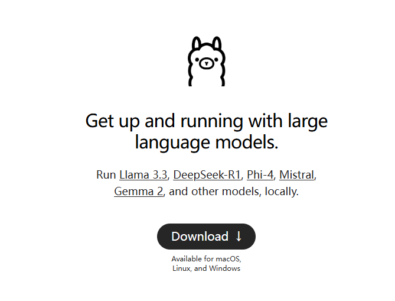
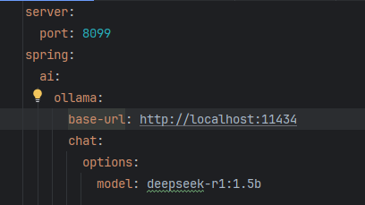
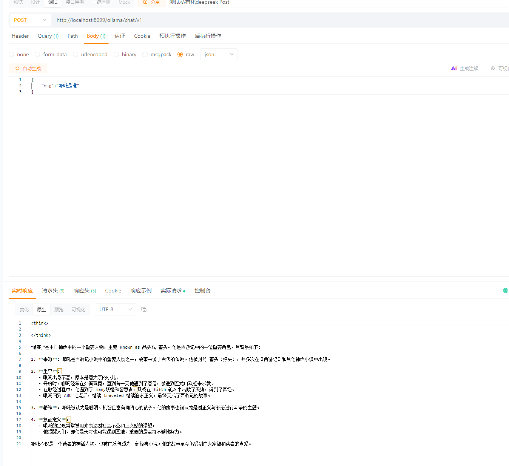

# 私有化部署deepseek-Java技术栈

1. 安装Ollama

[菜鸟教程-Ollama教程](https://www.runoob.com/ollama/ollama-tutorial.html)

[Ollama官网](https://ollama.com/)

2. 本地部署deepseekR1

打开cmd窗口，运行`ollama run deepseek-r1:1.5b`,下载有点慢，建议用浏览器迅雷嗅探插件（要科学上网）

3. 拉取https://github.com/dby321/Java-Ai项目（感谢点个star），修改配置文件application.yml，如果是本地部署的什么都不用改。

   **注意：此项目是SpringBoot3项目，需要Java17**

   

4. 启动项目，调用postman完成请求。

   