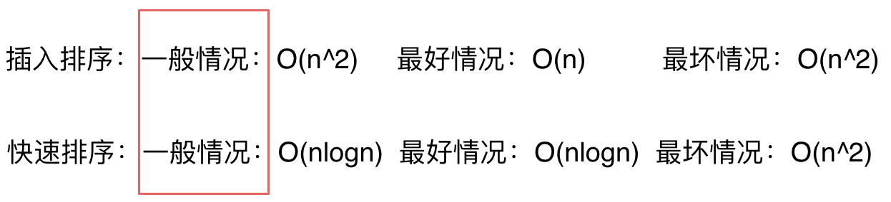
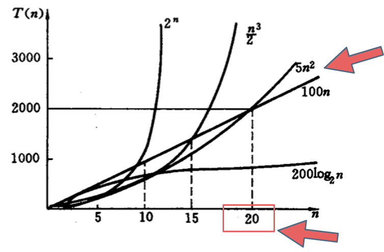

# 代码随想录

https://www.programmercarl.com/

## 本站必读

### 本站必读

> **编程语言**：本站统一使用C++语言进行讲解，但已经有Java、Python、Go、JavaScript等等多语言版本

#### 本站背景

> **刷题的困惑：**
>
> - 找题
> - 找到了不应该现阶段做的题
> - 没有全套的优质题解可以参考
>
> 刷题的顺序：
>
> - 数组-> 链表-> 哈希表->字符串->栈与队列->树->回溯->贪心->动态规划->图论->高级数据结构，再从简单刷起，做了几个类型题目之后，再慢慢做中等题目、困难题目。
> - 我们都是想用最短的时间**按照循序渐进的难度顺序把经典题目都做一遍**，这样效率才是最高的！

#### 如何使用本站

> **如何使用本站：**
>
> - 跟着菜单栏顺序刷题
> - **如果你是算法老手，这篇攻略也是复习的最佳资料**

#### 答疑

> 1. 一些算法新手可能疑惑，先刷剑指offer还是先看代码随想录呢？
>
>    - 建议先看 代码随想录，因为剑指offer的题目太少，技巧性还可以，但各个专题不够系统。
>
>    - 所以先看代码随想录，对整个算法各个专题都有整体认知之后，再去看剑指offer，一定会事半功倍！
>
> 2. 算法零基础小白想快速入门看代码随想路是不是一道题了解一种方法就行。比如二叉树的各种遍历递归和迭代总是忘记，有些题的解法也很多种。
>
>    - 小白的话，一道题目 了解一种解法就够了，优先把代码随想录 刷完，先整体有一个了解，然后二刷的时候，可以在去思考第二种解法之类的。

#### 关于作者

> Carl

### 《代码随想录》PDF

> 暂时不看

## 编程素养【有空再看】

### 注意核心代码模式和ACM模式

> 如果可以尽量使用ACM模式

### VIM的使用

> 暂时不看

## 求职【有空再看】

## 算法性能分析

### 时间复杂度分析

#### 究竟什么是时间复杂度

**时间复杂度是一个`函数`，它`定性`描述该算法的运行时间**。

#### 什么是大O

算法导论给出的解释：**大O用来表示`上界`的**，当用它作为算法的`最坏情况运行时间的上界`，就是对任意数据输入的运行时间的上界。

**但是我们依然说快速排序是O(nlogn)的时间复杂度，这个就是业内的一个默认规定，这里说的O代表的就是一般情况，而不是严格的上界**。如图所示： 

**面试中说道算法的时间复杂度是多少指的都是一般情况**。但是如果面试官和我们深入探讨一个算法的实现以及性能的时候，就要时刻想着数据用例的不一样，时间复杂度也是不同的，这一点是一定要注意的。

如下图中可以看出不同算法的时间复杂度在不同数据输入规模下的差异。

`在决定使用哪些算法的时候，不是时间复杂越低的越好（因为简化后的时间复杂度忽略了常数项等等），要考虑数据规模，如果数据规模很小甚至可以用O(n^2)的算法比O(n)的更合适（在有常数项的时候）`

**所以我们说的时间复杂度都是省略常数项系数的，是因为一般情况下都是默认数据规模足够的大，基于这样的事实，给出的算法时间复杂的的一个排行如下所示**：

O(1)常数阶 < O(logn)对数阶 < O(n)线性阶 < O(n^2)平方阶 < O(n^3)立方阶 < O(2^n)指数阶

但是也要注意大常数，如果这个常数非常大，例如10^7 ，10^9 ，那么常数就是不得不考虑的因素了。

#### O(logn)中的log是以什么为底？

平时说这个算法的时间复杂度是logn的，那么一定是log 以2为底n的对数么？

其实不然，也可以是以10为底n的对数，也可以是以20为底n的对数，**但我们统一说 logn，也就是`忽略底数`的描述**。

为什么可以这么做呢？如下图所示：

### 算法为什么会超时

实现三个函数，时间复杂度分别是 $O(n)$ , $O(n^2)$, $O(n\log n)$，使用加法运算来统一测试。

### 递归算法的时间复杂度

**递归的次数 \* 每次递归中的操作次数**。

### 空间复杂度

### 递归算法的性能分析

> 多画图分析

### 代码的内存消耗

> JVM自动内存管理，暂时算法阶段不考虑手动释放内存

