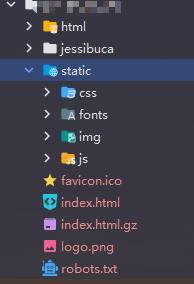
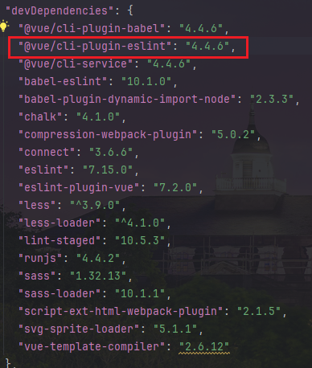

# （一）从Vue.config.js开始

> - 全程代码由`TONGYI LINGMA`、`MarsCode`分析
> - 面向项目实践学习，忽略不涉及的部分

```js
'use strict'
const path = require('path')

function resolve(dir) {
  return path.join(__dirname, dir)
}

const CompressionPlugin = require('compression-webpack-plugin')

const name = process.env.VUE_APP_TITLE || 'xxxx' // 网页标题

const port = process.env.port || process.env.npm_config_port || 80 // 端口

// vue.config.js 配置说明
//官方vue.config.js 参考文档 https://cli.vuejs.org/zh/config/#css-loaderoptions
// 这里只列一部分，具体配置参考文档
module.exports = {
  // 部署生产环境和开发环境下的URL。
  // 默认情况下，Vue CLI 会假设你的应用是被部署在一个域名的根路径上
  // 例如 https://www.ruoyi.vip/。如果应用被部署在一个子路径上，你就需要用这个选项指定这个子路径。例如，如果你的应用被部署在 https://www.ruoyi.vip/admin/，则设置 baseUrl 为 /admin/。
  publicPath: process.env.NODE_ENV === "production" ? "/xxxProject/" : "/xxxProject/",
  // 在npm run build 或 yarn build 时 ，生成文件的目录名称（要和baseUrl的生产环境路径一致）（默认dist）
  outputDir: 'xxxProject',
  // 用于放置生成的静态资源 (js、css、img、fonts) 的；（项目打包之后，静态资源会放在这个文件夹下）
  assetsDir: 'static',
  // 是否开启eslint保存检测，有效值：ture | false | 'error'
  lintOnSave: process.env.NODE_ENV === 'development',
  // 如果你不需要生产环境的 source map，可以将其设置为 false 以加速生产环境构建。
  productionSourceMap: false,
  // webpack-dev-server 相关配置
  devServer: {
    host: '0.0.0.0',
    port: port,
    open: true,
    proxy: {
      // detail: https://cli.vuejs.org/config/#devserver-proxy
      [process.env.VUE_APP_BASE_API]: {
        target: `http://localhost:10086`,//本地
        changeOrigin: true,
        pathRewrite: {
          ['^' + process.env.VUE_APP_BASE_API]: ''
        }
      }
    },
    disableHostCheck: true
  },
  css: {
    loaderOptions: {
      sass: {
        sassOptions: { outputStyle: "expanded" }
      }
    }
  },
  configureWebpack: {
    name: name,
    resolve: {
      alias: {
        '@': resolve('src')
      }
    },
    plugins: [
      // http://doc.ruoyi.vip/ruoyi-vue/other/faq.html#使用gzip解压缩静态文件
      new CompressionPlugin({
        cache: false,                   // 不启用文件缓存
        test: /\.(js|css|html)?$/i,     // 压缩文件格式
        filename: '[path].gz[query]',   // 压缩后的文件名
        algorithm: 'gzip',              // 使用gzip压缩
        minRatio: 0.8                   // 压缩率小于1才会压缩
      })
    ],
  },
  chainWebpack(config) {
    config.plugins.delete('preload') // TODO: need test
    config.plugins.delete('prefetch') // TODO: need test

    // set svg-sprite-loader
    config.module
      .rule('svg')
      .exclude.add(resolve('src/assets/icons'))
      .end()
    config.module
      .rule('icons')
      .test(/\.svg$/)
      .include.add(resolve('src/assets/icons'))
      .end()
      .use('svg-sprite-loader')
      .loader('svg-sprite-loader')
      .options({
        symbolId: 'icon-[name]'
      })
      .end()

    config.when(process.env.NODE_ENV !== 'development', config => {
      config
        .plugin('ScriptExtHtmlWebpackPlugin')
        .after('html')
        .use('script-ext-html-webpack-plugin', [{
          // `runtime` must same as runtimeChunk name. default is `runtime`
          inline: /runtime\..*\.js$/
        }])
        .end()

      config.optimization.splitChunks({
        chunks: 'all',
        cacheGroups: {
          libs: {
            name: 'chunk-libs',
            test: /[\\/]node_modules[\\/]/,
            priority: 10,
            chunks: 'initial' // only package third parties that are initially dependent
          },
          elementUI: {
            name: 'chunk-elementUI', // split elementUI into a single package
            test: /[\\/]node_modules[\\/]_?element-ui(.*)/, // in order to adapt to cnpm
            priority: 20 // the weight needs to be larger than libs and app or it will be packaged into libs or app
          },
          commons: {
            name: 'chunk-commons',
            test: resolve('src/components'), // can customize your rules
            minChunks: 3, //  minimum common number
            priority: 5,
            reuseExistingChunk: true
          }
        }
      })

      config.optimization.runtimeChunk('single'),
      {
        from: path.resolve(__dirname, './public/robots.txt'), //防爬虫文件
        to: './' //到根目录下
      }
    })
  }
}

```

## 1. 严格模式严格在哪？

[MDN-JS严格模式](https://developer.mozilla.org/zh-CN/docs/Web/JavaScript/Reference/Strict_mode)

use strict' 是JavaScript中的严格模式声明，用于启用更严格的解析和错误处理规则。它可以帮助开发者避免一些常见的编程错误，具体作用包括：

- 禁止使用未声明的变量。

```js
"use strict";
let mistypeVariable;

// 假设全局变量 mistypeVarible 不存在，由于“mistypeVariable”拼写错误（缺少“a”），这行会抛出 ReferenceError
mistypeVarible = 17;
```

- 严格模式会使引起静默失败

```js
"use strict";

// 给不可写全局变量赋值
undefined = 5; // TypeError
Infinity = 5; // TypeError

// 给不可写属性赋值
const obj1 = {};
Object.defineProperty(obj1, "x", { value: 42, writable: false });
obj1.x = 9; // TypeError

// 给只读属性赋值
const obj2 = {
  get x() {
    return 17;
  },
};
obj2.x = 5; // TypeError

// 给不可扩展对象的新属性赋值
const fixed = {};
Object.preventExtensions(fixed);
fixed.newProp = "ohai"; // TypeError

```

- 禁止删除不可删除的属性或使用保留字作为变量名。

```js
"use strict";
delete Object.prototype; // 抛出 TypeError 错误
```

- 禁止八进制表示法（如 010）。

```js
var a = 0o10; // ES6: 八进制
```

- 函数参数不能有同名属性。

```js
function sum(a, a, c) {
  // !!! 语法错误
  "use strict";
  return a + a + c; // 代码运行到这里会出错
}

```

- 严格模式禁止设置[原始](https://developer.mozilla.org/zh-CN/docs/Glossary/Primitive)值的属性。不采用严格模式，设置属性将会简单忽略（no-op），采用严格模式，将抛出 [`TypeError`](https://developer.mozilla.org/zh-CN/docs/Web/JavaScript/Reference/Global_Objects/TypeError) 错误

```js
"use strict";

false.true = ""; // TypeError
(14).sailing = "home"; // TypeError
"with".you = "far away"; // TypeError

```

## 2. __dirname是啥？require("path")是啥？

[菜鸟教程-Node.js 全局对象](https://www.runoob.com/nodejs/nodejs-global-object.html)

```js
function resolve(dir) {
  return path.join(__dirname, dir)
}
```

- `__dirname`： Node.js 中的一个全局变量，表示当前模块的目录名，即当前 JavaScript 文件所在的目录路径。它是一个字符串，通常用于构建文件路径或目录路径。
  - 与`__dirname`类似的一个全局变量是`__filename`，它表示当前正在执行的脚本的文件名
- `resolve()`：`__dirname` 与传入的相对路径 dir 拼接，生成绝对路径。这有助于避免路径拼接时出现错误，并确保路径的正确性

- `resolve()`和`join()`的区别：

  | 特性             | `path.resolve([...paths])`     | `path.join([...paths])`      |
  | ---------------- | ------------------------------ | ---------------------------- |
  | **返回类型**     | 总是返回绝对路径               | 可能返回相对路径或绝对路径   |
  | **路径解析方式** | 从右到左解析，基于当前工作目录 | 简单拼接路径，不做复杂的解析 |
  | **处理相对路径** | 根据当前工作目录解析           | 直接拼接，不考虑当前工作目录 |
  | **使用场景**     | 当你需要确保路径是绝对路径时   | 当你只需要简单的路径拼接时   |

```js
// 假设当前工作目录是 /Users/username/project
console.log(path.resolve('src', 'components')); 
// 输出: /Users/username/project/src/components

console.log(path.resolve('/home', 'user', 'docs')); 
// 输出: /home/user/docs （因为 '/home' 是绝对路径，所以从这里开始）

console.log(path.join('src', 'components')); 
// 输出: src/components （只是一个相对路径）

console.log(path.join('/home', 'user', '..', 'docs')); 
```

- `require("path")`下常用方法：
  - `path.join(...paths)`：用于连接路径。
  - `path.resolve(...paths)`：将相对路径解析为绝对路径。
  - `path.basename(path[, ext])`：获取路径中的文件名部分。
  - `path.dirname(path)`：获取路径中的目录名部分。
  - `path.extname(path)`：获取路径中的文件扩展名。

## 3. compression-webpack-plugin怎么使用

- compression-webpack-plugin是一个webpack插件，可以通过`npm install compression-webpack-plugin --save-dev`安装

  - `--save-dev` 是 npm（Node Package Manager）的一个命令行选项，用于在安装包时将其保存到项目的 `devDependencies` 中。`devDependencies` 通常包含项目开发过程中所需的工具和库，但这些工具和库不需要在生产环境中运行。

    具体来说：

    - **`dependencies`**: 这些是项目运行所必需的依赖项。它们会在生产环境中使用，因此会被安装在最终的部署包中。
    - **`devDependencies`**: 这些是仅在开发过程中需要的依赖项。例如，测试框架、构建工具、代码压缩工具等。这些依赖项不会被安装在生产环境中。

- webpack配置示例:

  - **`threshold`**: 这个选项指定了文件的最小大小（以字节为单位），只有大于或等于这个大小的文件才会被压缩。在这个例子中，`threshold: 10240` 表示只有当文件大小超过 10KB（10 * 1024 字节）时，文件才会被压缩。
  - **`minRatio`**: 这个选项定义了压缩后文件与原始文件大小的比例阈值。具体来说，如果压缩后的文件大小与原始文件大小的比率小于这个值，则压缩操作会被忽略。在这个例子中，`minRatio: 0.8` 表示只有当压缩后的文件大小至少比原文件小 20% 时（即压缩率至少为 20%），压缩操作才会被执行。

```js
const path = require('path');
const CompressionPlugin = require('compression-webpack-plugin');

module.exports = {
  entry: './src/index.js',
  output: {
    filename: 'bundle.js',
    path: path.resolve(__dirname, 'dist')
  },
  plugins: [
    new CompressionPlugin({
      test: /\.js$|\.css$/,
      threshold: 10240,
      minRatio: 0.8
    })
  ]
};

```


## 4. process.env.NODE_ENV是啥？publicPath、outputDir、assetsDir等是啥？

[Vue-cli官网-vue.config.js](https://cli.vuejs.org/zh/config/#publicpath)

- `NODE_ENV`

  : 这是一个常用的环境变量，用于指定当前的应用程序运行环境。常见的值包括：

  - `development`: 开发环境
  - `production`: 生产环境
  - `test`: 测试环境

- `publicPath`:默认情况下，Vue CLI 会假设你的应用是被部署在一个域名的根路径上，例如 `https://www.my-app.com/`。如果应用被部署在一个子路径上，你就需要用这个选项`publicPath`指定这个子路径。例如，如果你的应用被部署在 `https://www.my-app.com/my-app/`，则设置 `publicPath` 为 `/my-app/`。

- `outputDir`：当运行 `vue-cli-service build` 时生成的生产环境构建文件的目录。注意目标目录的内容在构建之前会被清除，默认为`dist` (构建时传入 `--no-clean` 可关闭该行为)。

- `assetsDir`:放置生成的静态资源 (js、css、img、fonts) 的 (相对于 `outputDir` 的) 目录。**经检查：确实生成了static文件夹**




- `lintOnSave`:是否在开发环境下通过 [eslint-loader](https://github.com/webpack-contrib/eslint-loader) 在每次保存时 lint 代码。这个值会在 [`@vue/cli-plugin-eslint`](https://github.com/vuejs/vue-cli/tree/dev/packages/@vue/cli-plugin-eslint) 被安装之后生效。**经检查：我的项目确实安装了@vue/cli-plugin-eslint
  - 设置为 `true` 或 `'warning'` 时，`eslint-loader` 会将 lint 错误输出为编译警告。默认情况下，警告仅仅会被输出到命令行，且不会使得编译失败。
  - 如果你希望让 lint 错误在开发时直接显示在浏览器中，你可以使用 `lintOnSave: 'default'`。这会强制 `eslint-loader` 将 lint 错误输出为编译错误，同时也意味着 lint 错误将会导致编译失败。
  - 设置为 `error` 将会使得 `eslint-loader` 把 lint 警告也输出为编译错误，这意味着 lint 警告将会导致编译失败。
   

##  5. productionSourceMap是啥？

- 生产环境中启用 productionSourceMap 有助于开发者调试代码，可以在浏览器的[调试工具](https://so.csdn.net/so/search?q=调试工具&spm=1001.2101.3001.7020)中查看到源文件中错误的代码位置，而不是编译后的代码位置。这对于定位线上问题十分有帮助。

- 配置为false有助于减小线上代码体积。

## 6. devServer{}要重点关注！

- `host: '0.0.0.0'`：指定开发服务器监听的主机地址。`'0.0.0.0'` 表示服务器将监听所有网络接口，这意味着你可以通过任何 IP 地址访问开发服务器（例如，`http://localhost:8080` 或 `http://<你的IP>:8080`）。
- `port: port`：**经检查，我这个项目使用80端口**
- `open: true`：自动打开浏览器
- `proxy`:当前端应用请求某些 API 时，可以通过代理将这些请求转发到指定的目标服务器，从而避免 CORS（跨域资源共享）问题。
- ``changeOrigin: true`:`true` 表示会改变请求的源为代理目标的源,解决一些服务器对 origin 有严格限制的问题。
- `pathRewrite`:移除或修改请求路径的一部分，以便符合目标服务器的要求。
  - `['^' + process.env.VUE_APP_BASE_API]: ''`:在process.env.VUE_APP_BASE_API为/api时，请求路径 `/api/user/info` 将被重写为 `/user/info` 并转发到目标服务器。
- `disableHostCheck: true`:`true` 表示禁用 host 检查,允许开发服务器接受来自任意 host 的请求，而不是仅限于 `localhost`。这在使用某些工具（如 ngrok）进行内网穿透时非常有用。
  - `ngrok` 是一个反向代理工具，它可以创建一个安全的隧道，将公共 URL 映射到你本地运行的服务。这样，即使你的本地服务器没有公网 IP 地址或被防火墙保护，外部用户也能通过 `ngrok` 提供的公共 URL 访问你的本地服务。
  - **内网穿透**:
    - 目标: 允许外部网络访问私有网络内的服务。
    - 应用场景: 远程开发、API 测试、协作开发等。
    - 工具: `ngrok`, `frp`, `ZeroTier`, `Localtunnel`。
  - **反向代理**:
    - 目标: 代表客户端向后端服务器发送请求，并将响应返回给客户端。
    - 应用场景: 负载均衡、安全性增强、缓存优化等。
    - 工具: Nginx, Apache, HAProxy, Envoy。
  - **单独使用**: 反向代理主要用于长期运行的服务，而内网穿透主要用于临时性和短期性的需求。
  - **共同点**: 两者都涉及将外部请求转发到内部网络中的服务，并提供一定程度的安全性和灵活性。


## 7. css.loaderOptions

提供的配置片段是用于 Vue CLI 项目中，用于自定义 Sass 加载器的选项

```js
css: {
    loaderOptions: {
      sass: {
        sassOptions: { outputStyle: "expanded" }
      }
    }
  }
```

- `outputStyle: "expanded"`
  - **作用**: 设置 Sass 编译后的 CSS 样式。
  - **值**: `"expanded"` 表示生成的 CSS 文件将以扩展格式输出。
  - 其他可能的值
    - `"nested"`: 默认值，嵌套格式。
    - `"compressed"`: 压缩格式，去除所有空格和换行符。
    - `"compact"`: 紧凑格式，每条规则占用一行。
    - `"expanded"`: 扩展格式，每个声明都在单独的一行上，并且有适当的缩进。

## 8. `configureWebpack` 自定义 Webpack 配置

```js
configureWebpack: {
  name: name,
  resolve: {
    alias: {
      '@': resolve('src')
    }
  },
  plugins: [
      // http://doc.ruoyi.vip/ruoyi-vue/other/faq.html#使用gzip解压缩静态文件
      new CompressionPlugin({
        cache: false,                   // 不启用文件缓存
        test: /\.(js|css|html)?$/i,     // 压缩文件格式
        filename: '[path].gz[query]',   // 压缩后的文件名
        algorithm: 'gzip',              // 使用gzip压缩
        minRatio: 0.8                   // 压缩率小于1才会压缩
      }),
      new webpack.ProvidePlugin({
        "window.Quill": "quill/dist/quill.js",
        Quill: "quill/dist/quill.js",
      }),
  ],
}
```

- `name: name`:设置 Webpack 构建的名称,在生成的文件中包含项目名称，便于识别和调试。

- `resolve.alias`:将 `@` 别名指向 `src` 目录，方便使用相对路径导入模块

- `CompressionPlugin`: 压缩静态文件，减少文件大小，提高加载速度。

  - **`cache: false`**: 不启用文件缓存。
  - **`test: /\.(js|css|html)?$/i`**: 指定需要压缩的文件类型。
    - `?`: 表示前面的元素是可选的，可以出现零次或一次。
    - **`i`**: 标志位，表示忽略大小写。
  - **`filename: '[path].gz[query]'`**: 设置压缩后的文件名。
    - **`[path]`**:
      - **作用**: 保留原始文件的路径。
      - **示例**: 如果原始文件路径是 `dist/js/app.js`，则 `[path]` 将会被替换为 `dist/js/app.js`。
    - **`.gz`**:
      - **作用**: 添加 `.gz` 扩展名，表示这是一个 Gzip 压缩的文件。
      - **示例**: 如果原始文件路径是 `dist/js/app.js`，则 `[path].gz` 将变为 `dist/js/app.js.gz`
    - **`[query]`**:
      - **作用**: 保留原始文件的查询参数（如果有）。
      - **示例**: 如果原始文件路径是 `dist/js/app.js?v=1.0`，则 `[query]` 将会被替换为 `?v=1.0`，最终生成的文件名为 `dist/js/app.js.gz?v=1.0`
  - **`algorithm: 'gzip'`**: 使用 Gzip 压缩,gzip拥有良好的浏览器兼容性，提供良好的压缩率和较快的解压速度，这是其他压缩算法不具备的。
  - **`minRatio: 0.8`**: 只有当压缩率小于 1 才会压缩。
  
- `ProvidePlugin`:让你可以全局引入某些模块，而不需要在每个文件中都导入它们。在这个例子中：

  - `"window.Quill": "quill/dist/quill.js"` 和 `Quill: "quill/dist/quill.js"`：这两行代码的作用是当你在代码中使用`Quill`或`window.Quill`时，无需手动导入它，因为通过这个插件已经全局提供。

  - Quill是一个强大的、免费的开源文本编辑器，专为现代网络设计。它被广泛用于构建富文本编辑功能，允许用户在网页应用中创建和编辑内容丰富的文档。
  
    - 如果你想快速在项目中使用Quill，可以参考以下基本步骤：
  
      1. **引入Quill库**：可以通过CDN或者下载到本地然后引入。
      2. **HTML结构**：为Quill提供一个容器元素，例如`<div id="editor"></div>`。
      3. **初始化Quill实例**：使用JavaScript初始化Quill编辑器,这里的`theme: 'snow'`是Quill提供的一个默认主题，提供了现代化的界面风格。
  
      ```js
      var quill = new Quill('#editor', {
        theme: 'snow'  // Specify theme in initialization
      });
      ```

## 9. chainWebpack

[ webpack-chain常用配置](https://metaatem.cn/javascript/webpack/webpack-chain%E5%B8%B8%E7%94%A8%E9%85%8D%E7%BD%AE.html)

[掘金-一步一步的了解webpack4的splitChunk插件](https://juejin.cn/post/6844903614759043079)

```js
chainWebpack(config) {
    config.plugins.delete('preload') // TODO: need test
    config.plugins.delete('prefetch') // TODO: need test

    // set svg-sprite-loader
    config.module
      .rule('svg')
      .exclude.add(resolve('src/assets/icons'))
      .end()
    config.module
      .rule('icons')
      .test(/\.svg$/)
      .include.add(resolve('src/assets/icons'))
      .end()
      .use('svg-sprite-loader')
      .loader('svg-sprite-loader')
      .options({
        symbolId: 'icon-[name]'
      })
      .end()

    config.when(process.env.NODE_ENV !== 'development', config => {
          config
            .plugin('ScriptExtHtmlWebpackPlugin')
            .after('html')
            .use('script-ext-html-webpack-plugin', [{
            // `runtime` must same as runtimeChunk name. default is `runtime`
              inline: /runtime\..*\.js$/
            }])
            .end()

          config.optimization.splitChunks({
            chunks: 'all',
            cacheGroups: {
              libs: {
                name: 'chunk-libs',
                test: /[\\/]node_modules[\\/]/,
                priority: 10,
                chunks: 'initial' // only package third parties that are initially dependent
              },
              elementUI: {
                name: 'chunk-elementUI', // split elementUI into a single package
                test: /[\\/]node_modules[\\/]_?element-ui(.*)/, // in order to adapt to cnpm
                priority: 20 // the weight needs to be larger than libs and app or it will be packaged into libs or app
              },
              commons: {
                name: 'chunk-commons',
                test: resolve('src/components'), // can customize your rules
                minChunks: 3, //  minimum common number
                priority: 5,
                reuseExistingChunk: true
              }
            }
          })

          config.optimization.runtimeChunk('single'),
          {
             from: path.resolve(__dirname, './public/robots.txt'), //防爬虫文件
             to: './' //到根目录下
          }
    })
  }
```

1. 删除预加载和预取插件:`preload` 和 `prefetch` 是 Webpack 的插件，分别用于预加载和预取资源。

2. 第一个 `rule('svg')`：排除 `src/assets/icons` 目录下的 SVG 文件，让默认的 SVG 加载器不处理这些文件。

3. 第二个 `rule('icons')`：专门处理 `src/assets/icons` 目录下的 SVG 文件，使用 `svg-sprite-loader` 加载器，并设置 `symbolId` 为 `icon-[name]`。

4. 使用 `ScriptExtHtmlWebpackPlugin` 插件，将运行时代码内联到 HTML 文件中，以减少请求次数

5. chunks: 'all'：对所有类型的代码块进行分割。

   - cacheGroups：定义了不同的缓存组，用于将代码分割成不同的包。
   - libs：将 node_modules 中的第三方库打包到 chunk-libs 中。
   - elementUI：将 element-ui 库单独打包到 chunk-elementUI 中。
   - commons：将 src/components 目录下被引用至少 3 次的组件打包到 chunk-commons 中。

6. 构建完成后，前往构建输出目录（默认是 `dist`），你会看到一些被分割的代码文件。这些文件通常会按照 `chainWebpack` 中配置的缓存组来命名，例如：

   - `chunk-libs.js`：包含 `node_modules` 中的第三方库。
   - `chunk-elementUI.js`：包含 `element-ui` 库。
   - `chunk-commons.js`：包含 `src/components` 目录下被引用至少 3 次的组件。

   假设你的项目默认构建输出目录是 `dist`，构建完成后，`dist` 目录的结构可能如下：

   

   ```plainText
   dist/
   ├── index.html
   ├── chunk-libs.js
   ├── chunk-elementUI.js
   ├── chunk-commons.js
   ├── runtime.js
   └── ...
   ```

