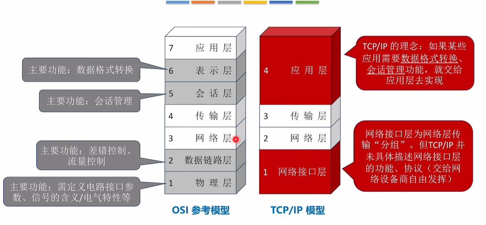
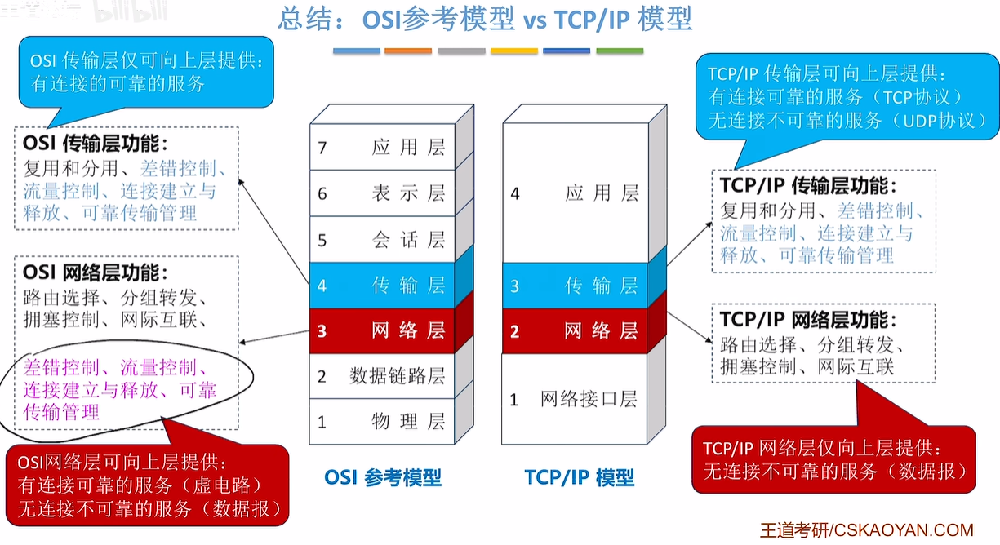
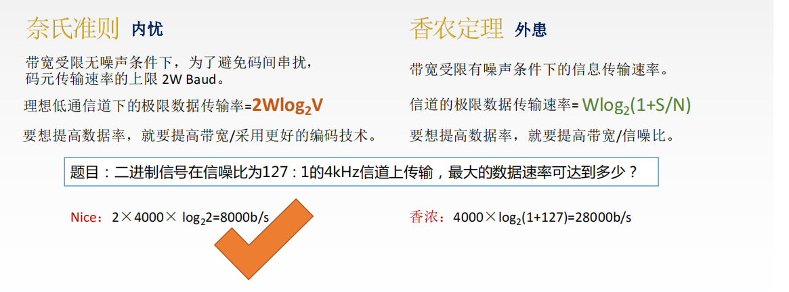
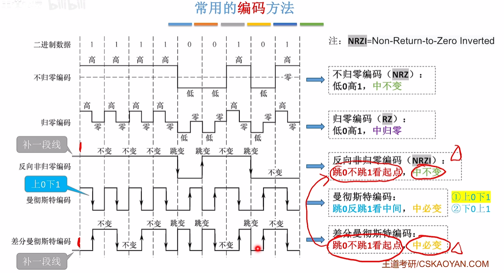
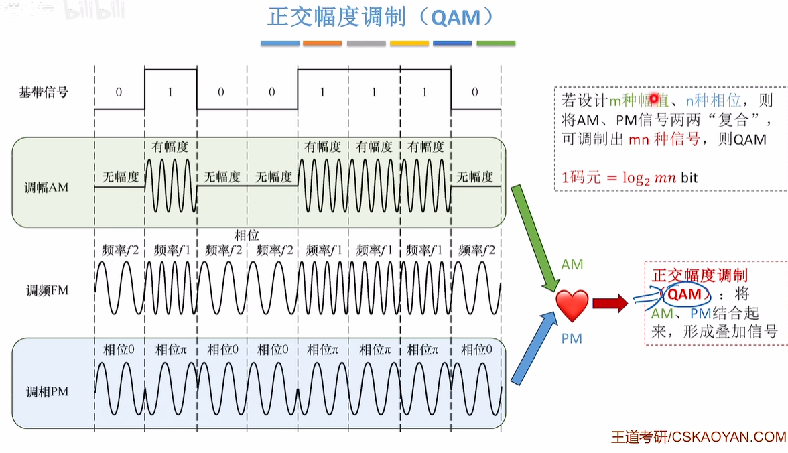
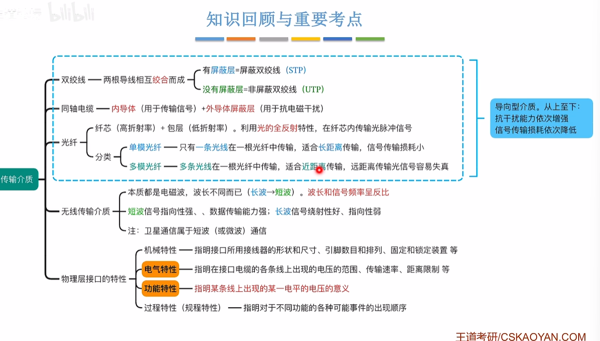

# 计算机网络笔记

[王道-计算机网络](https://www.bilibili.com/video/BV19E411D78Q)

## 1. 计算机网络体系结构

`计算机网络`(Computer networking)是一个将众多分散的、自治的计算机系统，通过通信设备与线路连接起来，由功能完善的软件实现资源共享和信息传递的系统。

### 计算机网络、互联网、互连网

- 计算机网络：多个结点由链路连接起来

  - 集线器可以组建一个简单的计算机网络，会数据冲突
  - 交换机可以组建一个简单的计算机网络，不会数据冲突
  - 路由器可以连接多个计算机网络

- 互连网

  - 银行的内网
  - 公司的内网

- 互联网

  - 家用路由器=路由器+交换机+其他功能

  - ISP互联网服务提供商：中国电信、中国移动等
  - 互联网上必须使用TCP/IP协议通信

### 计算机网络的组成

- 硬件
  - 主机
    - 手机
    - 智能汽车
    - 电脑
    - 智能机器人
  - 通信设备
    - 路由器
    - 交换机
    - 集线器
  - 通信链路
- 软件
  - 路由器上安装的软件
  - 手机，电脑上的软件
- 协议
  - 由软件和硬件共同实现，由网络适配器（网卡）+软件实现通信协议

----

- 边缘部分
  - 
- 核心部分
  - 连通性
  - 交换服务：动态选择路径，由路由器完成

----

- 资源子网
- 通信子网
  - 主机内部的网络适配器、底层协议属于通信子网的范畴

### 计算机网络的功能

- 数据通信
  - 微信
  - QQ
- 资源共享
  - 硬件资源共享：云端服务器
  - 软件资源共享：APP store
  - 数据资源共享：抖音分享视频
- 分布式处理
  - MapReduce
- 提高可靠性
  - 备份服务器
- 负载均衡
  - Nginx服务器
- 其他功能
  - 生活需求
  - 工作需求

### 电路交换、电报交换、分组交换

- 电路交换
  - 需要使用电话交换机，早期需要人工接线
  - 需要建立连接
  - 线路被通信双方独占，利用率低
  - 没有差错控制
- 电报交换：存储转发
  - 需要使用电报交换机
  - 不需建立连接
  - 线路不被独占，利用率高
  - 支持差错控制
  - 长报文存储转发开销大，发生错误重传代价高
- 分组交换
  - 主要解决电报长报文的问题
  - 乱序失序问题由终端处理，效率高
- 虚电路交换
  - 乱序失序问题由网络核心部分处理，效率低，故不采用

### 计算机网络的分类

- 广域网WAN
- 局域网LAN
- 个域网PAN

----

- 广播式网络
  - 无线网络都是广播式
- 点对点网络
  - 路由器转发都是点对点

---

- 总线型结构
  - 广播式
  - 总线争用问题
- 环形结构
  - 令牌环网
  - 解决了总线争用
- 星型结构
  - 点对点
  - 不存在总线争用
  - 以太网交换机
- 网状结构
  - 点对点
  - 由众多路由器构建的广域网

----

- 公用网
- 专用网
  - 银行
  - 军队
  - 医院

----

- 有线网络
- 无线网络

### 三种常见的网络体系结构

- OSI 7层 物联网叔会使用
- TCP/IP 4层
- 教学用 5层

## 2. 物理层

实现相邻结点`比特`的传输

### 信源、信宿、信号、信道

- 信源：数据发送方
- 信宿：数据接收方
- 信号
  - 数字信号
  - 模拟信号
- 信道

### 码元、波特

- 码元：每种型号能携带多少信息

  - 2进制码元

  - 4进制码元

  - 8进制码元 
  - `码元/秒` 就是`波特`

### 带宽、奈奎斯特定理、香农定理

### 常用编码方法

·

​	  

### 常见的调制方法

### 传输介质

