# 设计模式

> [尚硅谷Java设计模式（图解+框架源码剖析）](https://www.bilibili.com/video/BV1G4411c7N4/)

> 如果想成为合格软件工程师，花时间来研究设计模式是非常必要的
>
> 编程=算法（数据结构）+设计模式
>
> 面试会问：你用过哪些设计模式，怎么使用的，解决了什么问题
>
> Spring、Mybatis、Tomcat源码都是可以研究的
>
> 设计模式有7大原则和23种设计模式

## 设计模式的7大原则

> 为了让程序具有更好的：
>
> 1. 代码重用性：相同功能的代码，不用多次编写
> 2. 可读性：编程规范性，便于其他程序员的阅读和理解
> 3. 可拓展性：增加新的功能时，非常的方便
> 4. 可靠性：增加新的功能后，对原来的功能没有影响
> 5. 使程序呈现高内聚、低耦合的特性
>
> 设计模式的原则是设计模式是怎么设计的原则

### 单一职责原则（最小类、方法原则）

> 单一职责是针对类、方法。

### 接口隔离原则 （最小接口原则）

> 一个类对另一个类的依赖应该建立在最小的接口上


### 依赖倒转原则（面向接口编程）

> 1. 高层模块不应该依赖低层模块，二者都应该依赖其抽象
> 2. 抽象不应该依赖细节，细节应该依赖抽象
> 3. 依赖倒转的中心思想是面向接口编程

#### 依赖传递的三种方式

> 方法参数传递
>
> 构造方法传递
>
> setter方法传递

### 里氏替换原则lsp

> 子类尽量不要重写父类的方法
>
> 继承实际上让两个类的耦合性增强了，在适当的情况下， 可以通过聚合、组合、依赖来解决问题
>
> 可以创建一个更加基础的基类  

### 开闭原则ocp

> 是编程中最重要、最基础的原则
>
> 一个软件实体如类、模块和函数应该对拓展开放（对提供方），对修改关闭（对使用方）

### 迪米特法则（最小知道原则）

> 又叫最少知道原则，一个类对自己依赖的类知道的越少越好
>
> 我们称出现成员变量、方法参数、方法返回值中的类为直接的朋友，而出现在局部变量中的类不是直接的朋友。也就是说，陌生的类最好不要以局部变量的形式出现在类的内部

### 合成复用原则

> 尽量使用组合/聚合，而不是继承

## UML图

> 类图是UML图中的核心
>
> 聚合：整体和部分可以分开
>
> 组合：整体和部分不能分开
>
> 人头和人是组合关系，人和身份证是聚合关系

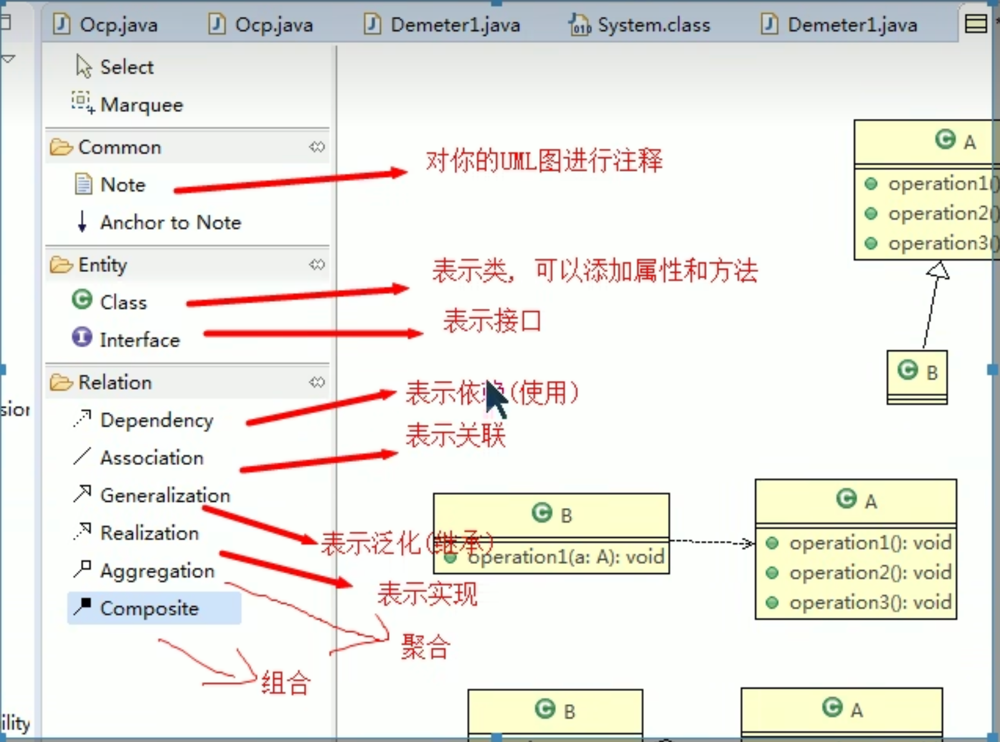

## 二十三种设计模式


### 1. 单例模式

> 单例模式就是采取一定的方法保证在整个软件系统中，对某个类只能存在一个对象实例，**并且该类只提供一个取得其对象实例的静态方法。**
>
> 比如Hibernate的SessionFactory，它充当数据存储源的代理，并负责创建Session对象。SessionFactory并不是轻量级的，一般情况下，一个项目只需要一个SessionFactory就够了，这就用到了单例模式

### 2. 简单工厂模式

> 也叫静态工厂模式
>
> Calendar就是简单工厂模式

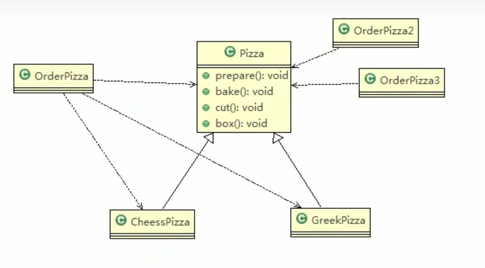

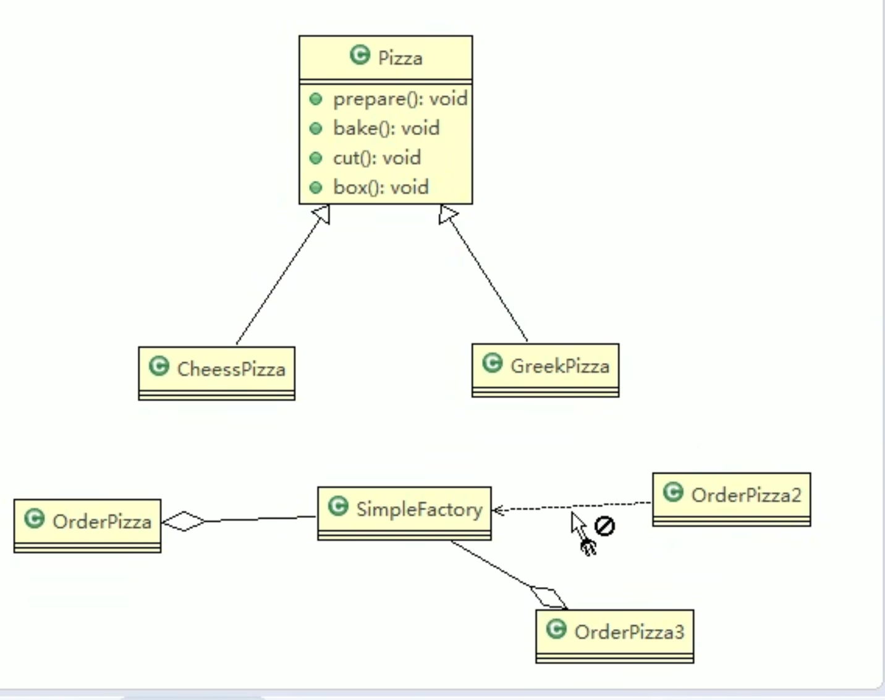

### 3. 工厂方法模式

> 将对象的实例化推迟到子类


### 4. 抽象工厂模式

> 定义了一个interface用于创建相关或有依赖关系的对象簇，而无需指明具体的类。
>
> 抽象工厂模式可以将简单工厂模式和工厂方法模式进行整合。
>
> 将工厂抽象成两层：抽象工厂和具体实现的工厂子类。这样将单个的简单工厂变成了工厂簇。


### 5. 原型模式

> Spring中原型bean的创建就用到了原型模式


### 6. 建造者模式

> 将产品和产品建造过程解耦
>
> StringBuilder


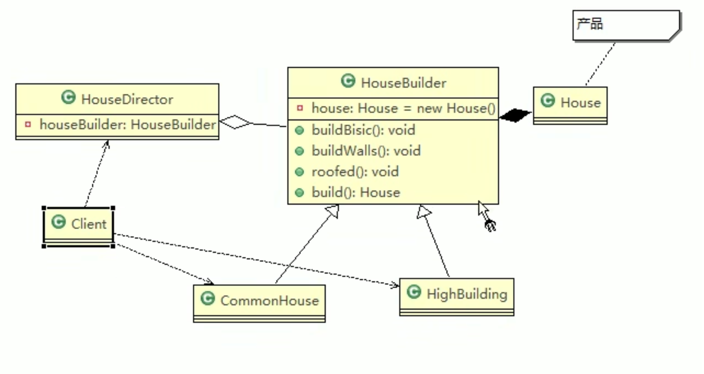

### 7. 适配器模式

> springMvc源码讲解没听懂


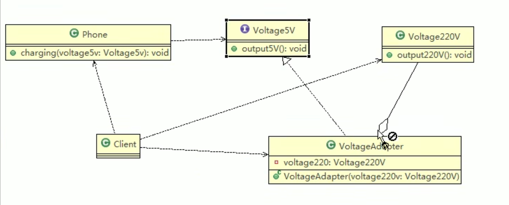


### 8. 桥接模式

> 传统方式解决存在类爆炸的问题
>
> 桥接模式：将**实现和抽象放在两个不同的类层次中**，使两个层次可以独立改变，它是一种结构型设计模式。它基于类的最小设计原则，通过使用封装、聚合及继承等行为让不同的类承担不同的之策。它的主要特点是把首相与行为实现分离开来，从而可以保持各部分的独立性以及应对他们的功能拓展。
>
> jdbc中使用了桥接模式
>
> 对于那些不希望使用继承或因为多层次继承导致系统类的个数急剧增加的系统，桥接模式尤为适用

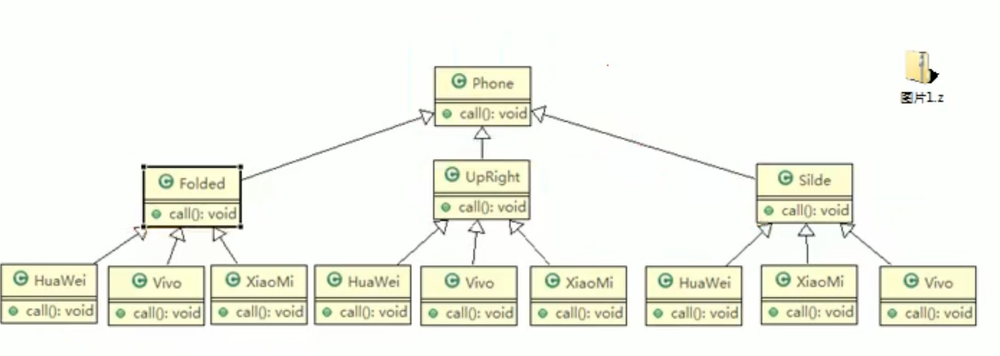


> 桥接模式原理类图解析：
>
> 1. client类：桥接模式的调用者
> 2. 抽象类：维护了Implementor/既它的实现类ConcreteImplementorA,二者是聚合关系，Abstraction充当桥接类
> 3. RefinedAbstraction：是Abstraction抽象类的子类
> 4. Implementor：是行为实现类的接口
> 5. ConcreteImplementorA/B:是行为的具体实现类


### 9. 装饰者模式

> 也是用来解决类爆炸
>
> JDK中IO流使用了装饰者模式

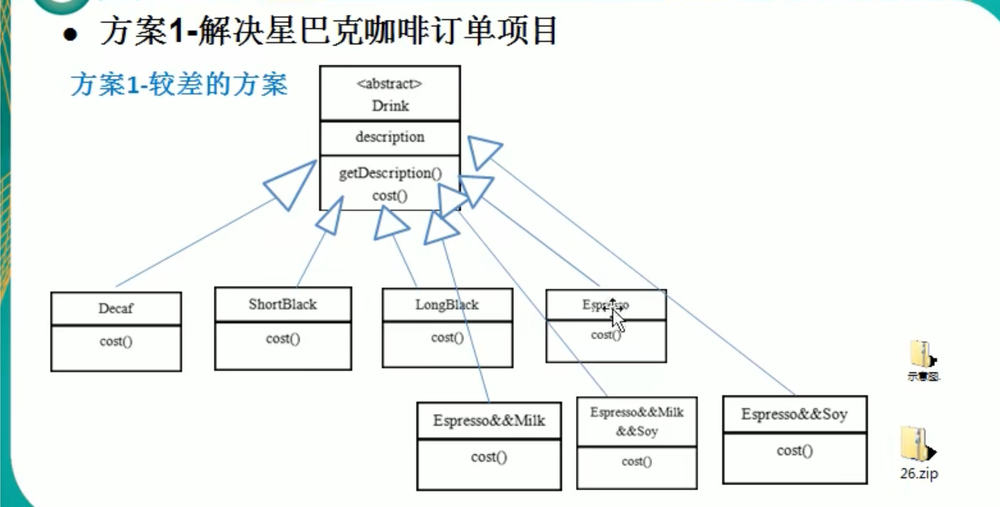


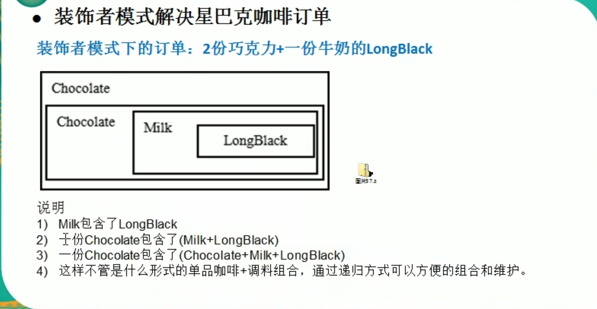


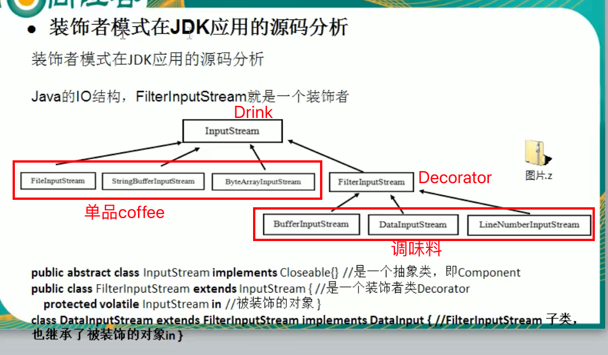


### 10. 组合模式

> HashMap和其静态内部类Node用到了组合模式

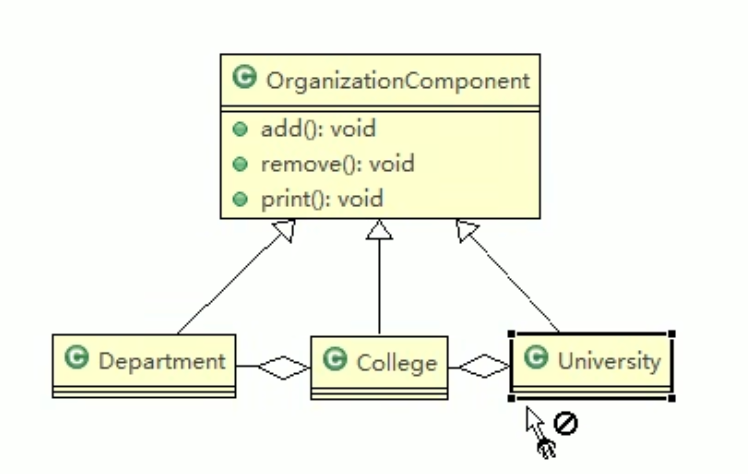

### 11. 外观模式

> 外观模式对外屏蔽了子系统的细节


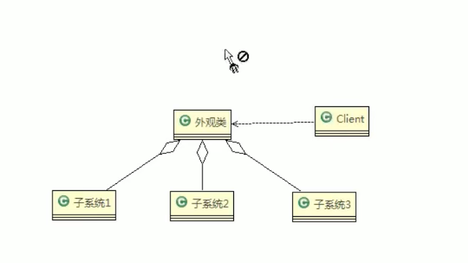

### 12. 享元模式

> 多个网站相似度高时，用多个服务器比较浪费，可以用享元模式解决。
>
> 1. 这种模式常用于系统底层开发，解决系统性能问题，像数据库连接池。
> 2. 能解决重复对象导致内存浪费的情况
>
> String常量池、数据库连接池、缓冲池等都是享元模式的应用。享元模式是池技术的重要实现方式

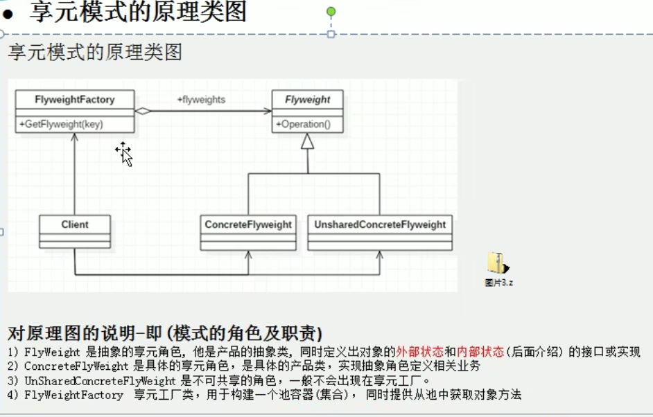


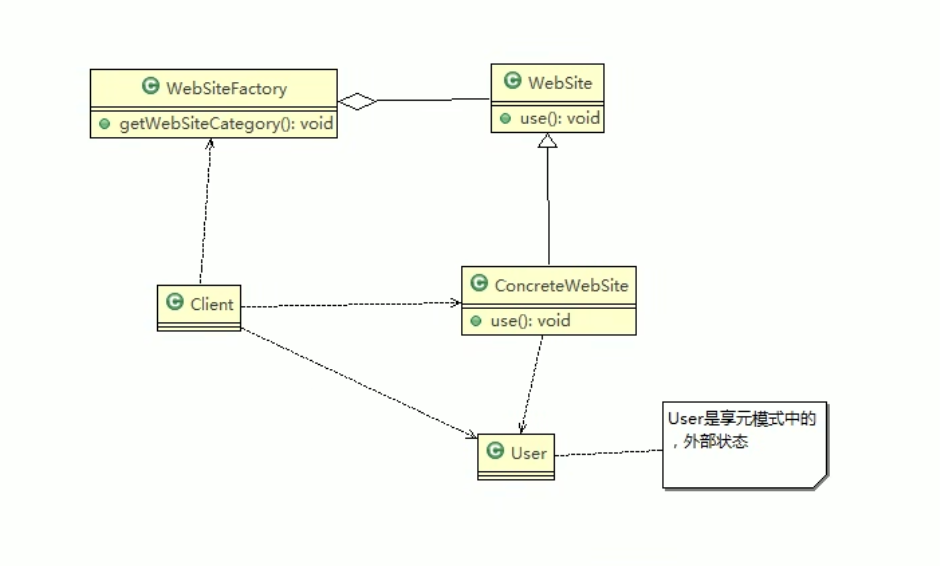

### 13. 代理模式

> 1. 为一个对象提供一个替身，以控制对这个对象的访问，既通过代理对象访问目标对象。这样做的好处是可以在目标对象实现的基础上，增强额外的功能操作，既拓展目标对象的功能。
> 2. 被代理的对象可以是远程对象、创建开销大的对象和需要安全控制的对象
> 3. 代理模式有不同的形式，包括静态代理、动态代理（也叫JDK代理、接口代理）和cglib代理（可以在内存中动态的创建对象，而不需要实现接口。属于动态代理的范畴。SpringAOP底层用到了cglib）
>
> [菜鸟教程-Cglib代理](https://www.runoob.com/w3cnote/cglibcode-generation-library-intro.html)

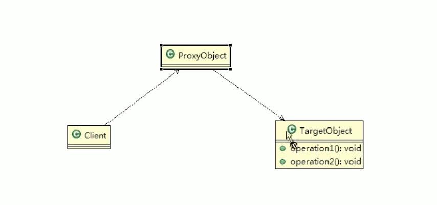

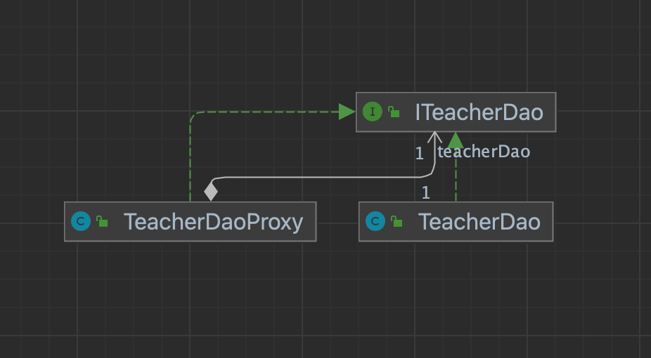


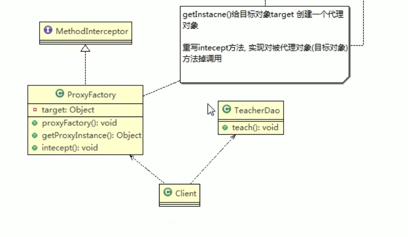

### 14. 模版方法模式

> 模版方法模式的父类中，可以定义一个方法，不做任何事，子类可以视情况要不要覆盖它
>
> SpringIOC容器初始化时用到了模版方法模式
>
> ```java
> @Override
> 	public void refresh() throws BeansException, IllegalStateException {
> 		synchronized (this.startupShutdownMonitor) {
> 			StartupStep contextRefresh = this.applicationStartup.start("spring.context.refresh");
> 
> 			// Prepare this context for refreshing.
> 			prepareRefresh();
> 
> 			// Tell the subclass to refresh the internal bean factory.
> 			ConfigurableListableBeanFactory beanFactory = obtainFreshBeanFactory();
> 
> 			// Prepare the bean factory for use in this context.
> 			prepareBeanFactory(beanFactory);
> 
> 			try {
> 				// Allows post-processing of the bean factory in context subclasses.
> 				postProcessBeanFactory(beanFactory);
> 
> 				StartupStep beanPostProcess = this.applicationStartup.start("spring.context.beans.post-process");
> 				// Invoke factory processors registered as beans in the context.
> 				invokeBeanFactoryPostProcessors(beanFactory);
> 
> 				// Register bean processors that intercept bean creation.
> 				registerBeanPostProcessors(beanFactory);
> 				beanPostProcess.end();
> 
> 				// Initialize message source for this context.
> 				initMessageSource();
> 
> 				// Initialize event multicaster for this context.
> 				initApplicationEventMulticaster();
> 
> 				// Initialize other special beans in specific context subclasses.
> 				onRefresh();
> 
> 				// Check for listener beans and register them.
> 				registerListeners();
> 
> 				// Instantiate all remaining (non-lazy-init) singletons.
> 				finishBeanFactoryInitialization(beanFactory);
> 
> 				// Last step: publish corresponding event.
> 				finishRefresh();
> 			}
> 
> 			catch (BeansException ex) {
> 				if (logger.isWarnEnabled()) {
> 					logger.warn("Exception encountered during context initialization - " +
> 							"cancelling refresh attempt: " + ex);
> 				}
> 
> 				// Destroy already created singletons to avoid dangling resources.
> 				destroyBeans();
> 
> 				// Reset 'active' flag.
> 				cancelRefresh(ex);
> 
> 				// Propagate exception to caller.
> 				throw ex;
> 			}
> 
> 			finally {
> 				// Reset common introspection caches in Spring's core, since we
> 				// might not ever need metadata for singleton beans anymore...
> 				resetCommonCaches();
> 				contextRefresh.end();
> 			}
> 		}
> 	}
> ```
>
> 


```mermaid
classDiagram
direction BT
class AbstractApplicationContext
class AbstractRefreshableApplicationContext
class AbstractRefreshableConfigApplicationContext
class AbstractXmlApplicationContext
class ApplicationContext {
<<Interface>>

}
class ApplicationEventPublisher {
<<Interface>>

}
class AutoCloseable {
<<Interface>>

}
class Aware {
<<Interface>>

}
class BeanFactory {
<<Interface>>

}
class BeanNameAware {
<<Interface>>

}
class ClassPathXmlApplicationContext
class Closeable {
<<Interface>>

}
class ConfigurableApplicationContext {
<<Interface>>

}
class DefaultResourceLoader
class EnvironmentCapable {
<<Interface>>

}
class FunctionalInterface
class HierarchicalBeanFactory {
<<Interface>>

}
class InitializingBean {
<<Interface>>

}
class Lifecycle {
<<Interface>>

}
class ListableBeanFactory {
<<Interface>>

}
class MessageSource {
<<Interface>>

}
class ResourceLoader {
<<Interface>>

}
class ResourcePatternResolver {
<<Interface>>

}

AbstractApplicationContext  ..>  ConfigurableApplicationContext 
AbstractApplicationContext  -->  DefaultResourceLoader 
AbstractRefreshableApplicationContext  -->  AbstractApplicationContext 
AbstractRefreshableConfigApplicationContext  -->  AbstractRefreshableApplicationContext 
AbstractRefreshableConfigApplicationContext  ..>  BeanNameAware 
AbstractRefreshableConfigApplicationContext  ..>  InitializingBean 
AbstractXmlApplicationContext  -->  AbstractRefreshableConfigApplicationContext 
ApplicationContext  -->  ApplicationEventPublisher 
ApplicationContext  -->  EnvironmentCapable 
ApplicationContext  -->  HierarchicalBeanFactory 
ApplicationContext  -->  ListableBeanFactory 
ApplicationContext  -->  MessageSource 
ApplicationContext  -->  ResourcePatternResolver 
FunctionalInterface  ..  ApplicationEventPublisher 
BeanNameAware  -->  Aware 
ClassPathXmlApplicationContext  -->  AbstractXmlApplicationContext 
Closeable  -->  AutoCloseable 
ConfigurableApplicationContext  -->  ApplicationContext 
ConfigurableApplicationContext  -->  Closeable 
ConfigurableApplicationContext  -->  Lifecycle 
DefaultResourceLoader  ..>  ResourceLoader 
HierarchicalBeanFactory  -->  BeanFactory 
ListableBeanFactory  -->  BeanFactory 
ResourcePatternResolver  -->  ResourceLoader 

```


### 15. 命令模式

> Spring中的JdbcTemplate中的
>
> - `private <T> T execute(StatementCallback<T> action, boolean closeResources) throws DataAccessException `充当了Invoker的角色
>
> - `class QueryStatementCallback implements StatementCallback<T>, SqlProvider `充当了ConcreteCommand的角色
>
> -  `public T doInStatement(Statement stmt) throws SQLException   `中的Statement充当了Receiver的角色

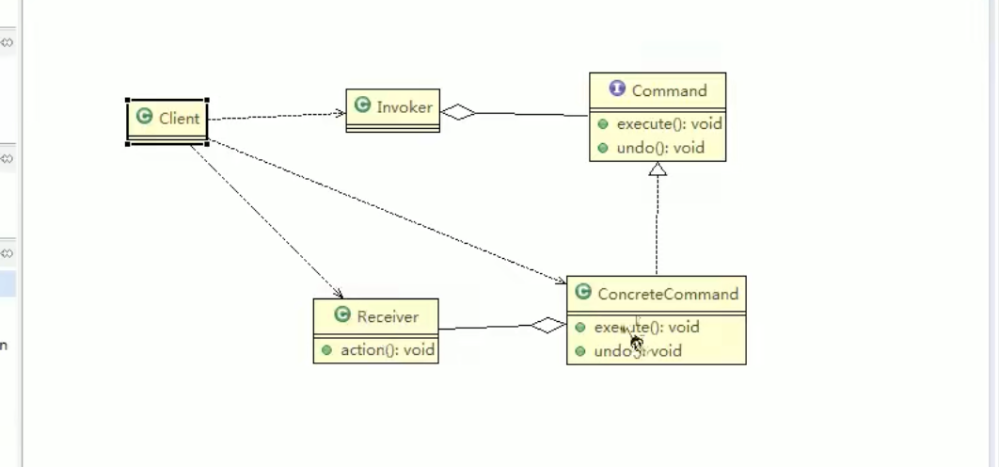


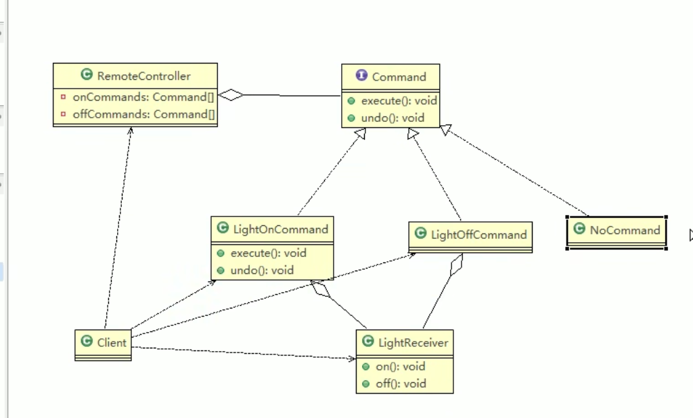

### 16. 访问者模式

> 将数据结构和对数据的操作分离

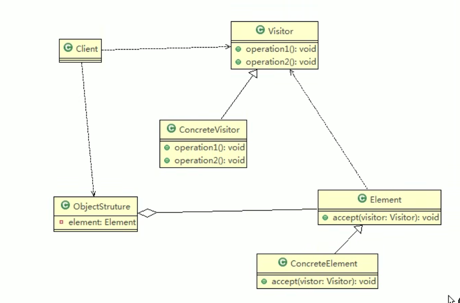

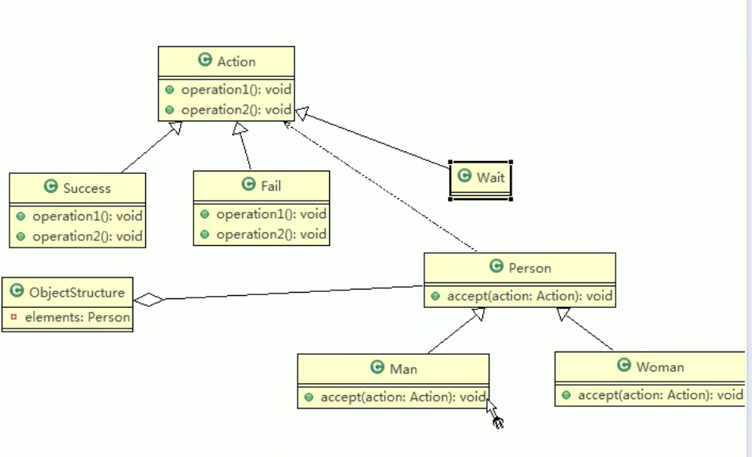

### 17. 迭代器模式

> JDK中的List接口充当了迭代器模式聚合接口的作用

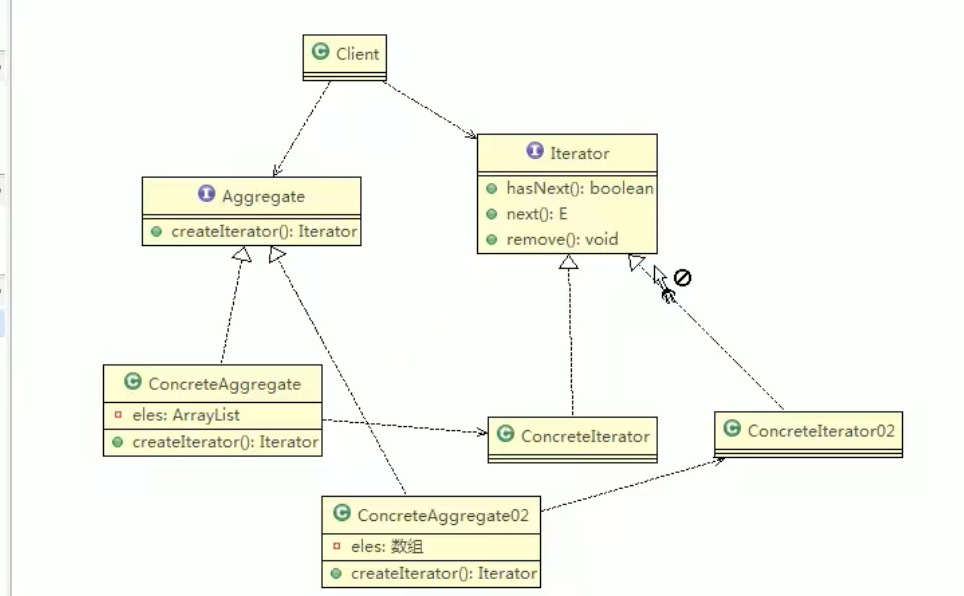

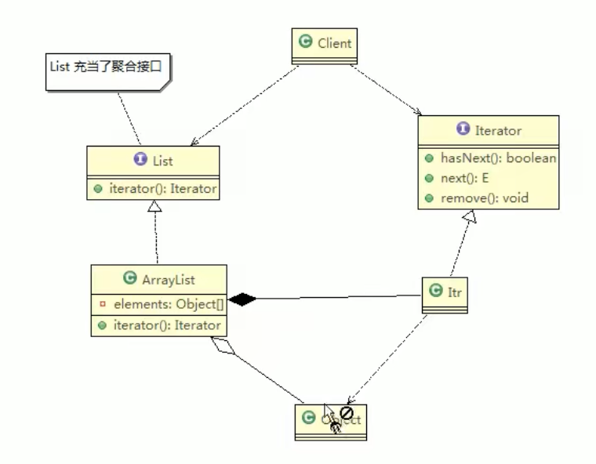

### 18. 观察者模式

> JDK中的Observable用到了观察者模式

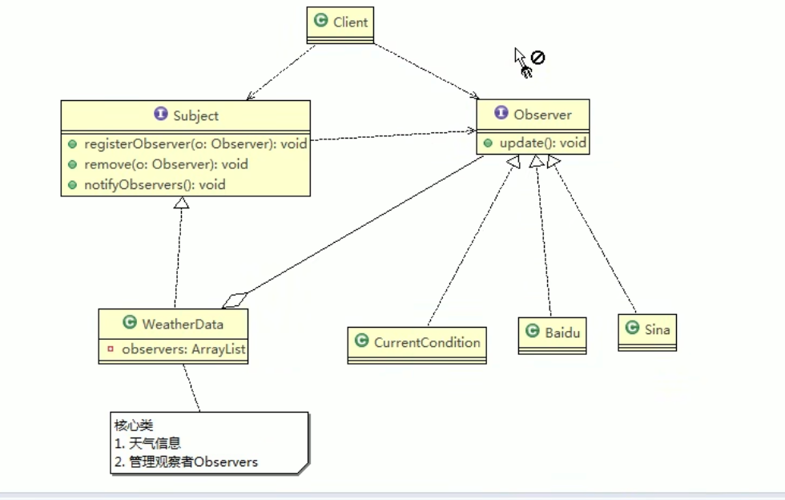

### 19. 中介者模式

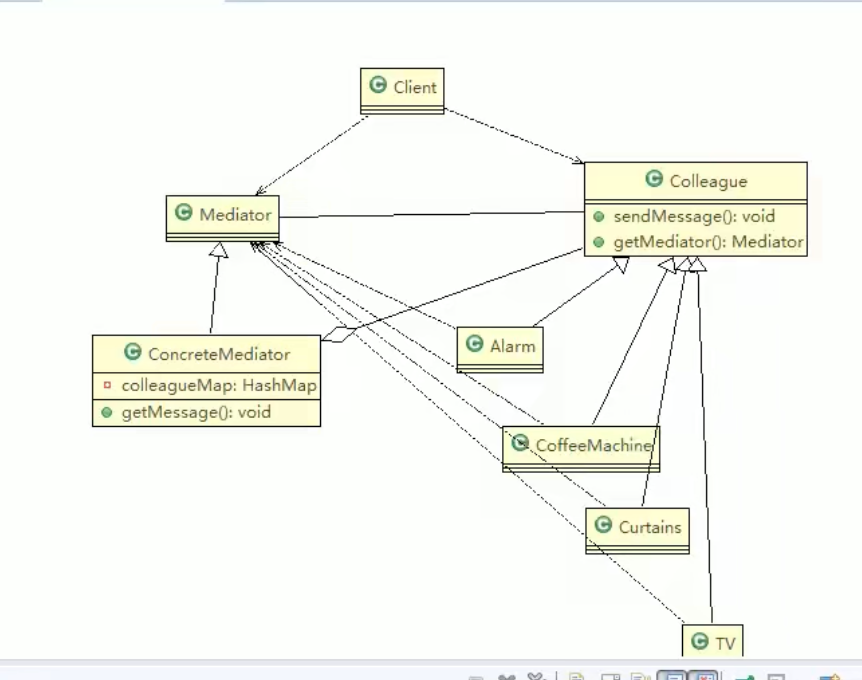

### 20 备忘录模式（快照模式）

