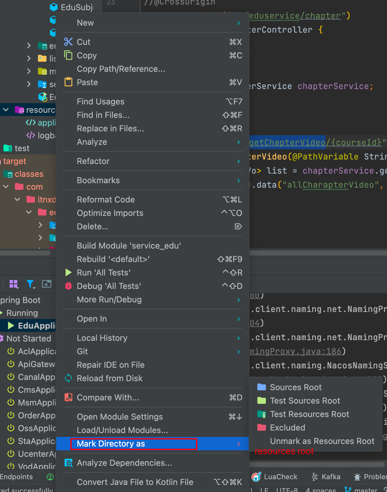
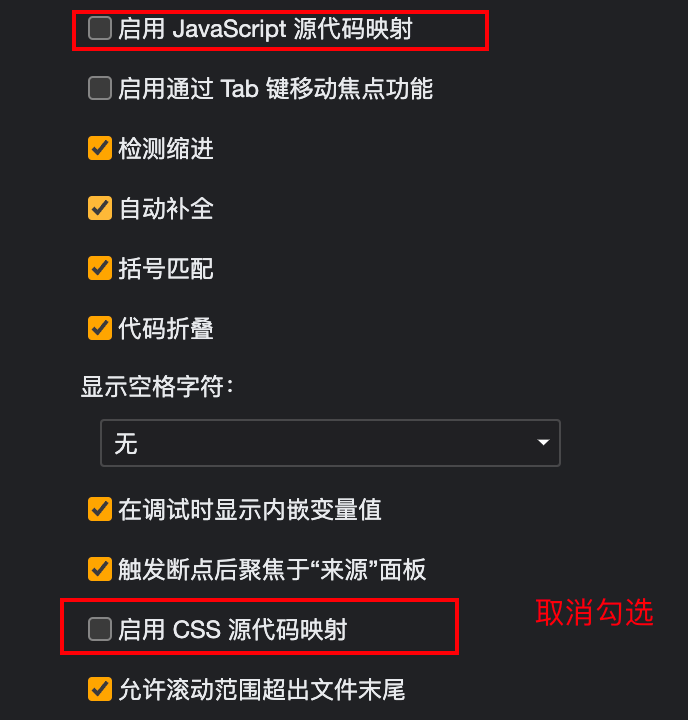
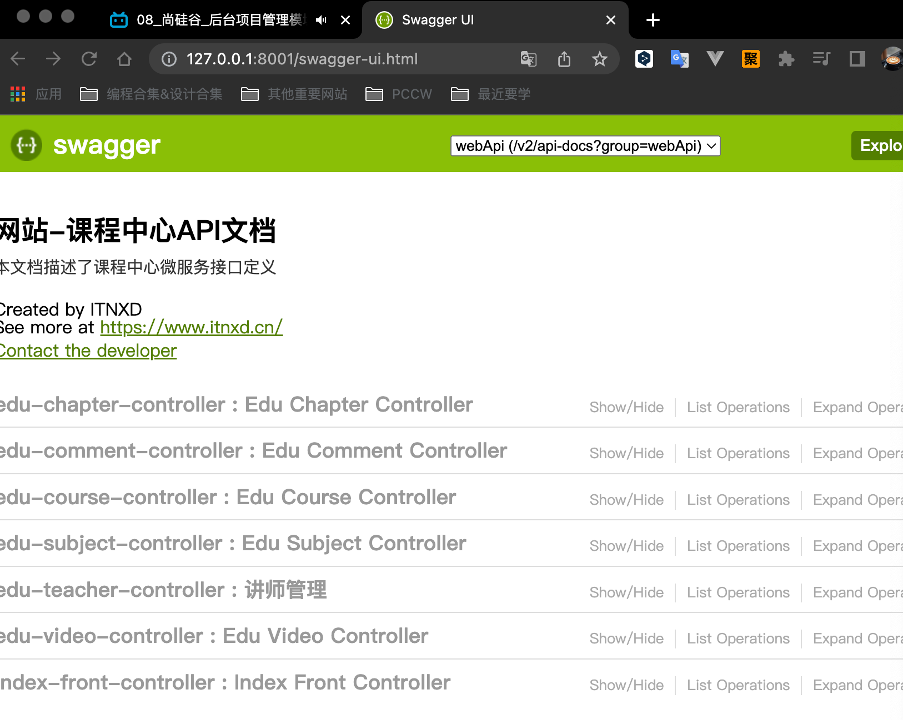
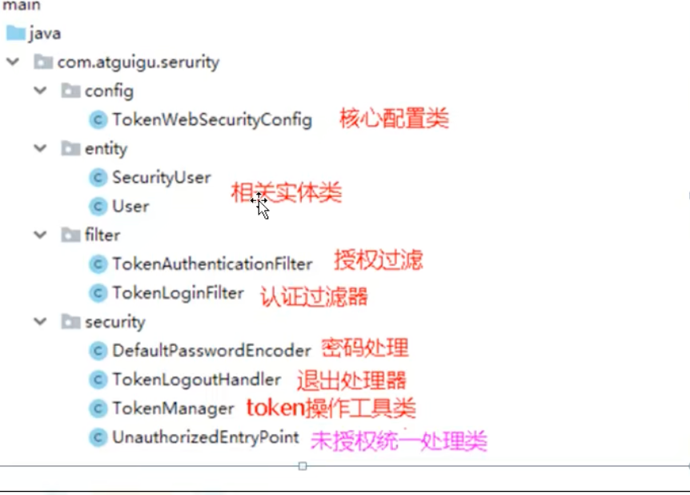

# 谷粒学院笔记

## 项目背景

> 我完全可以实现一个在线教育项目啊，放上自己的课程啊,冲冲冲

## 踩坑记录

### resouces没有识别导致错误



### driverclass报错

```properties
spring.datasource.driver-class-name=com.mysql.jdbc.Driver
```

### 返回json时间格式统一

```properties
#返回json的全局时间格式
spring.jackson.date-format=yyyy-MM-dd HH:mm:ss
spring.jackson.time-zone=GMT+8
```

### npm run dev报错

> 需要build/webpack.config.js文件，用老师的文件加上去就行了

###   ReferenceError: BASE_URL is not defined

https://blog.csdn.net/gxgalaxy/article/details/105302225

```html
<!DOCTYPE html>
<html>
  <head>
    <meta charset="utf-8">
    <meta name="viewport" content="width=device-width,initial-scale=1.0">
    <title>vue-admin-template</title>
  </head>
  <body>

    <script src=<%= htmlWebpackPlugin.options.url %>/tinymce4.7.5/tinymce.min.js></script>
    <script src=<%= htmlWebpackPlugin.options.url %>/tinymce4.7.5/langs/zh_CN.js></script>

    <div id="app"></div>
    <!-- built files will be auto injected -->
  </body>
</html>
```

### 跨域

```java
@Configuration
public class CorsConfiguration implements Filter {


    @Override
    public void doFilter(ServletRequest req, ServletResponse res, FilterChain chain) throws IOException, ServletException {
        HttpServletRequest reqs = (HttpServletRequest) req;
        String curOrigin = reqs.getHeader("Origin");
        HttpServletResponse response = (HttpServletResponse) res;
        response.setHeader("Access-Control-Allow-Origin", curOrigin == null ? "true" : curOrigin);
        response.setHeader("Access-Control-Allow-Credentials", "true");
        response.setHeader("Access-Control-Allow-Methods", "POST, GET, OPTIONS, DELETE, HEAD");
        response.setHeader("Access-Control-Max-Age", "3600");
        response.setHeader("Access-Control-Allow-Headers", "access-control-allow-origin, authority, content-type, version-info, X-Requested-With,x-token");
        response.setContentType("application/json;charset=UTF-8");
        chain.doFilter(req, res);

    }
}
```


### 图片上传失败

### nginx access denied

```shell
sudo chmod 777 ./*
```

###  :9528/#/teacher/save:1 Unchecked runtime.lastError: A listener indicated an asynchronous response by returning true, but the message channel closed before a response was received

https://stackoverflow.com/questions/72494154/a-listener-indicated-an-asynchronous-response-by-returning-true-but-the-messag

拓展产生的问题

### DevTools failed to load source map: Could not load content for chrome-extension://cofdbpoegempjloogbagkncekinflcnj/build/content.js.map: 系统错误: net::ERR_BLOCKED_BY_CLIENT

https://stackoverflow.com/questions/61339968/error-message-devtools-failed-to-load-sourcemap-could-not-load-content-for-chr



### 403错误

> 1. 跨域
> 2. 路径错了

### maven不会加载xml文件

方式一：把xml移动到resources

方式二：配置pom和springboot配置

```xml
<!-- 项目打包时会将java目录中的*.xml文件也进行打包 -->
    <build>
        <resources>
            <resource>
                <directory>src/main/java</directory>
                <includes>
                    <include>**/*.xml</include>
                </includes>
                <filtering>false</filtering>
            </resource>
        </resources>
    </build>
```

```properties
#配置mapper xml文件的路径
mybatis-plus.mapper-locations=classpath:com/itnxd/eduservice/mapper/xml/*.xml
```

### aliyun-sdk-vod-upload1.4.11报错，野包统一解决办法

> 因为这部分没开源 ,解决方案：
>
> 1. 下载相应的实例代码,进入lib目录
> 2. 执行maven命令`mvn install:install-file -DgroupId=com.aliyun -DartifactId=aliyun-sdk-vod-upload -Dversion=1.4.11 -Dpackaging=jar -Dfile=aliyun-java-vod-upload-1.4.11.jar`


## 集成Mybatis-plus

### 如何打印sql日志

```properties
#mybatis-plus配置控制台打印完整带参数SQL语句
mybatis-plus.configuration.log-impl=org.apache.ibatis.logging.stdout.StdOutImpl
```

### 设置主键生成策略和自动填充数据

```java
@Data
@AllArgsConstructor
@NoArgsConstructor
@TableName("user")
public class User {
    @TableId(type = IdType.ID_WORKER)
    private Long id;
    private String name;
    private Integer age;
    private String email;
    @TableField(fill = FieldFill.INSERT)
    private Date createTime;
    @TableField(fill = FieldFill.INSERT_UPDATE)
    private Date updateTime;
}
```


```java
@Slf4j
@Component
public class MyMetaObjectHandler implements MetaObjectHandler {

    @Override
    public void insertFill(MetaObject metaObject) {
        // 插入的时候2个时间都有
        this.setFieldValByName("createTime",new Date(),metaObject);
        this.setFieldValByName("updateTime",new Date(),metaObject);
    }

    @Override
    public void updateFill(MetaObject metaObject) {
        // 更新的时候只有更新时间需要
        this.setFieldValByName("updateTime",new Date(),metaObject);
    }

}
```

### 乐观锁解决丢失更新

```java
@Configuration
@MapperScan("com.binyu.mybatisplusdemo.mapper")
public class MybatisConfig {
    // 乐观锁插件
    @Bean
    public OptimisticLockerInterceptor optimisticLockerInterceptor(){
        return new OptimisticLockerInterceptor();
    }

}
```

### 分页插件

```java
@Configuration
@MapperScan("com.binyu.mybatisplusdemo.mapper")
public class MybatisConfig {
    // 分页插件
    @Bean
    public PaginationInterceptor paginationInterceptor(){
        PaginationInterceptor paginationInterceptor = new PaginationInterceptor();
        // 设置请求的页面大于最大页后操作，true调回首页，false继续请求，默认是false
        paginationInterceptor.setOverflow(false);
        return paginationInterceptor;
    }
}
```


```java
@SpringBootTest
class MybatisPlusDemoApplicationTests {

    @Autowired
    private UserMapper userMapper;
    @Test
    public void testPage(){
        Page<User> page=new Page<>(1,3);
        userMapper.selectPage(page, null);
        System.out.println(page.getCurrent());// 当前页
        System.out.println(page.getRecords());// 每页数据list集合
        System.out.println(page.getSize());//每页显示的记录数
        System.out.println(page.getTotal());//总记录数
        System.out.println(page.getPages());//总页数
        System.out.println(page.hasNext());
        System.out.println(page.hasPrevious());
    }
}
```

### 逻辑删除

```java
@TableLogic
private Integer deleted;
```

```java
@Configuration
@MapperScan("com.binyu.mybatisplusdemo.mapper")
public class MybatisConfig {
    
    @Bean
    public ISqlInjector iSqlInjector(){
        return new LogicSqlInjector();
    }

}
```

### 性能分析插件

```java
@Configuration
@MapperScan("com.binyu.mybatisplusdemo.mapper")
public class MybatisConfig {
    // sql执行效率插件
    // 设置成开发和测试环境开启，保证效率
    @Bean
    @Profile({"dev","test"})
    public PerformanceInterceptor performanceInterceptor(){
        PerformanceInterceptor performanceInterceptor = new PerformanceInterceptor();
        // 设置sql执行的最大时间，如果超过了则不执行，单位毫秒
        performanceInterceptor.setMaxTime(10);
        // 开启sql格式化支持
        performanceInterceptor.setFormat(true);
        return performanceInterceptor;
    }

}
```

### 复杂条件查询

```java
 @Test
    public void testQueryWrapper(){
        QueryWrapper<User> queryWrapper=new QueryWrapper<>();
        queryWrapper.select("id","name").ge("age",30).eq("name","123").ne("email","321").last("limit 1");
        userMapper.selectOne(queryWrapper);
    }
```

### 代码生成器

```java
public class CodeGenerator {

    @Test
    public void run() {

        // 1、创建代码生成器
        AutoGenerator mpg = new AutoGenerator();

        // 2、全局配置
        GlobalConfig gc = new GlobalConfig();
        String projectPath = System.getProperty("user.dir");
        gc.setOutputDir(projectPath + "/src/main/java");
        gc.setAuthor("binyu");
        gc.setOpen(false); //生成后是否打开资源管理器
        gc.setFileOverride(false); //重新生成时文件是否覆盖
        gc.setServiceName("%sService");	//去掉Service接口的首字母I
        gc.setIdType(IdType.ID_WORKER_STR); //主键策略
        gc.setDateType(DateType.ONLY_DATE);//定义生成的实体类中日期类型
        gc.setSwagger2(true);//开启Swagger2模式

        mpg.setGlobalConfig(gc);

        // 3、数据源配置
        DataSourceConfig dsc = new DataSourceConfig();
        dsc.setUrl("jdbc:mysql://localhost:3306/guli?serverTimezone=GMT%2B8");
        dsc.setDriverName("com.mysql.jdbc.Driver");
        dsc.setUsername("root");
        dsc.setPassword("root");
        dsc.setDbType(DbType.MYSQL);
        mpg.setDataSource(dsc);

        // 4、包配置
        PackageConfig pc = new PackageConfig();
        pc.setModuleName("test"); //模块名
        pc.setParent("com.binyu");
        pc.setController("controller");
        pc.setEntity("entity");
        pc.setService("service");
        pc.setMapper("mapper");
        mpg.setPackageInfo(pc);

        // 5、策略配置
        StrategyConfig strategy = new StrategyConfig();
        strategy.setInclude("edu_comment"); // 需要生成的表
        strategy.setNaming(NamingStrategy.underline_to_camel);//数据库表映射到实体的命名策略
        strategy.setTablePrefix(pc.getModuleName() + "_"); //生成实体时去掉表前缀

        strategy.setColumnNaming(NamingStrategy.underline_to_camel);//数据库表字段映射到实体的命名策略
        strategy.setEntityLombokModel(true); // lombok 模型 @Accessors(chain = true) setter链式操作

        strategy.setRestControllerStyle(true); //restful api风格控制器
        strategy.setControllerMappingHyphenStyle(true); //url中驼峰转连字符

        mpg.setStrategy(strategy);


        // 6、执行
        mpg.execute();
    }
}

```

### 自动填充


```java
@Component
public class MyMetaObjectHandler implements MetaObjectHandler {

    @Override
    public void insertFill(MetaObject metaObject) {
        this.setFieldValByName("gmtCreate", new Date(), metaObject);
        this.setFieldValByName("gmtModified", new Date(), metaObject);
    }

    @Override
    public void updateFill(MetaObject metaObject) {
        this.setFieldValByName("gmtModified", new Date(), metaObject);
    }
}
```

```java
 @ApiModelProperty(value = "创建时间")
    @TableField(fill = FieldFill.INSERT)
    private Date gmtCreate;

    @ApiModelProperty(value = "更新时间")
    @TableField(fill = FieldFill.INSERT_UPDATE)
    private Date gmtModified;
```


## 集成swagger

### 1. pom依赖

```xml
   <dependency>
            <groupId>io.springfox</groupId>
            <artifactId>springfox-swagger2</artifactId>
            <scope>provided</scope>
        </dependency>
        <dependency>
            <groupId>io.springfox</groupId>
            <artifactId>springfox-swagger-ui</artifactId>
            <scope>provided</scope>
        </dependency>
```

### 2. 配置类

```java
@Configuration
@EnableSwagger2
public class SwaggerConfig {

    @Bean
    public Docket webApiConfig(){
        return new Docket(DocumentationType.SWAGGER_2)
                .groupName("webApi")
                .apiInfo(webApiInfo())
                .select()
                //.paths(Predicates.not(PathSelectors.regex("/admin/.*")))
                .paths(Predicates.not(PathSelectors.regex("/error.*")))
                .build();
    }

    private ApiInfo webApiInfo(){
        return new ApiInfoBuilder()
                .title("网站-课程中心API文档")
                .description("本文档描述了课程中心微服务接口定义")
                .version("1.0")
                .contact(new Contact("ITNXD", "https://www.itnxd.cn/",
                        "158903258@qq.com"))
                .build();
    }
}
```

### 3. 包扫描

```java
@ComponentScan(basePackages = {"com.itnxd"})
public class EduApplication {

    public static void main(String[] args) {
        SpringApplication.run(EduApplication.class, args);
    }
}
```

### 4. 访问网页

http://127.0.0.1:8001/swagger-ui.html



## 统一异常处理

> 先找特定异常，再找全局异常

```java
@ControllerAdvice
@Slf4j
public class GlobalExceptionHandler {

    @ExceptionHandler(Exception.class)
    @ResponseBody // 为了返回json数据
    public R error(Exception e){
        e.printStackTrace();
        return R.error().message("执行了全局异常处理...");
    }

    @ExceptionHandler(ArithmeticException.class)
    @ResponseBody // 为了返回json数据
    public R error(ArithmeticException e){
        e.printStackTrace();
        return R.error().message("执行了ArithmeticException异常处理...");
    }

    @ExceptionHandler(GuliException.class)
    @ResponseBody // 为了返回json数据
    public R error(GuliException e){
        // 将异常错误信息写到日志文件：log_error.log
        log.error(e.getMessage());
        e.printStackTrace();
        return R.error().code(e.getCode()).message(e.getMsg());
    }
}
```

## 统一日志处理

> Log4j、logback日志工具

```properties
# 设置日志级别
logging.level.root=debug
```

## node.js

> 不需要浏览器就能运行javascript代码
>
> 可以模拟服务器如tomcat
>
> 我们使用12.14.0版本

## babel

> 是一个转码器，将ES6代码转换成ES5代码
>
> 我们使用babel6版本

### 1. 安装依赖

```shell
npm install -g babel-cli
npm install --save-dev babel-preset-es2015
```

### 2. 配置文件.babelrc

```json
{
  "presets": ["es2015"],
  "plugins": []
}
```

### 3. 使用命令转码

#### 3.1 单个文件转码

```shell
 babel es6/es6demo.js -o dist/es6demo-convert.js
```

#### 3.2 文件夹转码

```shell
babel es6 -d dist
```

## 模块化

### 1. 前端模块化概念

> 是js之间的调用

### 2. 后端模块化概念

> 是SSM三层框架的bean之间的调用

### 3. ES5实现模块化

#### 3.1 01.js

```js
const sum = function(a, b) {
  return parseInt(a) + parseInt(b)
}
const subtract = (a, b) => parseInt(a) - parseInt(b)
module.exports = {
  sum, subtract
}
```

#### 3.2 02.js

```js
const m = require('./01')
console.log(m.sum(10, 3))
```

#### 3.3 执行

```shell
node 02.js 
```

### 4. ES6实现模块化-方式1

#### 4.1 01.js

```js
export const fn = () => 1
```

#### 4.2 02.js

```js
import { fn } from './01'
console.log(fn())
```

#### 4.3 babel转换

```shell
babel es6-module -d dist
```

#### 4.4 node执行

```js
node 02.js 
```

### 5. ES6实现模块化-方式2

```js
export default {
  fun(a, b) {
    console.log(a + b)
  },
  fun2(a, b) {
    console.log(a - b)
  }
}
```

## webpack打包

> 多个静态资源打包成一个

### 1. 全局安装

```shell
npm i -g webpack webpack-cli
```

### 2. 查看版本

```shell
webpack -v
```

### 3. 配置文件webpack.config.js

```js
const path = require('path');

module.exports = {
  entry: './src/index.js',
  output: {
    filename: 'main.js',
    path: path.resolve(__dirname, 'dist'),
  },
};

```

### 4. 创建一些js并在index.js中引入使用

### 5. 执行打包命令

```shell
webpack
```

### 6 在package.json中修改script以便使用npm run build进行打包

```js
"scripts": {
    "test": "echo \"Error: no test specified\" && exit 1",
    "build": "webpack --mode=development"
  },
```

```shell
npm run build
```

### 7. 安装css-loader和style-loader

```shell
npm i --save-dev style-loader css-loader
```

### 8. 创建一些css

### 9. 修改webpack.config.js

```js
const path = require('path')

module.exports = {
  //...
  module: {
    rules: [
      {
        test: /\.css$/,
        use: ['style-loader', 'css-loader']
      }
    ]
  }
}
```

## 前端页面结构

### 入口文件

index.html

Main.js

### build目录

> 项目构建的脚本文件

### config目录

> 类似于application.properties

### node-modules

> 下载的依赖，类似于jar包

### src目录

> 写代码的位置

## 跨域解决

### 方法一 注解解决

```java
@CrossOrigin // 解决跨域请求
```

### 方法二 网关解决

> 以后讲

## 阿里云OSS

### 0.注册账号，开通OSS

### 1. 创建bucket

### 2. 编写代码

## Nginx

> 请求转发,负载均衡,动静分离

## EasyExcel

> 阿里巴巴开源excel处理框架


## 富文本编辑器

> base64图片直接存数据库


## 接口化请求调用

> 接口化请求调用流程：消费者->Feign->hystrix->ribbon->http client->生产者

> 熔断器可以用于服务降级和服务熔断

## Nuxt

> 服务端渲染技术

## SpringBoot缓存注解

> @Cacheable(key="",value="") 查询方法用
>
> @CachePut()新增方法用
>
> @CacheEvict()删除、更新方法用

## 单点登录SSO

> 一次登录，多处可用
>
> 常见的方式有：
>
> 1. session广播机制实现，session复制。早期的技术
> 2. 使用cookie和redis实现。
>    1. reids key，生成唯一随机值（IP、用户ID等等），在value存用户数据
>    2. Cookie 把redis里面生成的key值放到cookie
>    3. 带cookie访问
> 3. 使用token实现。
>    1. 一定格式生成的用户信息，把字符串以一定格式返回

## 微信登录

> OAuth2:
>
> 1. 开放系统间的授权
> 2. 分布式访问问题（单点登录）
>
> cookie不能跨域，解决方案是用jwt生成token字符串传递到首页面

## canal数据同步工具

> 调远程库效率低

## gateway网关

> 可以替代nginx的作用

## SpringSecurity



## Nacos

> 配置中心和注册中心

## Jenkins

> 使用maven可以打包，使用jenkins自动化打包
>
> 手动打包：进入项目目录中执行`Mvn clean package`,target目录中的jar包就是打包后的文件
>
> `java -jar xxx.jar`运行jar包 

> 在linux上安装java环境，安装Maven环境，安装git，安装docker，安装jenkins 
>
> 记得安装插件时配置国内镜像，重启jenkins
>
> 配置global tool configuration的各个软件路径
>
> 项目文件需要加一个dockerfile
>
> 编写shell进行脚本构建
>
> 要启动docker


