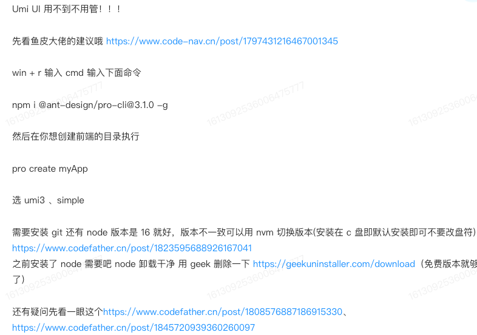
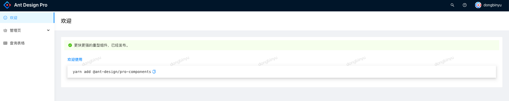

# 鱼皮知识星球-用户中心

> 了解完整做项目的流程，目标做出管理系统
>
> 后端：https://github.com/dby321/user-center
>
> 前端：https://github.com/dby321/myapp

## 前言

### 需求分析

1. 登录注册
2. 用户管理（仅管理员可见）
3. 用户校验（仅星球用户）

### 技术选型

前端：三件套+React+组件库 Ant-design+Umi+Ant Design Pro（现成的管理系统）

后端：Java+SSM+Mybatis-plus+SpringBoot+Mysql+Redis

部署：服务器/容器（平台）

## 计划

1. 初始化项目
   1. 前端初始化 20min ✅
      1. 初始化项目 ✅
      2. 引入组件 ✅
      3. 框架介绍/瘦身 ✅
   2. 后端初始化 20min
      1. 准备环境（Mysql 之类的）✅
      2. 引入框架（整合框架）✅

2. 数据库设计 ✅

3. 登录/注册 20min
   1. 后端
   2. 前端

4. 用户管理（仅管理员可见） 20min

## 项目初始化



1. `yarn`
2. `yarn start`

## 项目依赖作用

[Spring Boot 之 Spring-devtools 热部署：实现快速开发与调试](https://developer.aliyun.com/article/1310282)

[Spring Boot Actuator 使用和常用配置](https://developer.aliyun.com/article/1574023)

## 数据库表设计

```sql
create table user
(
    username varchar(256) null comment '用户昵称',
    id bigint auto_increment comment 'id' primary key ,
    userAccount varchar(256) null comment '账号',
    avatarUrl varchar(1024) null comment '用户头像',
    gender tinyint null comment '性别',
    userPassword varchar(512) null comment '密码',
    phone varchar(128) null comment '电话',
    email varchar(512) null comment '邮箱',
    userStatus int default 0 not null comment '状态 0 - 正常',
    createTime datetime default CURRENT_TIMESTAMP null comment '创建时间',
    updateTime datetime default CURRENT_TIMESTAMP null on update CURRENT_TIMESTAMP,
    isDelete tinyint default 0 not null comment '是否删除'
)
    comment '用户';
```

## 安装插件

- MybatisX: 自动根据数据库生成 domain 实体对象、mapper、service 等
- GenerateAllSetters：不太常用
- Randomness：不太常用
- SonarLint: 代码检查，常用

## 注册逻辑

1. 用户在前端输入账号和密码，以及校验码（todo)
2. 校验用户的账户、密码、校验密码是否符合要求
   1. 账户不小于 4 位
   2. 密码不小于 8 位
   3. 账户不能重复
   4. 账户不包含特殊字符
   5. 密码和校验密码相同
   6. 其他的校验
3. 对密码进行加密
4. 向数据库插入用户数据
## 前后端交互，如何找到 request 的 BASE_URL

1. axios 封装了 ajax
2. request 是 ant design 又封装了一次
3. 追踪 request 源码：用到了 umi 的插件: request
4. 由于使用的是 umi3.5, 定位到文档链接为 https://v3.umijs.org/plugins/plugin-request
5. F12 查看控制台调用情况

## 成功登录并设置水印和头像



## 跨域解决方案

1. nginx 配置解决，最常用

```nginx
# 跨域配置
location ^~ /api/ {
    proxy_pass http://127.0.0.1:8080/api/;
    add_header 'Access-Control-Allow-Origin' $http_origin;
    add_header 'Access-Control-Allow-Credentials' 'true';
    add_header Access-Control-Allow-Methods 'GET, POST, OPTIONS';
    add_header Access-Control-Allow-Headers '*';
    if ($request_method = 'OPTIONS') {
        add_header 'Access-Control-Allow-Credentials' 'true';
        add_header 'Access-Control-Allow-Origin' $http_origin;
        add_header 'Access-Control-Allow-Methods' 'GET, POST, OPTIONS';
        add_header 'Access-Control-Allow-Headers' 'DNT,User-Agent,X-Requested-With,If-Modified-Since,Cache-Control,Content-Type,Range';
        add_header 'Access-Control-Max-Age' 1728000;
        add_header 'Content-Type' 'text/plain; charset=utf-8';
        add_header 'Content-Length' 0;
        return 204;
    }
}

```

2. 后端配置

```java
@Configuration
public class CorsConfig {
    private CorsConfiguration buildConfig() {
        CorsConfiguration corsConfiguration = new CorsConfiguration();
        corsConfiguration.addAllowedOrigin("*");
        corsConfiguration.addAllowedHeader("*");
        corsConfiguration.addAllowedMethod("*");
        corsConfiguration.setMaxAge(3600L);
        corsConfiguration.setAllowCredentials(true);
        return corsConfiguration;
    }
 
    @Bean
    public CorsFilter corsFilter() {
        UrlBasedCorsConfigurationSource source = new UrlBasedCorsConfigurationSource();
        source.registerCorsConfiguration("/**", buildConfig());
        return new CorsFilter(source);
    }
}
```

3. 后端配置 2

```java
@Configuration
public class WebMvcConfg implements WebMvcConfigurer {
 
    @Override
    public void addCorsMappings(CorsRegistry registry) {
        //设置允许跨域的路径
        registry.addMapping("/**")
                //设置允许跨域请求的域名
                //当**Credentials为true时，**Origin不能为星号，需为具体的ip地址【如果接口不带cookie,ip无需设成具体ip】
                .allowedOrigins("http://localhost:9527", "http://127.0.0.1:9527", "http://127.0.0.1:8082", "http://127.0.0.1:8083")
                //是否允许证书 不再默认开启
                .allowCredentials(true)
                //设置允许的方法
                .allowedMethods("*")
                //跨域允许时间
                .maxAge(3600);
    }
}
```

4. 后端配置 3

```java
@Controller
@RequestMapping("/admin/sysLog")
@CrossOrigin(origins = {"http://localhost:5173"},allowCredentials = "true")
public class SysLogController {
 
}
```


# AI 总结的跨域解决方案

跨域问题是前端开发中非常常见的问题，其根本原因是 **浏览器的同源策略（Same-Origin Policy）**：当请求的 **协议（protocol）、域名（host）或端口（port）** 三者中任意一个不同时，浏览器会阻止脚本（如 Ajax）访问该资源。

为了解决这个问题，业界发展出了多种跨域解决方案。以下是 **主流且实用的跨域方案分类与详解**：

------

## 一、服务端协作类（需后端配合）

### 1. CORS（Cross-Origin Resource Sharing）——最主流

- **原理**：通过服务器在响应头中添加特定字段（如 `Access-Control-Allow-Origin`），告诉浏览器允许哪些源访问资源。

- **适用场景**：前后端分离项目、RESTful API。

- 优点

  ：

  - 支持所有 HTTP 方法（GET/POST/PUT/DELETE 等）
  - 安全可控（可限制 Origin、Header、Credentials）

- 注意点

  ：

  - 非简单请求会触发 **预检请求（Preflight，OPTIONS）**
  - 若携带 Cookie（`withCredentials: true`），则 `Access-Control-Allow-Origin` 不能为 `*`，必须指定具体域名

✅ 示例（Node.js/Express）：

```js
app.use((req, res, next) => {
  res.header('Access-Control-Allow-Origin', 'https://your-frontend.com');
  res.header('Access-Control-Allow-Credentials', 'true');
  res.header('Access-Control-Allow-Headers', 'Content-Type, Authorization');
  next();
});
```

------

### 2. Nginx 反向代理（推荐用于生产环境）

- **原理**：将前端和后端“伪装”成同源。Nginx 接收前端请求后，转发给真实后端，浏览器认为是同源请求。
- **配置示例**：

```nginx
server {
  listen 80;
  server_name localhost;

  location /api/ {
    proxy_pass http://backend-server:8080/;  # 转发到后端
  }
}
```

- 前端请求：`/api/users` → 实际访问 `http://localhost/api/users` → Nginx 转发到 `http://backend-server:8080/users`

- 优点

  ：

  - 彻底绕过浏览器跨域限制
  - 开发与生产环境一致
  - 无需修改后端 CORS 配置（可选）

------

### 3. 后端代理（开发阶段常用）

- 如 Webpack DevServer 的 `proxy`、Vite 的 `server.proxy`
- 仅用于本地开发，上线仍需 Nginx 或 CORS

```js
// vite.config.js
export default {
  server: {
    proxy: {
      '/api': {
        target: 'https://api.example.com',
        changeOrigin: true,
        rewrite: (path) => path.replace(/^\/api/, '')
      }
    }
  }
}
```

------

## 二、纯前端或特殊协议类（部分已淘汰或受限）

### 4. JSONP（仅限 GET，已不推荐）

- **原理**：利用 `<script>` 标签不受同源策略限制的特性，动态加载远程 JS 并执行回调函数。

- 缺点

  ：

  - 只支持 GET 请求
  - 无错误处理机制
  - 存在 XSS 风险

- **适用场景**：兼容老系统、第三方只提供 JSONP 接口时

```html
<script>
  function handleData(data) { console.log(data); }
</script>
<script src="https://api.example.com/data?callback=handleData"></script>
```

------

### 5. postMessage（窗口/iframe 通信）

- **原理**：HTML5 提供的安全跨域通信 API，可用于不同窗口、iframe、Web Worker 之间传递消息。
- **典型场景**：嵌入第三方 iframe、微前端子应用通信

```js
// 发送方
window.postMessage({ msg: 'hello' }, 'https://target.com');

// 接收方
window.addEventListener('message', (e) => {
  if (e.origin !== 'https://trusted.com') return;
  console.log(e.data);
});
```

------

### 6. document.domain（仅限主域相同）

- 适用于 `a.example.com` 和 `b.example.com` 这类子域跨域
- 需双方都设置 `document.domain = 'example.com'`
- **局限性大，现代项目很少用**

------

### 7. location.hash / window.name + iframe

- 利用 iframe 的 URL hash 或 window.name 在不同域间传数据
- 实现复杂、效率低，基本已被 postMessage 取代

------

### 8. WebSocket

- WebSocket 协议本身 **不受同源策略限制**
- 但服务器仍可校验 Origin 头进行安全控制
- 适用于实时通信场景（如聊天室）

```js
const ws = new WebSocket('wss://api.example.com');
ws.onmessage = (e) => console.log(e.data);
```

------

## 三、其他补充方案

### 9. 浏览器插件或关闭安全策略（仅开发调试）

- 启动 Chrome 时加参数：`--disable-web-security --user-data-dir=xxx`
- ⚠️ **绝对不可用于生产环境！**

------

## 四、如何选择？——实战建议

| 场景                             | 推荐方案                                      |
| -------------------------------- | --------------------------------------------- |
| 正常前后端分离项目（现代浏览器） | ✅ **CORS**（后端配）                          |
| 生产环境部署                     | ✅ **Nginx 反向代理**（统一入口，更安全）      |
| 本地开发跨域                     | ✅ **Webpack/Vite 代理**                       |
| 第三方只提供 JSONP 接口          | ⚠️ **JSONP**（注意安全）                       |
| iframe 或多窗口通信              | ✅ **postMessage**                             |
| 实时双向通信                     | ✅ **WebSocket**                               |
| 老旧系统兼容（IE8/9）            | ❌ 尽量升级，否则考虑 JSONP 或 Flash（已淘汰） |

------

## 总结

> **现代项目首选 CORS + Nginx 代理组合**：  
>
> - 开发阶段用 Vite/Webpack 代理；  
> - 上线后用 Nginx 统一入口，既解决跨域又提升安全性与性能。

跨域本质是 **浏览器的安全限制**，不是服务器问题。解决方案的核心思路要么是 **让浏览器认为“同源”**（如代理），要么是 **让服务器明确授权“允许跨域”**（如 CORS）。


