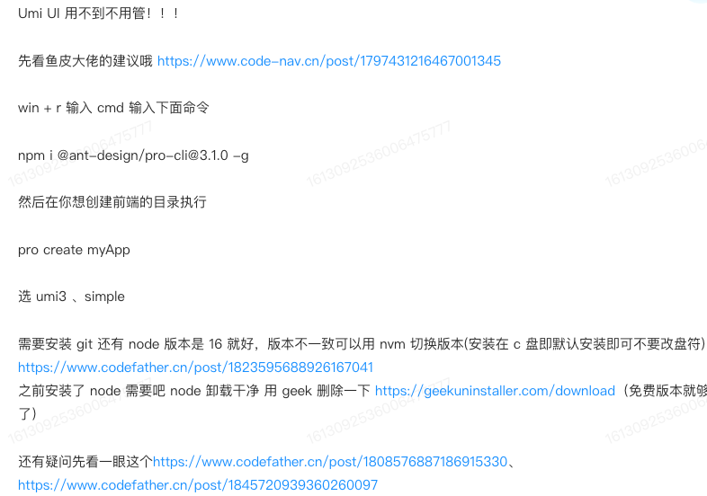
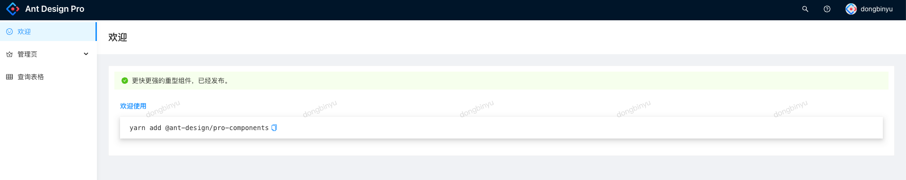

# 鱼皮知识星球-用户中心

> 了解完整做项目的流程，目标做出管理系统
>
> 后端：https://github.com/dby321/user-center
>
> 前端：https://github.com/dby321/myapp
>
> mac 端需要brew 启动 redis 和 nginx

## 前言

### 需求分析

1. 登录注册
2. 用户管理（仅管理员可见）
3. 用户校验（仅星球用户）

### 技术选型

前端：三件套+React+组件库 Ant-design+Umi+UmiUI+Ant Design Pro（现成的管理系统）

后端：Java+SSM+Mybatis-plus+SpringBoot+Mysql+Redis

部署：服务器/容器（平台）

## 计划

1. 初始化项目
   1. 前端初始化 20min ✅
      1. 初始化项目 ✅
      2. 引入组件 ✅
      3. 框架介绍/瘦身 ✅
   2. 后端初始化 20min
      1. 准备环境（Mysql 之类的）✅
      2. 引入框架（整合框架）✅

2. 数据库设计 ✅

3. 登录/注册 20min
   1. 后端
   2. 前端

4. 用户管理（仅管理员可见） 20min

## 项目初始化



1. `yarn`
2. `yarn start`

## 项目依赖作用

[Spring Boot 之 Spring-devtools 热部署：实现快速开发与调试](https://developer.aliyun.com/article/1310282)

[Spring Boot Actuator 使用和常用配置](https://developer.aliyun.com/article/1574023)

## 数据库表设计

```sql
create table user
(
    username varchar(256) null comment '用户昵称',
    id bigint auto_increment comment 'id' primary key ,
    userAccount varchar(256) null comment '账号',
    avatarUrl varchar(1024) null comment '用户头像',
    gender tinyint null comment '性别',
    userPassword varchar(512) null comment '密码',
    phone varchar(128) null comment '电话',
    email varchar(512) null comment '邮箱',
    userStatus int default 0 not null comment '状态 0 - 正常',
    createTime datetime default CURRENT_TIMESTAMP null comment '创建时间',
    updateTime datetime default CURRENT_TIMESTAMP null on update CURRENT_TIMESTAMP,
    isDelete tinyint default 0 not null comment '是否删除'
)
    comment '用户';
```

## 安装插件

- MybatisX: 自动根据数据库生成 domain 实体对象、mapper、service 等
- GenerateAllSetters：不太常用
- Randomness：不太常用
- SonarLint: 代码检查，常用

## Mybatis-plus自动驼峰装换

```yml
mybatis-plus:
  configuration:
    # 是否开启自动驼峰命名规则转换（默认 true）
    map-underscore-to-camel-case: true
```

## 注册逻辑

1. 用户在前端输入账号和密码，以及校验码（todo)
2. 校验用户的账户、密码、校验密码是否符合要求
   1. 账户不小于 4 位
   2. 密码不小于 8 位
   3. **账户不能重复**(要查询数据库，注意避免性能浪费)
   4. 账户不包含特殊字符
   5. 密码和校验密码相同
   6. 其他的校验
3. 对密码进行加密
4. 向数据库插入用户数据

## Java加密方法

### 一、Java 核心加密类库（JDK 自带，无需额外依赖）
JDK 本身提供了 `java.security` 和 `javax.crypto` 包，覆盖了绝大多数基础加密场景，这是最常用、最基础的类库。

#### 1. 哈希算法（MD5/SHA-1/SHA-256）
- **用途**：不可逆加密，用于密码存储、文件完整性校验（比如校验文件是否被篡改）。
- **核心类**：`MessageDigest`
- **注意**：MD5/SHA-1 已被证明不安全，生产环境优先用 SHA-256/SHA-512。

**代码示例（SHA-256 加密）**：

```java
import java.nio.charset.StandardCharsets;
import java.security.MessageDigest;
import java.security.NoSuchAlgorithmException;
import java.util.HexFormat;

/**
 * 哈希算法工具类（SHA-256）
 */
public class HashUtils {
    // 定义加密算法类型
    private static final String ALGORITHM_SHA256 = "SHA-256";

    /**
     * SHA-256 加密，返回16进制字符串
     * @param content 要加密的内容
     * @return 加密后的16进制字符串
     */
    public static String sha256Encrypt(String content) {
        try {
            // 1. 获取 MessageDigest 实例（指定算法）
            MessageDigest md = MessageDigest.getInstance(ALGORITHM_SHA256);
            // 2. 将内容转为字节数组，更新到 MessageDigest
            byte[] digestBytes = md.digest(content.getBytes(StandardCharsets.UTF_8));
            // 3. 字节数组转16进制字符串（JDK17+ 用 HexFormat，低版本可手动实现）
            return HexFormat.of().formatHex(digestBytes);
        } catch (NoSuchAlgorithmException e) {
            // 算法不存在时抛出运行时异常（实际开发中可自定义异常）
            throw new RuntimeException("SHA-256 算法不存在", e);
        }
    }

    // 测试
    public static void main(String[] args) {
        String content = "123456";
        String encrypted = sha256Encrypt(content);
        System.out.println("原始内容：" + content);
        System.out.println("SHA-256 加密后：" + encrypted);
        // 输出示例：8d969eef6ecad3c29a3a629280e686cf0c3f5d5a86aff3ca12020c923adc6c92
    }
}
```

#### 2. 对称加密（AES）
- **用途**：可逆加密，加密和解密用同一个密钥，用于敏感数据传输（比如接口参数加密）。
- **核心类**：`Cipher`（加密/解密核心）、`SecretKeySpec`（生成密钥）、`IvParameterSpec`（初始化向量，增强安全性）。
- **注意**：AES 推荐使用 `AES/CBC/PKCS5Padding` 模式，必须指定密钥和初始化向量（IV），密钥长度推荐 128/256 位。

**代码示例（AES 加密/解密）**：
```java
import javax.crypto.Cipher;
import javax.crypto.spec.IvParameterSpec;
import javax.crypto.spec.SecretKeySpec;
import java.nio.charset.StandardCharsets;
import java.util.Base64;

/**
 * AES 对称加密工具类（CBC 模式）
 */
public class AesUtils {
    // 算法/模式/填充方式
    private static final String AES_ALGORITHM = "AES/CBC/PKCS5Padding";
    // 密钥（16位=128位，32位=256位，需和业务方约定）
    private static final String AES_KEY = "1234567890abcdef"; // 16位
    // 初始化向量（IV），必须16位
    private static final String AES_IV = "abcdef1234567890";

    /**
     * AES 加密，返回 Base64 编码字符串
     */
    public static String aesEncrypt(String content) throws Exception {
        // 1. 生成密钥和IV
        SecretKeySpec keySpec = new SecretKeySpec(AES_KEY.getBytes(), "AES");
        IvParameterSpec ivSpec = new IvParameterSpec(AES_IV.getBytes(StandardCharsets.UTF_8));

        // 2. 初始化 Cipher（加密模式）
        Cipher cipher = Cipher.getInstance(AES_ALGORITHM);
        cipher.init(Cipher.ENCRYPT_MODE, keySpec, ivSpec);

        // 3. 加密并转 Base64
        byte[] encryptBytes = cipher.doFinal(content.getBytes(StandardCharsets.UTF_8));
        return Base64.getEncoder().encodeToString(encryptBytes);
    }

    /**
     * AES 解密，Base64 字符串还原原始内容
     */
    public static String aesDecrypt(String encryptedContent) throws Exception {
        // 1. 生成密钥和IV（和加密时一致）
        SecretKeySpec keySpec = new SecretKeySpec(AES_KEY.getBytes(), "AES");
        IvParameterSpec ivSpec = new IvParameterSpec(AES_IV.getBytes(StandardCharsets.UTF_8));

        // 2. 初始化 Cipher（解密模式）
        Cipher cipher = Cipher.getInstance(AES_ALGORITHM);
        cipher.init(Cipher.DECRYPT_MODE, keySpec, ivSpec);

        // 3. 解密并转字符串
        byte[] decryptBytes = cipher.doFinal(Base64.getDecoder().decode(encryptedContent));
        return new String(decryptBytes, StandardCharsets.UTF_8);
    }

    // 测试
    public static void main(String[] args) throws Exception {
        String content = "这是要加密的敏感数据";
        // 加密
        String encrypted = aesEncrypt(content);
        System.out.println("AES 加密后：" + encrypted);
        // 解密
        String decrypted = aesDecrypt(encrypted);
        System.out.println("AES 解密后：" + decrypted);
        // 输出：解密后和原始内容一致
    }
}
```

#### 3. 非对称加密（RSA）
- **用途**：可逆加密，加密和解密用不同密钥（公钥加密、私钥解密；私钥签名、公钥验签），用于身份认证、数字签名、密钥传输。
- **核心类**：`KeyPairGenerator`（生成密钥对）、`Cipher`（加密/解密）、`Signature`（签名/验签）。
- **注意**：RSA 加密速度慢，不适合大文件加密，通常用于加密对称加密的密钥。

**代码示例（RSA 加密/解密）**：
```java
import javax.crypto.Cipher;
import java.nio.charset.StandardCharsets;
import java.security.*;
import java.security.spec.PKCS8EncodedKeySpec;
import java.security.spec.X509EncodedKeySpec;
import java.util.Base64;

/**
 * RSA 非对称加密工具类
 */
public class RsaUtils {
    private static final String RSA_ALGORITHM = "RSA";
    // 密钥长度（推荐2048位，1024位已不安全）
    private static final int KEY_SIZE = 2048;

    /**
     * 生成 RSA 密钥对（公钥+私钥）
     */
    public static KeyPair generateRsaKeyPair() throws NoSuchAlgorithmException {
        KeyPairGenerator keyPairGen = KeyPairGenerator.getInstance(RSA_ALGORITHM);
        keyPairGen.initialize(KEY_SIZE);
        return keyPairGen.generateKeyPair();
    }

    /**
     * 公钥加密
     */
    public static String rsaEncrypt(String content, String publicKeyStr) throws Exception {
        // 1. 解析公钥字符串
        byte[] publicKeyBytes = Base64.getDecoder().decode(publicKeyStr);
        X509EncodedKeySpec keySpec = new X509EncodedKeySpec(publicKeyBytes);
        KeyFactory keyFactory = KeyFactory.getInstance(RSA_ALGORITHM);
        PublicKey publicKey = keyFactory.generatePublic(keySpec);

        // 2. 加密
        Cipher cipher = Cipher.getInstance(RSA_ALGORITHM);
        cipher.init(Cipher.ENCRYPT_MODE, publicKey);
        byte[] encryptBytes = cipher.doFinal(content.getBytes(StandardCharsets.UTF_8));
        return Base64.getEncoder().encodeToString(encryptBytes);
    }

    /**
     * 私钥解密
     */
    public static String rsaDecrypt(String encryptedContent, String privateKeyStr) throws Exception {
        // 1. 解析私钥字符串
        byte[] privateKeyBytes = Base64.getDecoder().decode(privateKeyStr);
        PKCS8EncodedKeySpec keySpec = new PKCS8EncodedKeySpec(privateKeyBytes);
        KeyFactory keyFactory = KeyFactory.getInstance(RSA_ALGORITHM);
        PrivateKey privateKey = keyFactory.generatePrivate(keySpec);

        // 2. 解密
        Cipher cipher = Cipher.getInstance(RSA_ALGORITHM);
        cipher.init(Cipher.DECRYPT_MODE, privateKey);
        byte[] decryptBytes = cipher.doFinal(Base64.getDecoder().decode(encryptedContent));
        return new String(decryptBytes, StandardCharsets.UTF_8);
    }

    // 测试
    public static void main(String[] args) throws Exception {
        // 生成密钥对
        KeyPair keyPair = generateRsaKeyPair();
        String publicKey = Base64.getEncoder().encodeToString(keyPair.getPublic().getEncoded());
        String privateKey = Base64.getEncoder().encodeToString(keyPair.getPrivate().getEncoded());
        System.out.println("公钥：" + publicKey);
        System.out.println("私钥：" + privateKey);

        // 加密
        String content = "RSA 测试内容";
        String encrypted = rsaEncrypt(content, publicKey);
        System.out.println("RSA 加密后：" + encrypted);

        // 解密
        String decrypted = rsaDecrypt(encrypted, privateKey);
        System.out.println("RSA 解密后：" + decrypted);
    }
}
```

### 二、第三方加密类库（补充 JDK 不足）
如果需要更丰富的加密算法（比如 SM4 国密算法）、更简洁的 API，推荐使用以下第三方库：

#### 1. BouncyCastle（BC 库）
- **特点**：支持几乎所有加密算法（包括国密 SM2/SM3/SM4），是 Java 加密的“万能库”。
- **使用步骤**：
  1. 引入依赖（Maven）：
     ```xml
     <dependency>
         <groupId>org.bouncycastle</groupId>
         <artifactId>bcprov-jdk18on</artifactId>
         <version>1.78.1</version>
     </dependency>
     ```
  2. 注册 Provider（可选，部分算法需要）：
     ```java
     Security.addProvider(new BouncyCastleProvider());
     ```
  3. 使用方式和 JDK 类似，只是算法名称可指定国密（比如 `SM4/CBC/PKCS7Padding`）。

#### 2. Hutool（工具类库，简化加密代码）
- **特点**：基于 JDK/BC 封装，API 极简，新手友好，无需关注底层细节。
- **使用步骤**：
  1. 引入依赖（Maven）：
     ```xml
     <dependency>
         <groupId>cn.hutool</groupId>
         <artifactId>hutool-all</artifactId>
         <version>5.8.22</version>
     </dependency>
     ```
  2. 极简示例（AES 加密）：
     ```java
     import cn.hutool.crypto.symmetric.AES;
     import cn.hutool.core.codec.Base64;
     
     public class HutoolAesDemo {
         public static void main(String[] args) {
             // 密钥（16位）
             String key = "1234567890abcdef";
             // 初始化 AES
             AES aes = new AES("CBC", "PKCS5Padding", key.getBytes(), "abcdef1234567890".getBytes());
             // 加密
             String encrypt = aes.encryptBase64("Hutool 测试内容");
             // 解密
             String decrypt = aes.decryptStr(encrypt);
             System.out.println("加密后：" + encrypt);
             System.out.println("解密后：" + decrypt);
         }
     }
     ```

### 三、使用注意事项
1. **密钥安全**：对称加密的密钥、非对称加密的私钥不能硬编码在代码里，建议通过配置中心、环境变量存储。
2. **算法选择**：
   - 密码存储：用 SHA-256 + 盐值（避免彩虹表破解），不要用 MD5。
   - 数据传输：AES（对称）+ RSA（加密AES密钥）。
   - 国密场景：用 BouncyCastle 实现 SM2/SM3/SM4。
3. **异常处理**：加密解密过程中会抛出 `NoSuchAlgorithmException`、`InvalidKeyException` 等，实际开发中要统一捕获并处理。

---

### 总结
1. **基础场景**：优先用 JDK 自带的 `MessageDigest`（哈希）、`Cipher`（对称/非对称），无需额外依赖；
2. **简化开发**：用 Hutool 封装的加密工具，一行代码实现加密解密；
3. **特殊算法**：用 BouncyCastle 支持国密、更多小众算法；
4. **核心原则**：密钥要安全存储，算法选最新的（比如 SHA-256、AES-256、RSA-2048），避免使用已不安全的算法（MD5、SHA-1、RSA-1024）。

## 单元测试

多用断言

## 如何知道是哪个用户登录了

### 🔍 核心流程拆解

**建立会话**：用户首次访问服务器时，服务器会创建一个唯一的 `session` 对象，并生成一个 `sessionId` 作为其标识，返回给前端。

**登录绑定**：用户输入账号密码登录成功后，服务器会将用户信息（如用户 ID）与当前的 `session` 对象进行绑定。同时，服务器会在响应头中设置一个 `Set-Cookie` 指令，将 `sessionId` 以 Cookie 的形式返回给浏览器。

**本地存储**：浏览器收到 `Set-Cookie` 指令后，会将包含 `sessionId` 的 Cookie 保存到本地。

**自动携带**：在后续的请求中，只要是向同一个域名发起的，浏览器都会自动在请求头中带上这个 Cookie，将 `sessionId` 传回服务器。

**身份识别**：服务器接收到请求后，从请求头的 Cookie 中取出 `sessionId`，在服务器端的内存或存储中查找对应的 `session` 对象，从而获取到绑定在该会话上的用户信息，以此识别出是哪个用户在操作。

### 💡 补充说明与演进

- **Session 存储**：在分布式系统中，Session 通常会被存储在 Redis 等共享缓存中，以确保多台服务器都能访问到。
- **安全性**：`sessionId` 是敏感信息，应通过 HTTPS 传输，并设置 Cookie 的 `HttpOnly` 和 `Secure` 属性，防止被 XSS 或 CSRF 攻击窃取。
- **现代方案**：随着前后端分离架构的流行，基于 Token（如 JWT）的无状态认证方案也被广泛使用。它不需要在服务器端存储 Session，而是将用户信息加密后直接存储在客户端的 Token 中，每次请求时携带，服务器解密后即可识别用户。

## 前后端交互，如何找到 request 的 BASE_URL

1. axios 封装了 ajax
2. request 是 ant design 又封装了一次
3. 追踪 request 源码：用到了 umi 的插件: request
4. 由于使用的是 umi3.5, 定位到文档链接为 https://v3.umijs.org/plugins/plugin-request
5. F12 查看控制台调用情况

## 成功登录并设置水印和头像



## 跨域解决方案

1. nginx 配置解决，最常用

```nginx
# 跨域配置
location ^~ /api/ {
    proxy_pass http://127.0.0.1:8080/api/;
    add_header 'Access-Control-Allow-Origin' $http_origin;
    add_header 'Access-Control-Allow-Credentials' 'true';
    add_header Access-Control-Allow-Methods 'GET, POST, OPTIONS';
    add_header Access-Control-Allow-Headers '*';
    if ($request_method = 'OPTIONS') {
        add_header 'Access-Control-Allow-Credentials' 'true';
        add_header 'Access-Control-Allow-Origin' $http_origin;
        add_header 'Access-Control-Allow-Methods' 'GET, POST, OPTIONS';
        add_header 'Access-Control-Allow-Headers' 'DNT,User-Agent,X-Requested-With,If-Modified-Since,Cache-Control,Content-Type,Range';
        add_header 'Access-Control-Max-Age' 1728000;
        add_header 'Content-Type' 'text/plain; charset=utf-8';
        add_header 'Content-Length' 0;
        return 204;
    }
}

```

2. 后端配置

```java
@Configuration
public class CorsConfig {
    private CorsConfiguration buildConfig() {
        CorsConfiguration corsConfiguration = new CorsConfiguration();
        corsConfiguration.addAllowedOrigin("*");
        corsConfiguration.addAllowedHeader("*");
        corsConfiguration.addAllowedMethod("*");
        corsConfiguration.setMaxAge(3600L);
        corsConfiguration.setAllowCredentials(true);
        return corsConfiguration;
    }
 
    @Bean
    public CorsFilter corsFilter() {
        UrlBasedCorsConfigurationSource source = new UrlBasedCorsConfigurationSource();
        source.registerCorsConfiguration("/**", buildConfig());
        return new CorsFilter(source);
    }
}
```

3. 后端配置 2

```java
@Configuration
public class WebMvcConfg implements WebMvcConfigurer {
 
    @Override
    public void addCorsMappings(CorsRegistry registry) {
        //设置允许跨域的路径
        registry.addMapping("/**")
                //设置允许跨域请求的域名
                //当**Credentials为true时，**Origin不能为星号，需为具体的ip地址【如果接口不带cookie,ip无需设成具体ip】
                .allowedOrigins("http://localhost:9527", "http://127.0.0.1:9527", "http://127.0.0.1:8082", "http://127.0.0.1:8083")
                //是否允许证书 不再默认开启
                .allowCredentials(true)
                //设置允许的方法
                .allowedMethods("*")
                //跨域允许时间
                .maxAge(3600);
    }
}
```

4. 后端配置 3

```java
@Controller
@RequestMapping("/admin/sysLog")
@CrossOrigin(origins = {"http://localhost:5173"},allowCredentials = "true")
public class SysLogController {
 
}
```

## i18n国际化

https://umijs.org/docs/max/i18n

# AI 总结的跨域解决方案

跨域问题是前端开发中非常常见的问题，其根本原因是 **浏览器的同源策略（Same-Origin Policy）**：当请求的 **协议（protocol）、域名（host）或端口（port）** 三者中任意一个不同时，浏览器会阻止脚本（如 Ajax）访问该资源。

为了解决这个问题，业界发展出了多种跨域解决方案。以下是 **主流且实用的跨域方案分类与详解**：

------

## 一、服务端协作类（需后端配合）

### 1. CORS（Cross-Origin Resource Sharing）——最主流

- **原理**：通过服务器在响应头中添加特定字段（如 `Access-Control-Allow-Origin`），告诉浏览器允许哪些源访问资源。

- **适用场景**：前后端分离项目、RESTful API。

- 优点

  ：

  - 支持所有 HTTP 方法（GET/POST/PUT/DELETE 等）
  - 安全可控（可限制 Origin、Header、Credentials）

- 注意点

  ：

  - 非简单请求会触发 **预检请求（Preflight，OPTIONS）**
  - 若携带 Cookie（`withCredentials: true`），则 `Access-Control-Allow-Origin` 不能为 `*`，必须指定具体域名

✅ 示例（Node.js/Express）：

```js
app.use((req, res, next) => {
  res.header('Access-Control-Allow-Origin', 'https://your-frontend.com');
  res.header('Access-Control-Allow-Credentials', 'true');
  res.header('Access-Control-Allow-Headers', 'Content-Type, Authorization');
  next();
});
```

------

### 2. Nginx 反向代理（推荐用于生产环境）

- **原理**：将前端和后端“伪装”成同源。Nginx 接收前端请求后，转发给真实后端，浏览器认为是同源请求。
- **配置示例**：

```nginx
server {
  listen 80;
  server_name localhost;

  location /api/ {
    proxy_pass http://backend-server:8080/;  # 转发到后端
  }
}
```

- 前端请求：`/api/users` → 实际访问 `http://localhost/api/users` → Nginx 转发到 `http://backend-server:8080/users`

- 优点

  ：

  - 彻底绕过浏览器跨域限制
  - 开发与生产环境一致
  - 无需修改后端 CORS 配置（可选）

------

### 3. 后端代理（开发阶段常用）

- 如 Webpack DevServer 的 `proxy`、Vite 的 `server.proxy`
- 仅用于本地开发，上线仍需 Nginx 或 CORS

```js
// vite.config.js
export default {
  server: {
    proxy: {
      '/api': {
        target: 'https://api.example.com',
        changeOrigin: true,
        rewrite: (path) => path.replace(/^\/api/, '')
      }
    }
  }
}
```

------

## 二、纯前端或特殊协议类（部分已淘汰或受限）

### 4. JSONP（仅限 GET，已不推荐）

- **原理**：利用 `<script>` 标签不受同源策略限制的特性，动态加载远程 JS 并执行回调函数。

- 缺点

  ：

  - 只支持 GET 请求
  - 无错误处理机制
  - 存在 XSS 风险

- **适用场景**：兼容老系统、第三方只提供 JSONP 接口时

```html
<script>
  function handleData(data) { console.log(data); }
</script>
<script src="https://api.example.com/data?callback=handleData"></script>
```

------

### 5. postMessage（窗口/iframe 通信）

- **原理**：HTML5 提供的安全跨域通信 API，可用于不同窗口、iframe、Web Worker 之间传递消息。
- **典型场景**：嵌入第三方 iframe、微前端子应用通信

```js
// 发送方
window.postMessage({ msg: 'hello' }, 'https://target.com');

// 接收方
window.addEventListener('message', (e) => {
  if (e.origin !== 'https://trusted.com') return;
  console.log(e.data);
});
```

------

### 6. document.domain（仅限主域相同）

- 适用于 `a.example.com` 和 `b.example.com` 这类子域跨域
- 需双方都设置 `document.domain = 'example.com'`
- **局限性大，现代项目很少用**

------

### 7. location.hash / window.name + iframe

- 利用 iframe 的 URL hash 或 window.name 在不同域间传数据
- 实现复杂、效率低，基本已被 postMessage 取代

------

### 8. WebSocket

- WebSocket 协议本身 **不受同源策略限制**
- 但服务器仍可校验 Origin 头进行安全控制
- 适用于实时通信场景（如聊天室）

```js
const ws = new WebSocket('wss://api.example.com');
ws.onmessage = (e) => console.log(e.data);
```

------

## 三、其他补充方案

### 9. 浏览器插件或关闭安全策略（仅开发调试）

- 启动 Chrome 时加参数：`--disable-web-security --user-data-dir=xxx`
- ⚠️ **绝对不可用于生产环境！**

------

## 四、如何选择？——实战建议

| 场景                             | 推荐方案                                      |
| -------------------------------- | --------------------------------------------- |
| 正常前后端分离项目（现代浏览器） | ✅ **CORS**（后端配）                          |
| 生产环境部署                     | ✅ **Nginx 反向代理**（统一入口，更安全）      |
| 本地开发跨域                     | ✅ **Webpack/Vite 代理**                       |
| 第三方只提供 JSONP 接口          | ⚠️ **JSONP**（注意安全）                       |
| iframe 或多窗口通信              | ✅ **postMessage**                             |
| 实时双向通信                     | ✅ **WebSocket**                               |
| 老旧系统兼容（IE8/9）            | ❌ 尽量升级，否则考虑 JSONP 或 Flash（已淘汰） |

------

## 总结

> **现代项目首选 CORS + Nginx 代理组合**：  
>
> - 开发阶段用 Vite/Webpack 代理；  
> - 上线后用 Nginx 统一入口，既解决跨域又提升安全性与性能。

跨域本质是 **浏览器的安全限制**，不是服务器问题。解决方案的核心思路要么是 **让浏览器认为“同源”**（如代理），要么是 **让服务器明确授权“允许跨域”**（如 CORS）。


