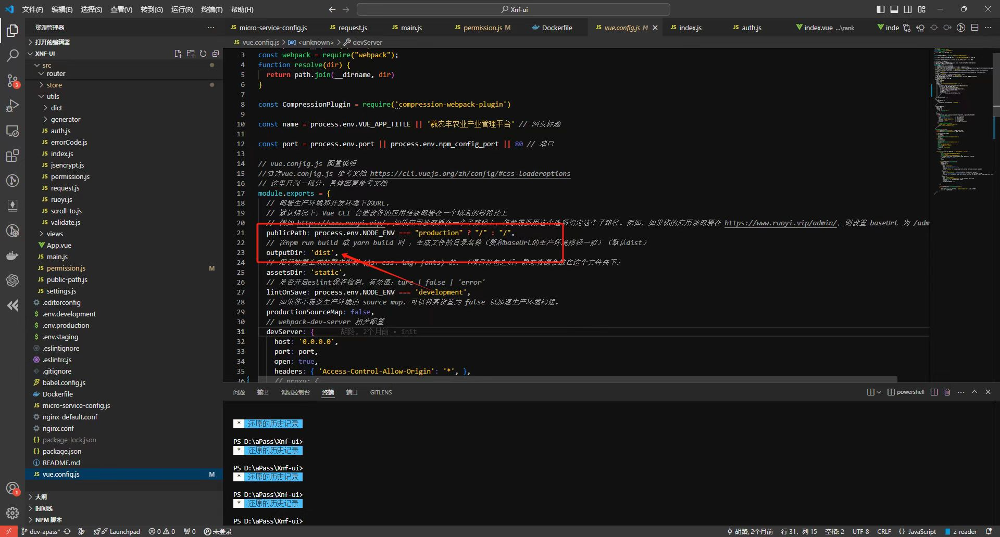
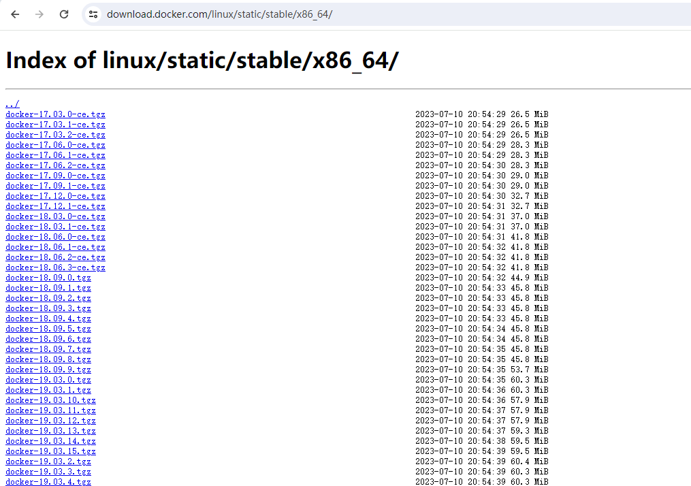

# 黑客马拉松笔记

## 1. 数字生活小程序-卡片开发

[数字生活小程序-官网](https://miniapp.cloud.189.cn/doc/miniapp/develop/devtools/download.html)

1. 拥有并登录 `天翼数字乡村-生态合作平台` 账号（找数字生活管理员开通，没有 @何孟阳）
2. 进入卡片管理列表，新建卡片
   1. 公司名称：湖北公众信息产业责任有限公司
   2. 社会信用代码：91420100300246301H
3. 配置卡片区域
4. 配置内容模型
   1. 配置上线的数据源
   2. 配置字段
5. 利用 `数字生活轻应用开发工具` 新建 `小部件PC`, 选择模板
   1. 如果调整样式可以使用 VScode 等 IDE
   2. 如果调用接口还是使用该 IDE
6. 发起 wgt.request
   1. widgetId 选择卡片列表中的 `卡片ID`
7. 在 `天翼数字乡村-生态合作平台` 新建版本
8. 上传小部件
9. 提交审核 开发版本-> 审核版本-> 上线版本

## 2. 研发云-低代码开发

[中国电信-apaas 平台](https://www.ctapaas.cn/)

链接：https://cloud.189.cn/web/share?code = ANRJRbEbeIV3
访问码：76dk

## 3. 电信科创相关网站

- [天翼云开发者社区](https://developer.ctyun.cn/) - 提供云服务开发资源和文档
- [天翼物联开放平台](https://iot.ctiot.cn/) - IoT 物联网开发平台
- [翼支付开放平台](https://open.bestpay.com.cn/) - 支付接口与金融服务
- [天翼云创新中心](https://www.ctyun.cn/innovation) - 创新项目孵化平台
- [天翼云市场](https://app.ctyun.cn/) - 云应用与服务市场
- [天翼实验室](https://ty.ctlab.cn/) - 电信研究院创新实验室
- [天翼云开发者社区](https://developer.ctyun.cn/) - 提供云服务开发资源和文档

## 4. MySQL 离线安装与若依数据库初始化

1. 提前准备 若依前后端分离版本的两个数据库脚本文件 [ry_20240629.sql](https://gitee.com/y_project/RuoYi-Vue/blob/master/sql/ry_20240629.sql) 和 [quartz.sql](https://gitee.com/y_project/RuoYi-Vue/blob/master/sql/quartz.sql)
2. 提前准备 MySQL 安装包 `mysql-8.0.20-linux-glibc2.12-x86_64.tar.xz` 
3. 登录研发云-集成交付平台(胡路有权限)


2. 找到一键安装 MySQL 的相关文件脚本 `my_automation.zip`，并解压

3. 阅读 `my_automation.sh` 中的注释

   > #(1)把安装包放入/data/install 下面，脚本也放入, 脚本名称设置为 my_automation.sh，脚本名别带上 mysql 字样，否则第一步的杀死进程会导致脚本终端
   > #(2)执行脚本方式为：sh /data/install/my_automation.sh
   > #(3)centos 版本为 CentOS Linux release 7.9.2009 (Core)
   > #(4)修改 mysql_install_path、mysql_data_path、exedir、exe、anzhuangbao、new_passwd、new_port 七个变量为正确值

4. 在服务器中新建 `/data/install` 文件夹，即执行 `mkdir -p /data/install`
5. 修改 `my_automation.sh` 中的相关配置, 主要是 `exe`、`anzhuangbao`、`new_passwd`、`new_port`

```
mysql_install_path=/usr/local/mysql    #mysql安装目录
mysql_data_path=/data/mysql			   #mysql数据存放目录
exedir=/data/install/       #安装包存放目录
exe=mysql-8.0.20-linux-glibc2.12-x86_64.tar.xz       #安装包名
anzhuangbao=mysql-8.0.20-linux-glibc2.12-x86_64      #解压后包名
version=$(echo "$anzhuangbao" | grep -oP '(?<=mysql-)\d+\.\d+\.\d+')
new_passwd='Admin!@#456'	    #mysql root 用户密码
new_port=33306				#mysql 监听端口
log=/data/install/mysqlresult.log
```

6. 利用 XShell 中带有的 Xftp 工具上传 `my_automation.sh`、`ry_20240629.sql`、`quartz.sql`、`mysql-8.0.20-linux-glibc2.12-x86_64.tar.xz ` 到 `/data/install` 目录下。
7. 执行 `my_automation.sh`, 即 `sh /data/install/my_automation.sh`, 如果没有报错即代表安装成功。
8. 配置 mysql 环境变量
9. Centos 启动 MySQL：`service mysqld start`
   - 启动 MySQL 服务 `sudo service mysqld start`
   - 停止 MySQL 服务 `sudo service mysqld stop`
   - 重启 MySQL 服务 `sudo service mysqld restart`
   - 检查 MySQL 服务状态 `sudo service mysqld status`

9. 连接 MySQL: `mysql -uroot -p`

10. 创建若依项目数据库:

    ```sql
    CREATE DATABASE ruoyi
    DEFAULT CHARACTER SET utf8mb4
    DEFAULT COLLATE utf8mb4_general_ci;
    ```

11. 选择若依数据库 `use ruoyi;`

12. 执行提前准备好的数据库脚本:

    ```
    source /data/install/ry_20240629.sql;
    source /data/install/quartz.sql;
    ```

13. 检测脚本是否安装成功：

    ```sql
    show tables;
    select * from sys_user;
    ```


## 5. Redis 离线安装

类似 MySQL, 使用集成交付平台一键安装

## 6. Nginx 离线安装

1. `tar -zxvf nginx-1.18.0.tar.gz`
2. `cd nginx-1.18.0`
3. `./configure`
4. `make && make install`
5. `cd /usr/local/nginx/sbin`
6. `./nginx`

## 7. 前后端项目部署

### 前端

1. 打包 `npm run build:prod` 生成 dist 文件夹，进行压缩，用 Xftp 上传到服务器
2. 放到 nginx 的 html 文件夹下，进行解压
3. 配置 nginx 配置文件，修改：` root   /usr/share/nginx/html/dist`
4. nginx 重新加载：`nginx -s reload`
5. 查看能否访问 `curl http://127.0.0.1`

### 后端

1. 对若依父项目进行打包，得到 `ruoyi-admin.jar`, 上传到服务器的某个位置
2. `java -jar ruoyi-admin.jar &`


## 8. 天翼云眼

参见 `《视联网_能力开放及海拼应用二开_课件.pdf》`

## 9. 研发云-高代码改造

参见 `《aPaas平台组件改造规范.pptx》`

1. 进入研发云 apaas 平台的合作伙伴

2. 改造前端代码

   

3. 改造后端代码

```java
@Component
public class LiquibaseConfig implements BeanPostProcessor {
 
    private final DataSource dataSource;
 
    public LiquibaseConfig(DataSource dataSource) {
        this.dataSource = dataSource;
        run("liquibase/master.xml");
    }
 
    public void run(String file) {
        Thread currentThread = Thread.currentThread();
        ClassLoader contextClassLoader = currentThread.getContextClassLoader();
        ResourceAccessor threadClFO = new ClassLoaderResourceAccessor(contextClassLoader);
        ResourceAccessor clFO = new ClassLoaderResourceAccessor();
        ResourceAccessor fsFO = new FileSystemResourceAccessor();
 
        try (Connection connection = dataSource.getConnection()) {
            Database database = DatabaseFactory.getInstance().findCorrectDatabaseImplementation(new JdbcConnection(connection));
            Liquibase liquibase = new Liquibase(file, new CompositeResourceAccessor(clFO, fsFO, threadClFO), database);
            liquibase.setChangeLogParameter("now", database.getCurrentDateTimeFunction());
            liquibase.update("");
            // 关闭数据库
            database.close();
        } catch (Exception e) {
            log.error(e.getMessage(), e);
        }
    }
}
```


## 10. docker 离线安装

#### 1、系统要求

首先需要确定 CentOS7 的内核版本号，因为 docker 安装要求 Linux 内核版本在 3.10 及以上。查看内核版本号：

```sh
uname -r

# CentOS7 内核版本号为：3.10.0-957.5.1.el7.x86_64
```

查看系统名称:

```sh
cat /etc/redhat-release

# CentOS Linux release 7.6.1810 (Core) 
```

#### 2、下载 Docker

Docker 官网：[Docker: Accelerated Container Application Development](https://www.docker.com/)

Docker 引擎安装说明：[在 CentOS 上安装 Docker 引擎 |Docker 文档](https://docs.docker.com/engine/install/centos/)

Docker 二进制安装说明：[从二进制文件安装 Docker 引擎 |Docker 文档](https://docs.docker.com/engine/install/binaries/)

因为这里要使用离线安装 Docker，所以为二进制安装。需要下载二进制文件。下载地址：https://download.docker.com/linux/static/stable/x86_64/



选择版本进行下载，下载成功后解压 docker 包。

```sh
tar -zxvf docker-26.1.3.tgz
```

#### 3、安装 Docker

将解压出来的 `docker` 文件内容拷贝或者移动到 `/usr/bin/` 目录下

```sh
cp docker/* /usr/bin/
```

然后就可以使用 `docker -v` 或者 `docker info` 命令验证是否可以输出 `docker` 信息了。因为没有开启守护进程，docker 其他命令还不能使用。所以需要编写 `docker.service` 文件加入 Linux 服务当中并开启守护进程。

编辑文件:

```sh
vim /etc/systemd/system/docker.service
```

添加内容：

```sh
[Unit]
Description=Docker Application Container Engine
Documentation=https://docs.docker.com
After=network-online.target firewalld.service
Wants=network-online.target
  
[Service]
Type=notify
# the default is not to use systemd for cgroups because the delegate issues still
# exists and systemd currently does not support the cgroup feature set required
# for containers run by docker
ExecStart=/usr/bin/dockerd -H unix:///var/run/docker.sock --selinux-enabled=false --default-ulimit nofile=65536:65536
ExecReload=/bin/kill -s HUP $MAINPID
# Having non-zero Limit*s causes performance problems due to accounting overhead
# in the kernel. We recommend using cgroups to do container-local accounting.
LimitNOFILE=infinity
LimitNPROC=infinity
LimitCORE=infinity
# Uncomment TasksMax if your systemd version supports it.
# Only systemd 226 and above support this version.
#TasksMax = infinity
TimeoutStartSec=0
# set delegate yes so that systemd does not reset the cgroups of docker containers
Delegate=yes
# kill only the docker process, not all processes in the cgroup
KillMode=process
# restart the docker process if it exits prematurely
Restart=on-failure
StartLimitBurst=3
StartLimitInterval=60s
  
[Install]
WantedBy=multi-user.target
```

如果需要开启远程服务 `ExecStart` 属性修改为以下命令：

```sh
ExecStart=/usr/bin/dockerd -H tcp://0.0.0.0:2375 -H unix:///var/run/docker.sock --selinux-enabled=false --default-ulimit nofile=65536:65536

# -H tcp://0.0.0.0:2375 开启远程连接命令
```

添加文件可执行权限

```sh
chmod +x /etc/systemd/system/docker.service
```

配置成功后，重新加载 daemon 服务

```sh
systemctl daemon-reload
```

启动 docker 服务

```sh
systemctl start docker
```

#### 4.5 插入步骤

> 感谢博客 https://blog.csdn.net/2301_79849395/article/details/142829852

1.修改/etc/docker/daemon.json 文件        

 ```
 vi /etc/docker/daemon.json
 ```

 2.导入镜像：（无论用上阿里云还是清华的镜像源都仍然 ERROR）

```java
{
"registry-mirrors": [
"https://0dj0t5fb.mirror.aliyuncs.com",
"https://docker.mirrors.ustc.edu.cn",
"https://6kx4zyno.mirror.aliyuncs.com",
"https://registry.docker-cn.com"
]
}
```


#### 4、配置 Docker 镜像

在目录 `etc` 下面创建一个 `docker` 文件夹，进入 `docker` 目录创建 `daemon.json` 文件

```sh
vim daemon.json
```

加入从阿里云申请的镜像源地址。

```sh
{
  "registry-mirrors": ["https://ejes884z.mirror.aliyuncs.com"],
  "log-driver":"json-file",
  "log-opts": {"max-size":"1g", "max-file":"3"},
  "live-restore": true
}

# registry-mirrors 个人镜像源地址, 如果有多个仓库， 在相应的列表里增加即可。
# log-driver log-opts 全局配置容器日志大小，如果不配置没有限制大小，后面有可能会导致磁盘崩盘
# live-restore 更新 daemon.json 配置文件时，自动加载配置，不用重新启动 Docker
```

配置成功后，重新启动 Docker

#### 5、Docker 服务相关命令

重新加载配置文件

```sh
systemctl daemon-reload
```

启动 docker 服务

```sh
systemctl start docker
```

查看 docker 服务的运行状态

```sh
systemctl status docker
```

停止运行

```sh
systemctl stop docker
```

重新启动

```sh
systemctl restart docker
```

将 docker 服务设置为开机自动启动

```sh
systemctl enable docker
```

禁用开机自动启动

```sh
systemctl disabled docker
```

查看 docker 开机自动启动状态 enabled: 开启, disabled: 关闭

```sh
systemctl is-enabled docker.service
```

查看 docker 版本号

```sh
docker -v

docker version
```

Docker 启动所有容器

```sh
docker start $(docker ps -a -q)
```

#### 6、导出和导入镜像

首先在可以连接网络的服务器上面获取相关软件镜像，然后通过 `save` 和 `load` 命令导出和导入镜像。由于导入的镜像没有镜像名称和 `tag` 版本号，需要使用 `docker tag 命令` 修改导入的镜像命令。

docker 导出镜像：

```sh
docker save 99ee9af2b6b1 > redis.tar # 99ee9af2b6b1 镜像 ID
```

docker 导入镜像：

```sh
docker load < redis.tar
```

docker 修改镜像标签名称：

```sh
 docker tag 99ee9af2b6b1 redis:3.2.0  #99ee9af2b6b1 镜像 ID  镜像名称: 版本号
```

## 附录 Vue 插件安装（未知）


## 附录：配置环境变量

1. 编辑配置：`vim ./bashrc`

2. ```bash
   PATH=$PATH:/usr/local/mysql/sbin:/usr/local/nginx/sbin
   export PATH
   ```

3. 应用配置：`source ./bashrc`

## 附录：MySQL 新建用户允许远程访问

```
mysql>create user dongxt@'%' identified by 'password';
给用户授权
mysql>grant all privileges on *.* to dongxt@'%' with grant option;
刷新权限
mysql>flush privileges;
修改远程连接用户的加密规则
mysql>alter user dongxt@'%' identified with mysql_native_password by 'password';
```
