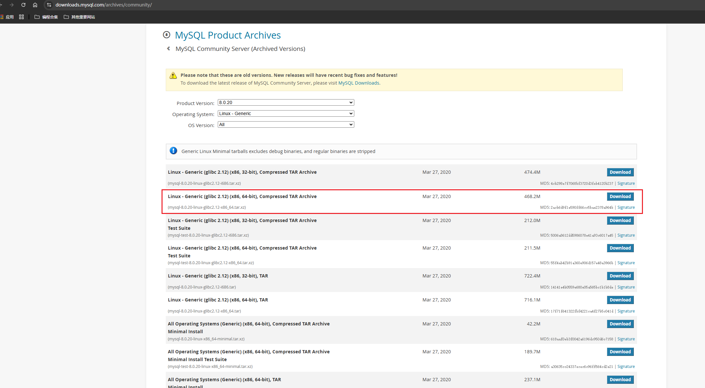
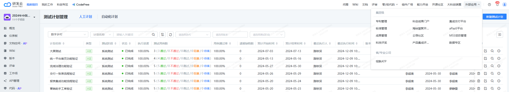

# 黑客马拉松笔记

## 1. 数字生活小程序

[数字生活小程序-官网](https://miniapp.cloud.189.cn/doc/miniapp/develop/devtools/download.html)

## 2. 研发云-低代码平台

[中国电信-apaas平台](https://www.ctapaas.cn/)
## 3. 电信科创相关网站

- [天翼云开发者社区](https://developer.ctyun.cn/) - 提供云服务开发资源和文档
- [天翼物联开放平台](https://iot.ctiot.cn/) - IoT物联网开发平台
- [翼支付开放平台](https://open.bestpay.com.cn/) - 支付接口与金融服务
- [天翼云创新中心](https://www.ctyun.cn/innovation) - 创新项目孵化平台
- [天翼云市场](https://app.ctyun.cn/) - 云应用与服务市场
- [天翼实验室](https://ty.ctlab.cn/) - 电信研究院创新实验室
- [天翼云开发者社区](https://developer.ctyun.cn/) - 提供云服务开发资源和文档

## 4. MySQL离线安装与若依数据库初始化

1. 提前准备 若依前后端分离版本的两个数据库脚本文件[ry_20240629.sql](https://gitee.com/y_project/RuoYi-Vue/blob/master/sql/ry_20240629.sql)和[quartz.sql](https://gitee.com/y_project/RuoYi-Vue/blob/master/sql/quartz.sql)
2. 提前准备 MySQL安装包`mysql-8.0.20-linux-glibc2.12-x86_64.tar.xz`
3. 登录研发云-集成交付平台(胡路有权限)



2. 找到一键安装MySQL的相关文件脚本`my_automation.zip`，并解压

3. 阅读`my_automation.sh`中的注释

   > #(1)把安装包放入/data/install下面，脚本也放入,脚本名称设置为my_automation.sh，脚本名别带上mysql字样，否则第一步的杀死进程会导致脚本终端
   > #(2)执行脚本方式为：sh /data/install/my_automation.sh
   > #(3)centos版本为CentOS Linux release 7.9.2009 (Core)
   > #(4)修改mysql_install_path、mysql_data_path、exedir、exe、anzhuangbao、new_passwd、new_port七个变量为正确值

4. 在服务器中新建`/data/install` 文件夹，即执行 `mkdir -p /data/install`
5. 修改`my_automation.sh`中的相关配置,主要是`exe`、`anzhuangbao`、`new_passwd`、`new_port`

```
mysql_install_path=/usr/local/mysql    #mysql安装目录
mysql_data_path=/data/mysql			   #mysql数据存放目录
exedir=/data/install/       #安装包存放目录
exe=mysql-8.0.20-linux-glibc2.12-x86_64.tar.xz       #安装包名
anzhuangbao=mysql-8.0.20-linux-glibc2.12-x86_64      #解压后包名
version=$(echo "$anzhuangbao" | grep -oP '(?<=mysql-)\d+\.\d+\.\d+')
new_passwd='Admin!@#456'	    #mysql root 用户密码
new_port=33306				#mysql 监听端口
log=/data/install/mysqlresult.log
```

6. 利用XShell中带有的Xftp工具上传`my_automation.sh`、`ry_20240629.sql`、`quartz.sql`、`mysql-8.0.20-linux-glibc2.12-x86_64.tar.xz `到`/data/install`目录下。
7. 执行`my_automation.sh`,即`sh /data/install/my_automation.sh`,如果没有报错即代表安装成功。
8. 配置mysql环境变量
9. Centos启动MySQL：`service mysqld start`
   - 启动 MySQL 服务 `sudo service mysqld start`
   - 停止 MySQL 服务 `sudo service mysqld stop`
   - 重启 MySQL 服务 `sudo service mysqld restart`
   - 检查 MySQL 服务状态 `sudo service mysqld status`

9. 连接MySQL:`mysql -uroot -p`

10. 创建若依项目数据库:

    ```sql
    CREATE DATABASE ruoyi
    DEFAULT CHARACTER SET utf8mb4
    DEFAULT COLLATE utf8mb4_general_ci;
    ```

11. 选择若依数据库`use ruoyi;`

12. 执行提前准备好的数据库脚本:

    ```
    source /data/install/ry_20240629.sql;
    source /data/install/quartz.sql;
    ```

13. 检测脚本是否安装成功：

    ```sql
    show tables;
    select * from sys_user;
    ```


## 5.Redis离线安装

类似MySQL

## 6. Nginx离线安装

1. `tar -zxvf nginx-1.18.0.tar.gz`
2. `cd nginx-1.18.0`
3. `./configure`
4. `make && make install`
5. `cd /usr/local/nginx/sbin`
6. `./nginx`

## 7. 前后端项目部署

### 前端

1. 打包`npm run build:prod`生成dist文件夹，进行压缩，用Xftp上传到服务器
2. 放到nginx的html文件夹下，进行解压
3. 配置nginx配置文件，修改：` root   /usr/share/nginx/html/dist`
4. nginx重新加载：`nginx -s reload`
5. 查看能否访问`curl http://127.0.0.1`

### 后端

1. 对若依父项目进行打包，得到`ruoyi-admin.jar`,上传到服务器的某个位置
2. `java -jar ruoyi-admin.jar &`

## 附录：配置环境变量

1. 编辑配置：`vim ./bashrc`

2. ```bash
   PATH=$PATH:/usr/local/mysql/sbin:/usr/local/nginx/sbin
   export PATH
   ```

3. 应用配置：`source ./bashrc`

## 附录：MySQL新建用户允许远程访问

```
mysql>create user dongxt@'%' identified by 'password';
给用户授权
mysql>grant all privileges on *.* to dongxt@'%' with grant option;
刷新权限
mysql>flush privileges;
修改远程连接用户的加密规则
mysql>alter user dongxt@'%' identified with mysql_native_password by 'password';
```

## 附录 低代码平台教程

链接：https://cloud.189.cn/web/share?code=ANRJRbEbeIV3
访问码：76dk
